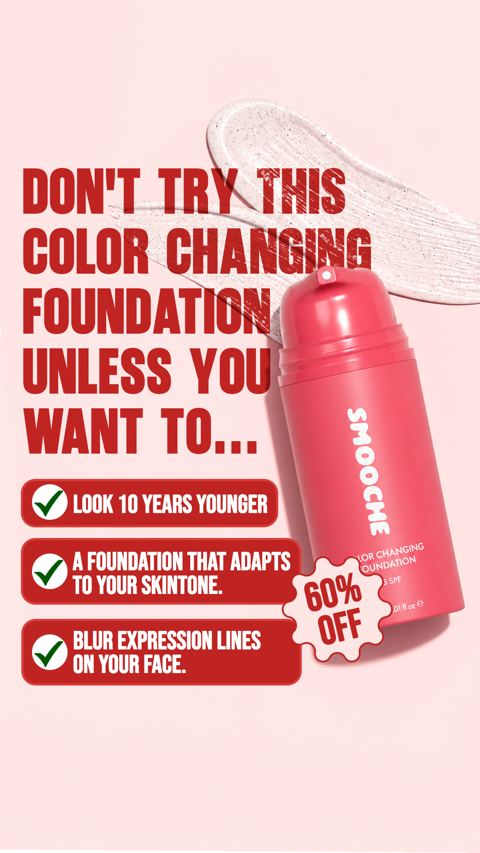
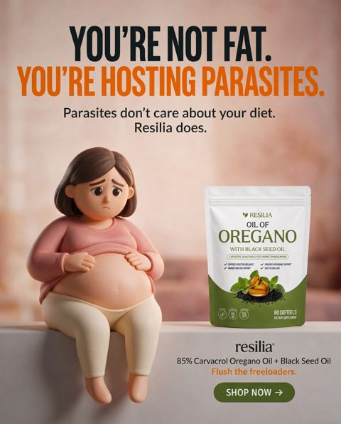
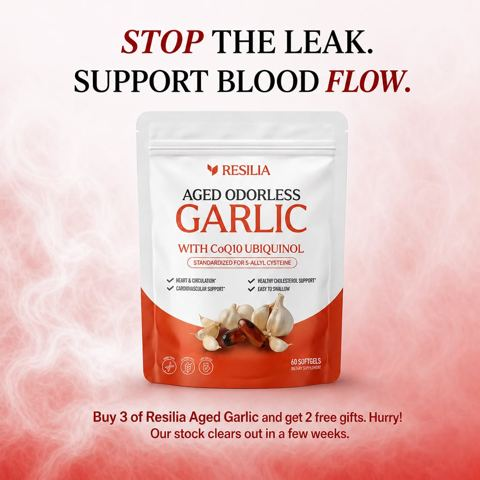
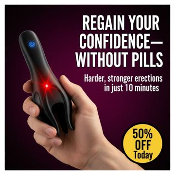
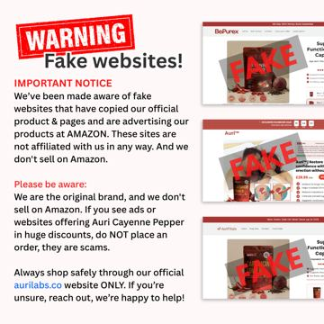

# Meta ad-library examples for F34 (GetHookd board 155932, gut health)

<!-- WAVE6 -->
## Wave 6: Resilia & Smooche live Meta ads (Oct 2026)

Pulled from the public Meta Ad Library on 2026-10-09 (Resilia: aged garlic, Ceylon cinnamon, oil of oregano; Smooche: color-changing foundation, Reverse Time peptide serum). Days live are counted to 2026-10-09; most video ads were new tests that week, while the long runners are statics and catalog templates. Transcripts are automatic. Brand claims are the advertisers', not verified, and many are health claims we would never make. The **Do not copy** line flags deceptive tactics (persona "publication" pages, undisclosed AI actors and "experts", fake stock counts).

### Smooche · Smooche: “DON'T TRY THIS COLOR CHANGING FOUNDATION UNLESS YOU WANT TO” (10 days live)

- **Ad:** [Meta Ad Library #2280843229404833](https://www.facebook.com/ads/library/?id=2280843229404833) · static image · page “Smooche” · started 2026-09-28 · lands on `smooche.com/products/ccf2`
- **What happens:** "DON'T TRY THIS COLOR CHANGING FOUNDATION UNLESS YOU WANT TO…" with a 3-tick list (look 10 years younger…).
- **Why it works:** Call-out statics: "Don't try this color changing foundation unless you want to… look 10 years younger" (reverse psychology), "You're not fat. You're hosting parasites." (a reframe), "Stop the leak."
- **How to make one:** Use a negative or reframe headline, a 3-tick list, and the product. Write 6 variants.
- **Do not copy:** The "you're hosting parasites" style of reframe makes an unsupported health claim.
- **LC remake:** "Don't buy this necklace… unless you want to stop taking it off."

Primary text

> You've been thinking about it. Now everyone else is buying it. Our viral color-matching foundation is down to the last few hundred bottles and your shade won't last the day. We can't make them fast enough - production is 3 weeks behind demand. If you miss this drop, you're looking at a 6-week waitlist minimum. One bottle adapts to YOUR exact skin tone. No more guessing. No more orange jawlines. Click before it's too late.

### Resilia · Gut Health Insider: “YOU'RE NOT FAT. YOU'RE HOSTING PARASITES” (0 days live)

- **Ad:** [Meta Ad Library #1013660571110874](https://www.facebook.com/ads/library/?id=1013660571110874) · static image · page “Gut Health Insider” · started 2026-10-08 · 1 copies · lands on `resilia.shop/products/resilia-oil-of-oregano-softgels`
- **What happens:** "YOU'RE NOT FAT. YOU'RE HOSTING PARASITES." with a 3D clay woman and the pouch.
- **Why it works:** Call-out statics: "Don't try this color changing foundation unless you want to… look 10 years younger" (reverse psychology), "You're not fat. You're hosting parasites." (a reframe), "Stop the leak."
- **How to make one:** Use a negative or reframe headline, a 3-tick list, and the product. Write 6 variants.
- **Do not copy:** The "you're hosting parasites" style of reframe makes an unsupported health claim.
- **LC remake:** "Don't buy this necklace… unless you want to stop taking it off."

Primary text

> Introducing Resilia Oil of Oregano — premium dual-action softgels that support your body's natural drainage and everyday vitality. 💧 Supports natural cleansing and healthy circulation 💧 Helps reduce puffiness and water retention 💧 Supports healthy fluid balance and lighter-feeling days 💧 Promotes clearer-looking skin and steady energy ✅ Dual-action blend of Oil of Oregano + Black Seed Oil ✅ 3rd-party tested in the USA, Non-GMO, no aftertaste ✨ No messy liquids — just two easy softgels each morning 🌿 Inspired by tradition, made for modern life ❤️‍🩹 Two softgels a day to help you feel light and vibrant again. Tap Shop Now to reclaim your flow with Resilia Oil of Oregano! 🌿 Don’t Just Mask It: Help your body fix the source. Support your natural drainage with the power of Resilia.

### Resilia · Vascular Wellness Report: “STOP THE LEAK. SUPPORT BLOOD FLOW” (1 day live)

- **Ad:** [Meta Ad Library #1672417714354897](https://www.facebook.com/ads/library/?id=1672417714354897) · static image · page “Vascular Wellness Report” · started 2026-10-07 · lands on `resilia.shop/products/resilia-aged-odorless-garlic`
- **What happens:** "STOP THE LEAK. SUPPORT BLOOD FLOW." with a garlic pouch.
- **Why it works:** Call-out statics: "Don't try this color changing foundation unless you want to… look 10 years younger" (reverse psychology), "You're not fat. You're hosting parasites." (a reframe), "Stop the leak."
- **How to make one:** Use a negative or reframe headline, a 3-tick list, and the product. Write 6 variants.
- **Do not copy:** The "you're hosting parasites" style of reframe makes an unsupported health claim.
- **LC remake:** "Don't buy this necklace… unless you want to stop taking it off."

Primary text

> Looking to Take Control of Your Heart Health Naturally?❤️ Experience the Power of Resilia Aged Garlic Extract! ✅: Supports cardiovascular health naturally ✅: Completely odorless formula ✅: Supports arterial health ✅: 20-month aging process ✅: 900+ clinical studies ✅: SAC-standardized aged garlic extract ✅: Plus CoQ10 Ubiquinol & Vitamin K2 MK-7 Transform your cardiovascular health with three clinically studied ingredients backed by modern science — 30-Day Risk-Free Guarantee.

<!-- /WAVE6 -->

From [@FedotOff90](https://x.com/FedotOff90/status/2108212319113412929)'s public board preview. Days live are as of 2026-10-09. Full board breakdown is in the internal sources folder.

## Libby Babet: Women's-body myth-bust talking head (fitness coach) (305 days live)

- **What happens:** Libby Babet (coach/founder) talking head at home: hook text 'This is why fasted workouts backfire for women' → explains cortisol/muscle → 'for my pro babes' → shows the empty wrapper of the collagen bar she ate this morning → 'go train strong, my ladies'. Burned-in yellow-highlight captions; three versions (different crops/backgrounds) in one DCO ad.
- **Why it lasts:** 305 days live. 'Women's bodies react differently' is an identity hook; the product arrives as the personal fix after 60 s of genuine education; the empty-wrapper detail is proof of real use.
- **How to make one:** Founder/coach to camera, 85-95 s, one take, captions with keyword highlights (CapCut 'highlight' style), 3 framings of the same take as DCO variants.
- **LC remake:** 'This is why your gold necklace turns green (and it's not your skin)' myth-bust by a stylist/founder → science in plain words → 'this is the one I slept in last night' → shows it on.

Transcript

> I really want to clear up a myth that I hear all the time from women, which is that we should train faster for better fat burn. The reality is that women's bodies react really differently to men's when we fast and particularly when we fast and then work out. You see when you skip food before training your cortisol and adrenaline can spike higher and that can actually break down muscle and throw off your hormones completely. When you have a small snack before you train just a little protein and carbs, you actually protect your muscle tissue, you help to regulate your hormones and you perform better which means you get better results and that is so important for everything you're trying to achieve. This is particularly important if you're doing any kind of weight training, high intensity training or endurance training. So for my pro babes out there, you need to be eating before you train. People always used to tell me a piece of fruit or a smoothie would do the trick but those things always felt horrible in my tummy. So for me, I have one of our chief collagen bars. They really just sit so well in my stomach and I don't even feel them if I have them 30 minutes before I train. And the bonus is that collagen also gives your tenons a little bit of support going into a session. So before a workout is the best time to take that. This is the empty packet of the bar I had this morning, which is our mint chocolate covered bar, but there are also non chocolate covered ones if you're a bit more of a plain morning girlie. So give that a go if you want to train harder and better and get better results. So you are absolutely not ruining your burn if you eat before you work out. In fact, you are helping your body to burn smarter and that will help you get your results. So go train strong, my ladies.

## Pinch Magic Fiber: Product callout-label static ('This cleared my stuck poop') (258 days live)

- **What happens:** Close-up of a scoop over the jar, black pill headline 'THIS CLEARED MY STUCK POOP' and 3 small callout labels pointing at the product (perfect poops / high-quality psyllium husk / tastes great).
- **Why it lasts:** 258 days live. A blunt first-person result headline + 3 benefit labels is readable in one glance.
- **How to make one:** One macro photo, Canva pill labels with thin leader lines; 1080x1350.
- **LC remake:** Wrist stack close-up, pill headline 'THIS SURVIVED 200 SHOWERS', labels: 14K PVD / won't turn green / any 7 for $85.

<!-- WAVE4 -->
## Wave 4: Alex Fedotoff's October 2026 swipe boards (GetHookd public previews)

Each ad below is from the free 10-ad preview of a public GetHookd board that [@FedotOff90](https://x.com/FedotOff90) shared on X. Days live are as of 2026-10-09; brand claims are the advertisers', not verified.

### Wellness Way UK: "Regain your confidence, without pills" device static (Wellness Way UK) (252 days live)

- **Board:** [Winning Men's Health / Testosterone Ads — June 2026](https://x.com/FedotOff90/status/2102455699557200246) · image
- **What happens:** A hand holds a black device: "REGAIN YOUR CONFIDENCE, WITHOUT PILLS", "Harder, stronger erections in just 10 minutes", "50% OFF today" badge.
- **Why it lasts:** 252 days. A pill-free promise plus a time-bound result.
- **How to make one:** Product in hand, a "[outcome], without [drug]" headline, a time-bound result, a discount badge.
- **LC remake:** Not for LC.

### Aurivita Cayenne: "WARNING: Fake websites!" brand notice static (Aurivita) (197 days live)

- **Board:** [iPhone Notes / Text Messages / Reddit / Google Search / Breaking News / DMs / Amazon Review / TikTok Comments](https://x.com/FedotOff90/status/2106046297434374289) · image
- **What happens:** A red "WARNING Fake websites!" banner with screenshots stamped "FAKE": "We are the original brand, and we don't sell on Amazon… if you see ads offering Auri Cayenne Pepper in huge discounts, do not place an order."
- **Why it lasts:** 197 days. A brand warning reads as a public service, and it implies demand (people copy it).
- **How to make one:** A red warning banner, screenshots stamped FAKE, an "original brand" claim.
- **LC remake:** "WARNING: fake LC sellers on Amazon" (only if true).

