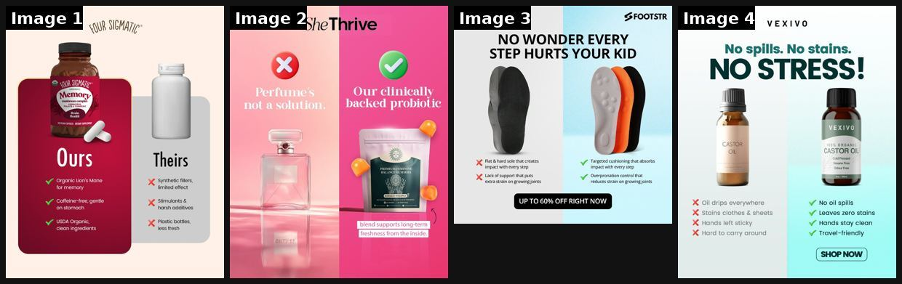

# 35 · Diagram statics: Venn, report card, comparison chart, us-vs-them grid: see it, then make it

[](https://x.com/Hashir_Shaikh_/status/2096337779412304217)

**The example:** [@Hashir_Shaikh_ on X](https://x.com/Hashir_Shaikh_/status/2096337779412304217) · 4 images · 127 likes, 5K views

**Watch it:** [open the post on X](https://x.com/Hashir_Shaikh_/status/2096337779412304217)

> We make 1,000+ statics every month. Around 10% are Us vs Them. Because showing the difference can be more powerful than simply talking about your product. Show people what they’re choosing between. Brands use static ads to say why their product is good. But “better quality,” “better results,” and “better value” don’t mean much without context. An Us vs Them ad gives people that context. You can compare your product a…

## What you are seeing

Four diagram-style statics: a this-vs-that comparison with the product against a rival, a red X versus a green check table, and a "NO WONDER EVERY STEP HURTS" anatomy visual. Each one makes the argument with a simple chart instead of a lifestyle photo.

## Image by image

| Image | Text on it (OCR, rough) |
|---|---|
| 1 | uk SIGMA un Memory, mushroom complex rose? Brain Health ss Ours Theirs Organic Lion's Mane synthetic fillers, limited effect for memory gentle on stomach harsh additives Plastic bottles, USDA Organic, clean ingredients less fresh |
| 2 | (mostly visual) |
| 3 | NO WONDER EVERY STEP HURTS YOUR KID ae Targeted that absorbs Flat hard sole that creates impact with every step impact with every step Lack of support that puts control that extra strain on growing joints reduces strain on growing joints |
| 4 | No spills. No stains. NO STRESS! CAS ORGANIC CASTOR OIL Cold Pressed Free Free Ve Oil everywhere No oil spills XX stains clothes sheets Leaves zero stains Hands left sticky Hands stay clean xX Hard to carry around Travel-friendly |

## How to make one like it

**The format in one line:** Information-graphic statics: a Venn diagram where LC sits in the overlap, a school report card grading LC vs "typical gold-plated", a check/cross comparison chart, or an us-vs-them split. Quick logical proof at a glance.

**Why it works:** - Visual logic is processed instantly; the overlap/grade is the punchline. - Report card and Venn are novel UIs in feed (pattern break). - Good for MOF shoppers comparing options.

**Contents:** [1. Structure](#1-copy-the-structure) · [2. Shot by shot](#2-shot-by-shot-remake) · [3. Script and hooks](#3-write-the-script) · [4. Prompts](#4-prompts) · [5. Tools and settings](#5-tools-and-settings) · [6. Louise Carter remake](#6-louise-carter-remake) · [7. Variants and test](#7-variants-and-test-plan) · [8. Pitfalls](#8-pitfalls)

### 1. Copy the structure

The skeleton every version follows: **hook → problem or tension → turn (the product shows up) → proof → one clear ask.** The shot-by-shot below fills it in.

### 2. Shot-by-shot remake

**Target length / size:** 1 static, 1080x1350

| # | Time / slot | What we see (visual + camera) | Dialogue / on-screen text |
|---|---|---|---|
| 1 | Venn | Two circles: "waterproof" and "looks like real gold" | Product in the overlap |
| 2 | Report card | School report card layout | Product vs "typical gold-plated": A+ vs D across 5 subjects |
| 3 | Comparison grid | Check/cross table | Product vs category, 5 rows |

<details><summary>Playbook shot list (Louise Carter version from the README)</summary>

| Time / slot | Visual | Audio / copy |
|---|---|---|
| Venn | 3 circles: "looks like real gold" / "shower-proof" / "under $15 a piece" → center: LC stack photo | — |
| Report card | "Louise Carter — Report Card": Waterproof A+, Price A, Compliments A+, Taking it off F (never) | Primary text: teacher comment joke |
| Chart | LC vs plated vs solid 14K: price, waterproof, tarnish, gift box | — |

</details>

### 3. Write the script

Open with one of these hooks (first 1–3 seconds, or the headline on a static):

- "The jewelry Venn diagram nobody could solve"
- "Report card after 6 months of wearing it every day"
- "Plated vs solid vs PVD — honest chart"

Then fill the beats from the table above. Pull the wording from real customer reviews, not from ad copy: a review line beats a copywriter line almost every time. Read every line out loud and cut anything you would not say to a friend. Ready-made Louise Carter scripts are in section 6; hand [BOT.md](BOT.md) to any AI agent to write versions for another brand.

### 4. Prompts

**Figma**

```text
Grid 1080x1350, two columns, rows 120px, green check / grey cross icons, product photo in the header of its column.
```

**Full creative-agent prompt (from the playbook):**

```
Produce on-image copy for: 1 Venn (3 desirable traits, LC center), 1 report card (5 subjects, grades, a funny teacher comment), 1 comparison chart (LC vs gold-plated vs solid 14K; 5 rows from {{PDP_FACTS}} and public generic facts). Flag any row that needs substantiation.
```

### 5. Tools and settings

1. Figma templates: Venn, report card, 3-column chart, split us/them.
2. Comparison rows only with verifiable facts; competitor = generic category ("typical gold-plated").
3. AI image tools can render the template; check text accuracy.

| Setting | Value |
|---|---|
| Canvas | 1080×1350 (4:5) for feed; 1080×1920 (9:16) story/reel version with the same elements stacked |
| Type | Headline 80–110 px, max 8 words; body 36–44 px; at most 2 typefaces |
| Layout | Headline readable at thumbnail size; product at least 40% of the canvas; logo small, bottom corner |
| Safe zone | Keep text out of the bottom 20% on 9:16 (UI overlays) |
| Tools | Figma or Canva for layout; Photoshop or Photoroom to cut out product; Midjourney or Flux only for backgrounds, never for the product itself |
| Export | PNG or JPG at quality 90, sRGB, under 1 MB |

### 6. Louise Carter remake

- A · Venn: "looks expensive" ∩ "shower-proof" ∩ "any 7 for $85" = LC.
- B · Report card: "Waterproof A+ · Compliments A+ · Price A · Gift-ability A+ · Ever taking it off: F". Teacher note: "Wears it to the pool. Distracting."
- C · Chart: LC 14K PVD vs typical plated vs solid 14K.

Brand rules, claims you can and cannot make, and more scripts: [brands/louise-carter.md](brands/louise-carter.md). Step-by-step from idea to scale: [STAGES.md](STAGES.md).

### 7. Variants and test plan

- Diagram type
- Funny vs factual tone

**Test plan:** - **Budget/structure:** 6 statics, $20/day, 5 days - **Primary KPIs:** CTR, CPA; Omni (F35-*) - **Kill rule:** CTR <0.8% - **Scale rule:** Winner → carousel + F39 - **Naming:** `utm_content=F35-<concept>-<variant>`; weekly Omni roll-up of new-customer revenue by format.

**Naming:** `F35-<variant>-<hook##>-<date>` so results map back to this folder. Change one thing per test (hook, narrator, length or offer), never two.

### 8. Pitfalls

- Compare against categories, not named brands, unless every claim is verified.
- Keep it to 5 rows.
- Too much text: if it cannot be read in 1 second at thumbnail size, cut it.
- AI-generated product images: show the real product; AI is fine for backgrounds only.

**Compliance:** Baseline: [_COMPLIANCE.md](../_COMPLIANCE.md) (no fake testimonials, AI disclosure, no bulk/spoofed accounts, copy structure not assets, PDP-only claims). - Comparative claims must be accurate and substantiated; no named competitors without legal review.

## More examples

Every post we found for this format, with transcripts: [examples/](examples/README.md). Playbook: [README.md](README.md). Agent brief: [BOT.md](BOT.md).
