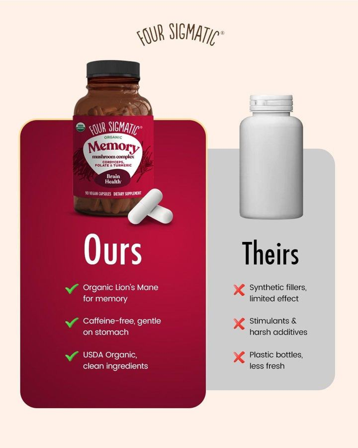

# 35 · Diagram statics: Venn, report card, comparison chart, us-vs-them grid

<!-- HERO:START -->
[](EXAMPLE.md)

**[See the example and how to make it →](EXAMPLE.md)** · [watch on X](https://x.com/Hashir_Shaikh_/status/2096337779412304217)
<!-- HERO:END -->


> **LC priority P2** · evidence: Medium (format lists) · hype risk: Low · cost $0 · 20 min

## What it is
Information-graphic statics: a Venn diagram where LC sits in the overlap, a school report card grading LC vs "typical gold-plated", a check/cross comparison chart, or an us-vs-them split. Quick logical proof at a glance.

## Why it works
- Visual logic is processed instantly; the overlap/grade is the punchline.
- Report card and Venn are novel UIs in feed (pattern break).
- Good for MOF shoppers comparing options.

## Shot-by-shot (LC version)

| Time / slot | Visual | Audio / copy |
|---|---|---|
| Venn | 3 circles: "looks like real gold" / "shower-proof" / "under $15 a piece" → center: LC stack photo | — |
| Report card | "Louise Carter — Report Card": Waterproof A+, Price A, Compliments A+, Taking it off F (never) | Primary text: teacher comment joke |
| Chart | LC vs plated vs solid 14K: price, waterproof, tarnish, gift box | — |

## Hooks (swap-in openers)
- "The jewelry Venn diagram nobody could solve"
- "Report card after 6 months of wearing it every day"
- "Plated vs solid vs PVD — honest chart"

## Real examples from X (studied)
- @FedotOff90 — "report card", Venn among formats with days-active ([post](https://x.com/FedotOff90/status/2104949773539442831)).
- @ads4apps — Venn diagram + us vs them in 39-format list ([post](https://x.com/ads4apps/status/2081785032679518490)).
- @_evancarroll — comparison chart, us vs them, old vs new in 15 AI static frameworks ([post](https://x.com/_evancarroll/status/2084775630152114293)).
- @nicktheriot_ — "us vs them" A-tier in 2026 tier list ([post](https://x.com/nicktheriot_/status/2108173638033871013)).

## Production recipe
1. Figma templates: Venn, report card, 3-column chart, split us/them.
2. Comparison rows only with verifiable facts; competitor = generic category ("typical gold-plated").
3. AI image tools can render the template; check text accuracy.

## Bot prompt (copy into the creative agent)
```
Produce on-image copy for: 1 Venn (3 desirable traits, LC center), 1 report card (5 subjects, grades, a funny teacher comment), 1 comparison chart (LC vs gold-plated vs solid 14K; 5 rows from {{PDP_FACTS}} and public generic facts). Flag any row that needs substantiation.
```

## 3 LC scripts
- A · Venn: "looks expensive" ∩ "shower-proof" ∩ "any 7 for $85" = LC.
- B · Report card: "Waterproof A+ · Compliments A+ · Price A · Gift-ability A+ · Ever taking it off: F". Teacher note: "Wears it to the pool. Distracting."
- C · Chart: LC 14K PVD vs typical plated vs solid 14K.

## Variants to test
- Diagram type
- Funny vs factual tone

## Omni test plan
- **Budget/structure:** 6 statics, $20/day, 5 days
- **Primary KPIs:** CTR, CPA; Omni (F35-*)
- **Kill rule:** CTR <0.8%
- **Scale rule:** Winner → carousel + F39
- **Naming:** `utm_content=F35-<concept>-<variant>`; weekly Omni roll-up of new-customer revenue by format.

## Compliance
Baseline: [_COMPLIANCE.md](../_COMPLIANCE.md) (no fake testimonials, AI disclosure, no bulk/spoofed accounts, copy structure not assets, PDP-only claims).
- Comparative claims must be accurate and substantiated; no named competitors without legal review.

## Related
- Strategies: 41-von-restorff-static-copy-prompt, 08-ad-library-transparency-targeting-intel
- Formats: [16-us-vs-copycat-screen-scroll](../16-us-vs-copycat-screen-scroll/README.md), [34-callout-statics-signs-myths-warnings](../34-callout-statics-signs-myths-warnings/README.md)

<!-- EVIDENCE:START -->
## Evidence from X discovery (auto-generated)

| Date | Author | Post | Engagement | Grade | Gist |
|---|---|---|---|---|---|
| 2026-07-27 | [@ads4apps](https://x.com/ads4apps) | [link](https://x.com/ads4apps/status/2081785032679518490) | 412L/930BM/27kV | VALUE | 39 Meta formats that convert (930 bookmarks): X reasons, IG story, us vs them, Venn, don't buy this, iPhone notes, text message, low stock, we're sorry, breaking news, Reddit, Google search, text on skin, tier list, zero stars… |
| 2026-08-21 | [@raph_guilhem](https://x.com/raph_guilhem) | [link](https://x.com/raph_guilhem/status/2090725512976970065) | 9L/6BM/0kV | SOME | 35 static/native formats tree: Trustpilot, text msg, email screenshot, Reddit, text on skin, crossed-out, tier list, Venn, breaking news. |
| 2026-08-04 | [@_evancarroll](https://x.com/_evancarroll) | [link](https://x.com/_evancarroll/status/2084775630152114293) | 4L/2BM/0kV | SOME | 15 AI static frameworks: 3 core benefits, bold claim, us vs them, comparison chart, old vs new, 5-star, stat, press screenshot, notes app, sticky notes, meme, lo-fi. |
| 2026-08-05 | [@Yannlce](https://x.com/Yannlce) | [link](https://x.com/Yannlce/status/2085017654364958737) | 3L/2BM/1kV | SOME | Same 40-format list (adds claymation, AI podcast). |
<!-- EVIDENCE:END -->
