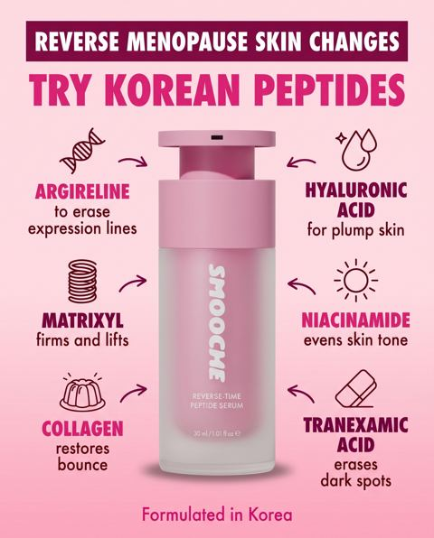
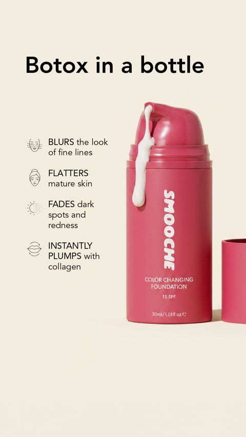
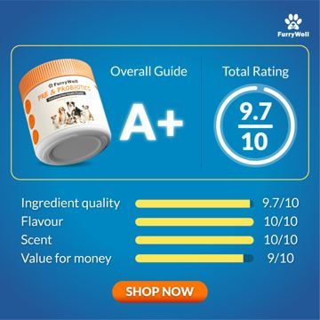

# Meta ad-library examples for F35

<!-- WAVE6 -->
## Wave 6: Resilia & Smooche live Meta ads (Oct 2026)

Pulled from the public Meta Ad Library on 2026-10-09 (Resilia: aged garlic, Ceylon cinnamon, oil of oregano; Smooche: color-changing foundation, Reverse Time peptide serum). Days live are counted to 2026-10-09; most video ads were new tests that week, while the long runners are statics and catalog templates. Transcripts are automatic. Brand claims are the advertisers', not verified, and many are health claims we would never make. The **Do not copy** line flags deceptive tactics (persona "publication" pages, undisclosed AI actors and "experts", fake stock counts).

### Smooche · Cosmetic Times: “REVERSE MENOPAUSE SKIN CHANGES: TRY KOREAN PEPTIDES” (19 days live)

- **Ad:** [Meta Ad Library #1485670853320595](https://www.facebook.com/ads/library/?id=1485670853320595) · static image · page “Cosmetic Times” · started 2026-09-19 · 1 copies · lands on `quiz.smooche.com/`
- **What happens:** "REVERSE MENOPAUSE SKIN CHANGES: TRY KOREAN PEPTIDES", an ingredient-callout diagram around the bottle.
- **Why it works:** An ingredient diagram ("Reverse menopause skin changes: try Korean peptides", with callout icons pointing to the bottle) and "Botox in a bottle" callouts make the mechanism scannable.
- **How to make one:** Put the product in the centre with 4-6 labelled callouts (ingredient → benefit), use one headline, and no more than 12 words per callout.
- **LC remake:** LC necklace centre; callouts: 14K gold layer · PVD bond · stainless core · hypoallergenic · waterproof · 2-year color promise.

Primary text

> Most anti-aging creams don't work. And no, it's not because women use them wrong. It's because collagen molecules are too big to absorb. They sit on top of the skin until you wash them off. Collagen powders? Broken down in digestion before your skin ever sees them. And the treatments that do work run hundreds per session. That's why so many women are switching to Smooche. A peptide serum formulated in Korea with hydrolyzed collagen and hyaluronic acid: the same actives, cut small enough to actually sink in. Plus firming peptides and sodium DNA. ✔ Takes seconds, morning and night ✔ No needles, no downtime, no clinic prices ✔ Fresher-looking skin in days, firmer in weeks Try it risk-free for 30 days.

### Smooche · Cosmetic Times: “Botox in a bottle” (17 days live)

- **Ad:** [Meta Ad Library #1075860478768510](https://www.facebook.com/ads/library/?id=1075860478768510) · static image · page “Cosmetic Times” · started 2026-09-21 · 1 copies · lands on `smooche.com/pages/bestfoundation`
- **What happens:** "Botox in a bottle" with 4 benefit callouts (blurs, flattens, fades, plumps).
- **Why it works:** An ingredient diagram ("Reverse menopause skin changes: try Korean peptides", with callout icons pointing to the bottle) and "Botox in a bottle" callouts make the mechanism scannable.
- **How to make one:** Put the product in the centre with 4-6 labelled callouts (ingredient → benefit), use one headline, and no more than 12 words per callout.
- **LC remake:** LC necklace centre; callouts: 14K gold layer · PVD bond · stainless core · hypoallergenic · waterproof · 2-year color promise.

Primary text

> For years, every foundation I tried would settle into my fine lines, turn orange by noon, and make me look older instead of younger. I'd accepted that foundation just wasn't for mature skin anymore. Then I discovered color-adapting technology that actually works WITH aging skin instead of against it. No settling. No oxidizing. No cakey texture. Within minutes, I looked 10 years younger—and it lasted all day. If you've been struggling with foundation that makes you look older, this might change everything.

<!-- /WAVE6 -->

<!-- WAVE4 -->
## Wave 4: Alex Fedotoff's October 2026 swipe boards (GetHookd public previews)

Each ad below is from the free 10-ad preview of a public GetHookd board that [@FedotOff90](https://x.com/FedotOff90) shared on X. Days live are as of 2026-10-09; brand claims are the advertisers', not verified.

### Frøya Organics: "What will be gone by 2025" checklist static (Frøya Organics) (609 days live)

- **Board:** [Skincare & Anti-Aging Winners — Active Now (Oct 2026, US/EN)](https://x.com/FedotOff90/status/2107495487570137409) · dco
- **What happens:** A black static: "What will be gone by 2025" with yellow check-boxes: Dark circles GONE, Crows feet GONE, Wrinkles GONE, Age spots GONE, Dull skin GONE, Turkey neck GONE; 4 jars on the strip below.
- **Why it lasts:** 609 days, with 5,530 brand ads. A year-goal checklist; each line is one symptom the reader ticks off.
- **How to make one:** A dark background, "What will be gone by [year]", 6 checked symptom lines with "GONE" underlined, a product strip.
- **LC remake:** "What will be gone in 2027: green neck GONE, tarnish GONE, taking it off to shower GONE."

### Raising Toddlers with Bec: Vintage anatomy diagram static ("2 years in diapers vs 4 years") (278 days live)

- **Board:** [Native Unusual Visuals — Sep 2026](https://x.com/FedotOff90/status/2107184145541853536) · image
- **What happens:** A vintage medical-illustration-style diagram comparing two toddlers' brain-bladder connection ("active connection" versus "signal suppression"). Raising Toddlers with Bec.
- **Why it lasts:** 278 days. An old-textbook look reads as education, not an ad, and it is unusual in the feed.
- **How to make one:** A vintage anatomical illustration (AI image) with 2 labelled states side by side and handwritten-style labels.
- **LC remake:** A vintage diagram: "plated brass versus PVD steel" cross-section.

### FurryWell Philippines: Report-card rating static (FurryWell "A+ / 9.7") (188 days live)

- **Board:** [iPhone Notes / Text Messages / Reddit / Google Search / Breaking News / DMs / Amazon Review / TikTok Comments](https://x.com/FedotOff90/status/2106046297434374289) · image
- **What happens:** An "Overall Guide A+ / Total Rating 9.7/10" card with bars (Ingredient quality 9.7, Flavour 10, Scent 10, Value 9) and a SHOP NOW button.
- **Why it lasts:** 188 days. A report-card UI makes a claim look like a third-party rating.
- **How to make one:** A report-card template, 4 scored bars, a letter grade.
- **LC remake:** "LC rated: waterproof 10/10, skin-safe 10/10, value 10/10".

