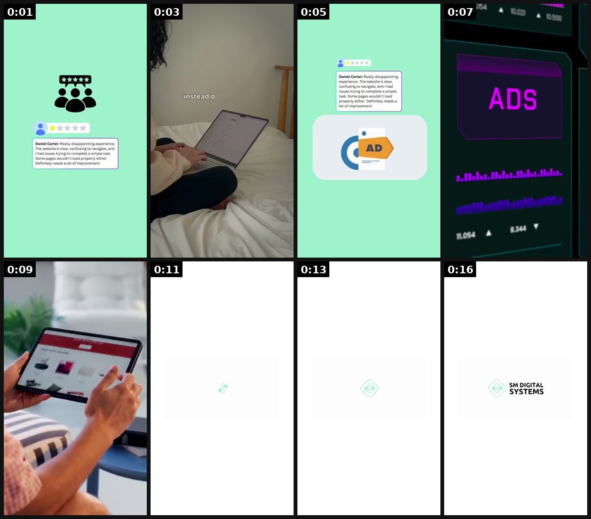

# 36 · Backhanded / 'bad review' ad (complaint that is secretly a benefit): see it, then make it

[](https://x.com/Smdigitalsys/status/2099549775892783266)

**The example:** [@Smdigitalsys on X](https://x.com/Smdigitalsys/status/2099549775892783266) · 0:17 video · 13 likes, 33 views

**Watch it:** [open the post on X](https://x.com/Smdigitalsys/status/2099549775892783266) · [play the video file](https://video.twimg.com/amplify_video/2099549675468570624/vid/avc1/320x568/Px6zCLdfn3su5zAH.mp4?tag=29)

> They left us a 1-star review. We turned it into an ad 😂🔥 DM your worst review, we'll turn it into content. #reputationmarketing #contentmarketing #smdigitalsystems

## What you are seeing

An agency's animated ad built from a real 1-star review ("They left us a 1-star review. We turned it into an ad"): a review card pops up, a hand on a laptop, an "ADS" dashboard, then a logo end card.

## Beat by beat

The storyboard above samples the video every 0:02. Lines are the transcript for that stretch; on-screen text comes from OCR, so treat it as rough.

| Frame | Time | On screen | Said / sung |
|---|---|---|---|
| 1 | 0:00–0:02 | Daniel Carter: Really appointing The website is slow, confusing to navigate, and issues trying to complete a simple task Some ps wouldn't load properly er needs | · |
| 2 | 0:02–0:04 | · | Someone left us this review, so instead of deleting it, we built a whole ad campaign around it. |
| 3 | 0:04–0:06 | · | · |
| 4 | 0:06–0:08 | · | · |
| 5 | 0:08–0:10 | · | Your worst review could be your best headline. DM us with yours. |
| 6 | 0:10–0:12 | · | · |
| 7 | 0:12–0:15 | · | · |
| 8 | 0:15–0:17 | SM DIGITAL SYSTEMS | · |

<details><summary>Full transcript (timestamped)</summary>

- `0:00` Someone left us this review, so instead of deleting it, we built a whole ad campaign around it.
- `0:07` Your worst review could be your best headline. DM us with yours.

</details>

## How to make one like it

**The format in one line:** A review-card or creator reading a "1-star review" whose complaint is actually a benefit ("1 star: I can't find a reason to take it off"), or a brand "we're sorry" apology for a positive problem ("we're sorry the herringbone sold out again"). Must use real reviews or be clearly the brand's own joke.

**Why it works:** - Negative stars stop the scroll (loss-aversion). - The twist makes it shareable; humour lowers ad resistance. - Real backhanded reviews are common in LC's review base (compliments, "addicted").

**Contents:** [1. Structure](#1-copy-the-structure) · [2. Shot by shot](#2-shot-by-shot-remake) · [3. Script and hooks](#3-write-the-script) · [4. Prompts](#4-prompts) · [5. Tools and settings](#5-tools-and-settings) · [6. Louise Carter remake](#6-louise-carter-remake) · [7. Variants and test](#7-variants-and-test-plan) · [8. Pitfalls](#8-pitfalls)

### 1. Copy the structure

Use the example's timing as your beat sheet. Keep the beat, change the words and the product.

| Beat | Time | In the example | Your version |
|---|---|---|---|
| 1 | 0:01 | Someone left us this review, so instead of deleting it, we built a whole ad campaign around it. | … |
| 2 | 0:03 | Someone left us this review, so instead of deleting it, we built a whole ad campaign around it. | … |
| 3 | 0:05 | Someone left us this review, so instead of deleting it, we built a whole ad campaign around it. | … |
| 4 | 0:07 | Your worst review could be your best headline. DM us with yours. | … |
| 5 | 0:09 | Your worst review could be your best headline. DM us with yours. | … |
| 6 | 0:11 | Your worst review could be your best headline. DM us with yours. | … |
| 7 | 0:13 | (visual beat, see frame 7) | … |
| 8 | 0:16 | on screen: SM DIGITAL SYSTEMS | … |

### 2. Shot-by-shot remake

**Target length / size:** Review card static or 15-30s video

| # | Time / slot | What we see (visual + camera) | Dialogue / on-screen text |
|---|---|---|---|
| 1 | 0-2s | A 1-star review card, big | "★☆☆☆☆ I can't find a reason to take it off." |
| 2 | 2-10s | Creator or brand reads it, deadpan | "Fair." |
| 3 | 10-20s | Proof that the complaint is the benefit | Shower, sea, sleep footage |
| 4 | End | Product | Offer |

<details><summary>Playbook shot list (Louise Carter version from the README)</summary>

| Time / slot | Visual | Audio / copy |
|---|---|---|
| 0-2s | 1-star review card on screen, creator reacting | "We got a 1-star review…" |
| 2-8s | Zoom on text: "Ruined my life. Everyone asks where it's from and I have to keep sending the link." | Creator deadpan |
| 8-15s | Product shots | "We're so sorry. Any 7 for $85." |

</details>

### 3. Write the script

Open with one of these hooks (first 1–3 seconds, or the headline on a static):

- "Our worst review ever:"
- "We're sorry. (Not really.)"
- "1 star: now my sister wants one too"
- "Complaint received: I forgot I was wearing it in the ocean"

Then fill the beats from the table above. Pull the wording from real customer reviews, not from ad copy: a review line beats a copywriter line almost every time. Read every line out loud and cut anything you would not say to a friend. Ready-made Louise Carter scripts are in section 6; hand [BOT.md](BOT.md) to any AI agent to write versions for another brand.

### 4. Prompts

**Copy**

```text
Write 20 fake-complaint lines that are clearly jokes and secretly benefits. Label them as a joke ("a review we wish we got") unless they are real reviews.
```

**Full creative-agent prompt (from the playbook):**

```
From these real LC reviews {{REVIEWS}}, find 10 that read like complaints but are benefits. For each: on-image quote (verbatim), 1-line brand "apology", 80-word primary text. Do NOT edit review wording.
```

### 5. Tools and settings

1. Search LC reviews for backhanded phrases ("addicted", "everyone asks", "husband", "can't stop").
2. Use real review text (with reviewer first name/initial per review-platform rules); if invented for comedy, frame as brand's own joke, never as a customer review.
3. Static review card + 10-15s creator/Qirra read version.

| Setting | Value |
|---|---|
| Canvas | 1080×1920 (9:16) master; crop a 1080×1350 (4:5) cut for feed placements |
| Frame rate | 30 fps (shoot 60 fps for slow-motion water or sparkle shots) |
| Camera | Phone main lens at 1x, exposure locked on skin, HDR off, grid on; tripod or a phone clamp for product shots |
| Light | One soft key at 45° (window or ring light), white card as fill; side light for metal sparkle |
| Audio | Lavalier or phone 15–20 cm from the mouth; mix voice at -14 LUFS, music at -28 to -30 dB under voice |
| Captions | Burned in, 2–5 words per line, 64–80 px bold sans, white with a black stroke or pill; keep text inside the safe zone (top 220 px and bottom 420 px clear, 64 px side margins) |
| Pacing | A visual change every 1.5–3 s; the hook lands in the first 1.5 s with no logo intro |
| Edit / export | CapCut or Premiere; H.264, 12–20 Mbps, AAC 320 kbps; upload natively to each platform, not via links |

### 6. Louise Carter remake

- A · Real review "my mom stole mine" → "We're sorry, [Name]. Here's a gift box for the next one."
- B · Qirra reading: "1 star: 'I wore it in the ocean and forgot'. Honestly, fair."
- C · "We're sorry" static: "We're sorry the Chelsea Herringbone sold out 3 times." (only if true)

Brand rules, claims you can and cannot make, and more scripts: [brands/louise-carter.md](brands/louise-carter.md). Step-by-step from idea to scale: [STAGES.md](STAGES.md).

### 7. Variants and test plan

- Review card vs founder read
- Apology vs 1-star frame

**Test plan:** - **Budget/structure:** 5 statics + 2 videos, $25/day each, 5 days - **Primary KPIs:** CTR, shares/1k, CPA; Omni (F36-*) - **Kill rule:** CPA >2× baseline - **Scale rule:** Organic series "reading our worst reviews" - **Naming:** `utm_content=F36-<concept>-<variant>`; weekly Omni roll-up of new-customer revenue by format.

**Naming:** `F36-<variant>-<hook##>-<date>` so results map back to this folder. Change one thing per test (hook, narrator, length or offer), never two.

### 8. Pitfalls

- A made-up review presented as real is a fake testimonial; frame it as a joke or use a real one.
- Slow open: if the first 1.5 s does not show the hook visually, most people swipe.
- Logo or brand intro at the start reads as an ad; put the brand at the end.
- Captions covered by the platform UI: check the safe zone on a real phone before posting.
- Music over the voice: keep music at least 14 dB under speech.

**Compliance:** Baseline: [_COMPLIANCE.md](../_COMPLIANCE.md) (no fake testimonials, AI disclosure, no bulk/spoofed accounts, copy structure not assets, PDP-only claims). - Never fabricate a review or alter a real one (FTC fake-review rule 2024). - Sell-out/"sorry" claims must be true.

## Field notes

Newer observations live in the playbook: [Wave 2c update: the "SCAM ALERT" skeptic flip](README.md)

## More examples

Every post we found for this format, with transcripts: [examples/](examples/README.md). Playbook: [README.md](README.md). Agent brief: [BOT.md](BOT.md).
