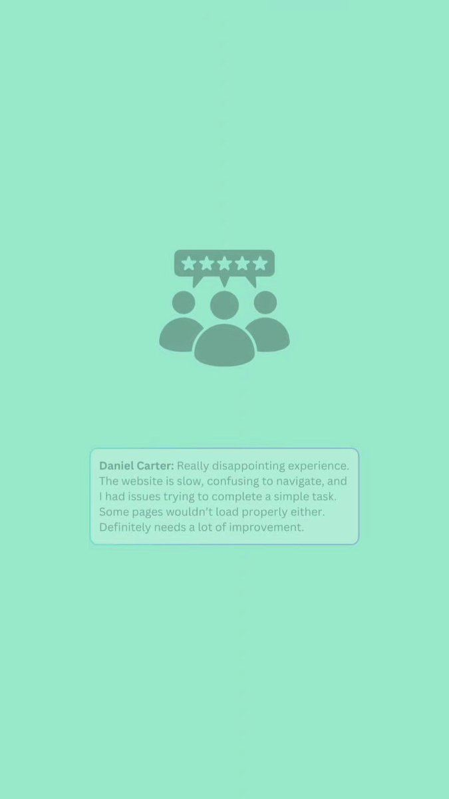

# 36 · Backhanded / "bad review" ad (complaint that is secretly a benefit)

<!-- HERO:START -->
[](EXAMPLE.md)

**[See the example and how to make it →](EXAMPLE.md)** · [watch on X](https://x.com/Smdigitalsys/status/2099549775892783266)
<!-- HERO:END -->


> **LC priority P1** · evidence: Medium (tier lists) · hype risk: Low · cost $0 · 15 min

## What it is
A review-card or creator reading a "1-star review" whose complaint is actually a benefit ("1 star: I can't find a reason to take it off"), or a brand "we're sorry" apology for a positive problem ("we're sorry the herringbone sold out again"). Must use real reviews or be clearly the brand's own joke.

## Why it works
- Negative stars stop the scroll (loss-aversion).
- The twist makes it shareable; humour lowers ad resistance.
- Real backhanded reviews are common in LC's review base (compliments, "addicted").

## Shot-by-shot (LC version)

| Time / slot | Visual | Audio / copy |
|---|---|---|
| 0-2s | 1-star review card on screen, creator reacting | "We got a 1-star review…" |
| 2-8s | Zoom on text: "Ruined my life. Everyone asks where it's from and I have to keep sending the link." | Creator deadpan |
| 8-15s | Product shots | "We're so sorry. Any 7 for $85." |

## Hooks (swap-in openers)
- "Our worst review ever:"
- "We're sorry. (Not really.)"
- "1 star: now my sister wants one too"
- "Complaint received: I forgot I was wearing it in the ocean"

## Real examples from X (studied)
- @nicktheriot_ — "bad review due to benefits" B-tier in 2026 creative tier list ([post](https://x.com/nicktheriot_/status/2108173638033871013)).
- @EmerieOnoh — "we're sorry" static in formats printing ([post](https://x.com/EmerieOnoh/status/2098426706612683154)).
- @KanishDigital — negative hooks; fully negative ad wins for one brand ([post](https://x.com/KanishDigital/status/2101549415467213023)).

## Production recipe
1. Search LC reviews for backhanded phrases ("addicted", "everyone asks", "husband", "can't stop").
2. Use real review text (with reviewer first name/initial per review-platform rules); if invented for comedy, frame as brand's own joke, never as a customer review.
3. Static review card + 10-15s creator/Qirra read version.

## Bot prompt (copy into the creative agent)
```
From these real LC reviews {{REVIEWS}}, find 10 that read like complaints but are benefits. For each: on-image quote (verbatim), 1-line brand "apology", 80-word primary text. Do NOT edit review wording.
```

## 3 LC scripts
- A · Real review "my mom stole mine" → "We're sorry, [Name]. Here's a gift box for the next one."
- B · Qirra reading: "1 star: 'I wore it in the ocean and forgot'. Honestly, fair."
- C · "We're sorry" static: "We're sorry the Chelsea Herringbone sold out 3 times." (only if true)

## Variants to test
- Review card vs founder read
- Apology vs 1-star frame

## Omni test plan
- **Budget/structure:** 5 statics + 2 videos, $25/day each, 5 days
- **Primary KPIs:** CTR, shares/1k, CPA; Omni (F36-*)
- **Kill rule:** CPA >2× baseline
- **Scale rule:** Organic series "reading our worst reviews"
- **Naming:** `utm_content=F36-<concept>-<variant>`; weekly Omni roll-up of new-customer revenue by format.

## Compliance
Baseline: [_COMPLIANCE.md](../_COMPLIANCE.md) (no fake testimonials, AI disclosure, no bulk/spoofed accounts, copy structure not assets, PDP-only claims).
- Never fabricate a review or alter a real one (FTC fake-review rule 2024).
- Sell-out/"sorry" claims must be true.

## Related
- Strategies: 11-social-proof-credibility-engine, 17-review-prompt-timing
- Formats: [34-callout-statics-signs-myths-warnings](../34-callout-statics-signs-myths-warnings/README.md), [40-testimonial-mashup](../40-testimonial-mashup/README.md)

## Wave 2c update: the "SCAM ALERT" skeptic flip
- Helio Pet: "SCAM ALERT ⭐ turns out it actually works?" static (vet-scrubs UGC) → /pages/helio-1 advertorial, 334 days live (@FedotOff90 dog-joint x-ray). Same mechanism as the backhanded review: open as a complaint and resolve as proof.

<!-- EVIDENCE:START -->
## Evidence from X discovery (auto-generated)

| Date | Author | Post | Engagement | Grade | Gist |
|---|---|---|---|---|---|
| 2026-07-27 | [@ads4apps](https://x.com/ads4apps) | [link](https://x.com/ads4apps/status/2081785032679518490) | 412L/930BM/27kV | VALUE | 39 Meta formats that convert (930 bookmarks): X reasons, IG story, us vs them, Venn, don't buy this, iPhone notes, text message, low stock, we're sorry, breaking news, Reddit, Google search, text on skin, tier list, zero stars… |
| 2026-09-20 | [@KanishDigital](https://x.com/KanishDigital) | [link](https://x.com/KanishDigital/status/2101549415467213023) | 13L/13BM/1kV | SOME | Negative hooks ("this product should be banned", "don't buy this…") — for one baby brand the best ad is a fully negative ad. |
| 2026-08-05 | [@Yannlce](https://x.com/Yannlce) | [link](https://x.com/Yannlce/status/2085017654364958737) | 3L/2BM/1kV | SOME | Same 40-format list (adds claymation, AI podcast). |
<!-- EVIDENCE:END -->
