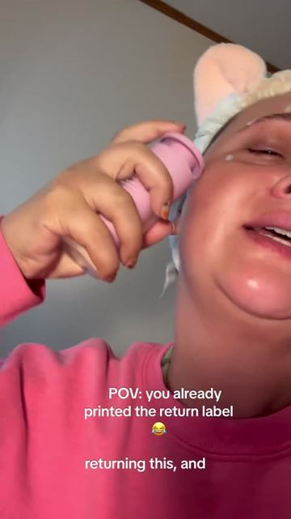
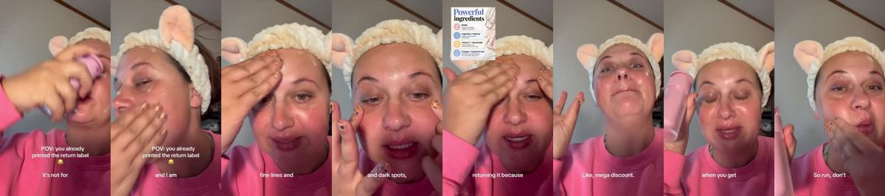
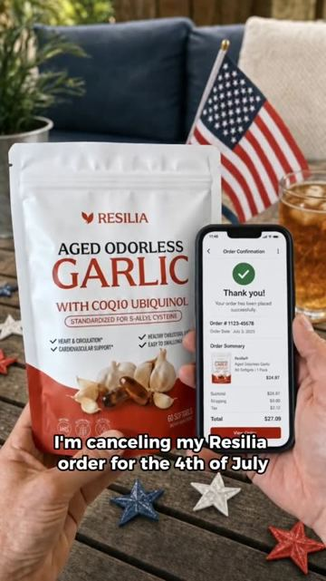
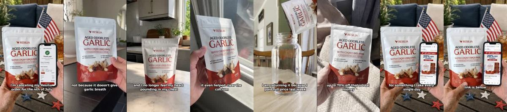

# Meta ad-library examples for F36

<!-- WAVE6 -->
## Wave 6: Resilia & Smooche live Meta ads (Oct 2026)

Pulled from the public Meta Ad Library on 2026-10-09 (Resilia: aged garlic, Ceylon cinnamon, oil of oregano; Smooche: color-changing foundation, Reverse Time peptide serum). Days live are counted to 2026-10-09; most video ads were new tests that week, while the long runners are statics and catalog templates. Transcripts are automatic. Brand claims are the advertisers', not verified, and many are health claims we would never make. The **Do not copy** line flags deceptive tactics (persona "publication" pages, undisclosed AI actors and "experts", fake stock counts).

### Smooche · Smooche: “I just got the smooth reverse tight serum in an absolutely shook it…” (4 days live)

- **Ad:** [Meta Ad Library #2004973356857122](https://www.facebook.com/ads/library/?id=2004973356857122) · video 0:40 · page “Smooche” · started 2026-10-04 · 2 copies · lands on `smooche.com/products/reverse-time-peptide-serum`
- **What happens:** Opens: “I just got the smooth reverse tight serum in an absolutely shook it. Literally target Literally target my fine lines and wrinkles helps target those hyperpigmentation pigmentation in dark spots and…”
- **Why it works:** "I am returning it because…" sets up a complaint that is really a benefit.
- **How to make one:** Start as a complaint, list the "problems" (each is a benefit), and end with "…anyway, I reordered."
- **LC remake:** "I'm returning my LC necklace because now none of my old jewelry looks good next to it."

Transcript (auto, first ~70 s)

> I just got the smooth reverse tight serum in an absolutely shook it. Literally target Literally target my fine lines and wrinkles helps target those hyperpigmentation pigmentation in dark spots and it is a lot of dark spots and it's beyond hydrating with the most amazing the most amazing ingredients but I'm freaking returning it because I got on the website today. And it's on huge discount. And if you get a second bottle you're only getting it for a second

### Resilia · Arterial Health Review: “not because it stopped working for the 4th of july right now. my chest…” (1 day live)

- **Ad:** [Meta Ad Library #1648532766604206](https://www.facebook.com/ads/library/?id=1648532766604206) · video 0:31 · page “Arterial Health Review” · started 2026-10-07 · 2 copies · lands on `resilia.shop/products/resilia-aged-odorless-garlic`
- **What happens:** Opens: “not because it stopped working for the 4th of july right now. my chest at night.”
- **Why it works:** "I am returning it because…" sets up a complaint that is really a benefit.
- **How to make one:** Start as a complaint, list the "problems" (each is a benefit), and end with "…anyway, I reordered."
- **LC remake:** "I'm returning my LC necklace because now none of my old jewelry looks good next to it."

Transcript (auto, first ~70 s)

> not because it stopped working for the 4th of july right now. my chest at night. It even helped clear the calcium build up off my artery walls. I am returning it because I paid full price last week, and Rizilia just dropped a massive 4th of July blowout. Up to 70% off. That is real money for something I take every single day. The fireworks end this weekend and so does this deal. Link is below. Go grab it before it closes.

<!-- /WAVE6 -->

