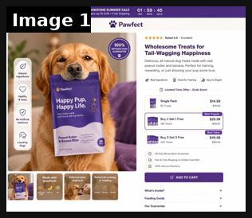
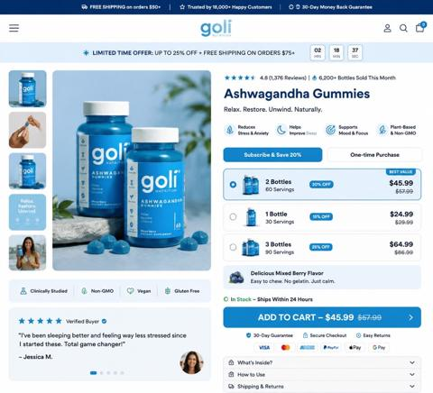
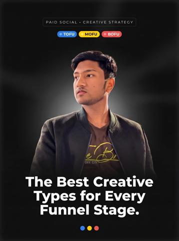
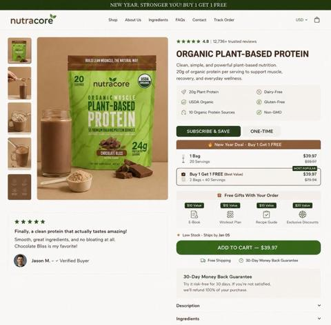
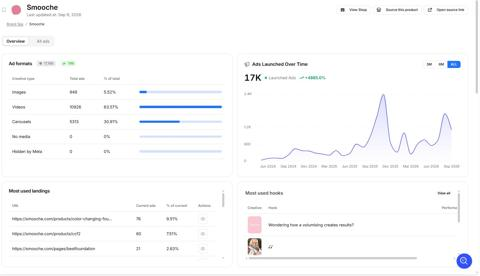

# 37 · Urgency/offer statics: low stock, back in stock, limited-time offer, BFCM: see it, then make it

[](https://x.com/johntech778/status/2106885699374829636)

**The example:** [@johntech778 on X](https://x.com/johntech778/status/2106885699374829636) · 1 image · 39 likes, 1K views

**Watch it:** [open the post on X](https://x.com/johntech778/status/2106885699374829636)

> "Buy 2 Get 1 Free" is a stronger offer than "33% off." Same discount. Better conversion. Here's why and how I structured a Pawfect product page around it 👇 9 conversion decisions most pet DTC brands get wrong: 1. Countdown timer in the top bar "PAWSOME SUMMER SALE · 01:59:45 · Save Up To 50% + Free Shipping." Urgency with a reason (seasonal sale). Buyers need a why, not just a when. 2. "100% Satisfaction Guarantee" b…

## What you are seeing

A product page shot as an offer static: a dog holding a treat bag, a countdown timer at the top, and a bundle picker (Single Pack, Buy 2 Get 1 Free and so on) with ratings and trust badges. The offer, not the product, is the hero.

## Image by image

| Image | Text on it (OCR, rough) |
|---|---|
| 1 | SUMMER SALE ve pp 59: 45 Rated 4.9 Excellent 100% Wholesome Treats for Happiness Delicious, al-natural dog treats made with real res peanut butter and banana, Perfect for training, rewarding, or just showing your pup some love. create ring my to United Time offer -Ends Happy Pup, a Single Pack $14.9 |

## More real examples (6)

Other posts that show this format, or a close cousin of it. Click a thumbnail to open it on X.

| | | |
|---|---|---|
| [](https://x.com/johntech778/status/2102744531489751066)<br>**@johntech778** · image · 369 views<br>"6,200+ Bottles Sold This Month" is the most under-used line on any product page. Here's how I structured a Goli Ashwagandha buy box around it 10 conv | [](https://x.com/usmanstrategist/status/2087306011849965645)<br>**@usmanstrategist** · image · 299 views<br>Here's a breakdown of the three funnel stages and the best creative formats for each, so you can drive more purchases and scale your brand more profit | [](https://x.com/kylaugccreator/status/2096744141031981406)<br>**@kylaugccreator** · 0:37 video · 228 views<br>Here’s an ugc example I created for Bucketlisters Nashville app The goal was to showcase a limited-time 90s throwback bar while positioning Bucketlist |
| [](https://x.com/hey_ankita/status/2102704237805547557)<br>**@hey_ankita** · 0:15 video · 45K views<br>90% OFF Seedance 2.5 on Pippit AI, now only $1.5/month for a limited time. Pippit AI is giving creators access to the official, native Seedance 2.5 mo | [](https://x.com/johntech778/status/2101658718647521629)<br>**@johntech778** · image · 368 views<br>Buy 1 Get 1 Free" is the most under-used conversion lever in supplement DTC. Here's how I structured a product page around it. 8 conversion decisions | [](https://x.com/jackolivieri_/status/2097798592010547583)<br>**@jackolivieri_** · images · 117 views<br>Smooche static "847 Orders in Last Hour, Almost Gone" / "LIVE UPDATE" stock copy (GetHookd share). |

## How to make one like it

**The format in one line:** Bottom-of-funnel statics built around a real time/stock constraint: "back in stock", "only N left", "ends Sunday", "BFCM: any 7 for $85 + free gift". Clean product + offer + deadline. For retargeting and seasonal pushes.

**Why it works:** - Converts warm audiences who already know the product. - LTO S-tier in a 2026 operator tier list. - Mirrors Omnisend/OneText calendar → consistent offer across channels.

**Contents:** [1. Structure](#1-copy-the-structure) · [2. Shot by shot](#2-shot-by-shot-remake) · [3. Script and hooks](#3-write-the-script) · [4. Prompts](#4-prompts) · [5. Tools and settings](#5-tools-and-settings) · [6. Louise Carter remake](#6-louise-carter-remake) · [7. Variants and test](#7-variants-and-test-plan) · [8. Pitfalls](#8-pitfalls)

### 1. Copy the structure

The skeleton every version follows: **hook → problem or tension → turn (the product shows up) → proof → one clear ask.** The shot-by-shot below fills it in.

### 2. Shot-by-shot remake

**Target length / size:** 1 static 1080x1350 per offer type

| # | Time / slot | What we see (visual + camera) | Dialogue / on-screen text |
|---|---|---|---|
| 1 | Low stock | Product photo + a live-looking stock bar | "Only 38 left of the Mae Necklace." |
| 2 | Back in stock | Bold "BACK" headline over the product | "Back in stock. Sold out in 9 days last time." |
| 3 | Limited-time offer | Offer in big type, end date | "Any 7 for $85 · Ends Sunday" |
| 4 | BFCM | Black background, gold type | "Black Friday: the stack deal, once a year." |

<details><summary>Playbook shot list (Louise Carter version from the README)</summary>

| Time / slot | Visual | Audio / copy |
|---|---|---|
| Static A | "Back in stock" stamp on Chelsea Herringbone | — |
| Static B | "Any 7 for $85 — ends Sunday" over stack flat-lay | — |
| Static C | Low-stock bar "87% claimed" | Only with real data |

</details>

### 3. Write the script

Open with one of these hooks (first 1–3 seconds, or the headline on a static):

- "It's back (for now)"
- "Any 7 for $85 ends Sunday"
- "BFCM early access: build your stack"
- "Last restock before the holidays"

Then fill the beats from the table above. Pull the wording from real customer reviews, not from ad copy: a review line beats a copywriter line almost every time. Read every line out loud and cut anything you would not say to a friend. Ready-made Louise Carter scripts are in section 6; hand [BOT.md](BOT.md) to any AI agent to write versions for another brand.

### 4. Prompts

**Figma**

```text
Headline 110px, offer line 56px, product 50% of canvas; a version per offer, same layout so only the message changes.
```

**Inventory link**

```text
Pull the real stock number from Shopify on the day you post; update or pause the ad when it changes.
```

**Full creative-agent prompt (from the playbook):**

```
Given the live offer {{OFFER}}, deadline {{DATE}} and stock data {{STOCK}}, write 8 urgency static headlines (≤8 words) and 8 subheads; only use scarcity that the data supports. Add matching Omnisend subject line and OneText SMS (≤140 chars).
```

### 5. Tools and settings

1. Pull real stock/deadline from Shopify; schedule start/stop.
2. Templates for back-in-stock, ends-X, BFCM, gift-deadline (shipping cutoff).
3. Retarget 30-day engagers + site visitors; exclude purchasers 7d.
4. Mirror in email (Omnisend) + SMS (OneText) with same UTM concept.

| Setting | Value |
|---|---|
| Canvas | 1080×1350 (4:5) for feed; 1080×1920 (9:16) story/reel version with the same elements stacked |
| Type | Headline 80–110 px, max 8 words; body 36–44 px; at most 2 typefaces |
| Layout | Headline readable at thumbnail size; product at least 40% of the canvas; logo small, bottom corner |
| Safe zone | Keep text out of the bottom 20% on 9:16 (UI overlays) |
| Tools | Figma or Canva for layout; Photoshop or Photoroom to cut out product; Midjourney or Flux only for backgrounds, never for the product itself |
| Export | PNG or JPG at quality 90, sRGB, under 1 MB |

### 6. Louise Carter remake

- A · "Back in stock: Chelsea Herringbone. Last time: 9 days."(only if true)
- B · "Any 7 for $85 — your stack, your rules. Ends Sunday."
- C · "Order by Dec 15 for gift delivery" (shipping cutoff).

Brand rules, claims you can and cannot make, and more scripts: [brands/louise-carter.md](brands/louise-carter.md). Step-by-step from idea to scale: [STAGES.md](STAGES.md).

### 7. Variants and test plan

- Deadline vs stock framing
- Product vs stack image

**Test plan:** - **Budget/structure:** Retargeting ad set $50-150/day during offer window - **Primary KPIs:** ROAS, CPA (warm); Omni attribution incl. email/SMS (F37-*) - **Kill rule:** Frequency >4 with falling CTR - **Scale rule:** BFCM calendar - **Naming:** `utm_content=F37-<concept>-<variant>`; weekly Omni roll-up of new-customer revenue by format.

**Naming:** `F37-<variant>-<hook##>-<date>` so results map back to this folder. Change one thing per test (hook, narrator, length or offer), never two.

### 8. Pitfalls

- Low-stock and deadline claims must be true (consumer law).
- Turn ads off when the offer ends.
- Don't run urgency all year; it stops working.
- Too much text: if it cannot be read in 1 second at thumbnail size, cut it.
- AI-generated product images: show the real product; AI is fine for backgrounds only.

**Compliance:** Baseline: [_COMPLIANCE.md](../_COMPLIANCE.md) (no fake testimonials, AI disclosure, no bulk/spoofed accounts, copy structure not assets, PDP-only claims). - Fake scarcity/countdowns are deceptive (FTC dark-patterns report, EU UCPD) — only real stock/deadlines. - Price/offer must match checkout.

## Field notes

Newer observations live in the playbook: [Wave 2d update: live-update stock statics (Smooche)](README.md) · [Wave 3 update: Meta ad-library long-runners (Fedotoff gut-health board)](README.md) · [Wave 4 update: Fedotoff October 2026 swipe boards](README.md)

## More examples

Every post we found for this format, with transcripts: [examples/](examples/README.md). Playbook: [README.md](README.md). Agent brief: [BOT.md](BOT.md).
