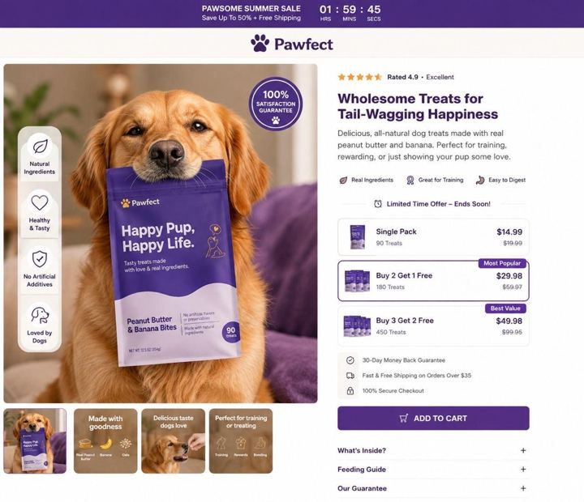

# 37 · Urgency/offer statics: low stock, back in stock, limited-time offer, BFCM

<!-- HERO:START -->
[](EXAMPLE.md)

**[See the example and how to make it →](EXAMPLE.md)** · [watch on X](https://x.com/johntech778/status/2106885699374829636)
<!-- HERO:END -->


> **LC priority P1** · evidence: High (S-tier LTO; BOF map) · hype risk: Low · cost $0 · 15 min

## What it is
Bottom-of-funnel statics built around a real time/stock constraint: "back in stock", "only N left", "ends Sunday", "BFCM: any 7 for $85 + free gift". Clean product + offer + deadline. For retargeting and seasonal pushes.

## Why it works
- Converts warm audiences who already know the product.
- LTO S-tier in a 2026 operator tier list.
- Mirrors Omnisend/OneText calendar → consistent offer across channels.

## Shot-by-shot (LC version)

| Time / slot | Visual | Audio / copy |
|---|---|---|
| Static A | "Back in stock" stamp on Chelsea Herringbone | — |
| Static B | "Any 7 for $85 — ends Sunday" over stack flat-lay | — |
| Static C | Low-stock bar "87% claimed" | Only with real data |

## Hooks (swap-in openers)
- "It's back (for now)"
- "Any 7 for $85 ends Sunday"
- "BFCM early access: build your stack"
- "Last restock before the holidays"

## Real examples from X (studied)
- @nicktheriot_ — limited-time offer S-tier; back in stock B-tier ([post](https://x.com/nicktheriot_/status/2108173638033871013)).
- @williamkast_ — BOF = urgency statics in funnel map ([post](https://x.com/williamkast_/status/2103910235005935644)).
- @EmerieOnoh — low stock / we're sorry statics printing ([post](https://x.com/EmerieOnoh/status/2098426706612683154)).
- @adamtaylorl — "discount statics" dead in 2026 ([post](https://x.com/adamtaylorl/status/2086814826177679660)) → frame bundle value, not "% off".

## Production recipe
1. Pull real stock/deadline from Shopify; schedule start/stop.
2. Templates for back-in-stock, ends-X, BFCM, gift-deadline (shipping cutoff).
3. Retarget 30-day engagers + site visitors; exclude purchasers 7d.
4. Mirror in email (Omnisend) + SMS (OneText) with same UTM concept.

## Bot prompt (copy into the creative agent)
```
Given the live offer {{OFFER}}, deadline {{DATE}} and stock data {{STOCK}}, write 8 urgency static headlines (≤8 words) and 8 subheads; only use scarcity that the data supports. Add matching Omnisend subject line and OneText SMS (≤140 chars).
```

## 3 LC scripts
- A · "Back in stock: Chelsea Herringbone. Last time: 9 days."(only if true)
- B · "Any 7 for $85 — your stack, your rules. Ends Sunday."
- C · "Order by Dec 15 for gift delivery" (shipping cutoff).

## Variants to test
- Deadline vs stock framing
- Product vs stack image

## Omni test plan
- **Budget/structure:** Retargeting ad set $50-150/day during offer window
- **Primary KPIs:** ROAS, CPA (warm); Omni attribution incl. email/SMS (F37-*)
- **Kill rule:** Frequency >4 with falling CTR
- **Scale rule:** BFCM calendar
- **Naming:** `utm_content=F37-<concept>-<variant>`; weekly Omni roll-up of new-customer revenue by format.

## Compliance
Baseline: [_COMPLIANCE.md](../_COMPLIANCE.md) (no fake testimonials, AI disclosure, no bulk/spoofed accounts, copy structure not assets, PDP-only claims).
- Fake scarcity/countdowns are deceptive (FTC dark-patterns report, EU UCPD) — only real stock/deadlines.
- Price/offer must match checkout.

## Related
- Strategies: 05-offer-page-engineering, 16-rewards-streaks-earned-discounts
- Formats: [17-lofi-handwritten-sign-promo-static](../17-lofi-handwritten-sign-promo-static/README.md), [32-screenshot-native-static-pack](../32-screenshot-native-static-pack/README.md)

## Wave 2d update: live-update stock statics (Smooche)
- Smooche static via a public GetHookd share: title **"847 Orders in Last Hour: Almost Gone"**, body "LIVE UPDATE: Stock is disappearing faster than we expected… Everyone who waits risks being stuck refreshing for the next restock" (36 days live; lands on the peptide-serum PDP). @jackolivieri_: "same hook, same offer, no rotation."
- Smooche PDP stack (Chase Chappell teardown): price anchor $59 → $39, "89% sold", countdown timers, bundles >50% savings, email pop-up converting 15-17%.
- LC: only real numbers ("312 orders since 9am" if true). Video version: **F99**.

<!-- EVIDENCE:START -->
## Wave 3 update: Meta ad-library long-runners (Fedotoff gut-health board)
- Phantom Athletics: Catalog DCO grid with big % badge (German), 445 days live. Meta's DCO tests the image/headline combos; the % badge + rating does all the selling for an impulse category.
- Stills, transcripts and LC remakes: [adlibrary/](adlibrary/README.md).

## Evidence from X discovery (auto-generated)

| Date | Author | Post | Engagement | Grade | Gist |
|---|---|---|---|---|---|
| 2026-07-27 | [@ads4apps](https://x.com/ads4apps) | [link](https://x.com/ads4apps/status/2081785032679518490) | 412L/930BM/27kV | VALUE | 39 Meta formats that convert (930 bookmarks): X reasons, IG story, us vs them, Venn, don't buy this, iPhone notes, text message, low stock, we're sorry, breaking news, Reddit, Google search, text on skin, tier list, zero stars… |
| 2026-09-26 | [@williamkast_](https://x.com/williamkast_) | [link](https://x.com/williamkast_/status/2103910235005935644) | 252L/400BM/13kV | VALUE | Formats by funnel: TOF founder/yapper/AI animation/natives/3 reasons/voiceless overlay; MOF comment reply/testimonial mashup/text wall; BOF urgency statics. |
| 2026-10-08 | [@nicktheriot_](https://x.com/nicktheriot_) | [link](https://x.com/nicktheriot_/status/2108173638033871013) | 219L/348BM/12kV | VALUE | 2026 FB creative styles tier list: S = long primary text + organic image, LTO, UGC, VSL, reaction, news; A = demo, us vs them, testimonial, close-up, founder story, podcast, BTS, authority, x reasons; C = unboxing, DITL. |
| 2026-08-21 | [@raph_guilhem](https://x.com/raph_guilhem) | [link](https://x.com/raph_guilhem/status/2090725512976970065) | 9L/6BM/0kV | SOME | 35 static/native formats tree: Trustpilot, text msg, email screenshot, Reddit, text on skin, crossed-out, tier list, Venn, breaking news. |
| 2026-09-11 | [@EmerieOnoh](https://x.com/EmerieOnoh) | [link](https://x.com/EmerieOnoh/status/2098426706612683154) | 6L/6BM/0kV | SOME | Static formats printing: us vs them, whiteboard, breaking news, doodle, low stock, iPhone notes, Google search, we're sorry, Reddit, tweet screenshot, text on palm. |
| 2026-08-05 | [@Yannlce](https://x.com/Yannlce) | [link](https://x.com/Yannlce/status/2085017654364958737) | 3L/2BM/1kV | SOME | Same 40-format list (adds claymation, AI podcast). |
| 2026-09-09 | [@jackolivieri_](https://x.com/jackolivieri_) | [link](https://x.com/jackolivieri_/status/2097798592010547583) | 0L/0BM/0kV | SOME | Smooche static "847 Orders in Last Hour, Almost Gone" / "LIVE UPDATE" stock copy (GetHookd share). |
<!-- EVIDENCE:END -->
