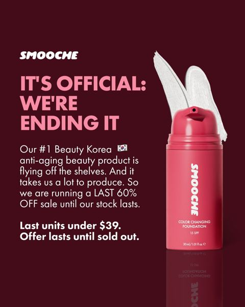
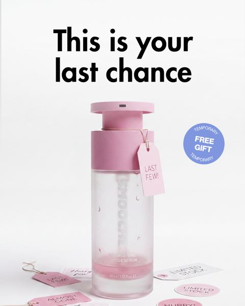
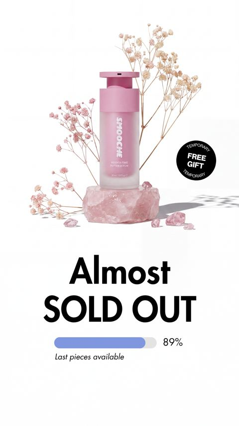
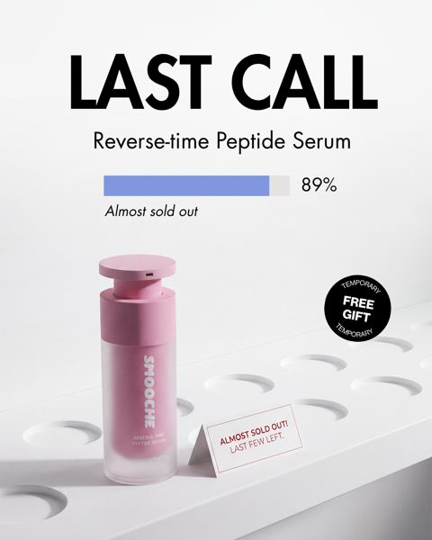
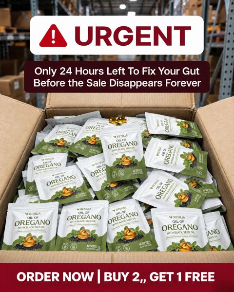

# Meta ad-library examples for F37 (GetHookd board 155932, gut health)

<!-- WAVE6 -->
## Wave 6: Resilia & Smooche live Meta ads (Oct 2026)

Pulled from the public Meta Ad Library on 2026-10-09 (Resilia: aged garlic, Ceylon cinnamon, oil of oregano; Smooche: color-changing foundation, Reverse Time peptide serum). Days live are counted to 2026-10-09; most video ads were new tests that week, while the long runners are statics and catalog templates. Transcripts are automatic. Brand claims are the advertisers', not verified, and many are health claims we would never make. The **Do not copy** line flags deceptive tactics (persona "publication" pages, undisclosed AI actors and "experts", fake stock counts).

### Smooche · Smooche: “IT'S OFFICIAL: WE'RE ENDING IT” (53 days live)

- **Ad:** [Meta Ad Library #3039677756368104](https://www.facebook.com/ads/library/?id=3039677756368104) · static image · page “Smooche” · started 2026-08-16 · 3 copies · lands on `smooche.com/products/ccf2`
- **What happens:** "IT'S OFFICIAL: WE'RE ENDING IT": the #1 product is "flying off the shelves… last 60% off sale until our stock lasts".
- **Why it works:** This is a whole urgency ladder: "FINAL 287 BOTTLES", "It's official: we're ending it", "This is your last chance", "Almost sold out 89%" with a progress bar, "LAST CALL", "URGENT: only 24 hours". The variants have been running 13-53 days.
- **How to make one:** Build 5 statics with the same product shot and an escalating headline plus a progress bar, and rotate them by audience recency.
- **Do not copy:** The stock counts and "ending it" claims run for weeks, so they are not literally true. Only state real stock.
- **LC remake:** The "Last 300 Lucky Charm sets" progress bar at 89%.

### Smooche · Smooche: “IT'S OFFICIAL: WE'RE ENDING IT” (10 days live)

- **Ad:** [Meta Ad Library #1425514233040456](https://www.facebook.com/ads/library/?id=1425514233040456) · static image · page “Smooche” · started 2026-09-28 · 2 copies · lands on `smooche.com/products/ccf2`
- **What happens:** "IT'S OFFICIAL: WE'RE ENDING IT" (headline: "FINAL 287 BOTTLES").
- **Why it works:** This is a whole urgency ladder: "FINAL 287 BOTTLES", "It's official: we're ending it", "This is your last chance", "Almost sold out 89%" with a progress bar, "LAST CALL", "URGENT: only 24 hours". The variants have been running 13-53 days.
- **How to make one:** Build 5 statics with the same product shot and an escalating headline plus a progress bar, and rotate them by audience recency.
- **Do not copy:** The stock counts and "ending it" claims run for weeks, so they are not literally true. Only state real stock.
- **LC remake:** The "Last 300 Lucky Charm sets" progress bar at 89%.

Primary text

> You've been thinking about it. Now everyone else is buying it. Our viral color-matching foundation is down to the last few hundred bottles and your shade won't last the day. We can't make them fast enough - production is 3 weeks behind demand. If you miss this drop, you're looking at a 6-week waitlist minimum. One bottle adapts to YOUR exact skin tone. No more guessing. No more orange jawlines. Click before it's too late.

### Smooche · Smooche: “This is your last chance” (37 days live)

- **Ad:** [Meta Ad Library #1829601588200696](https://www.facebook.com/ads/library/?id=1829601588200696) · static image · page “Smooche” · started 2026-09-01 · 4 copies · lands on `smooche.com/products/reverse-time-peptide-serum`
- **What happens:** "This is your last chance": a pink serum bottle with a FREE GIFT tag.
- **Why it works:** This is a whole urgency ladder: "FINAL 287 BOTTLES", "It's official: we're ending it", "This is your last chance", "Almost sold out 89%" with a progress bar, "LAST CALL", "URGENT: only 24 hours". The variants have been running 13-53 days.
- **How to make one:** Build 5 statics with the same product shot and an escalating headline plus a progress bar, and rotate them by audience recency.
- **Do not copy:** The stock counts and "ending it" claims run for weeks, so they are not literally true. Only state real stock.
- **LC remake:** The "Last 300 Lucky Charm sets" progress bar at 89%.

Primary text

> You’ve been thinking about it. Now everyone else is buying it. Our viral Reverse Time Peptide Serum is down to the last few hundred bottles — and this batch won’t last the day. This isn’t another moisturizer that just makes dry skin feel softer. It’s a concentrated peptide serum designed to target the visible signs of aging — helping skin look firmer, smoother and younger over time. Fine lines. Wrinkles. Loss of firmness. That tired, aging look in the mirror. Don’t just cover them up. Target them at the source. If you miss this drop, you’ll have to wait for the next batch. Click before it’s too late.

### Smooche · Smooche: “Almost SOLD OUT” (37 days live)

- **Ad:** [Meta Ad Library #1053306423980368](https://www.facebook.com/ads/library/?id=1053306423980368) · static image · page “Smooche” · started 2026-09-01 · 3 copies · lands on `smooche.com/products/reverse-time-peptide-serum`
- **What happens:** "Almost SOLD OUT" with an 89% progress bar.
- **Why it works:** This is a whole urgency ladder: "FINAL 287 BOTTLES", "It's official: we're ending it", "This is your last chance", "Almost sold out 89%" with a progress bar, "LAST CALL", "URGENT: only 24 hours". The variants have been running 13-53 days.
- **How to make one:** Build 5 statics with the same product shot and an escalating headline plus a progress bar, and rotate them by audience recency.
- **Do not copy:** The stock counts and "ending it" claims run for weeks, so they are not literally true. Only state real stock.
- **LC remake:** The "Last 300 Lucky Charm sets" progress bar at 89%.

Primary text

> You’ve been thinking about it. Now everyone else is buying it. Our viral Reverse Time Peptide Serum is down to the last few hundred bottles — and this batch won’t last the day. This isn’t another moisturizer that just makes dry skin feel softer. It’s a concentrated peptide serum designed to target the visible signs of aging — helping skin look firmer, smoother and younger over time. Fine lines. Wrinkles. Loss of firmness. That tired, aging look in the mirror. Don’t just cover them up. Target them at the source. If you miss this drop, you’ll have to wait for the next batch. Click before it’s too late.

### Smooche · Smooche: “LAST CALL. Reverse-time Peptide Serum, almost sold out 89%” (37 days live)

- **Ad:** [Meta Ad Library #1070916458773952](https://www.facebook.com/ads/library/?id=1070916458773952) · static image · page “Smooche” · started 2026-09-01 · 3 copies · lands on `smooche.com/products/reverse-time-peptide-serum`
- **What happens:** "LAST CALL. Reverse-time Peptide Serum, almost sold out 89%."
- **Why it works:** This is a whole urgency ladder: "FINAL 287 BOTTLES", "It's official: we're ending it", "This is your last chance", "Almost sold out 89%" with a progress bar, "LAST CALL", "URGENT: only 24 hours". The variants have been running 13-53 days.
- **How to make one:** Build 5 statics with the same product shot and an escalating headline plus a progress bar, and rotate them by audience recency.
- **Do not copy:** The stock counts and "ending it" claims run for weeks, so they are not literally true. Only state real stock.
- **LC remake:** The "Last 300 Lucky Charm sets" progress bar at 89%.

Primary text

> You’ve been thinking about it. Now everyone else is buying it. Our viral Reverse Time Peptide Serum is down to the last few hundred bottles — and this batch won’t last the day. This isn’t another moisturizer that just makes dry skin feel softer. It’s a concentrated peptide serum designed to target the visible signs of aging — helping skin look firmer, smoother and younger over time. Fine lines. Wrinkles. Loss of firmness. That tired, aging look in the mirror. Don’t just cover them up. Target them at the source. If you miss this drop, you’ll have to wait for the next batch. Click before it’s too late.

### Resilia · Resilia: “URGENT: only 24 hours left to fix your gut before the sale disappears forever” (1 day live)

- **Ad:** [Meta Ad Library #1105035942451176](https://www.facebook.com/ads/library/?id=1105035942451176) · static image · page “Resilia” · started 2026-10-07 · lands on `resilia.shop/products/resilia-oil-of-oregano-softgels`
- **What happens:** "URGENT: only 24 hours left to fix your gut before the sale disappears forever" over a warehouse box of pouches.
- **Why it works:** This is a whole urgency ladder: "FINAL 287 BOTTLES", "It's official: we're ending it", "This is your last chance", "Almost sold out 89%" with a progress bar, "LAST CALL", "URGENT: only 24 hours". The variants have been running 13-53 days.
- **How to make one:** Build 5 statics with the same product shot and an escalating headline plus a progress bar, and rotate them by audience recency.
- **Do not copy:** The stock counts and "ending it" claims run for weeks, so they are not literally true. Only state real stock.
- **LC remake:** The "Last 300 Lucky Charm sets" progress bar at 89%.

Primary text

> Resilia is powered by oil of oregano and cold-pressed black seed oil — two of nature's most time-tested botanicals. Our easy-to-swallow softgels feature premium oil of oregano with naturally occurring carvacrol and black seed oil with thymoquinone. Clean, no-BS ingredients, third-party tested, and shipped right from the USA to deliver daily support for a healthy gut, a healthy inflammatory response, and your body's natural defenses. Just two softgels a day, no powders or routines to remember.

<!-- /WAVE6 -->

From [@FedotOff90](https://x.com/FedotOff90/status/2108212319113412929)'s public board preview. Days live are as of 2026-10-09. Full board breakdown is in the internal sources folder.

## Phantom Athletics: Catalog DCO grid with big % badge (German) (445 days live)

- **What happens:** Dynamic-creative carousel: hero model holding the bag, three product variants stacked left, red 'JETZT -42%' badge, Trustpilot-style 4.75 rating strip.
- **Why it lasts:** 445 days live. Meta's DCO tests the image/headline combos; the % badge + rating does all the selling for an impulse category.
- **How to make one:** 1080x1080 and 1080x1350 templates in Canva; 3-6 cards; feed the catalog; one offer badge, max 3 colours.
- **LC remake:** LC catalog DCO: model wearing the stack, 3 variant tiles (necklace / huggies / bracelet), '7 for $85' badge, rating strip. Let Advantage+ creative rotate.

<!-- WAVE4 -->
## Wave 4: Alex Fedotoff's October 2026 swipe boards (GetHookd public previews)

Each ad below is from the free 10-ad preview of a public GetHookd board that [@FedotOff90](https://x.com/FedotOff90) shared on X. Days live are as of 2026-10-09; brand claims are the advertisers', not verified.

### Solvaderm Skin Care: Clean product-on-podium static (Solvaderm, "Unlock your best skin yet") (690 days live)

- **Board:** [Skincare & Anti-Aging Winners — Active Now (Oct 2026, US/EN)](https://x.com/FedotOff90/status/2107495487570137409) · dco
- **What happens:** A pastel 3D podium, a tall serum bottle, the headline "Unlock Your Best Skin Yet!" and a sub-line. DCO.
- **Why it lasts:** 690 days. It shows a polished brand static can also run for years in skincare (a contrast to the ugly-ad board).
- **How to make one:** A 3D-rendered podium scene, one bottle, a 5-word headline, 3 benefits.
- **LC remake:** LC: necklace on a podium, "Your forever necklace."

### Muscle Mat: "FREE" baby-on-topper static (Muscle Mat) (533 days live)

- **Board:** [Hook Frameworks That Stop the Scroll (Top 150)](https://x.com/FedotOff90/status/2106774251777020286) · dco
- **What happens:** A baby asleep on the topper with a "FREE" banner and a gift offer.
- **Why it lasts:** 533 days. A cute visual plus a giveaway word.
- **How to make one:** A cute visual, one big offer word.
- **LC remake:** "FREE" box with a wrist stack.

### BioRoot Labs: "A message from our founder" scarcity text static (378 days live)

- **Board:** [AI Storytelling Ads: 13 Brands x 50 Longest-Running (Oct 2026)](https://x.com/FedotOff90/status/2107177846070202853) · dco
- **What happens:** A white text static: "A MESSAGE FROM OUR FOUNDER 💔 We never expected this. Thousands of people are turning to BioRoot Labs' Doctor-Formulated Turmeric daily, and our limited Buy Two, Get One Free offer is about to expire… our stock is dangerously low… Sale ends at midnight." DCO with 29 media.
- **Why it lasts:** 378 days. A letter format reads as personal, not an ad, and adds offer scarcity.
- **How to make one:** A plain white letter, a heart emoji, 5 short paragraphs: surprise, demand, offer, scarcity, deadline. Sign-off.
- **LC remake:** "A message from our founder: the 7-for-$85 bundle is almost gone."

### Shopmenvault: "BUY 2, GET 2 FREE – We won't do this again" offer static (251 days live)

- **Board:** [Winning Men's Health / Testosterone Ads — June 2026](https://x.com/FedotOff90/status/2102455699557200246) · image
- **What happens:** A black static: "BUY 2, GET 2 FREE", "WE WON'T DO THIS AGAIN", 3 boxer briefs, "50% OFF deals", "Trusted by 10,000+ men after prostate surgery".
- **Why it lasts:** 251 days. A big bundle plus a one-time claim plus a niche trust line.
- **How to make one:** Offer as headline, a scarcity sub-line, product, a niche trust line.
- **LC remake:** "BUY 3 GET 4 FREE" (any 7 for $85).

