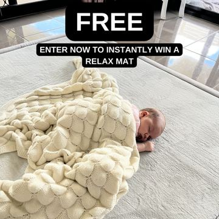
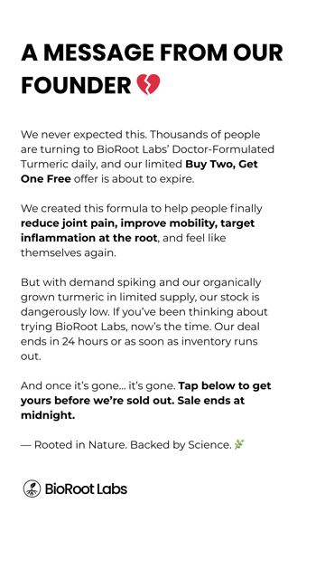

# Meta ad-library examples for F37 (GetHookd board 155932, gut health)

From [@FedotOff90](https://x.com/FedotOff90/status/2108212319113412929)'s public board preview. Days live are as of 2026-10-09. Full board breakdown is in the internal sources folder.

## Phantom Athletics: Catalog DCO grid with big % badge (German) (445 days live)

- **What happens:** Dynamic-creative carousel: hero model holding the bag, three product variants stacked left, red 'JETZT -42%' badge, Trustpilot-style 4.75 rating strip.
- **Why it lasts:** 445 days live. Meta's DCO tests the image/headline combos; the % badge + rating does all the selling for an impulse category.
- **How to make one:** 1080x1080 and 1080x1350 templates in Canva; 3-6 cards; feed the catalog; one offer badge, max 3 colours.
- **LC remake:** LC catalog DCO: model wearing the stack, 3 variant tiles (necklace / huggies / bracelet), '7 for $85' badge, rating strip. Let Advantage+ creative rotate.

<!-- WAVE4 -->
## Wave 4: Alex Fedotoff's October 2026 swipe boards (GetHookd public previews)

Each ad below is from the free 10-ad preview of a public GetHookd board that [@FedotOff90](https://x.com/FedotOff90) shared on X. Days live are as of 2026-10-09; brand claims are the advertisers', not verified.

### Solvaderm Skin Care: Clean product-on-podium static (Solvaderm, "Unlock your best skin yet") (690 days live)

- **Board:** [Skincare & Anti-Aging Winners — Active Now (Oct 2026, US/EN)](https://x.com/FedotOff90/status/2107495487570137409) · dco
- **What happens:** A pastel 3D podium, a tall serum bottle, the headline "Unlock Your Best Skin Yet!" and a sub-line. DCO.
- **Why it lasts:** 690 days. It shows a polished brand static can also run for years in skincare (a contrast to the ugly-ad board).
- **How to make one:** A 3D-rendered podium scene, one bottle, a 5-word headline, 3 benefits.
- **LC remake:** LC: necklace on a podium, "Your forever necklace."

### Muscle Mat: "FREE" baby-on-topper static (Muscle Mat) (533 days live)

- **Board:** [Hook Frameworks That Stop the Scroll (Top 150)](https://x.com/FedotOff90/status/2106774251777020286) · dco
- **What happens:** A baby asleep on the topper with a "FREE" banner and a gift offer.
- **Why it lasts:** 533 days. A cute visual plus a giveaway word.
- **How to make one:** A cute visual, one big offer word.
- **LC remake:** "FREE" box with a wrist stack.

### BioRoot Labs: "A message from our founder" scarcity text static (378 days live)

- **Board:** [AI Storytelling Ads: 13 Brands x 50 Longest-Running (Oct 2026)](https://x.com/FedotOff90/status/2107177846070202853) · dco
- **What happens:** A white text static: "A MESSAGE FROM OUR FOUNDER 💔 We never expected this. Thousands of people are turning to BioRoot Labs' Doctor-Formulated Turmeric daily, and our limited Buy Two, Get One Free offer is about to expire… our stock is dangerously low… Sale ends at midnight." DCO with 29 media.
- **Why it lasts:** 378 days. A letter format reads as personal, not an ad, and adds offer scarcity.
- **How to make one:** A plain white letter, a heart emoji, 5 short paragraphs: surprise, demand, offer, scarcity, deadline. Sign-off.
- **LC remake:** "A message from our founder: the 7-for-$85 bundle is almost gone."

### Shopmenvault: "BUY 2, GET 2 FREE – We won't do this again" offer static (251 days live)

- **Board:** [Winning Men's Health / Testosterone Ads — June 2026](https://x.com/FedotOff90/status/2102455699557200246) · image
- **What happens:** A black static: "BUY 2, GET 2 FREE", "WE WON'T DO THIS AGAIN", 3 boxer briefs, "50% OFF deals", "Trusted by 10,000+ men after prostate surgery".
- **Why it lasts:** 251 days. A big bundle plus a one-time claim plus a niche trust line.
- **How to make one:** Offer as headline, a scarcity sub-line, product, a niche trust line.
- **LC remake:** "BUY 3 GET 4 FREE" (any 7 for $85).

