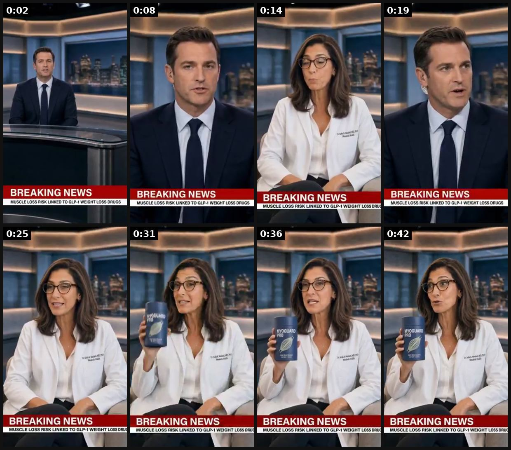
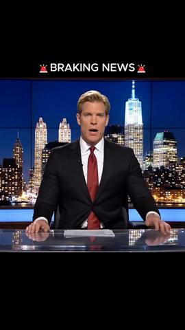
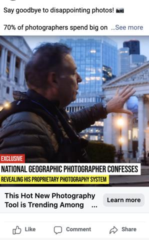
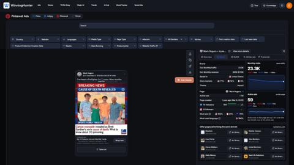
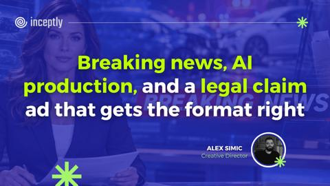

# 38 · Breaking-news / news-report style ad: see it, then make it

[](https://x.com/ladprofit/status/2089745258796261415)

**The example:** [@ladprofit on X](https://x.com/ladprofit/status/2089745258796261415) · 0:45 video · 58 likes, 90K views

**Watch it:** [open the post on X](https://x.com/ladprofit/status/2089745258796261415) · [play the video file](https://video.twimg.com/amplify_video/2089745025005735936/vid/avc1/320x570/iIVPKOKBkbB6gkI2.mp4?tag=29)

> built a BREAKING NEWS style ad with AI and it's terrifying how convincing it is synthetic spokesperson, invented product, "doctor" with credentials I generated, and the only thing standing between this and a multimillion-dollar lawsuit is a disclosure line I burned into the https://t.co/H4GpAMRZhd https://t.co/pgkBjE7Pui

## What you are seeing

An AI-generated breaking-news broadcast: a male anchor at a news desk with a red "BREAKING NEWS" lower-third, then a female reporter holding up the product as if it were a news story.

## Beat by beat

The storyboard above samples the video every 0:05. Lines are the transcript for that stretch; on-screen text comes from OCR, so treat it as rough.

| Frame | Time | On screen | Said / sung |
|---|---|---|---|
| 1 | 0:00–0:05 | · | We're following breaking news tonight on a growing concern for anyone taking a GLP-1 weight loss drug. |
| 2 | 0:05–0:11 | · | Joining us now, Dr. Sophia Marchetti. Doctor, what exactly is happening here? |
| 3 | 0:11–0:17 | · | When you eat significantly less, your body can't always tell the difference between fat and muscle. It burns both. |
| 4 | 0:17–0:22 | · | So people could be losing muscle without even realizing it? |
| 5 | 0:22–0:28 | we BREAKING NEWS | Exactly. That's why so many people feel weak and drained even as the number on the scale keeps dropping. |
| 6 | 0:28–0:34 | · | What should someone actually do about that? This. Myogard Pro. |
| 7 | 0:34–0:39 | · | Creatine, CAHMB, Zinc, Carnacine, 80-plus vitamins and minerals built to help you hold onto muscle |
| 8 | 0:39–0:45 | · | while you lose the fat. You don't have to lose muscle to lose weight. Ask about Myogard Pro. |

<details><summary>Full transcript (timestamped)</summary>

- `0:00` We're following breaking news tonight on a
- `0:02` growing concern for anyone taking a GLP-1 weight loss drug.
- `0:06` Joining us now, Dr. Sophia Marchetti.
- `0:09` Doctor, what exactly is happening here?
- `0:11` When you eat significantly less,
- `0:13` your body can't always tell the difference
- `0:15` between fat and muscle. It burns both.
- `0:17` So people could be losing muscle
- `0:19` without even realizing it?
- `0:21` Exactly. That's why so many people
- `0:23` feel weak and drained
- `0:25` even as the number on the scale keeps dropping.
- `0:28` What should someone actually do about that?
- `0:31` This. Myogard Pro.
- `0:33` Creatine, CAHMB, Zinc, Carnacine,
- `0:35` 80-plus vitamins and minerals
- `0:37` built to help you hold onto muscle
- `0:39` while you lose the fat.
- `0:41` You don't have to lose muscle to lose weight.
- `0:43` Ask about Myogard Pro.

</details>

## More real examples (5)

Other posts that show this format, or a close cousin of it. Click a thumbnail to open it on X.

| | | |
|---|---|---|
| [](https://x.com/HenryCrochemore/status/2034948938789171441)<br>**@HenryCrochemore** · 2:13 video · 7K views<br>an AI news broadcast opens the video “breaking news” a serious anchor at a desk city skyline behind him calm, authoritative voice it looks exactly lik | [](https://x.com/richardbrien/status/2103478126928138309)<br>**@richardbrien** · images · 91 views<br>"Breaking News" style ad creative crushes harder than any other format across long periods of time. | [](https://x.com/rogiergg/status/2086977376286585184)<br>**@rogiergg** · image · 123 views<br>(BREAKING NEWS - CAUSE OF DEATH REVEALED) tbh that's just a creative on a $29.99 CO detector not a product headline a news format! the ad does not fee |
| [](https://x.com/Bsschiller/status/2048497164393791985)<br>**@Bsschiller** · 0:46 video · 335 views<br>We turned an @IShowSpeed stream into a “news report” ad for a South Florida experience brand — and it was an overnight hit. 106x reach vs followers Hu | [](https://x.com/inceptly/status/2105302286490546274)<br>**@inceptly** · image · 14 views<br>🚨 What if your next ad looked like breaking news? This week's Modular Creative System ad breakdown covers a Find Legal ad that opens on an AI-generate |   |

## How to make one like it

**The format in one line:** The ad borrows news grammar: "BREAKING" lower-third, anchor-style delivery or a news-article screenshot announcing something genuinely new (launch, milestone, restock, real press). Video = creator as reporter on green screen; static = headline card.

**Why it works:** - News framing triggers "what happened?" curiosity. - S-tier in a 2026 operator tier list. - Natural fit for launches and milestones.

**Contents:** [1. Structure](#1-copy-the-structure) · [2. Shot by shot](#2-shot-by-shot-remake) · [3. Script and hooks](#3-write-the-script) · [4. Prompts](#4-prompts) · [5. Tools and settings](#5-tools-and-settings) · [6. Louise Carter remake](#6-louise-carter-remake) · [7. Variants and test](#7-variants-and-test-plan) · [8. Pitfalls](#8-pitfalls)

### 1. Copy the structure

Use the example's timing as your beat sheet. Keep the beat, change the words and the product.

| Beat | Time | In the example | Your version |
|---|---|---|---|
| 1 | 0:02 | We're following breaking news tonight on a growing concern for anyone taking a GLP-1 weight loss drug. | … |
| 2 | 0:08 | Joining us now, Dr. Sophia Marchetti. Doctor, what exactly is happening here? | … |
| 3 | 0:14 | When you eat significantly less, your body can't always tell the difference between fat and muscle. It burns both. | … |
| 4 | 0:19 | So people could be losing muscle without even realizing it? Exactly. That's why so many people | … |
| 5 | 0:25 | Exactly. That's why so many people feel weak and drained even as the number on the scale keeps dropping. | … |
| 6 | 0:31 | What should someone actually do about that? This. Myogard Pro. | … |
| 7 | 0:36 | Creatine, CAHMB, Zinc, Carnacine, 80-plus vitamins and minerals built to help you hold onto muscle | … |
| 8 | 0:42 | while you lose the fat. You don't have to lose muscle to lose weight. Ask about Myogard Pro. | … |

### 2. Shot-by-shot remake

**Target length / size:** 15-30s, 1080x1920

| # | Time / slot | What we see (visual + camera) | Dialogue / on-screen text |
|---|---|---|---|
| 1 | 0-3s | News-desk set, "BREAKING NEWS" red lower-third | Anchor: "Breaking: the necklace you can swim in is back in stock" |
| 2 | 3-15s | Reporter on location with the product | The genuinely new thing (launch, restock, milestone) |
| 3 | 15-25s | B-roll with news ticker | Facts |
| 4 | End | Logo card | Offer |

<details><summary>Playbook shot list (Louise Carter version from the README)</summary>

| Time / slot | Visual | Audio / copy |
|---|---|---|
| 0-2s | Red "BREAKING" bar, creator as anchor | "Breaking: a jewelry brand just passed 300,000 customers and…" |
| 2-12s | B-roll of pieces in water | "…the reason is you can shower in it." |
| 12-20s | Offer card | "Any 7 for $85. Back to you." |

</details>

### 3. Write the script

Open with one of these hooks (first 1–3 seconds, or the headline on a static):

- "BREAKING: the necklace that survived 6 months of ocean"
- "News: 300,000 women stopped taking their jewelry off"
- "This just in: the herringbone is back"

Then fill the beats from the table above. Pull the wording from real customer reviews, not from ad copy: a review line beats a copywriter line almost every time. Read every line out loud and cut anything you would not say to a friend. Ready-made Louise Carter scripts are in section 6; hand [BOT.md](BOT.md) to any AI agent to write versions for another brand.

### 4. Prompts

**Veo 3 / Kling**

```text
television news studio, a male anchor at a news desk, red BREAKING NEWS lower third, professional lighting, says "[line]", 8s, 9:16
```

**Full creative-agent prompt (from the playbook):**

```
Write 5 news-style LC ad scripts (20s) around these real events {{EVENTS}}: anchor line, 2 supporting facts, CTA. Plus 5 headline statics. Do not mimic real news outlets.
```

### 5. Tools and settings

1. Only announce real news (launch, milestone, restock, real press).
2. News lower-third template; no real network logos.
3. Creator on green screen or AI presenter (labelled).

| Setting | Value |
|---|---|
| Canvas | 1080×1920 (9:16) master; crop a 1080×1350 (4:5) cut for feed placements |
| Frame rate | 30 fps (shoot 60 fps for slow-motion water or sparkle shots) |
| Camera | Phone main lens at 1x, exposure locked on skin, HDR off, grid on; tripod or a phone clamp for product shots |
| Light | One soft key at 45° (window or ring light), white card as fill; side light for metal sparkle |
| Audio | Lavalier or phone 15–20 cm from the mouth; mix voice at -14 LUFS, music at -28 to -30 dB under voice |
| Captions | Burned in, 2–5 words per line, 64–80 px bold sans, white with a black stroke or pill; keep text inside the safe zone (top 220 px and bottom 420 px clear, 64 px side margins) |
| Pacing | A visual change every 1.5–3 s; the hook lands in the first 1.5 s with no logo intro |
| Edit / export | CapCut or Premiere; H.264, 12–20 Mbps, AAC 320 kbps; upload natively to each platform, not via links |

### 6. Louise Carter remake

- A · Milestone: "BREAKING: 300,000 customers…"
- B · Launch: "This just in: [new collection]…"
- C · Restock news.

Brand rules, claims you can and cannot make, and more scripts: [brands/louise-carter.md](brands/louise-carter.md). Step-by-step from idea to scale: [STAGES.md](STAGES.md).

### 7. Variants and test plan

- Anchor video vs headline static
- Serious vs playful

**Test plan:** - **Budget/structure:** 3 videos + 3 statics, $30/day, 5 days - **Primary KPIs:** Hook rate, CPA; Omni (F38-*) - **Kill rule:** CPA >2× - **Scale rule:** Use for every launch - **Naming:** `utm_content=F38-<concept>-<variant>`; weekly Omni roll-up of new-customer revenue by format.

**Naming:** `F38-<variant>-<hook##>-<date>` so results map back to this folder. Change one thing per test (hook, narrator, length or offer), never two.

### 8. Pitfalls

- Do not imitate a real network's branding.
- The "news" must be true; use only for real launches/restocks/milestones.
- Label AI.
- Slow open: if the first 1.5 s does not show the hook visually, most people swipe.
- Logo or brand intro at the start reads as an ad; put the brand at the end.
- Captions covered by the platform UI: check the safe zone on a real phone before posting.
- Music over the voice: keep music at least 14 dB under speech.

**Compliance:** Baseline: [_COMPLIANCE.md](../_COMPLIANCE.md) (no fake testimonials, AI disclosure, no bulk/spoofed accounts, copy structure not assets, PDP-only claims). - No fake news outlets, logos, or fabricated press; no "as seen on" unless true. - Meta prohibits ads impersonating news to mislead.

## Field notes

Newer observations live in the playbook: [Wave 4 update: Fedotoff October 2026 swipe boards](README.md)

## More examples

Every post we found for this format, with transcripts: [examples/](examples/README.md). Playbook: [README.md](README.md). Agent brief: [BOT.md](BOT.md).
