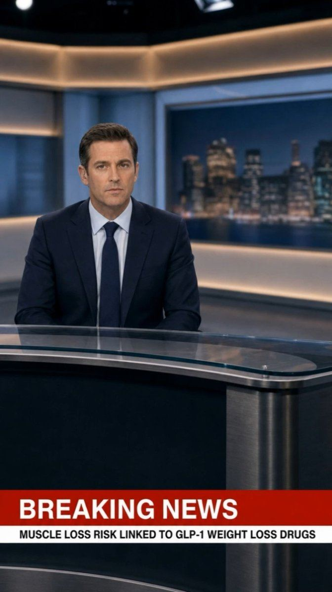

# 38 · Breaking-news / news-report style ad

<!-- HERO:START -->
[](EXAMPLE.md)

**[See the example and how to make it →](EXAMPLE.md)** · [watch on X](https://x.com/ladprofit/status/2089745258796261415)
<!-- HERO:END -->


> **LC priority P1** · evidence: High (S-tier "news") · hype risk: Medium · cost $0-100 · 30-60 min

## What it is
The ad borrows news grammar: "BREAKING" lower-third, anchor-style delivery or a news-article screenshot announcing something genuinely new (launch, milestone, restock, real press). Video = creator as reporter on green screen; static = headline card.

## Why it works
- News framing triggers "what happened?" curiosity.
- S-tier in a 2026 operator tier list.
- Natural fit for launches and milestones.

## Shot-by-shot (LC version)

| Time / slot | Visual | Audio / copy |
|---|---|---|
| 0-2s | Red "BREAKING" bar, creator as anchor | "Breaking: a jewelry brand just passed 300,000 customers and…" |
| 2-12s | B-roll of pieces in water | "…the reason is you can shower in it." |
| 12-20s | Offer card | "Any 7 for $85. Back to you." |

## Hooks (swap-in openers)
- "BREAKING: the necklace that survived 6 months of ocean"
- "News: 300,000 women stopped taking their jewelry off"
- "This just in: the herringbone is back"

## Real examples from X (studied)
- @nicktheriot_ — "news" S-tier ([post](https://x.com/nicktheriot_/status/2108173638033871013)).
- @raph_guilhem — "news report" in 30-format tree ([post](https://x.com/raph_guilhem/status/2083288607062732816)).
- @EmerieOnoh — breaking news static ([post](https://x.com/EmerieOnoh/status/2098426706612683154)).
- @ads4apps — breaking news in 39-format list ([post](https://x.com/ads4apps/status/2081785032679518490)).

## Production recipe
1. Only announce real news (launch, milestone, restock, real press).
2. News lower-third template; no real network logos.
3. Creator on green screen or AI presenter (labelled).

## Bot prompt (copy into the creative agent)
```
Write 5 news-style LC ad scripts (20s) around these real events {{EVENTS}}: anchor line, 2 supporting facts, CTA. Plus 5 headline statics. Do not mimic real news outlets.
```

## 3 LC scripts
- A · Milestone: "BREAKING: 300,000 customers…"
- B · Launch: "This just in: [new collection]…"
- C · Restock news.

## Variants to test
- Anchor video vs headline static
- Serious vs playful

## Omni test plan
- **Budget/structure:** 3 videos + 3 statics, $30/day, 5 days
- **Primary KPIs:** Hook rate, CPA; Omni (F38-*)
- **Kill rule:** CPA >2×
- **Scale rule:** Use for every launch
- **Naming:** `utm_content=F38-<concept>-<variant>`; weekly Omni roll-up of new-customer revenue by format.

## Compliance
Baseline: [_COMPLIANCE.md](../_COMPLIANCE.md) (no fake testimonials, AI disclosure, no bulk/spoofed accounts, copy structure not assets, PDP-only claims).
- No fake news outlets, logos, or fabricated press; no "as seen on" unless true.
- Meta prohibits ads impersonating news to mislead.

## Related
- Strategies: 43-48h-trend-hijacking, 35-mass-awareness-placement-to-advertorial
- Formats: [09-native-story-static-to-advertorial](../09-native-story-static-to-advertorial/README.md), [32-screenshot-native-static-pack](../32-screenshot-native-static-pack/README.md)

<!-- EVIDENCE:START -->
## Wave 4 update: Fedotoff October 2026 swipe boards
- Aurivita Cayenne: "WARNING: Fake websites!" brand notice static (Aurivita), 197 days live (iPhone Notes / Text Messages / Reddit / Google Search / Breaking News / DMs / Amazon Review / TikTok Comments board). A brand warning reads as a public service, and it implies demand (people copy it).
- Breaking News: Breaking-news TV lower-third static, 141 days live (iPhone Notes / Text Messages / Reddit / Google Search / Breaking News / DMs / Amazon Review / TikTok Comments board). A news frame stops the scroll; this one leans on a celebrity and is high-risk.
- Stills, how-to and LC remakes: [adlibrary/](adlibrary/README.md).

## Evidence from X discovery (auto-generated)

| Date | Author | Post | Engagement | Grade | Gist |
|---|---|---|---|---|---|
| 2026-07-27 | [@ads4apps](https://x.com/ads4apps) | [link](https://x.com/ads4apps/status/2081785032679518490) | 412L/930BM/27kV | VALUE | 39 Meta formats that convert (930 bookmarks): X reasons, IG story, us vs them, Venn, don't buy this, iPhone notes, text message, low stock, we're sorry, breaking news, Reddit, Google search, text on skin, tier list, zero stars… |
| 2026-10-08 | [@nicktheriot_](https://x.com/nicktheriot_) | [link](https://x.com/nicktheriot_/status/2108173638033871013) | 219L/348BM/12kV | VALUE | 2026 FB creative styles tier list: S = long primary text + organic image, LTO, UGC, VSL, reaction, news; A = demo, us vs them, testimonial, close-up, founder story, podcast, BTS, authority, x reasons; C = unboxing, DITL. |
| 2026-07-31 | [@raph_guilhem](https://x.com/raph_guilhem) | [link](https://x.com/raph_guilhem/status/2083288607062732816) | 55L/105BM/7kV | SOME | 30-format tree: hooks, founder (walking/car monologue, whiteboard), social proof (customer call, DM I get every day), news report. |
| 2026-08-21 | [@raph_guilhem](https://x.com/raph_guilhem) | [link](https://x.com/raph_guilhem/status/2090725512976970065) | 9L/6BM/0kV | SOME | 35 static/native formats tree: Trustpilot, text msg, email screenshot, Reddit, text on skin, crossed-out, tier list, Venn, breaking news. |
| 2026-09-11 | [@EmerieOnoh](https://x.com/EmerieOnoh) | [link](https://x.com/EmerieOnoh/status/2098426706612683154) | 6L/6BM/0kV | SOME | Static formats printing: us vs them, whiteboard, breaking news, doodle, low stock, iPhone notes, Google search, we're sorry, Reddit, tweet screenshot, text on palm. |
| 2026-08-05 | [@Yannlce](https://x.com/Yannlce) | [link](https://x.com/Yannlce/status/2085017654364958737) | 3L/2BM/1kV | SOME | Same 40-format list (adds claymation, AI podcast). |
<!-- EVIDENCE:END -->
