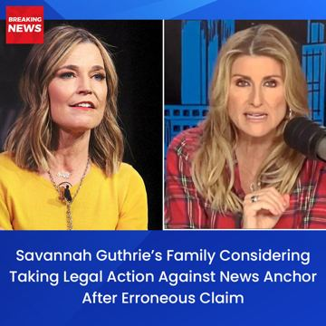

# Meta ad-library examples for F38

<!-- WAVE4 -->
## Wave 4: Alex Fedotoff's October 2026 swipe boards (GetHookd public previews)

Each ad below is from the free 10-ad preview of a public GetHookd board that [@FedotOff90](https://x.com/FedotOff90) shared on X. Days live are as of 2026-10-09; brand claims are the advertisers', not verified.

### Aurivita Cayenne: "WARNING: Fake websites!" brand notice static (Aurivita) (197 days live)

- **Board:** [iPhone Notes / Text Messages / Reddit / Google Search / Breaking News / DMs / Amazon Review / TikTok Comments](https://x.com/FedotOff90/status/2106046297434374289) · image
- **What happens:** A red "WARNING Fake websites!" banner with screenshots stamped "FAKE": "We are the original brand, and we don't sell on Amazon… if you see ads offering Auri Cayenne Pepper in huge discounts, do not place an order."
- **Why it lasts:** 197 days. A brand warning reads as a public service, and it implies demand (people copy it).
- **How to make one:** A red warning banner, screenshots stamped FAKE, an "original brand" claim.
- **LC remake:** "WARNING: fake LC sellers on Amazon" (only if true).

### Breaking News: Breaking-news TV lower-third static (141 days live)

- **Board:** [iPhone Notes / Text Messages / Reddit / Google Search / Breaking News / DMs / Amazon Review / TikTok Comments](https://x.com/FedotOff90/status/2106046297434374289) · image
- **What happens:** Two news-anchor photos with a "BREAKING NEWS" bug and a lower-third headline about a family considering legal action against a news anchor.
- **Why it lasts:** 141 days. A news frame stops the scroll; this one leans on a celebrity and is high-risk.
- **How to make one:** A TV-news template with a non-celebrity, a true, brand-safe headline.
- **LC remake:** Avoid celebrity misuse. Use "BREAKING: waterproof gold is real".

