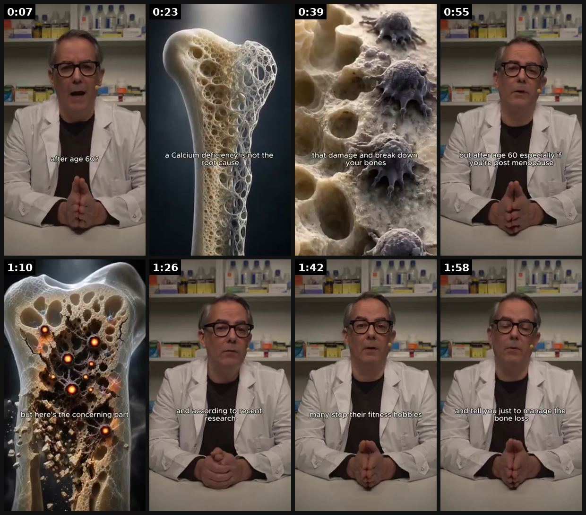

# 39 · '3 reasons why' / X reasons listicle ad: see it, then make it

[](https://x.com/lorenzo_pravata/status/2090384597737508973)

**The example:** [@lorenzo_pravata on X](https://x.com/lorenzo_pravata/status/2090384597737508973) · 2:05 video · 70 likes, 5K views

**Watch it:** [open the post on X](https://x.com/lorenzo_pravata/status/2090384597737508973) · [play the video file](https://video.twimg.com/amplify_video/2090376266335580160/vid/avc1/320x568/5ryLgPLePCgfeqb6.mp4?tag=29)

> This ad is CRAZY from the team: The 3 reasons why: 1. Script is crazy good 2. Format includes an authority figure and looks like nothing in the ad account 3. Our B-roll generation from our editors is perfectly placed inside the footage (Look at the enemy we present as well) https://t.co/Gjo1v1IUok

## What you are seeing

A doctor in a white coat talking to camera, intercut with CGI of a bone breaking down and microscopic cells. Each "reason why" gets its own visual, then it cuts back to the doctor.

## Beat by beat

The storyboard above samples the video every 0:15. Lines are the transcript for that stretch; on-screen text comes from OCR, so treat it as rough.

| Frame | Time | On screen | Said / sung |
|---|---|---|---|
| 1 | 0:00–0:15 | a, ar si -2 fs my after age 607 eo lu fl me me, | There is a cellular reason your bones thin after menopause, and it is reversible. What is the best way to rebuild bone density after age 60? Calcium pills? No. Phosomax? Nope. Prolianjections? Definitely not. |
| 2 | 0:15–0:31 | · | There is an even more powerful vitamin that rebuilds bone density in the hips, knees, and spine. Did you know that a calcium deficiency is not the root cause of osteoporosis? Contrary to popular belief, a calcium deficiency is a symptom, but not the root cause. |
| 3 | 0:31–0:47 | Nw a a that damage and Weak down your bones rX ns SS ee Se | Inside your bones, there are a group of good cells that repair and grow your bones, and a group of evil cells that damage and break down your bones. This process is called bone remodeling. And when you're young, this process works in perfect balance. |
| 4 | 0:47–1:02 | a. git hy especially if youre post menopause a 9? | The old cells get cleared out to make room for new, healthy ones. And your bones stay healthy and strong, no problems. But after age 60, especially if you're postmenopause, your body starts accumulating a surplus of evil cells called zombie cells. And these zombie cells break down your bones faster  |
| 5 | 1:02–1:18 | · | Aki, low back, knees, or hips, that's your skeletal system losing that battle to zombie cells. But here's the concerning part, if your bones get too weak, most doctors say you'll be stuck with the pain forever. Your bones become thin, brittle, fragile, |
| 6 | 1:18–1:34 | · | until something as simple as a stumble, a bump, or even an awkward step becomes a fracture waiting to happen. And according to recent research, low bone density is one of the leading reasons people lose their independence as they age. A hip fracture can mean surgery. |
| 7 | 1:34–1:50 | et a, Sy their fitness Sy ae ee | A spinal fracture can mean permanent disability. A simple fall can mean never living alone again. Many stop their fitness hobbies. Many stop visiting family. And the next thing you know, then the old folks home. All because of bone loss caused by these evil zombie cells. |
| 8 | 1:50–2:05 | and tell you just to manage the bone loss yr fi | Meanwhile, doctors keep prescribing calcium supplements. Bio-phosphate medications and tell you just to manage the bone loss. But calcium supplements don't remove the zombie cells attacking your bones. And prescription medications don't eliminate the root. |

<details><summary>Full transcript (timestamped)</summary>

- `0:00` There is a cellular reason your bones thin after menopause, and it is reversible.
- `0:05` What is the best way to rebuild bone density after age 60?
- `0:09` Calcium pills? No.
- `0:11` Phosomax? Nope.
- `0:12` Prolianjections? Definitely not.
- `0:14` There is an even more powerful vitamin that rebuilds bone density in the hips,
- `0:18` knees, and spine.
- `0:20` Did you know that a calcium deficiency is not the root cause of osteoporosis?
- `0:25` Contrary to popular belief, a calcium deficiency is a symptom, but not the root cause.
- `0:30` Inside your bones, there are a group of good cells that repair and grow your bones,
- `0:36` and a group of evil cells that damage and break down your bones.
- `0:39` This process is called bone remodeling.
- `0:42` And when you're young, this process works in perfect balance.
- `0:45` The old cells get cleared out to make room for new, healthy ones.
- `0:49` And your bones stay healthy and strong, no problems.
- `0:51` But after age 60, especially if you're postmenopause,
- `0:55` your body starts accumulating a surplus of evil cells called zombie cells.
- `0:59` And these zombie cells break down your bones faster than your body can repair them.
- `1:04` Aki, low back, knees, or hips,
- `1:06` that's your skeletal system losing that battle to zombie cells.
- `1:10` But here's the concerning part, if your bones get too weak,
- `1:13` most doctors say you'll be stuck with the pain forever.
- `1:16` Your bones become thin, brittle, fragile,
- `1:19` until something as simple as a stumble, a bump,
- `1:22` or even an awkward step becomes a fracture waiting to happen.
- `1:25` And according to recent research,
- `1:27` low bone density is one of the leading reasons people lose their independence as they age.
- `1:32` A hip fracture can mean surgery.
- `1:34` A spinal fracture can mean permanent disability.
- `1:37` A simple fall can mean never living alone again.
- `1:40` Many stop their fitness hobbies.
- `1:42` Many stop visiting family.
- `1:44` And the next thing you know, then the old folks home.
- `1:47` All because of bone loss caused by these evil zombie cells.
- `1:51` Meanwhile, doctors keep prescribing calcium supplements.
- `1:55` Bio-phosphate medications and tell you just to manage the bone loss.
- `1:58` But calcium supplements don't remove the zombie cells attacking your bones.
- `2:03` And prescription medications don't eliminate the root.

</details>

## How to make one like it

**The format in one line:** A numbered listicle — "3 reasons I only wear 14K PVD", "5 reasons this is the best gift under $100" — delivered as talking head, voiceless overlay, carousel or static. Same message, packaged as a list.

**Why it works:** - Numbers promise a finite, skimmable payoff → watch-through. - Converts any winning message into a new framework (Entity ID) per @williamkast_. - Easy for creators and AI to produce at volume.

**Contents:** [1. Structure](#1-copy-the-structure) · [2. Shot by shot](#2-shot-by-shot-remake) · [3. Script and hooks](#3-write-the-script) · [4. Prompts](#4-prompts) · [5. Tools and settings](#5-tools-and-settings) · [6. Louise Carter remake](#6-louise-carter-remake) · [7. Variants and test](#7-variants-and-test-plan) · [8. Pitfalls](#8-pitfalls)

### 1. Copy the structure

Use the example's timing as your beat sheet. Keep the beat, change the words and the product.

| Beat | Time | In the example | Your version |
|---|---|---|---|
| 1 | 0:07 | There is a cellular reason your bones thin after menopause, and it is reversible. What is the best way to rebuild bone density after age 60? | … |
| 2 | 0:23 | There is an even more powerful vitamin that rebuilds bone density in the hips, knees, and spine. Did you know that a calcium deficiency is n | … |
| 3 | 0:39 | Inside your bones, there are a group of good cells that repair and grow your bones, and a group of evil cells that damage and break down you | … |
| 4 | 0:55 | The old cells get cleared out to make room for new, healthy ones. And your bones stay healthy and strong, no problems. But after age 60, esp | … |
| 5 | 1:10 | Aki, low back, knees, or hips, that's your skeletal system losing that battle to zombie cells. But here's the concerning part, if your bones | … |
| 6 | 1:26 | until something as simple as a stumble, a bump, or even an awkward step becomes a fracture waiting to happen. And according to recent resear | … |
| 7 | 1:42 | A spinal fracture can mean permanent disability. A simple fall can mean never living alone again. Many stop their fitness hobbies. Many stop | … |
| 8 | 1:58 | Meanwhile, doctors keep prescribing calcium supplements. Bio-phosphate medications and tell you just to manage the bone loss. But calcium su | … |

### 2. Shot-by-shot remake

**Target length / size:** 20-40s video, carousel or static

| # | Time / slot | What we see (visual + camera) | Dialogue / on-screen text |
|---|---|---|---|
| 1 | 0-2s | Creator holds up 3 fingers + product | "3 reasons I stopped buying gold-plated jewelry" |
| 2 | 2-8s | Shower shot | "1: I shower in this." |
| 3 | 8-14s | Gift box | "2: it comes ready to gift." |
| 4 | 14-20s | Stack on wrist | "3: any 7 for $85." |
| 5 | End | Product | CTA |

<details><summary>Playbook shot list (Louise Carter version from the README)</summary>

| Time / slot | Visual | Audio / copy |
|---|---|---|
| 0-2s | Creator holds up 3 fingers + necklace | "3 reasons I stopped buying gold-plated jewelry" |
| 2-8s | Shower shot | "1: I shower in this." |
| 8-14s | Gift box | "2: it comes ready to gift." |
| 14-20s | Stack | "3: any 7 for $85." |

</details>

### 3. Write the script

Open with one of these hooks (first 1–3 seconds, or the headline on a static):

- "3 reasons this is the only necklace I wear"
- "5 reasons it's the easiest gift this year"
- "3 reasons your jewelry turns green (and the fix)"

Then fill the beats from the table above. Pull the wording from real customer reviews, not from ad copy: a review line beats a copywriter line almost every time. Read every line out loud and cut anything you would not say to a friend. Ready-made Louise Carter scripts are in section 6; hand [BOT.md](BOT.md) to any AI agent to write versions for another brand.

### 4. Prompts

**Claude**

```text
From these reviews [paste], extract the 6 most-mentioned reasons. Write 3 listicles (3, 5, 7 reasons) as a 20s talking-head script, 8 carousel slides (max 10 words each) and one static headline.
```

**Full creative-agent prompt (from the playbook):**

```
From {{REVIEWS}} extract the 6 most-mentioned reasons customers love LC. Write 3 listicles (3, 5, 7 reasons) as: 20s talking-head script, carousel slides (≤10 words each), static headline.
```

### 5. Tools and settings

1. Pull reasons from reviews (angle bank).
2. Produce 4 packagings: talking head, F30 overlay, carousel, static.
3. Hook variants: number (3 vs 5) and subject.

| Setting | Value |
|---|---|
| Canvas | 1080×1920 (9:16) master; crop a 1080×1350 (4:5) cut for feed placements |
| Frame rate | 30 fps (shoot 60 fps for slow-motion water or sparkle shots) |
| Camera | Phone main lens at 1x, exposure locked on skin, HDR off, grid on; tripod or a phone clamp for product shots |
| Light | One soft key at 45° (window or ring light), white card as fill; side light for metal sparkle |
| Audio | Lavalier or phone 15–20 cm from the mouth; mix voice at -14 LUFS, music at -28 to -30 dB under voice |
| Captions | Burned in, 2–5 words per line, 64–80 px bold sans, white with a black stroke or pill; keep text inside the safe zone (top 220 px and bottom 420 px clear, 64 px side margins) |
| Pacing | A visual change every 1.5–3 s; the hook lands in the first 1.5 s with no logo intro |
| Edit / export | CapCut or Premiere; H.264, 12–20 Mbps, AAC 320 kbps; upload natively to each platform, not via links |

### 6. Louise Carter remake

- A · "3 reasons I only wear LC": shower, compliments, price.
- B · "5 reasons it's the best gift under $100".
- C · Carousel: "7 pieces, 7 reasons" (any 7 for $85).

Brand rules, claims you can and cannot make, and more scripts: [brands/louise-carter.md](brands/louise-carter.md). Step-by-step from idea to scale: [STAGES.md](STAGES.md).

### 7. Variants and test plan

- Number of reasons
- Packaging (video/carousel/static)

**Test plan:** - **Budget/structure:** 4 packagings, $30/day each, 5 days - **Primary KPIs:** Hold rate, CPA; Omni (F39-*) - **Kill rule:** CPA >2× - **Scale rule:** Rotate reasons from new reviews - **Naming:** `utm_content=F39-<concept>-<variant>`; weekly Omni roll-up of new-customer revenue by format.

**Naming:** `F39-<variant>-<hook##>-<date>` so results map back to this folder. Change one thing per test (hook, narrator, length or offer), never two.

### 8. Pitfalls

- Each reason must be true and checkable.
- Package the same reasons 4 ways (talking head, overlay, carousel, static) before changing the reasons.
- Slow open: if the first 1.5 s does not show the hook visually, most people swipe.
- Logo or brand intro at the start reads as an ad; put the brand at the end.
- Captions covered by the platform UI: check the safe zone on a real phone before posting.
- Music over the voice: keep music at least 14 dB under speech.

**Compliance:** Baseline: [_COMPLIANCE.md](../_COMPLIANCE.md) (no fake testimonials, AI disclosure, no bulk/spoofed accounts, copy structure not assets, PDP-only claims). - Each reason must be substantiated by PDP or real reviews.

## Field notes

Newer observations live in the playbook: [Wave 2c update: AI listicle angles (Fedotoff Vol. 04)](README.md)

## More examples

Every post we found for this format, with transcripts: [examples/](examples/README.md). Playbook: [README.md](README.md). Agent brief: [BOT.md](BOT.md).
