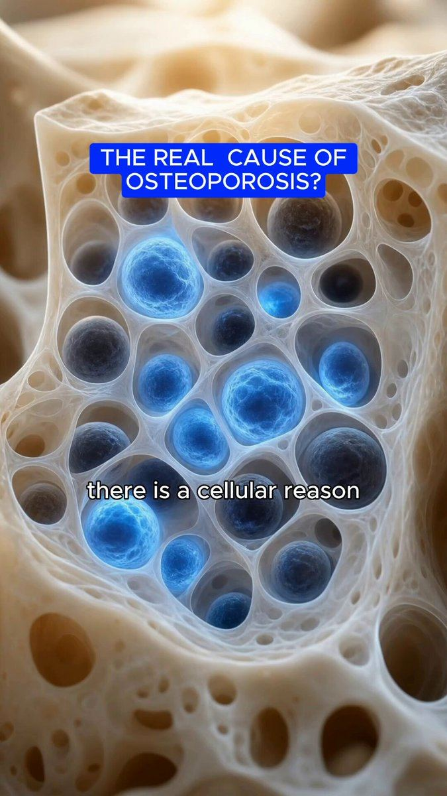

# 39 · "3 reasons why" / X reasons listicle ad

<!-- HERO:START -->
[](EXAMPLE.md)

**[See the example and how to make it →](EXAMPLE.md)** · [watch on X](https://x.com/lorenzo_pravata/status/2090384597737508973)
<!-- HERO:END -->


> **LC priority P1** · evidence: High (framework in multiple systems) · hype risk: Low · cost $0-50 · 20-40 min

## What it is
A numbered listicle — "3 reasons I only wear 14K PVD", "5 reasons this is the best gift under $100" — delivered as talking head, voiceless overlay, carousel or static. Same message, packaged as a list.

## Why it works
- Numbers promise a finite, skimmable payoff → watch-through.
- Converts any winning message into a new framework (Entity ID) per @williamkast_.
- Easy for creators and AI to produce at volume.

## Shot-by-shot (LC version)

| Time / slot | Visual | Audio / copy |
|---|---|---|
| 0-2s | Creator holds up 3 fingers + necklace | "3 reasons I stopped buying gold-plated jewelry" |
| 2-8s | Shower shot | "1: I shower in this." |
| 8-14s | Gift box | "2: it comes ready to gift." |
| 14-20s | Stack | "3: any 7 for $85." |

## Hooks (swap-in openers)
- "3 reasons this is the only necklace I wear"
- "5 reasons it's the easiest gift this year"
- "3 reasons your jewelry turns green (and the fix)"

## Real examples from X (studied)
- @williamkast_ — "3 reasons why" as framework in diversity matrix ([post](https://x.com/williamkast_/status/2084659151578202574)) and TOF map ([post](https://x.com/williamkast_/status/2103910235005935644)).
- @nicktheriot_ — "x reasons" A-tier ([post](https://x.com/nicktheriot_/status/2108173638033871013)).
- @rirahcreates — "3 reasons why" among 20 UGC types ([post](https://x.com/rirahcreates/status/2089827933561016787)).

## Production recipe
1. Pull reasons from reviews (angle bank).
2. Produce 4 packagings: talking head, F30 overlay, carousel, static.
3. Hook variants: number (3 vs 5) and subject.

## Bot prompt (copy into the creative agent)
```
From {{REVIEWS}} extract the 6 most-mentioned reasons customers love LC. Write 3 listicles (3, 5, 7 reasons) as: 20s talking-head script, carousel slides (≤10 words each), static headline.
```

## 3 LC scripts
- A · "3 reasons I only wear LC": shower, compliments, price.
- B · "5 reasons it's the best gift under $100".
- C · Carousel: "7 pieces, 7 reasons" (any 7 for $85).

## Variants to test
- Number of reasons
- Packaging (video/carousel/static)

## Omni test plan
- **Budget/structure:** 4 packagings, $30/day each, 5 days
- **Primary KPIs:** Hold rate, CPA; Omni (F39-*)
- **Kill rule:** CPA >2×
- **Scale rule:** Rotate reasons from new reviews
- **Naming:** `utm_content=F39-<concept>-<variant>`; weekly Omni roll-up of new-customer revenue by format.

## Compliance
Baseline: [_COMPLIANCE.md](../_COMPLIANCE.md) (no fake testimonials, AI disclosure, no bulk/spoofed accounts, copy structure not assets, PDP-only claims).
- Each reason must be substantiated by PDP or real reviews.

## Related
- Strategies: 40-modular-variation-testing-review, 36-owned-winner-video-remix
- Formats: [30-voiceless-broll-text-overlay](../30-voiceless-broll-text-overlay/README.md), [02-listicle-save-carousel](../02-listicle-save-carousel/README.md), [35-diagram-statics-venn-report-card](../35-diagram-statics-venn-report-card/README.md)

## Wave 2c update: AI listicle angles (Fedotoff Vol. 04)
- "The list does the selling. The ad only sells the list." **6 angles:** Comparison Question (low risk), Category Ranking with receipts (medium), Countdown Tease (low), Wrong-Pick Warning (medium), Numbered Timeline (low-medium), Single-Winner Reveal (medium). The ERODUS cluster tests variants at volume. Extract the funnel (ad → listicle lander), not just the ad. Board: 430 top-N listicles. Doc: [AI Listicle Ads](https://rural-lifeboat-196.notion.site/3addb9d7074d8182bd33cbf42e6fbc6e). Pullup & Dip "X reasons why" → numbered listicle lander, 35 days, 145 ads.

<!-- EVIDENCE:START -->
## Wave 3 update: Meta ad-library long-runners (Fedotoff gut-health board)
- Rachel's Tea: Animated numbered-benefit product spec video, 424 days live. Silent, readable in 3 s, cheap to version; for a returning-customer base the spec IS the message.
- Stills, transcripts and LC remakes: [adlibrary/](adlibrary/README.md).

## Evidence from X discovery (auto-generated)

| Date | Author | Post | Engagement | Grade | Gist |
|---|---|---|---|---|---|
| 2026-07-27 | [@ads4apps](https://x.com/ads4apps) | [link](https://x.com/ads4apps/status/2081785032679518490) | 412L/930BM/27kV | VALUE | 39 Meta formats that convert (930 bookmarks): X reasons, IG story, us vs them, Venn, don't buy this, iPhone notes, text message, low stock, we're sorry, breaking news, Reddit, Google search, text on skin, tier list, zero stars… |
| 2026-09-26 | [@williamkast_](https://x.com/williamkast_) | [link](https://x.com/williamkast_/status/2103910235005935644) | 252L/400BM/13kV | VALUE | Formats by funnel: TOF founder/yapper/AI animation/natives/3 reasons/voiceless overlay; MOF comment reply/testimonial mashup/text wall; BOF urgency statics. |
| 2026-10-08 | [@nicktheriot_](https://x.com/nicktheriot_) | [link](https://x.com/nicktheriot_/status/2108173638033871013) | 219L/348BM/12kV | VALUE | 2026 FB creative styles tier list: S = long primary text + organic image, LTO, UGC, VSL, reaction, news; A = demo, us vs them, testimonial, close-up, founder story, podcast, BTS, authority, x reasons; C = unboxing, DITL. |
| 2026-08-10 | [@williamkast_](https://x.com/williamkast_) | [link](https://x.com/williamkast_/status/2086835243474985414) | 38L/46BM/3kV | VALUE | Turn 1 winning ad into 5: same message, different frameworks (DITL, 3 reasons, old me/new me, phone call). |
| 2026-08-01 | [@williamkast_](https://x.com/williamkast_) | [link](https://x.com/williamkast_/status/2083616523134841035) | 12L/14BM/1kV | VALUE | 15 formats to repackage winners into (scaled to $30k/day on 3-4 angles): founder, yapper, AI animation, voiceless overlay, carousel, reply ad, text wall, review static, camouflage. |
| 2026-08-04 | [@williamkast_](https://x.com/williamkast_) | [link](https://x.com/williamkast_/status/2084659151578202574) | 2L/4BM/0kV | VALUE | Creative diversity matrix image: 5 production formats × 5 frameworks = 25 concepts from one message. |
| 2026-08-18 | [@rirahcreates](https://x.com/rirahcreates) | [link](https://x.com/rirahcreates/status/2089827933561016787) | 12L/17BM/1kV | SOME | 20 UGC types: talking head, review, unboxing, testimonial, demo, problem/solution, before/after, GRWM, DITL, voiceover, routine, how-to, FAQ, 3 reasons why, POV. |
| 2026-08-21 | [@raph_guilhem](https://x.com/raph_guilhem) | [link](https://x.com/raph_guilhem/status/2090725512976970065) | 9L/6BM/0kV | SOME | 35 static/native formats tree: Trustpilot, text msg, email screenshot, Reddit, text on skin, crossed-out, tier list, Venn, breaking news. |
| 2026-08-04 | [@_evancarroll](https://x.com/_evancarroll) | [link](https://x.com/_evancarroll/status/2084775630152114293) | 4L/2BM/0kV | SOME | 15 AI static frameworks: 3 core benefits, bold claim, us vs them, comparison chart, old vs new, 5-star, stat, press screenshot, notes app, sticky notes, meme, lo-fi. |
| 2026-08-05 | [@Yannlce](https://x.com/Yannlce) | [link](https://x.com/Yannlce/status/2085017654364958737) | 3L/2BM/1kV | SOME | Same 40-format list (adds claymation, AI podcast). |
<!-- EVIDENCE:END -->
