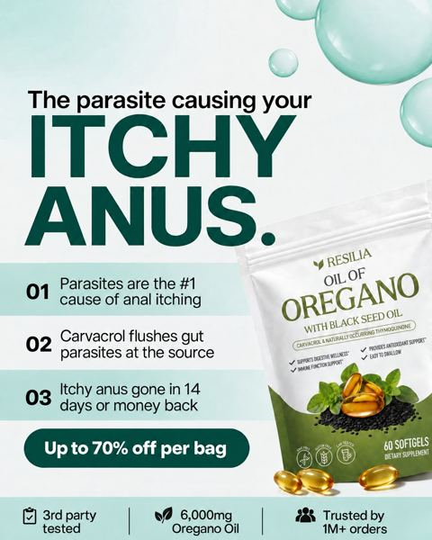
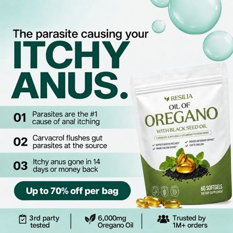

# Meta ad-library examples for F39 (GetHookd board 155932, gut health)

<!-- WAVE6 -->
## Wave 6: Resilia & Smooche live Meta ads (Oct 2026)

Pulled from the public Meta Ad Library on 2026-10-09 (Resilia: aged garlic, Ceylon cinnamon, oil of oregano; Smooche: color-changing foundation, Reverse Time peptide serum). Days live are counted to 2026-10-09; most video ads were new tests that week, while the long runners are statics and catalog templates. Transcripts are automatic. Brand claims are the advertisers', not verified, and many are health claims we would never make. The **Do not copy** line flags deceptive tactics (persona "publication" pages, undisclosed AI actors and "experts", fake stock counts).

### Resilia · Resilia: “The parasite causing your ITCHY ANUS” (1 day live)

- **Ad:** [Meta Ad Library #1427630012634173](https://www.facebook.com/ads/library/?id=1427630012634173) · static image · page “Resilia” · started 2026-10-07 · 37 copies · lands on `resilia.shop/products/resilia-oil-of-oregano-softgels`
- **What happens:** "The parasite causing your ITCHY ANUS": 01/02/03 numbered reasons with the pouch.
- **Why it works:** Numbered 01/02/03 reasons ("The parasite causing your itchy anus") on a branded card, run as three near-identical variants.
- **How to make one:** Put 3 numbered reasons, each with an icon, and the product with an offer bar.
- **LC remake:** "3 reasons your jewelry turns green": 01 brass core, 02 thin plating, 03 no PVD seal. Then LC.

Primary text

> Resilia is powered by oil of oregano and cold-pressed black seed oil — two of nature's most time-tested botanicals. Our easy-to-swallow softgels feature premium oil of oregano with naturally occurring carvacrol and black seed oil with thymoquinone. Clean, no-BS ingredients, third-party tested, and shipped right from the USA to deliver daily support for a healthy gut, a healthy inflammatory response, and your body's natural defenses. Just two softgels a day, no powders or routines to remember.

### Resilia · Resilia: A landscape variant of the 01/02/03 numbered-reasons card (1 day live)

- **Ad:** [Meta Ad Library #1457158606272817](https://www.facebook.com/ads/library/?id=1457158606272817) · static image · page “Resilia” · started 2026-10-07 · lands on `resilia.shop/products/resilia-oil-of-oregano-softgels`
- **What happens:** A landscape variant of the 01/02/03 numbered-reasons card.
- **Why it works:** Numbered 01/02/03 reasons ("The parasite causing your itchy anus") on a branded card, run as three near-identical variants.
- **How to make one:** Put 3 numbered reasons, each with an icon, and the product with an offer bar.
- **LC remake:** "3 reasons your jewelry turns green": 01 brass core, 02 thin plating, 03 no PVD seal. Then LC.

Primary text

> Resilia is powered by oil of oregano and cold-pressed black seed oil — two of nature's most time-tested botanicals. Our easy-to-swallow softgels feature premium oil of oregano with naturally occurring carvacrol and black seed oil with thymoquinone. Clean, no-BS ingredients, third-party tested, and shipped right from the USA to deliver daily support for a healthy gut, a healthy inflammatory response, and your body's natural defenses. Just two softgels a day, no powders or routines to remember.

<!-- /WAVE6 -->

From [@FedotOff90](https://x.com/FedotOff90/status/2108212319113412929)'s public board preview. Days live are as of 2026-10-09. Full board breakdown is in the internal sources folder.

## Rachel's Tea: Animated numbered-benefit product spec video (424 days live)

- **What happens:** Motion-graphic: bottle on orange/white, '100 BILLION PROBIOTICS' supers, numbered 01 / 02 benefit callouts sliding in, ORDER NOW end card; music only.
- **Why it lasts:** 424 days live. Silent, readable in 3 s, cheap to version; for a returning-customer base the spec IS the message.
- **How to make one:** After Effects / CapCut keyframes or Canva video; 15-22 s; one benefit per 4 s; brand colour background.
- **LC remake:** Animated '3 reasons it doesn't turn green': 01 14K gold layer, 02 PVD bond, 03 stainless core; product spins; '7 for $85'.
