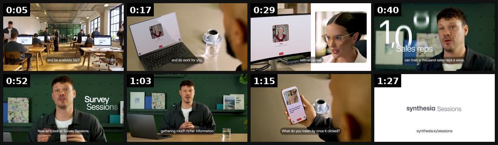
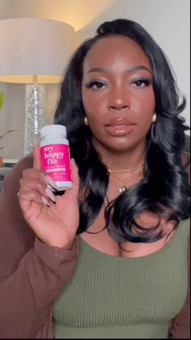
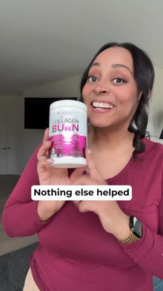

# 40 · Testimonial mashup (real customer clip montage): see it, then make it

[](https://x.com/ashvinmelwani/status/2105710765151752218)

**The example:** [@ashvinmelwani on X](https://x.com/ashvinmelwani/status/2105710765151752218) · 1:32 video · 31 likes, 12K views

**Watch it:** [open the post on X](https://x.com/ashvinmelwani/status/2105710765151752218) · [play the video file](https://video.twimg.com/amplify_video/2105591527678287872/vid/avc1/640x360/GNl2ow2BKAvHW-oZ.mp4?tag=29) (the media is in the post it quotes)

> One ad format that will always crush is a mashup of raw customer testimonials. The fastest way to get this content for us was to post in our 117K+ member Facebook Group and ask who wanted a $100 gift card to hop on a zoom call. Problem is everyone wants a gift card and there’s https://t.co/79lvX8yHnN

## What you are seeing

A mashup of raw customer testimonials: different people on Zoom-style calls, at desks and in kitchens, each saying one line, cut together fast and ending on the brand card ("synthesis tutoring").

## Beat by beat

The storyboard above samples the video every 0:11. Lines are the transcript for that stretch; on-screen text comes from OCR, so treat it as rough.

| Frame | Time | On screen | Said / sung |
|---|---|---|---|
| 1 | 0:00–0:11 | · | Ever wish you could send an avatar to do meetings for you? Interview a hundred customers a day and be available 24-7 while you're on the beach? Well, now you can. Today, we're, introducing sessions. |
| 2 | 0:11–0:23 | and do work for you. | Sessions are like joining a zoo. But on the other side is an avatar that speaks every language which can take meetings and do work- and work for you. They're super easy and fun to build. Just select what convoy you want to have, |
| 3 | 0:23–0:34 | · | and set it all up in a single prompt with our system. In role-play, role-play sessions let you practice hard conversations with an avatar and get live feedback. |
| 4 | 0:34–0:46 | can train a thousand | Today |
| 5 | 0:46–0:58 | a Now let's | · |
| 6 | 0:58–1:09 | · | to fill out |
| 7 | 1:09–1:21 | What do you … once it clicked? | What do you mean by once it clicked? It took, you know what to realize? It's all in how you prompt it? |
| 8 | 1:21–1:32 | · | · |

<details><summary>Full transcript (timestamped)</summary>

- `0:00` Ever wish you could send an avatar to do meetings for you?
- `0:03` Interview a hundred customers a day and be available 24-7 while you're on the beach?
- `0:08` Well, now you can.
- `0:10` Today, we're, introducing sessions.
- `0:11` Sessions are like joining a zoo.
- `0:13` But on the other side is an avatar that speaks every language
- `0:16` which can take meetings and do work- and work for you.
- `0:18` They're super easy and fun to build.
- `0:20` Just select what convoy you want to have,
- `0:22` and set it all up in a single prompt with our system.
- `0:25` In role-play, role-play sessions let you practice hard conversations with an avatar and get live feedback.
- `0:30` Today
- `0:54` to fill out
- `1:13` What do you mean by once it clicked?
- `1:15` It took, you know what to realize?
- `1:16` It's all in how you prompt it?

</details>

## More real examples (3)

Other posts that show this format, or a close cousin of it. Click a thumbnail to open it on X.

| | | |
|---|---|---|
| [](https://x.com/hellonecole/status/1714802268971655219)<br>**@hellonecole** · 0:33 video · 1K views<br>I love a customer testimonial mashup! Meet the hormone support and period relief vitamin that's changing lives @MyHappyFlo Http://myhappyflo.co | [](https://x.com/_ibbibhai/status/1958891605307404424)<br>**@_ibbibhai** · 0:44 video · 56 views<br>The “testimonial mashup” ad is killing it for My DTC clients! #DTCbrands #UGCads #UGC #admanagement #ads #Winningads #MetaAds #SnapchatAds | [](https://x.com/domaco1968/status/1949766307567620333)<br>**@domaco1968** · 0:14 video · 25 views<br>If you’re in a “saturated” niche and your ads are tanking, you’ve gotta try this testimonial mashup format. So I planned this creative for a supplemen |

## How to make one like it

**The format in one line:** A fast montage of 6-12 real customers each saying one line (selfie video, review screenshot, unboxing) stitched into a 20-40s ad. Volume of real voices = proof.

**Why it works:** - Social proof at scale; MOF retargeting staple (@williamkast_). - Many faces → broad identification across age/skin tone. - Uses content LC can collect via post-purchase flows.

**Contents:** [1. Structure](#1-copy-the-structure) · [2. Shot by shot](#2-shot-by-shot-remake) · [3. Script and hooks](#3-write-the-script) · [4. Prompts](#4-prompts) · [5. Tools and settings](#5-tools-and-settings) · [6. Louise Carter remake](#6-louise-carter-remake) · [7. Variants and test](#7-variants-and-test-plan) · [8. Pitfalls](#8-pitfalls)

### 1. Copy the structure

Use the example's timing as your beat sheet. Keep the beat, change the words and the product.

| Beat | Time | In the example | Your version |
|---|---|---|---|
| 1 | 0:05 | Ever wish you could send an avatar to do meetings for you? Interview a hundred customers a day and be available 24-7 while you're on the bea | … |
| 2 | 0:17 | Sessions are like joining a zoo. But on the other side is an avatar that speaks every language which can take meetings and do work- and work | … |
| 3 | 0:29 | and set it all up in a single prompt with our system. In role-play, role-play sessions let you practice hard conversations with an avatar an | … |
| 4 | 0:40 | Today | … |
| 5 | 0:52 | on screen: a Now let's | … |
| 6 | 1:03 | to fill out | … |
| 7 | 1:15 | What do you mean by once it clicked? It took, you know what to realize? It's all in how you prompt it? | … |
| 8 | 1:27 | (visual beat, see frame 8) | … |

### 2. Shot-by-shot remake

**Target length / size:** 20-40s, 1080x1920

| # | Time / slot | What we see (visual + camera) | Dialogue / on-screen text |
|---|---|---|---|
| 1 | 0-3s | Strongest single customer line, selfie video | "I've worn it in the sea every day for a year." |
| 2 | 3-10s | Customers 2-4, 2s each: shower, gym, wedding | One line each: "Never taken it off." "Still gold." "My sister stole mine." |
| 3 | 10-20s | Customers 5-8: review screenshots and unboxings | Short on-screen quotes |
| 4 | 20-30s | Stack shot + review count | "4,812 reviews. 4.8 stars." |
| 5 | End | Offer | "Any 7 for $85." |

<details><summary>Playbook shot list (Louise Carter version from the README)</summary>

| Time / slot | Visual | Audio / copy |
|---|---|---|
| 0-3s | Rapid 3 faces | "I shower in it" / "6 months" / "still gold" |
| 3-25s | 8 more one-liners with name/city captions | Real audio |
| 25-30s | Review count + offer | "300,000+ customers" |

</details>

### 3. Write the script

Open with one of these hooks (first 1–3 seconds, or the headline on a static):

- "We asked customers one question: do you ever take it off?"
- "300,000 people can't be wrong (here are 12)"

Then fill the beats from the table above. Pull the wording from real customer reviews, not from ad copy: a review line beats a copywriter line almost every time. Read every line out loud and cut anything you would not say to a friend. Ready-made Louise Carter scripts are in section 6; hand [BOT.md](BOT.md) to any AI agent to write versions for another brand.

### 4. Prompts

**Collect**

```text
Email recent buyers: "Send us a 10-second selfie video answering: what surprised you most? We'll send $20 store credit." Include a release form link.
```

**Edit**

```text
Cut each clip to its single best line; captions in the same style; order from strongest to weakest; music at -22 dB.
```

**Full creative-agent prompt (from the playbook):**

```
From these customer clip transcripts {{CLIPS}} pick 10 one-liners (≤8 words) that together cover: waterproof, compliments, gift, value, longevity. Order for a 30s montage with an opening 3-clip hook.
```

### 5. Tools and settings

1. Omnisend post-purchase flow (day 30): "Send us a 10s selfie video answering X → $15 credit" with usage-rights consent.
2. Same question for everyone → clean edit.
3. Disclose incentive where required ("customers received store credit").

| Setting | Value |
|---|---|
| Canvas | 1080×1920 (9:16) master; crop a 1080×1350 (4:5) cut for feed placements |
| Frame rate | 30 fps (shoot 60 fps for slow-motion water or sparkle shots) |
| Camera | Phone main lens at 1x, exposure locked on skin, HDR off, grid on; tripod or a phone clamp for product shots |
| Light | One soft key at 45° (window or ring light), white card as fill; side light for metal sparkle |
| Audio | Lavalier or phone 15–20 cm from the mouth; mix voice at -14 LUFS, music at -28 to -30 dB under voice |
| Captions | Burned in, 2–5 words per line, 64–80 px bold sans, white with a black stroke or pill; keep text inside the safe zone (top 220 px and bottom 420 px clear, 64 px side margins) |
| Pacing | A visual change every 1.5–3 s; the hook lands in the first 1.5 s with no logo intro |
| Edit / export | CapCut or Premiere; H.264, 12–20 Mbps, AAC 320 kbps; upload natively to each platform, not via links |

### 6. Louise Carter remake

- A · "Do you ever take it off?" montage.
- B · "What did people say when you wore it?"
- C · Gift recipients reacting (with consent).

Brand rules, claims you can and cannot make, and more scripts: [brands/louise-carter.md](brands/louise-carter.md). Step-by-step from idea to scale: [STAGES.md](STAGES.md).

### 7. Variants and test plan

- Question asked
- Length 15 vs 30s

**Test plan:** - **Budget/structure:** 2 cuts retargeting + 1 cold, $40/day, 7 days - **Primary KPIs:** CPA, CVR; Omni (F40-*) - **Kill rule:** CPA >1.8× - **Scale rule:** Refresh monthly - **Naming:** `utm_content=F40-<concept>-<variant>`; weekly Omni roll-up of new-customer revenue by format.

**Naming:** `F40-<variant>-<hook##>-<date>` so results map back to this folder. Change one thing per test (hook, narrator, length or offer), never two.

### 8. Pitfalls

- Real customers only, with signed consent.
- Don't script customers; ask one question and use their words.
- Review counts on screen must be current.
- Slow open: if the first 1.5 s does not show the hook visually, most people swipe.
- Logo or brand intro at the start reads as an ad; put the brand at the end.
- Captions covered by the platform UI: check the safe zone on a real phone before posting.
- Music over the voice: keep music at least 14 dB under speech.

**Compliance:** Baseline: [_COMPLIANCE.md](../_COMPLIANCE.md) (no fake testimonials, AI disclosure, no bulk/spoofed accounts, copy structure not assets, PDP-only claims). - Real customers only, written consent + usage rights; disclose incentives (FTC Endorsement Guides). - Results not typical disclaimers where needed.

## Field notes

Newer observations live in the playbook: [Wave 4 update: Fedotoff October 2026 swipe boards](README.md)

## More examples

Every post we found for this format, with transcripts: [examples/](examples/README.md). Playbook: [README.md](README.md). Agent brief: [BOT.md](BOT.md).
