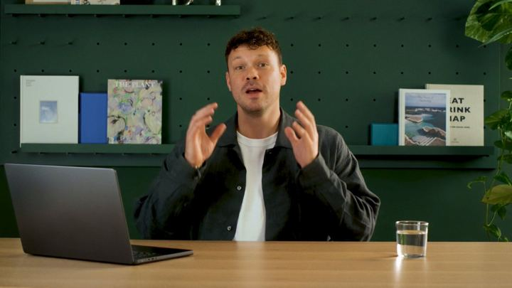

# 40 · Testimonial mashup (real customer clip montage)

<!-- HERO:START -->
[](EXAMPLE.md)

**[See the example and how to make it →](EXAMPLE.md)** · [watch on X](https://x.com/ashvinmelwani/status/2105710765151752218)
<!-- HERO:END -->


> **LC priority P1** · evidence: Medium-High · hype risk: Low · cost $0-300 (customer incentives) · 2-4 h

## What it is
A fast montage of 6-12 real customers each saying one line (selfie video, review screenshot, unboxing) stitched into a 20-40s ad. Volume of real voices = proof.

## Why it works
- Social proof at scale; MOF retargeting staple (@williamkast_).
- Many faces → broad identification across age/skin tone.
- Uses content LC can collect via post-purchase flows.

## Shot-by-shot (LC version)

| Time / slot | Visual | Audio / copy |
|---|---|---|
| 0-3s | Rapid 3 faces | "I shower in it" / "6 months" / "still gold" |
| 3-25s | 8 more one-liners with name/city captions | Real audio |
| 25-30s | Review count + offer | "300,000+ customers" |

## Hooks (swap-in openers)
- "We asked customers one question: do you ever take it off?"
- "300,000 people can't be wrong (here are 12)"

## Real examples from X (studied)
- @williamkast_ — MOF testimonial mashup ([post](https://x.com/williamkast_/status/2103910235005935644)); in 15 formats to repackage winners ([post](https://x.com/williamkast_/status/2083616523134841035)).
- @zackpaid — testimonial compilation among 11 AI formats ([post](https://x.com/zackpaid/status/2085621175292670183)).
- @nicktheriot_ — testimonial A-tier ([post](https://x.com/nicktheriot_/status/2108173638033871013)).

## Production recipe
1. Omnisend post-purchase flow (day 30): "Send us a 10s selfie video answering X → $15 credit" with usage-rights consent.
2. Same question for everyone → clean edit.
3. Disclose incentive where required ("customers received store credit").

## Bot prompt (copy into the creative agent)
```
From these customer clip transcripts {{CLIPS}} pick 10 one-liners (≤8 words) that together cover: waterproof, compliments, gift, value, longevity. Order for a 30s montage with an opening 3-clip hook.
```

## 3 LC scripts
- A · "Do you ever take it off?" montage.
- B · "What did people say when you wore it?"
- C · Gift recipients reacting (with consent).

## Variants to test
- Question asked
- Length 15 vs 30s

## Omni test plan
- **Budget/structure:** 2 cuts retargeting + 1 cold, $40/day, 7 days
- **Primary KPIs:** CPA, CVR; Omni (F40-*)
- **Kill rule:** CPA >1.8×
- **Scale rule:** Refresh monthly
- **Naming:** `utm_content=F40-<concept>-<variant>`; weekly Omni roll-up of new-customer revenue by format.

## Compliance
Baseline: [_COMPLIANCE.md](../_COMPLIANCE.md) (no fake testimonials, AI disclosure, no bulk/spoofed accounts, copy structure not assets, PDP-only claims).
- Real customers only, written consent + usage rights; disclose incentives (FTC Endorsement Guides).
- Results not typical disclaimers where needed.

## Related
- Strategies: 11-social-proof-credibility-engine, 17-review-prompt-timing
- Formats: [26-founder-surprise-customer-call](../26-founder-surprise-customer-call/README.md), [36-backhanded-zero-star-review](../36-backhanded-zero-star-review/README.md)

<!-- EVIDENCE:START -->
## Wave 4 update: Fedotoff October 2026 swipe boards
- Blossom Essentials Skin: Short AI-UGC "only balm I'll ever buy" (Blossom Essentials, 3 variants), 213 days live (AI UGC + Doctor Avatars board). One script on many faces is Fedotoff's "avatar is the variable, mechanism is the template".
- Stills, how-to and LC remakes: [adlibrary/](adlibrary/README.md).

## Evidence from X discovery (auto-generated)

| Date | Author | Post | Engagement | Grade | Gist |
|---|---|---|---|---|---|
| 2026-09-26 | [@williamkast_](https://x.com/williamkast_) | [link](https://x.com/williamkast_/status/2103910235005935644) | 252L/400BM/13kV | VALUE | Formats by funnel: TOF founder/yapper/AI animation/natives/3 reasons/voiceless overlay; MOF comment reply/testimonial mashup/text wall; BOF urgency statics. |
| 2026-08-01 | [@williamkast_](https://x.com/williamkast_) | [link](https://x.com/williamkast_/status/2083616523134841035) | 12L/14BM/1kV | VALUE | 15 formats to repackage winners into (scaled to $30k/day on 3-4 angles): founder, yapper, AI animation, voiceless overlay, carousel, reply ad, text wall, review static, camouflage. |
| 2026-08-07 | [@zackpaid](https://x.com/zackpaid) | [link](https://x.com/zackpaid/status/2085621175292670183) | 9L/20BM/2kV | SOME | 11 AI formats (agency pitch): native UGC, founder, claymation, Pixar 3D, jingle, screen recording, before/after, testimonial compilation, cinematic demo, mini-doc, meme. |
<!-- EVIDENCE:END -->
