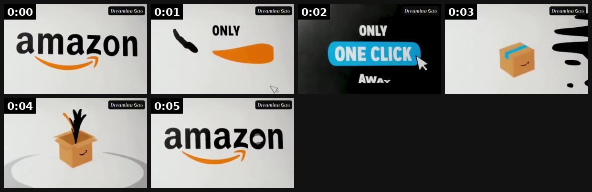

# 41 · Talking product (AI-animated product as narrator): see it, then make it

[](https://x.com/koloveski/status/2076868032002150833)

**The example:** [@koloveski on X](https://x.com/koloveski/status/2076868032002150833) · 0:05 video · 183 likes, 191K views

**Watch it:** [open the post on X](https://x.com/koloveski/status/2076868032002150833) · [play the video file](https://video.twimg.com/amplify_video/2076867981196591104/vid/avc1/570x360/y98b5q-s_pVV_HiY.mp4?tag=14)

> 🚨 I made a fully animated product video for Amazon without touching a traditional editing workflow. I used Dreamina Octo as my AI creative partner, and it took care of: → Storyboarding → Motion graphics → Animation → Music synchronization I simply shared the idea, and it transformed it into a polished animated video. #dreamina #dreaminapartner #dreaminaocto #vibecreate #aifilm

## What you are seeing

A fully animated product video: an Amazon logo, "ONLY ONE CLICK", a parcel dropping in, an object rising out of a box, then the Amazon logo again. The product animates itself with no presenter.

## Beat by beat

The storyboard above samples the video every 0:00. Lines are the transcript for that stretch; on-screen text comes from OCR, so treat it as rough.

| Frame | Time | On screen | Said / sung |
|---|---|---|---|
| 1 | 0:00–0:01 | · | · |
| 2 | 0:01–0:02 | · | Ever since then |
| 3 | 0:02–0:03 | · | · |
| 4 | 0:03–0:03 | · | · |
| 5 | 0:03–0:04 | · | · |
| 6 | 0:04–0:05 | · | · |

<details><summary>Full transcript (timestamped)</summary>

- `0:00` Ever since then

</details>

## How to make one like it

**The format in one line:** The product itself gets eyes/mouth (AI animation) and speaks to camera: "I'm the necklace she wore in the ocean 47 times." Personification makes the mechanism a story.

**Why it works:** - Novelty stops the scroll; product is literally the protagonist. - Ran 183 days for a hair brand (@FedotOff90).

**Contents:** [1. Structure](#1-copy-the-structure) · [2. Shot by shot](#2-shot-by-shot-remake) · [3. Script and hooks](#3-write-the-script) · [4. Prompts](#4-prompts) · [5. Tools and settings](#5-tools-and-settings) · [6. Louise Carter remake](#6-louise-carter-remake) · [7. Variants and test](#7-variants-and-test-plan) · [8. Pitfalls](#8-pitfalls)

### 1. Copy the structure

Use the example's timing as your beat sheet. Keep the beat, change the words and the product.

| Beat | Time | In the example | Your version |
|---|---|---|---|
| 1 | 0:00 | Ever since then | … |
| 2 | 0:01 | Ever since then | … |
| 3 | 0:02 | Ever since then | … |
| 4 | 0:03 | Ever since then | … |
| 5 | 0:04 | (visual beat, see frame 5) | … |
| 6 | 0:05 | (visual beat, see frame 6) | … |

### 2. Shot-by-shot remake

**Target length / size:** 15-30s, 1080x1920

| # | Time / slot | What we see (visual + camera) | Dialogue / on-screen text |
|---|---|---|---|
| 1 | 0-2s | The product with animated eyes and mouth, close-up on a bathroom shelf | "I'm the necklace she wore in the ocean 47 times." |
| 2 | 2-15s | Product "remembers" moments (shower, sea, a date) as quick cutaways | Speaks in first person |
| 3 | 15-25s | Product winks | "Still gold. Get me at [brand]." |

<details><summary>Playbook shot list (Louise Carter version from the README)</summary>

| Time / slot | Visual | Audio / copy |
|---|---|---|
| 0-3s | Animated LC necklace on vanity | "Hi. I'm the necklace she refuses to take off." |
| 3-15s | Cuts to necklace "experiencing" shower, pool | "Shampoo? Fine. Chlorine? Fine. 14K PVD, baby." |
| 15-20s | Stack of friends | "Bring my friends. Any 7 for $85." |

</details>

### 3. Write the script

Open with one of these hooks (first 1–3 seconds, or the headline on a static):

- "I'm the necklace she never takes off"
- "Day 180 on her neck. Still gold."

Then fill the beats from the table above. Pull the wording from real customer reviews, not from ad copy: a review line beats a copywriter line almost every time. Read every line out loud and cut anything you would not say to a friend. Ready-made Louise Carter scripts are in section 6; hand [BOT.md](BOT.md) to any AI agent to write versions for another brand.

### 4. Prompts

**Kling / Pika (image-to-video)**

```text
animate the gold necklace in this photo with small expressive cartoon eyes and a mouth, it talks to camera, keep the jewelry design identical, soft bathroom light, 5s
```

**Voice (ElevenLabs)**

```text
Warm, witty, female, 30s, slight smile in the voice; stability 40, similarity 75.
```

**Full creative-agent prompt (from the playbook):**

```
Write 5 first-person scripts (≤55 words) for an animated LC necklace/ring narrator with a witty, warm persona; include one PDP fact each.
```

### 5. Tools and settings

1. Generate base product shots; animate with an image-to-video model + lip-sync voice.
2. Keep voice consistent (persona); label as AI animation.
3. 15-25s.

| Setting | Value |
|---|---|
| Canvas | 1080×1920 (9:16) master; crop a 1080×1350 (4:5) cut for feed placements |
| Frame rate | 30 fps (shoot 60 fps for slow-motion water or sparkle shots) |
| Camera | Phone main lens at 1x, exposure locked on skin, HDR off, grid on; tripod or a phone clamp for product shots |
| Light | One soft key at 45° (window or ring light), white card as fill; side light for metal sparkle |
| Audio | Lavalier or phone 15–20 cm from the mouth; mix voice at -14 LUFS, music at -28 to -30 dB under voice |
| Captions | Burned in, 2–5 words per line, 64–80 px bold sans, white with a black stroke or pill; keep text inside the safe zone (top 220 px and bottom 420 px clear, 64 px side margins) |
| Pacing | A visual change every 1.5–3 s; the hook lands in the first 1.5 s with no logo intro |
| Edit / export | CapCut or Premiere; H.264, 12–20 Mbps, AAC 320 kbps; upload natively to each platform, not via links |

### 6. Louise Carter remake

- A · Necklace narrator in the shower.
- B · Ring jealous of the new stack.
- C · Huggies at the gym.

Brand rules, claims you can and cannot make, and more scripts: [brands/louise-carter.md](brands/louise-carter.md). Step-by-step from idea to scale: [STAGES.md](STAGES.md).

### 7. Variants and test plan

- Character voice
- Product

**Test plan:** - **Budget/structure:** 3 ads, $25/day, 5 days - **Primary KPIs:** Hook rate, CPA; Omni (F41-*) - **Kill rule:** CTR <0.7% - **Scale rule:** Persona page if winner - **Naming:** `utm_content=F41-<concept>-<variant>`; weekly Omni roll-up of new-customer revenue by format.

**Naming:** `F41-<variant>-<hook##>-<date>` so results map back to this folder. Change one thing per test (hook, narrator, length or offer), never two.

### 8. Pitfalls

- Keep the product recognisable; eyes and mouth only, no redesign.
- Claims spoken by the product are still ad claims.
- Slow open: if the first 1.5 s does not show the hook visually, most people swipe.
- Logo or brand intro at the start reads as an ad; put the brand at the end.
- Captions covered by the platform UI: check the safe zone on a real phone before posting.
- Music over the voice: keep music at least 14 dB under speech.

**Compliance:** Baseline: [_COMPLIANCE.md](../_COMPLIANCE.md) (no fake testimonials, AI disclosure, no bulk/spoofed accounts, copy structure not assets, PDP-only claims). - Label AI content (Meta/TikTok AI labels).

## More examples

Every post we found for this format, with transcripts: [examples/](examples/README.md). Playbook: [README.md](README.md). Agent brief: [BOT.md](BOT.md).
