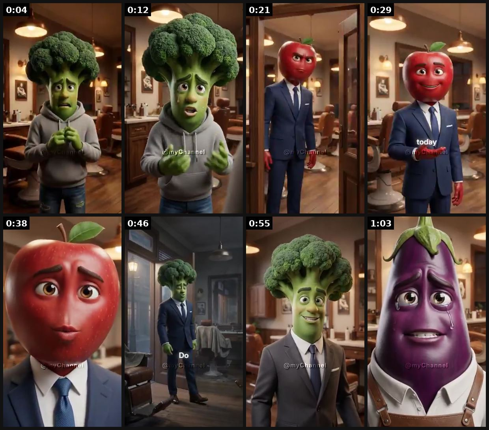
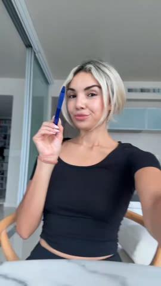
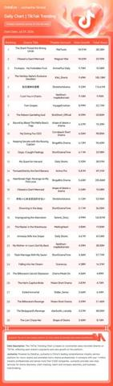
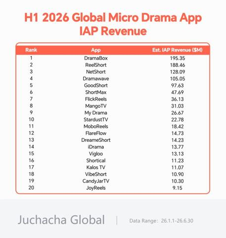
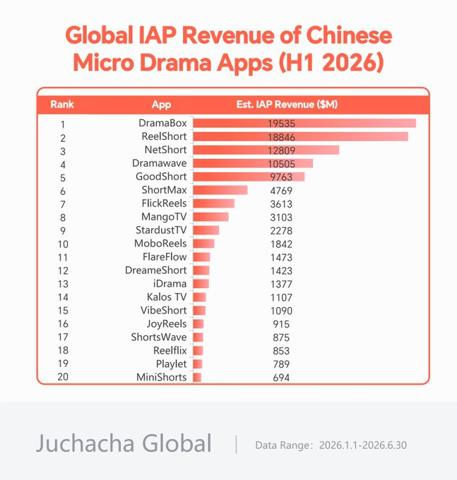

# 42 · AI object-head micro-drama (talking-fruit-style soap opera): see it, then make it

[](https://x.com/seergioo_gil/status/2089472288001347867)

**The example:** [@seergioo_gil on X](https://x.com/seergioo_gil/status/2089472288001347867) · 1:07 video · 9 likes, 6K views

**Watch it:** [open the post on X](https://x.com/seergioo_gil/status/2089472288001347867) · [play the video file](https://video.twimg.com/amplify_video/2089471991908540416/vid/avc1/320x568/SwludvS8nMgHToEX.mp4?tag=29)

> talking fruit stories have been going extremely viral lately (+20B views) arguably the best-performing AI pages in view count across ALL platforms this year the format is simple: 1- micro-drama with a plot twist at the end 2- human bodies, fruit heads 3- AI-animated with lip-sync that's it, just come up with a good "love" story (or replicate theirs) -> create a template (refs + ask the Calliope chatbot), -> generate …

## What you are seeing

Talking-fruit micro-drama: a broccoli-head character and a tomato-head businessman in suits in a barbershop or office, then an apple and an eggplant character. It is a 1-minute soap plot acted out by food characters.

## Beat by beat

The storyboard above samples the video every 0:08. Lines are the transcript for that stretch; on-screen text comes from OCR, so treat it as rough.

| Frame | Time | On screen | Said / sung |
|---|---|---|---|
| 1 | 0:00–0:08 | a Rat SS my hi aes Shi | Bruno I have the most important interview of my life today |
| 2 | 0:08–0:16 | · | One euro you get nothing here for that if I look good today this interview could change everything |
| 3 | 0:16–0:25 | · | Beggars have no place in my salon What is going on here? What is your name boy? |
| 4 | 0:25–0:33 | · | Bruno sir, I only want a fair chance Then today you will have it Put your euro back in your pocket |
| 5 | 0:33–0:42 | · | You pay nothing Success usually starts with one person believing in you |
| 6 | 0:42–0:50 | Ss SB rh Nl ict Be | This salon closes tomorrow if the debts are not paid. Do you still recognize this place, sir? Bruno is that really you? |
| 7 | 0:50–0:59 | wt os mx ek Ls rai a a a | Every debt is paid in full today. This salon is yours again. I Am ashamed |
| 8 | 0:59–1:07 | · | Everyone deserves a second chance The greatest gift is not money. It is that you never lost your heart |

<details><summary>Full transcript (timestamped)</summary>

- `0:01` Bruno
- `0:03` I have the most important interview of my life today
- `0:08` One euro you get nothing here for that if I look good today this interview could change everything
- `0:17` Beggars have no place in my salon
- `0:20` What is going on here? What is your name boy?
- `0:26` Bruno sir, I only want a fair chance
- `0:29` Then today you will have it
- `0:32` Put your euro back in your pocket
- `0:34` You pay nothing
- `0:36` Success usually starts with one person believing in you
- `0:40` This salon closes tomorrow if the debts are not paid. Do you still recognize this place, sir?
- `0:49` Bruno is that really you?
- `0:52` Every debt is paid in full today. This salon is yours again. I
- `0:57` Am ashamed
- `0:59` Everyone deserves a second chance
- `1:01` The greatest gift is not money. It is that you never lost your heart

</details>

## More real examples (5)

Other posts that show this format, or a close cousin of it. Click a thumbnail to open it on X.

| | | |
|---|---|---|
| [](https://x.com/bmx_ai13/status/2103701345563812177)<br>**@bmx_ai13** · 1:20 video · 1K views<br>AI micro-drama production skill (script → storyboard → consistent characters) — tool promo. | [](https://x.com/CodewizzyX/status/2096695495590568092)<br>**@CodewizzyX** · 0:50 video · 3K views<br>THESE VIRAL "FRUIT DRAMA" AI VIDEOS AREN'T RANDOM - THERE'S AN ACTUAL FORMULA AND IT'S FREE TO COPY No camera, no writers room, no editing. Absurd fru | [](https://x.com/SmartEye_ADSpy/status/2082748308293071171)<br>**@SmartEye_ADSpy** · images · 242 views<br>🔥July 30 Global Micro Dramas & AI Micro Dramas: Multiple NetShort Horror Campus AI Dramas Secure Chart Rankings; Fruit-Themed AI Micro Drama Jumps to |
| [](https://x.com/SmartEye_ADSpy/status/2087111287184728470)<br>**@SmartEye_ADSpy** · image · 158 views<br>Top 3 Claim Over 40% of Global Market Revenue; Breakout AI Micro Drama App VibeShort Cracks the Chart Market Revenue Is Highly Concentrated: In H1 202 | [](https://x.com/SmartEye_ADSpy/status/2087810501686481034)<br>**@SmartEye_ADSpy** · image · 137 views<br>Top 3 Contribute Over 40% of Market Revenue \| Maiya's NetShort Cracks the Top 3 In H1 2026, the Top 20 Chinese micro drama apps in global markets gene |   |

## How to make one like it

**The format in one line:** Serialized 1-2 min AI soap operas where characters are objects/fruit heads on human bodies (love, betrayal, plot twist). Massive organic views category; product placement is the play for a brand.

**Why it works:** - Serialized cliffhangers drive follows and binge views. - Novel aesthetic; huge category per claims.

**Contents:** [1. Structure](#1-copy-the-structure) · [2. Shot by shot](#2-shot-by-shot-remake) · [3. Script and hooks](#3-write-the-script) · [4. Prompts](#4-prompts) · [5. Tools and settings](#5-tools-and-settings) · [6. Louise Carter remake](#6-louise-carter-remake) · [7. Variants and test](#7-variants-and-test-plan) · [8. Pitfalls](#8-pitfalls)

### 1. Copy the structure

Use the example's timing as your beat sheet. Keep the beat, change the words and the product.

| Beat | Time | In the example | Your version |
|---|---|---|---|
| 1 | 0:04 | Bruno I have the most important interview of my life today | … |
| 2 | 0:12 | One euro you get nothing here for that if I look good today this interview could change everything | … |
| 3 | 0:21 | Beggars have no place in my salon What is going on here? What is your name boy? | … |
| 4 | 0:29 | Bruno sir, I only want a fair chance Then today you will have it Put your euro back in your pocket | … |
| 5 | 0:38 | You pay nothing Success usually starts with one person believing in you | … |
| 6 | 0:46 | This salon closes tomorrow if the debts are not paid. Do you still recognize this place, sir? Bruno is that really you? | … |
| 7 | 0:55 | Every debt is paid in full today. This salon is yours again. I Am ashamed | … |
| 8 | 1:03 | Everyone deserves a second chance The greatest gift is not money. It is that you never lost your heart | … |

### 2. Shot-by-shot remake

**Target length / size:** 60-120s episodes, 1080x1920

| # | Time / slot | What we see (visual + camera) | Dialogue / on-screen text |
|---|---|---|---|
| 1 | 0-5s | Object-head characters (fruit/gem heads on human bodies) mid-drama | "You gave HER the necklace?" |
| 2 | 5-60s | Soap plot: love, betrayal, twist | Dialogue with lip-sync |
| 3 | 60-90s | Cliffhanger | "Part 2" |
| 4 | Placement | Product is a prop worn by a character | One mention max |

<details><summary>Playbook shot list (Louise Carter version from the README)</summary>

| Time / slot | Visual | Audio / copy |
|---|---|---|
| 0-5s | Fruit-head characters argue | Plot hook |
| 5-60s | Drama, twist | Lip-synced dialogue |
| 60-70s | Cliffhanger; LC piece as plot device | "Part 2" |

</details>

### 3. Write the script

Open with one of these hooks (first 1–3 seconds, or the headline on a static):

- "She found the necklace in his car…"
- "The ring that ruined the wedding (part 1)"

Then fill the beats from the table above. Pull the wording from real customer reviews, not from ad copy: a review line beats a copywriter line almost every time. Read every line out loud and cut anything you would not say to a friend. Ready-made Louise Carter scripts are in section 6; hand [BOT.md](BOT.md) to any AI agent to write versions for another brand.

### 4. Prompts

**Midjourney**

```text
hyperreal 3D character, a man with a broccoli head wearing a navy suit in a barbershop, cinematic soft light, Pixar realism --ar 9:16
```

**Veo 3 / Kling**

```text
the broccoli-head man [ref] arguing with a tomato-head woman in an office, dramatic, lip-sync "[line]", 8s
```

**Full creative-agent prompt (from the playbook):**

```
Write a 6-episode outline for an AI object-head soap opera where an LC necklace is the plot device (heirloom, gift, mystery). Each episode: 60s, cliffhanger, no disparagement.
```

### 5. Tools and settings

1. Only as an experiment on a separate page; consistent characters via reference images; label AI.

| Setting | Value |
|---|---|
| Canvas | 1080×1920 (9:16) master; crop a 1080×1350 (4:5) cut for feed placements |
| Frame rate | 30 fps (shoot 60 fps for slow-motion water or sparkle shots) |
| Camera | Phone main lens at 1x, exposure locked on skin, HDR off, grid on; tripod or a phone clamp for product shots |
| Light | One soft key at 45° (window or ring light), white card as fill; side light for metal sparkle |
| Audio | Lavalier or phone 15–20 cm from the mouth; mix voice at -14 LUFS, music at -28 to -30 dB under voice |
| Captions | Burned in, 2–5 words per line, 64–80 px bold sans, white with a black stroke or pill; keep text inside the safe zone (top 220 px and bottom 420 px clear, 64 px side margins) |
| Pacing | A visual change every 1.5–3 s; the hook lands in the first 1.5 s with no logo intro |
| Edit / export | CapCut or Premiere; H.264, 12–20 Mbps, AAC 320 kbps; upload natively to each platform, not via links |

### 6. Louise Carter remake

- A · "The heirloom" ep 1.
- B · "Who bought the stack?"
- C · "Ocean proof" twist.

Brand rules, claims you can and cannot make, and more scripts: [brands/louise-carter.md](brands/louise-carter.md). Step-by-step from idea to scale: [STAGES.md](STAGES.md).

### 7. Variants and test plan

- Characters
- Episode length

**Test plan:** - **Budget/structure:** $0 paid; 6 organic episodes - **Primary KPIs:** Views, follows, profile clicks; Omni (F42-*) - **Kill rule:** <10k avg views after 6 eps - **Scale rule:** Only if organic breakout - **Naming:** `utm_content=F42-<concept>-<variant>`; weekly Omni roll-up of new-customer revenue by format.

**Naming:** `F42-<variant>-<hook##>-<date>` so results map back to this folder. Change one thing per test (hook, narrator, length or offer), never two.

### 8. Pitfalls

- Serial formats need consistent characters; save reference images.
- This builds an organic page; it is not a direct-response ad.
- Slow open: if the first 1.5 s does not show the hook visually, most people swipe.
- Logo or brand intro at the start reads as an ad; put the brand at the end.
- Captions covered by the platform UI: check the safe zone on a real phone before posting.
- Music over the voice: keep music at least 14 dB under speech.

**Compliance:** Baseline: [_COMPLIANCE.md](../_COMPLIANCE.md) (no fake testimonials, AI disclosure, no bulk/spoofed accounts, copy structure not assets, PDP-only claims). - Label AI; no real-person likeness; keep brand-safe.

## More examples

Every post we found for this format, with transcripts: [examples/](examples/README.md). Playbook: [README.md](README.md). Agent brief: [BOT.md](BOT.md).
