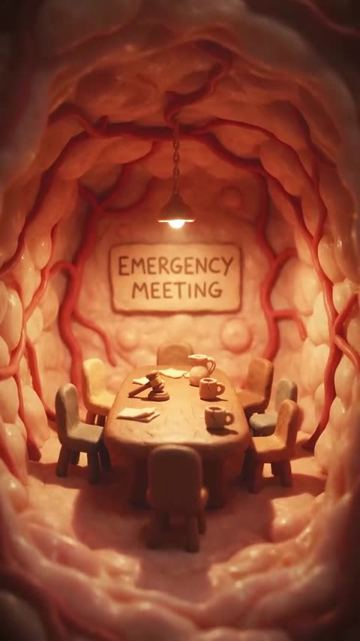
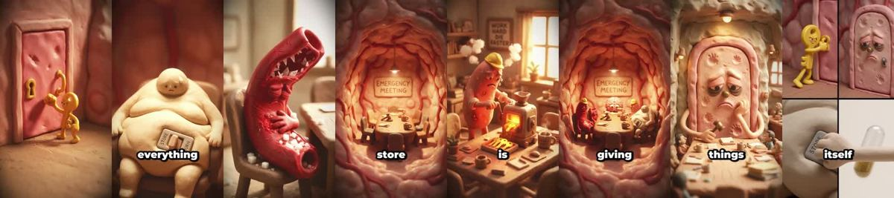

# Meta ad-library examples for F42

<!-- WAVE6 -->
## Wave 6: Resilia & Smooche live Meta ads (Oct 2026)

Pulled from the public Meta Ad Library on 2026-10-09 (Resilia: aged garlic, Ceylon cinnamon, oil of oregano; Smooche: color-changing foundation, Reverse Time peptide serum). Days live are counted to 2026-10-09; most video ads were new tests that week, while the long runners are statics and catalog templates. Transcripts are automatic. Brand claims are the advertisers', not verified, and many are health claims we would never make. The **Do not copy** line flags deceptive tactics (persona "publication" pages, undisclosed AI actors and "experts", fake stock counts).

### Resilia · Blood Sugar Wellness: “I'm exhausted. It's been getting knocked on all day, every day, for 30…” (1 day live)

- **Ad:** [Meta Ad Library #1135598845663584](https://www.facebook.com/ads/library/?id=1135598845663584) · video 2:15 · page “Blood Sugar Wellness” · started 2026-10-07 · 1 copies · lands on `resilia.shop/products/resilia-ceylon-cinnamon`
- **What happens:** Opens: “I'm exhausted. It's been getting knocked on all day, every day, for 30 years.”
- **Why it works:** Claymation organs ("the door" of a cell, worn out from insulin knocking "every day for 30 years") make an abstract mechanism into a cute short story.
- **How to make one:** Turn the mechanism into characters (a door, a doorman, a delivery guy) and voice their complaint. The product is the help that arrives. Generate it with clay-style AI video.
- **LC remake:** Clay jewelry characters: a tired brass ring that turns green after one swim, and the LC ring that comes out of the pool smiling.

Transcript (auto, first ~70 s)

> I'm exhausted. It's been getting knocked on all day, every day, for 30 years. Insulin won't stop. And the door stopped answering years ago. I agree. Sugar has been grinding through me for months, scratching the walls, wearing everything down. Nobody is cleaning this up. The belly hasn't had a break in years. The switch inside the door is a-a-a-a-y-a-y-a-y-a-y-a-y-a-y-a-y-a-y-a-y-a-y-a-y-a-y-a-y-a-y-a-y-a. The switch inside the cells has been set to store for as long as it can remember. Everything coming in gets packed away as fat. Nothing gets burned.

<!-- /WAVE6 -->

