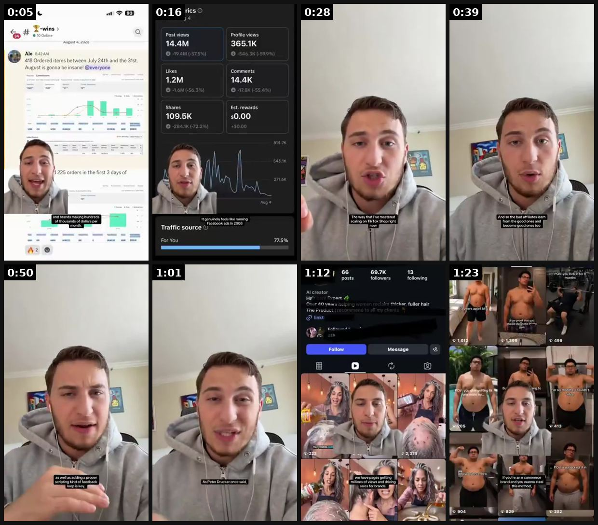
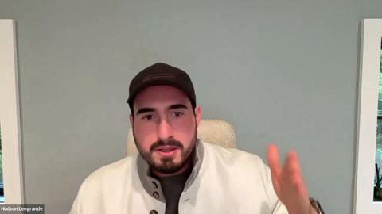
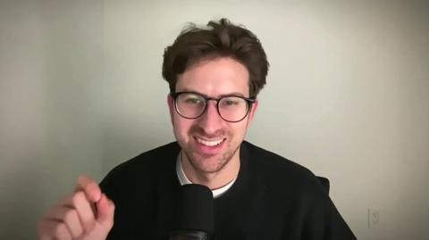
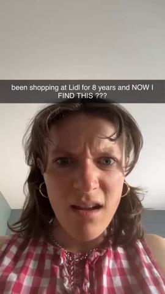
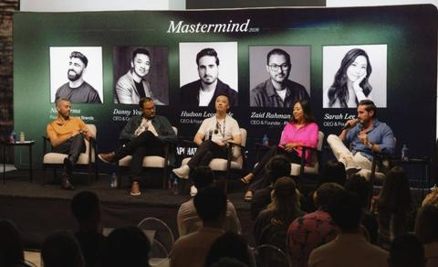
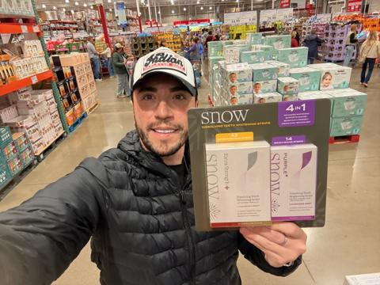

# 43 · Hudson Method creator swarm (hundreds of small creators → every ad channel): see it, then make it

[](https://x.com/maverickecom/status/2088288284690567296)

**The example:** [@maverickecom on X](https://x.com/maverickecom/status/2088288284690567296) · 1:29 video · 16 likes, 2K views

**Watch it:** [open the post on X](https://x.com/maverickecom/status/2088288284690567296) · [play the video file](https://video.twimg.com/amplify_video/2088288158488100865/vid/avc1/320x568/5AfaczMQiKdozgEd.mp4?tag=29)

> Ai content has crossed the chasm Ai + Hudson method = viral tiktok shop https://t.co/2f4nYMgPW5 https://t.co/rezzpmWCk3

## What you are seeing

A TikTok Shop creator explaining the "Hudson method" to camera (in a hoodie), with screenshots of analytics (14.4M views, GMV), then a grid of many creator accounts all posting the same product.

## Beat by beat

The storyboard above samples the video every 0:11. Lines are the transcript for that stretch; on-screen text comes from OCR, so treat it as rough.

| Frame | Time | On screen | Said / sung |
|---|---|---|---|
| 1 | 0:00–0:11 | Y-wins Online August 4, … Ale &424m 418 Ordered items between July 24th and the … August is gonna be insane! everyone … 225 orders in the first days of | Oh my gosh, we've got creators making tens of thousands of dollars per month, and brands making hundreds of thousands of dollars per month, and I built an AI content machine that's |
| 2 | 0:11–0:22 | Key metrics Jun Aug Post views Profile views 14.4M 365.1K -19.4M … -59.9% Likes Comments 1.2M 14.4K -1.6M -56.3% -17.8K -55.4% Shares Est. rewards 109.5K 30.00  | powering this right now, scripting content on easy mode, enabling new affiliates to go viral every day. It genuinely feels like running Facebook ads in 2008 because affiliates are making so many views and sales. |
| 3 | 0:22–0:33 | · | This new brand we started from zero on TikTok Shop is up 50% every month. The way that I've mastered scaling on TikTok Shop right now is purely by using proper content strategy. |
| 4 | 0:33–0:44 | the good ones and ones too | First of all, I mix in top affiliates with a lot worse affiliates as well, and so the bad affiliates learn from the good ones and become good ones too, for a lot cheaper price. So I simultaneously use the good affiliates because they already know what they're doing |
| 5 | 0:44–0:55 | · | and they can get views and sales like it's easy peasy. Combining these two things as well as adding a proper scripting kind of feedback loop is key. And so I use Claude code to basically do all of that in terms of scripting, in terms of |
| 6 | 0:55–1:07 | · | research, in terms of reporting, and just allowing me to know the metrics every day. Because I know the best metrics as Peter Drucker once said, what gets measured gets managed because I know what's going well and what's also doing badly, I can of course improve |
| 7 | 1:07–1:18 | 66 69.7K 13 posts followers following … Over 40 years he thicker fuller hair … we have pages getting millions of views and sales for brands. | it and do more of what works every single day. Yeah, we have pages getting millions of views and driving sales for brands and I've genuinely never seen an affiliate method like this that can get sales so quickly as AI can. |
| 8 | 1:18–1:29 | commerce brand and you wanna steal a this method, | All you need to do is plug in with affiliate pages and social media pages that are already viral in your niche. If you're an Ecom brand and you want to steal this method, comment the word, scale below. I'll send over the method for free and you can of course plug it in for your brand. |

<details><summary>Full transcript (timestamped)</summary>

- `0:00` Oh my gosh, we've got creators making tens of thousands of dollars per month, and brands
- `0:05` making hundreds of thousands of dollars per month, and I built an AI content machine that's
- `0:10` powering this right now, scripting content on easy mode, enabling new affiliates to go
- `0:14` viral every day.
- `0:16` It genuinely feels like running Facebook ads in 2008 because affiliates are making so
- `0:19` many views and sales.
- `0:21` This new brand we started from zero on TikTok Shop is up 50% every month.
- `0:26` The way that I've mastered scaling on TikTok Shop right now is purely by using proper content
- `0:31` strategy.
- `0:32` First of all, I mix in top affiliates with a lot worse affiliates as well, and so the bad
- `0:37` affiliates learn from the good ones and become good ones too, for a lot cheaper price.
- `0:41` So I simultaneously use the good affiliates because they already know what they're doing
- `0:44` and they can get views and sales like it's easy peasy.
- `0:46` Combining these two things as well as adding a proper scripting kind of feedback loop
- `0:51` is key.
- `0:52` And so I use Claude code to basically do all of that in terms of scripting, in terms of
- `0:56` research, in terms of reporting, and just allowing me to know the metrics every day.
- `0:59` Because I know the best metrics as Peter Drucker once said, what gets measured gets managed
- `1:03` because I know what's going well and what's also doing badly, I can of course improve
- `1:07` it and do more of what works every single day.
- `1:09` Yeah, we have pages getting millions of views and driving sales for brands and I've
- `1:13` genuinely never seen an affiliate method like this that can get sales so quickly
- `1:16` as AI can.
- `1:17` All you need to do is plug in with affiliate pages and social media pages that are
- `1:21` already viral in your niche.
- `1:22` If you're an Ecom brand and you want to steal this method, comment the word, scale below.
- `1:26` I'll send over the method for free and you can of course plug it in for your brand.

</details>

## More real examples (5)

Other posts that show this format, or a close cousin of it. Click a thumbnail to open it on X.

| | | |
|---|---|---|
| [](https://x.com/hectorserrranoo/status/2106136430556672384)<br>**@hectorserrranoo** · 0:56 video · 8K views<br>Panel: you're nothing without your creators (Comfrt: 10 creators = big share of revenue). | [](https://x.com/ai_cult1/status/2092368368968049118)<br>**@ai_cult1** · 47:51 video · 49 views<br>Cal AI growth was paid, not organic: creator roster, affiliate program, MrBeast sponsorship, in-house daily ad creative ($40M in 12 months). | [](https://x.com/pixclipper/status/2084739019187847201)<br>**@pixclipper** · 0:40 video · 26K views<br>Mise $300K/mo: 18 UGC accounts running the SAME 43s wordless video (ALDI/LIDL/German versions); store name does the targeting; 702 videos in 8 weeks, |
| [](https://x.com/BoraMutluoglu/status/2051293081920758018)<br>**@BoraMutluoglu** · image · 500 views<br>Hudson Method from Comfrt founder masterminds: thousands of samples/mo, $5k+ bonuses for 100+ videos/mo, run creator content on Meta/Snap/YT, keep pay | [](https://x.com/joshelizetxe/status/2107504952977317898)<br>**@joshelizetxe** · image · 503 views<br>I paid a celebrity $250,000 for a holiday post that generated under $35,000 in sales. Our blended customer acquisition cost spiked to over $300 on a $ |   |

## How to make one like it

**The format in one line:** Instead of a few polished influencers, recruit hundreds of small creators (1k-50k followers) who each post many videos/month for a base fee + commission + volume bonuses; contests drive output; every creator video is whitelisted and loaded into Meta Partnership ads, Snap and YouTube — the creator swarm becomes the ad-creative engine.

**Why it works:** - Volume of real creators = volume of Entity IDs and hooks; winners emerge statistically. - Partnership/creator ads stay live longer (50.5 of 90 days) and get cheaper CPMs than brand assets. - Commission on ad-driven sales keeps creators motivated to keep producing. - Cal AI (15M downloads, $50M run rate) ran a creator roster + affiliate + daily creative team.

**Contents:** [1. Structure](#1-copy-the-structure) · [2. Shot by shot](#2-shot-by-shot-remake) · [3. Script and hooks](#3-write-the-script) · [4. Prompts](#4-prompts) · [5. Tools and settings](#5-tools-and-settings) · [6. Louise Carter remake](#6-louise-carter-remake) · [7. Variants and test](#7-variants-and-test-plan) · [8. Pitfalls](#8-pitfalls)

### 1. Copy the structure

Use the example's timing as your beat sheet. Keep the beat, change the words and the product.

| Beat | Time | In the example | Your version |
|---|---|---|---|
| 1 | 0:05 | Oh my gosh, we've got creators making tens of thousands of dollars per month, and brands making hundreds of thousands of dollars per month, | … |
| 2 | 0:16 | powering this right now, scripting content on easy mode, enabling new affiliates to go viral every day. It genuinely feels like running Face | … |
| 3 | 0:28 | This new brand we started from zero on TikTok Shop is up 50% every month. The way that I've mastered scaling on TikTok Shop right now is pur | … |
| 4 | 0:39 | First of all, I mix in top affiliates with a lot worse affiliates as well, and so the bad affiliates learn from the good ones and become goo | … |
| 5 | 0:50 | and they can get views and sales like it's easy peasy. Combining these two things as well as adding a proper scripting kind of feedback loop | … |
| 6 | 1:01 | research, in terms of reporting, and just allowing me to know the metrics every day. Because I know the best metrics as Peter Drucker once s | … |
| 7 | 1:12 | it and do more of what works every single day. Yeah, we have pages getting millions of views and driving sales for brands and I've genuinely | … |
| 8 | 1:23 | All you need to do is plug in with affiliate pages and social media pages that are already viral in your niche. If you're an Ecom brand and | … |

### 2. Shot-by-shot remake

**Target length / size:** System: 100-500 creators, 20-60 posts each per month

| # | Time / slot | What we see (visual + camera) | Dialogue / on-screen text |
|---|---|---|---|
| 1 | Recruit | Post in creator communities; 1k-50k followers | Base fee + commission + volume bonus |
| 2 | Brief | One-page brief with 5 proven hooks and the demo | "Film 30 videos this month, any of these hooks" |
| 3 | Content | Each creator posts organically | Brand watches for outliers |
| 4 | Ads | Outliers become Spark/Partnership ads | Whitelisting codes |

<details><summary>Playbook shot list (Louise Carter version from the README)</summary>

| Time / slot | Visual | Audio / copy |
|---|---|---|
| Recruit | TikTok Shop affiliate center + IG search; samples to 50-200 creators/month | DM template (brand-run, opt-in) |
| Brief | 1-page brief: minimum every video must hit, 5 hook ideas, do/don't | Day-one rules |
| Produce | Creator posts 10-30 videos/mo on own account | Base pay per video + commission |
| Contest | Monthly video-count contest: $100-250 for 10 approved videos | VA review, net-30 |
| Amplify | Whitelist top 5% → Meta Partnership ads + Spark Ads | Omni attribution |
| Iterate | Winning hooks fed back to all creators | Weekly hook memo |

</details>

### 3. Write the script

Open with one of these hooks (first 1–3 seconds, or the headline on a static):

- Creator brief hooks: "I wore this necklace in the ocean for 30 days"
- "Unboxing the stack my husband got me"
- "Things I never take off"
- "Gift idea under $100 she'll actually wear"

Then fill the beats from the table above. Pull the wording from real customer reviews, not from ad copy: a review line beats a copywriter line almost every time. Read every line out loud and cut anything you would not say to a friend. Ready-made Louise Carter scripts are in section 6; hand [BOT.md](BOT.md) to any AI agent to write versions for another brand.

### 4. Prompts

**Brief template**

```text
Product in 1 line · the 5 hooks that worked · the 15s demo to always include · 3 things you must not say · how to get your Spark code · payment terms.
```

**Full creative-agent prompt (from the playbook):**

```
You manage LC's creator swarm. Given this week's creator video sheet {{SHEET}} (views, likes, link clicks, approvals), 1) list top 5% for Partnership ads with suggested ad copy, 2) extract the 5 best hooks verbatim, 3) write the weekly hook memo to creators (≤200 words), 4) flag any non-compliant videos (missing disclosure, off-PDP claims).
```

### 5. Tools and settings

1. Phase 1 (month 1): 50 creators seeded via TikTok Shop affiliate + IG; 10% commission + $10-20/video base for first 10 videos.
2. Brief with minimum standards (product visible in 2s, says "14K PVD/waterproof" exactly as PDP, #ad/Paid partnership on).
3. VA reviews every video in a sheet (approved/not) → pay net-30.
4. Monthly video-count contest; top 10 creators get retainer ($300-500/mo for 20+ videos).
5. Weekly: pull top 5% by views/CTR → whitelist → Meta Partnership ads (utm_content=F43-<creator>-<hook>).
6. Feed winning hooks back to the swarm.

| Setting | Value |
|---|---|
| What you are building | A repeatable system (account, page, offer or pipeline), not one ad |
| Cadence | Decide the posting or launch rhythm up front (e.g. daily, or 3 new ads a week) and keep it for 30 days |
| Template | Lock one caption, layout and naming template so output is consistent |
| Tracking | One UTM pattern per system (`utm_campaign=F<NN>`) and a weekly sheet: spend, CTR, hook rate, CPA |
| Tools | Meta Ads Manager / TikTok Ads Manager, a shared Drive folder per format, the agent brief in BOT.md |

### 6. Louise Carter remake

- A · Creator brief "30-day ocean test": film day 1 / day 15 / day 30 wearing the same necklace through swims and showers.
- B · Brief "Gift reveal": film partner/mom opening the LC gift box (consent) — real reaction.
- C · Brief "Stack with me": build a 7-piece stack on camera with any 7 for $85.

Brand rules, claims you can and cannot make, and more scripts: [brands/louise-carter.md](brands/louise-carter.md). Step-by-step from idea to scale: [STAGES.md](STAGES.md).

### 7. Variants and test plan

- Pay model: per-video vs retainer vs commission-only
- Contest type: count vs GMV
- Organic only vs whitelisted

**Test plan:** - **Budget/structure:** Month 1: $3-5k creator pay + samples; $100/day Partnership ads on top 5% - **Primary KPIs:** Approved videos/mo, cost per approved video, % videos >10k views, Partnership-ad CPA vs brand ads; Omni (F43-*) - **Kill rule:** Cost per approved video >$60 with <2% >10k views after 60 days - **Scale rule:** Add 50 creators/month; contest tiers - **Naming:** `utm_content=F43-<concept>-<variant>`; weekly Omni roll-up of new-customer revenue by format.

**Naming:** `F43-<variant>-<hook##>-<date>` so results map back to this folder. Change one thing per test (hook, narrator, length or offer), never two.

### 8. Pitfalls

- Every creator must disclose (#ad / paid partnership).
- Track per-creator posting and pay on volume + results.
- Do not let creators make claims beyond the PDP.
- Changing the template every week: the system only learns if it stays consistent for at least 30 days.
- No tracking: without one naming and UTM pattern you cannot tell which piece of the system works.

**Compliance:** Baseline: [_COMPLIANCE.md](../_COMPLIANCE.md) (no fake testimonials, AI disclosure, no bulk/spoofed accounts, copy structure not assets, PDP-only claims). - FTC Endorsement Guides: every paid/gifted creator must disclose (#ad / Paid partnership label); brief must say so. - Creators may only make PDP claims; no fake "I bought this" if gifted. - Contracts: usage rights for whitelisting, duration, payment terms; no spoofed or bulk accounts.

## Field notes

Newer observations live in the playbook: [Wave 3 update: brands & apps crushing it (Oct 2026)](README.md) · [Wave 5 update: Matt Gittleson / HardLaunch UGC system (Oct 2026)](README.md)

## More examples

Every post we found for this format, with transcripts: [examples/](examples/README.md). Playbook: [README.md](README.md). Agent brief: [BOT.md](BOT.md).
