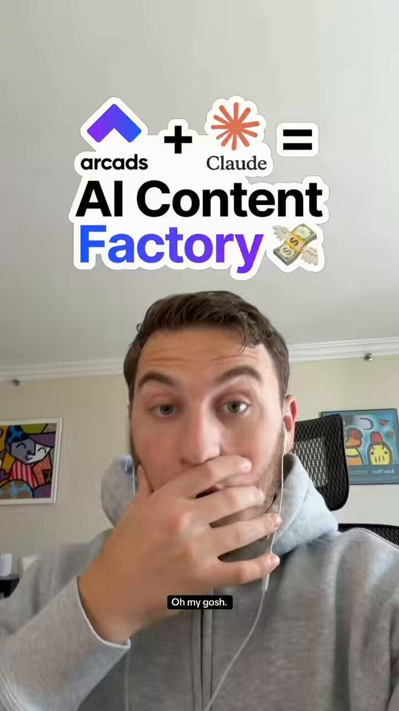

# 43 · Hudson Method creator swarm (hundreds of small creators → every ad channel)

<!-- HERO:START -->
[](EXAMPLE.md)

**[See the example and how to make it →](EXAMPLE.md)** · [watch on X](https://x.com/maverickecom/status/2088288284690567296)
<!-- HERO:END -->


> **LC priority P0** · evidence: High (multiple operators + first-party data) · hype risk: Med · cost $100-400 per creator/month + product + commission · ongoing program (VA + 5-10 h/week)

## What it is
Instead of a few polished influencers, recruit hundreds of small creators (1k-50k followers) who each post many videos/month for a base fee + commission + volume bonuses; contests drive output; every creator video is whitelisted and loaded into Meta Partnership ads, Snap and YouTube — the creator swarm becomes the ad-creative engine.

## Why it works
- Volume of real creators = volume of Entity IDs and hooks; winners emerge statistically.
- Partnership/creator ads stay live longer (50.5 of 90 days) and get cheaper CPMs than brand assets.
- Commission on ad-driven sales keeps creators motivated to keep producing.
- Cal AI (15M downloads, $50M run rate) ran a creator roster + affiliate + daily creative team.

## Shot-by-shot (LC version)

| Time / slot | Visual | Audio / copy |
|---|---|---|
| Recruit | TikTok Shop affiliate center + IG search; samples to 50-200 creators/month | DM template (brand-run, opt-in) |
| Brief | 1-page brief: minimum every video must hit, 5 hook ideas, do/don't | Day-one rules |
| Produce | Creator posts 10-30 videos/mo on own account | Base pay per video + commission |
| Contest | Monthly video-count contest: $100-250 for 10 approved videos | VA review, net-30 |
| Amplify | Whitelist top 5% → Meta Partnership ads + Spark Ads | Omni attribution |
| Iterate | Winning hooks fed back to all creators | Weekly hook memo |

## Hooks (swap-in openers)
- Creator brief hooks: "I wore this necklace in the ocean for 30 days"
- "Unboxing the stack my husband got me"
- "Things I never take off"
- "Gift idea under $100 she'll actually wear"

## Real examples from X (studied)
- @Seanfrank — Hudson Method (Comfrt): seed hundreds of small TikTok creators, pay per video + commission, bonuses for 100+ videos/mo, load into every channel ([post](https://x.com/Seanfrank/status/2051036381359849697)).
- @BoraMutluoglu — thousands of samples/mo, $5k+ bonuses, keep paying commission on ad sales ([post](https://x.com/BoraMutluoglu/status/2051293081920758018)).
- @NotZainAgain — 3 contest types (views — gameable; GMV — free-riders; video-count $100-250 for 10 videos, VA review, net-30) ([post](https://x.com/NotZainAgain/status/2079765230888899036)).
- @jesseabed_ — creator pay benchmarks: ~$400 base for 40-60 hook+demo videos; ~$400 for 20-30 talking head/skit; 25% upfront ([post](https://x.com/jesseabed_/status/2102818749384421524)).
- @Peter_Quadrel — Partnership creator ads live 50.5/90 days vs statics 38.4 vs brand video 28.1 ([post](https://x.com/Peter_Quadrel/status/2108429557611290996)).
- @JoshJDurham — influencer lever by revenue/AOV (seeding → Hudson Method → TikTok Shop) ([post](https://x.com/JoshJDurham/status/2096261644347224438)).
- @alexolim_ — day-one creator rules: show the minimum, what failure looks like, replacement, rewards ([post](https://x.com/alexolim_/status/2107533597942964286)).
- @ai_cult1 — Cal AI growth was paid: creator roster, affiliate program, MrBeast sponsorship, in-house daily ad creative ([post](https://x.com/ai_cult1/status/2092368368968049118)).

## Production recipe
1. Phase 1 (month 1): 50 creators seeded via TikTok Shop affiliate + IG; 10% commission + $10-20/video base for first 10 videos.
2. Brief with minimum standards (product visible in 2s, says "14K PVD/waterproof" exactly as PDP, #ad/Paid partnership on).
3. VA reviews every video in a sheet (approved/not) → pay net-30.
4. Monthly video-count contest; top 10 creators get retainer ($300-500/mo for 20+ videos).
5. Weekly: pull top 5% by views/CTR → whitelist → Meta Partnership ads (utm_content=F43-<creator>-<hook>).
6. Feed winning hooks back to the swarm.

## Bot prompt (copy into the creative agent)
```
You manage LC's creator swarm. Given this week's creator video sheet {{SHEET}} (views, likes, link clicks, approvals), 1) list top 5% for Partnership ads with suggested ad copy, 2) extract the 5 best hooks verbatim, 3) write the weekly hook memo to creators (≤200 words), 4) flag any non-compliant videos (missing disclosure, off-PDP claims).
```

## 3 LC scripts
- A · Creator brief "30-day ocean test": film day 1 / day 15 / day 30 wearing the same necklace through swims and showers.
- B · Brief "Gift reveal": film partner/mom opening the LC gift box (consent) — real reaction.
- C · Brief "Stack with me": build a 7-piece stack on camera with any 7 for $85.

## Variants to test
- Pay model: per-video vs retainer vs commission-only
- Contest type: count vs GMV
- Organic only vs whitelisted

## Omni test plan
- **Budget/structure:** Month 1: $3-5k creator pay + samples; $100/day Partnership ads on top 5%
- **Primary KPIs:** Approved videos/mo, cost per approved video, % videos >10k views, Partnership-ad CPA vs brand ads; Omni (F43-*)
- **Kill rule:** Cost per approved video >$60 with <2% >10k views after 60 days
- **Scale rule:** Add 50 creators/month; contest tiers
- **Naming:** `utm_content=F43-<concept>-<variant>`; weekly Omni roll-up of new-customer revenue by format.

## Compliance
Baseline: [_COMPLIANCE.md](../_COMPLIANCE.md) (no fake testimonials, AI disclosure, no bulk/spoofed accounts, copy structure not assets, PDP-only claims).
- FTC Endorsement Guides: every paid/gifted creator must disclose (#ad / Paid partnership label); brief must say so.
- Creators may only make PDP claims; no fake "I bought this" if gifted.
- Contracts: usage rights for whitelisting, duration, payment terms; no spoofed or bulk accounts.

## Related
- Strategies: 28-ugc-creator-network-per-video-pay, 09-influencer-rev-share, 39-creator-campaign-marketplaces
- Formats: [19-tiktok-shop-affiliate-shoppable-demo](../19-tiktok-shop-affiliate-shoppable-demo/README.md), [14-in-car-yapper-confession](../14-in-car-yapper-confession/README.md), [47-grwm-stack-with-me](../47-grwm-stack-with-me/README.md)

<!-- EVIDENCE:START -->
## Wave 3 update: brands & apps crushing it (Oct 2026)
- Halara: 10,000 creator affiliates; product seeding instead of retainers, 5-20% commission, top 1% whitelisted into Spark Ads; TikTok Shop virality spilled into Amazon and DTC ([@joshelizetxe](https://x.com/joshelizetxe/status/2103449355701080399)).
- A $50K studio Black Friday commercial ($82 CAC) lost to a mom filming in her car ($14 CAC); 500 seeded products → 1,200 raw videos → $1.8M BFCM sales ([@joshelizetxe](https://x.com/joshelizetxe/status/2107089957995037179)).
- Power law: Comfrt's top 10 creators drive a huge share of revenue; Zach Yadegari's best ads came from one creator in his first 20; Haus's top 20 creators drive 85% of sales ([@hectorserrranoo](https://x.com/hectorserrranoo/status/2106136430556672384)). Build community around the few, not 2,000 identical talking heads.

## Wave 5 update: Matt Gittleson / HardLaunch UGC system (Oct 2026)
- Claim (third-party tracked, unverified by us): 1.4B views in 90 days, a client past $1M MRR (Jenni AI), $0 paid, 7¢ CPI and under $0.30 CPM, across dedicated creator-run accounts ([article](https://x.com/mattgittleson/status/2107530746923823444)).
- **Dedicated accounts:** a creator runs an account just for your product; it looks and posts like an organic user, and the product is in every video. Run one yourself first: you can't brief a format you've never made.
- **Warm-up protocol:** days 1-4, use the app like a human for 15-30 min a day (watch time in the niche matters; at Jenni, 40 followers before any promo). Days 4-7, three non-promo warm-up posts that are quick and high-viral-potential. Diagnosis: zero or single-digit views = account problem (cold, flagged, shadowbanned); a few hundred = content problem. One new account's first 2 promo videos did 7.5M+ after the warm-ups.
- **Hire for the ICP, not the niche:** creators who look like your user (real students at 1am, moms), or a credible recommender (a teacher, another mom). A mismatched face gets scrolled and trusted less.
- **Prescribe format and hooks; let creators own execution.** Creators drift to whatever is easiest to film and gets the most views.
- **Propagation numbers:** one 60M-view format produced, within 30 days, 2 more videos above 20M, 9 above 5M and 34 above 1M. The follow-ups did 100M+, more than the original.
- **Portfolio:** 50% proven formats / 25% one-variable iterations / 25% moonshots. No single account should carry most of the views (one shadowban ends the month); rotate out underperformers.
- **Team split:** 20% front (format, principles), 75% middle (briefing, filming, editing, scheduling, all delegated), 5% end (a taste pass on every post).
- LC: 3 dedicated persona accounts (beach girl, nurse on a 12h shift, gym girl); each warmed for 7 days; every video prescribed from the LC format bank; the founder does the 5% taste pass.

## Evidence from X discovery (auto-generated)

| Date | Author | Post | Engagement | Grade | Gist |
|---|---|---|---|---|---|
| 2026-05-03 | [@Seanfrank](https://x.com/Seanfrank) | [link](https://x.com/Seanfrank/status/2051036381359849697) | 2027L/3902BM/376kV | VALUE | The "Hudson Method" (Comfrt): seed hundreds of small TikTok creators, pay per video + commission, bonuses for 100+ videos/mo, load all into every ad channel. (May 2026; 3.9k bookmarks.) |
| 2026-10-07 | [@jakecastilloooo](https://x.com/jakecastilloooo) | [link](https://x.com/jakecastilloooo/status/2107873317369581751) | 984L/3090BM/290kV | VALUE | Ex-Cal AI UGC lead's full AI UGC workflow (article): customer context → outlier videos vs creator baseline → reverse-engineer → believable first frame → test take → batch → 4-platform scheduling → remake winners with real creators, then paid. |
| 2026-09-23 | [@jesseabed_](https://x.com/jesseabed_) | [link](https://x.com/jesseabed_/status/2102818749384421524) | 148L/324BM/18kV | VALUE | Sideshift creator pay: hook-and-demo creators ~$400 base + view milestones for 40-60 videos; talking head/skit ~$400 for 20-30; 25% upfront. |
| 2026-08-04 | [@pixclipper](https://x.com/pixclipper) | [link](https://x.com/pixclipper/status/2084739019187847201) | 134L/339BM/26kV | VALUE | Mise $300K/mo: 18 UGC accounts running the SAME 43s wordless video (ALDI/LIDL/German versions); store name does the targeting; 702 videos in 8 weeks, 3 carry 60% of views. |
| 2026-07-22 | [@NotZainAgain](https://x.com/NotZainAgain) | [link](https://x.com/NotZainAgain/status/2079765230888899036) | 24L/25BM/3kV | VALUE | 3 TikTok Shop contest types: view-based (gameable), GMV-based (free-rider risk), video-count ($100-250 for 10 videos, min-quality rules, VA review, net-30). |
| 2026-05-04 | [@BoraMutluoglu](https://x.com/BoraMutluoglu) | [link](https://x.com/BoraMutluoglu/status/2051293081920758018) | 8L/2BM/0kV | VALUE | Hudson Method from Comfrt founder masterminds: thousands of samples/mo, $5k+ bonuses for 100+ videos/mo, run creator content on Meta/Snap/YT, keep paying commission on ad sales. |
| 2026-10-06 | [@alexolim_](https://x.com/alexolim_) | [link](https://x.com/alexolim_/status/2107533597942964286) | 2L/5BM/0kV | VALUE | Day-one creator onboarding rules: show the minimum per video, what failure looks like (not approved/not counted), replacement after repeated misses, more campaigns for follow-through. |
| 2026-10-09 | [@Peter_Quadrel](https://x.com/Peter_Quadrel) | [link](https://x.com/Peter_Quadrel/status/2108429557611290996) | 1L/2BM/0kV | VALUE | A year of Meta data: Partnership creator ads live 50.5 of first 90 days vs statics 38.4 vs brand video 28.1; 29% still spending at day 90. |
| 2026-07-01 | [@SeoulJosephK](https://x.com/SeoulJosephK) | [link](https://x.com/SeoulJosephK/status/2072291737536803119) | 720L/2243BM/98kV | SOME | App marketing reading list: paid (athcanft), organic UGC (Superwall pod), Sideshift/Posted/Noise view-based campaigns, Jake Castillo for influencers. |
| 2026-09-05 | [@JoshJDurham](https://x.com/JoshJDurham) | [link](https://x.com/JoshJDurham/status/2096261644347224438) | 27L/24BM/2kV | SOME | Influencer levers by revenue/AOV: seeding, gifting, whitelisting, Partnership ads, Hudson Method (retainer + % of ad spend), Trybe, TikTok Shop. |
| 2026-08-25 | [@ai_cult1](https://x.com/ai_cult1) | [link](https://x.com/ai_cult1/status/2092368368968049118) | 0L/0BM/0kV | SOME | Cal AI growth was paid, not organic: creator roster, affiliate program, MrBeast sponsorship, in-house daily ad creative ($40M in 12 months). |
| 2026-08-14 | [@maverickecom](https://x.com/maverickecom) | [link](https://x.com/maverickecom/status/2088288284690567296) | 16L/14BM/2kV | HYPE | "AI + Hudson method = viral TikTok Shop" — comment-gated pitch for AI affiliate pages. |
<!-- EVIDENCE:END -->
