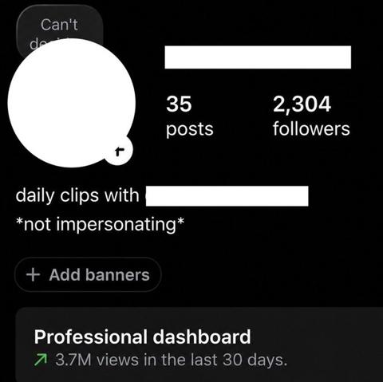
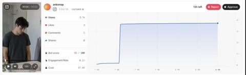
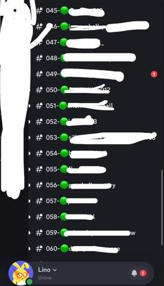
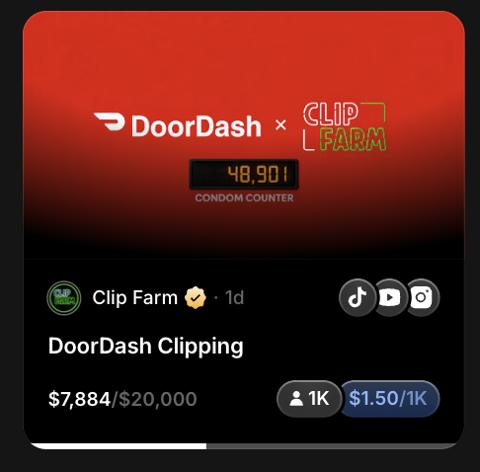
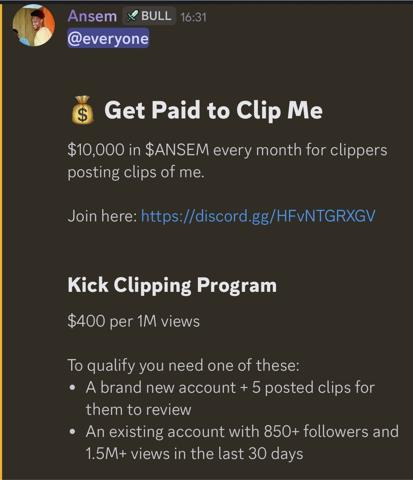
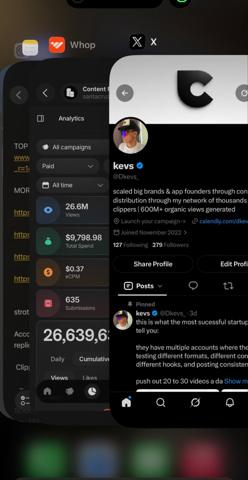
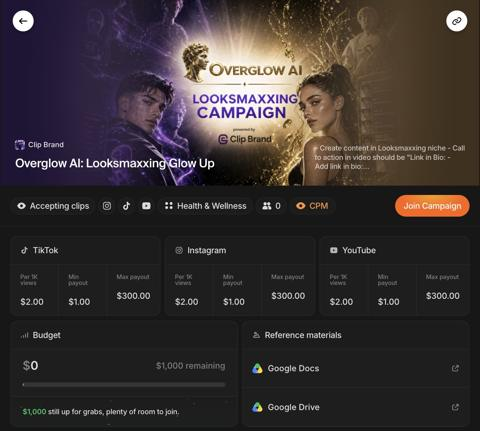
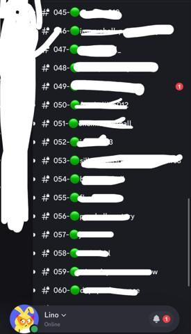

# 44 · Clipping campaign (pay-per-view clippers distribute founder/podcast content): see it, then make it

[](https://x.com/leonclipping/status/2107903429490135362)

**The example:** [@leonclipping on X](https://x.com/leonclipping/status/2107903429490135362) · 0:07 video · 44 likes, 3K views

**Watch it:** [open the post on X](https://x.com/leonclipping/status/2107903429490135362) · [play the video file](https://video.twimg.com/amplify_video/2107903387496833024/vid/avc1/320x568/7rkDLgG0WQ-jYeZR.mp4?tag=29)

> this app spams ONE format and pulled 522M views with organic UGC a 4 sec shocked reaction to a period fact nobody told you, then the dragon in the app explains it 930 of their videos passed 100K views the top one hit 12.2M 100+ creators all running the same hook you can check their entire UGC operation here for free https://darkugc.com/brands/Musa%3A%20Period%20%26%20Pregnancy?ref=leonclipping

## What you are seeing

A 4-second shocked-reaction hook (a woman covering her face and reading the fact on screen), then the app screen (a purple mascot with a body fact). It is one tiny format repeated across many clipping accounts.

## Beat by beat

The storyboard above samples the video every 0:01. Lines are the transcript for that stretch; on-screen text comes from OCR, so treat it as rough.

| Frame | Time | On screen | Said / sung |
|---|---|---|---|
| 1 | 0:00–0:01 | · | · |
| 2 | 0:01–0:02 | shaving a period, … just now, finding why, my, Whole | Somebody's watching me |
| 3 | 0:02–0:03 | · | · |
| 4 | 0:03–0:05 | Cycle day of 28 … my on taught me! … phase Itch levels are at an all-time high Hormonal chaos is in full swing, and your skin is making you feel like a walking  | · |
| 5 | 0:05–0:06 | Cycle day of 28 … phase Itch levels are at an all-time high Hormonal chaos is in full swing, and your skin is making you feel like a walking wool sweater. … and | · |
| 6 | 0:06–0:07 | Cycle day of 28 … my dragon taught me!! … phase Itch levels are at an all-time high. Hormonal chaos is in full swing, and your skin is making you feel like a wa | · |

<details><summary>Full transcript (timestamped)</summary>

- `0:00` Somebody's watching me

</details>

## More real examples (8)

Other posts that show this format, or a close cousin of it. Click a thumbnail to open it on X.

| | | |
|---|---|---|
| [](https://x.com/alexzgirbu/status/2092441815739670637)<br>**@alexzgirbu** · images · 2K views<br>Clipper earns ~$3k per 1M views cutting streams/vlogs into short clips submitted to Content Rewards/Clipping Net/Clipster campaigns. | [](https://x.com/natiakourdadze/status/2107495566225834123)<br>**@natiakourdadze** · image · 1K views<br>The easiest way to get banned on Clip Brand? A bot score of 99. Don't submit videos with fake views. Content Rewards detects bots, and we can see it r | [](https://x.com/LinoLeighton/status/2077533819905744955)<br>**@LinoLeighton** · images · 32K views<br>Currently at 60 clippers now for side app. I’ve only spent $430 on this faceless clipping campaign so far and it’s currently on around 10X return. Ove |
| [](https://x.com/alexxgrowth/status/2085667455062389146)<br>**@alexxgrowth** · images · 10K views<br>doordash did $13.7 BILLION in revenue last year they have one of the best marketing teams on the planet and they just launched something called Cringe | [](https://x.com/savixbt/status/2082914407567462902)<br>**@savixbt** · image · 1K views<br>clippers in the house, @blknoiz06 just drop a clipping campaign for clippers there’s $10,000 in $ANSEM reward every month for clippers. requirements: | [](https://x.com/Dkevs_/status/2103032078514246093)<br>**@Dkevs_** · image · 896 views<br>if you’re a founder and you haven’t launched your own clipping campaign yet just start. it’s one of the cheapest ways to distribute your content at sc |
| [](https://x.com/natiakourdadze/status/2101662430048735412)<br>**@natiakourdadze** · image · 2K views<br>Did I share my newest marketing obsession? Content Rewards by Whop 🥳 I just launched a campaign for Overglow AI, and clippers are already applying, po | [](https://x.com/LinoLeighton/status/2077532362842181898)<br>**@LinoLeighton** · images · 110 views<br>Currently at 60 clippers now for side app. I’ve only spent $430 on this faceless clipping campaign so far and it’s already generated $4K in Rev. Over |   |

## How to make one like it

**The format in one line:** Post a campaign on a clipping marketplace (Content Rewards, Whop clipping, Sideshift-type) paying a fixed rate per 1k views; dozens of clippers cut your long-form (founder podcast, lives, interviews) or a template format into shorts on their own accounts.

**Why it works:** - Pay only for views; massive account diversity. - One proven format × 100 clippers = outlier scale (Musa 522M views).

**Contents:** [1. Structure](#1-copy-the-structure) · [2. Shot by shot](#2-shot-by-shot-remake) · [3. Script and hooks](#3-write-the-script) · [4. Prompts](#4-prompts) · [5. Tools and settings](#5-tools-and-settings) · [6. Louise Carter remake](#6-louise-carter-remake) · [7. Variants and test](#7-variants-and-test-plan) · [8. Pitfalls](#8-pitfalls)

### 1. Copy the structure

Use the example's timing as your beat sheet. Keep the beat, change the words and the product.

| Beat | Time | In the example | Your version |
|---|---|---|---|
| 1 | 0:00 | Somebody's watching me | … |
| 2 | 0:01 | Somebody's watching me | … |
| 3 | 0:03 | Somebody's watching me | … |
| 4 | 0:04 | Somebody's watching me | … |
| 5 | 0:05 | on screen: Cycle day of 28 … phase Itch levels are at an all-time high Hormonal chaos is in full swing, and your skin is making you | … |
| 6 | 0:07 | on screen: Cycle day of 28 … my dragon taught me!! … phase Itch levels are at an all-time high. Hormonal chaos is in full swing, an | … |

### 2. Shot-by-shot remake

**Target length / size:** System: a pool of clippers posting short clips from founder or podcast content, paid per 1,000 views

| # | Time / slot | What we see (visual + camera) | Dialogue / on-screen text |
|---|---|---|---|
| 1 | Source | A long founder video or podcast episode (20-60 min) | - |
| 2 | Brief | A shared folder with the source, the brand rules and 10 example clips | "Cut 15-45s moments; captions on; tag @louisecarter" |
| 3 | Clips | Clippers post on their own TikTok/IG/YT accounts | Hooks pulled from the best lines |
| 4 | Payout | Views tracked via platform (e.g. Whop/Clipping) and paid per 1,000 | - |
| 5 | Recycle | Best clips become paid ads (with rights) | - |

<details><summary>Playbook shot list (Louise Carter version from the README)</summary>

| Time / slot | Visual | Audio / copy |
|---|---|---|
| Source | Qirra 30-60 min podcast/live with stories | — |
| Campaign | Rules: min length, must show product/name, disclosure, $ per 1k views, cap | — |
| Clips | Clippers post on own pages | — |
| Pay | Verified views only | — |

</details>

### 3. Write the script

Open with one of these hooks (first 1–3 seconds, or the headline on a static):

- Clip prompt: "the moment Qirra explains why she started LC"
- "Customer story that made Qirra cry"

Then fill the beats from the table above. Pull the wording from real customer reviews, not from ad copy: a review line beats a copywriter line almost every time. Read every line out loud and cut anything you would not say to a friend. Ready-made Louise Carter scripts are in section 6; hand [BOT.md](BOT.md) to any AI agent to write versions for another brand.

### 4. Prompts

**Brief (Claude)**

```text
Write a clipper brief: what to cut, what never to say, caption style, required disclosure (#ad / paid partnership), payout rate and rules.
```

**Platform**

```text
Set up a campaign with a CPM cap, a view floor per clip, and manual approval of the first 20 clips.
```

**Full creative-agent prompt (from the playbook):**

```
From this transcript {{TRANSCRIPT}} of Qirra's long-form content, list 15 clip-worthy 20-45s moments with hook line, timestamp, and on-screen caption.
```

### 5. Tools and settings

1. Need source content first (F27 founder content, podcast).
2. Pick reputable marketplace with view verification; set CPM cap and budget cap.
3. Require #ad disclosure and approved claims list.

| Setting | Value |
|---|---|
| What you are building | A repeatable system (account, page, offer or pipeline), not one ad |
| Cadence | Decide the posting or launch rhythm up front (e.g. daily, or 3 new ads a week) and keep it for 30 days |
| Template | Lock one caption, layout and naming template so output is consistent |
| Tracking | One UTM pattern per system (`utm_campaign=F<NN>`) and a weekly sheet: spend, CTR, hook rate, CPA |
| Tools | Meta Ads Manager / TikTok Ads Manager, a shared Drive folder per format, the agent brief in BOT.md |

### 6. Louise Carter remake

- A · Founder origin story clips.
- B · Customer-call clips (F26).
- C · "Jewelry myths" clips.

Brand rules, claims you can and cannot make, and more scripts: [brands/louise-carter.md](brands/louise-carter.md). Step-by-step from idea to scale: [STAGES.md](STAGES.md).

### 7. Variants and test plan

- $/1k views
- Source type

**Test plan:** - **Budget/structure:** $1,000 cap pilot - **Primary KPIs:** Verified views, cost per 1k, profile visits, Omni (F44-*) - **Kill rule:** <$ value vs Meta CPM after pilot - **Scale rule:** Only if Omni shows revenue - **Naming:** `utm_content=F44-<concept>-<variant>`; weekly Omni roll-up of new-customer revenue by format.

**Naming:** `F44-<variant>-<hook##>-<date>` so results map back to this folder. Change one thing per test (hook, narrator, length or offer), never two.

### 8. Pitfalls

- Clippers must disclose the paid relationship.
- Approve early clips; one bad clip can misquote the founder.
- Cap spend per clip to avoid paying for botted views.
- Changing the template every week: the system only learns if it stays consistent for at least 30 days.
- No tracking: without one naming and UTM pattern you cannot tell which piece of the system works.

**Compliance:** Baseline: [_COMPLIANCE.md](../_COMPLIANCE.md) (no fake testimonials, AI disclosure, no bulk/spoofed accounts, copy structure not assets, PDP-only claims). - Clippers must disclose paid partnership; no bot views; no reposting customers without consent.

## More examples

Every post we found for this format, with transcripts: [examples/](examples/README.md). Playbook: [README.md](README.md). Agent brief: [BOT.md](BOT.md).
