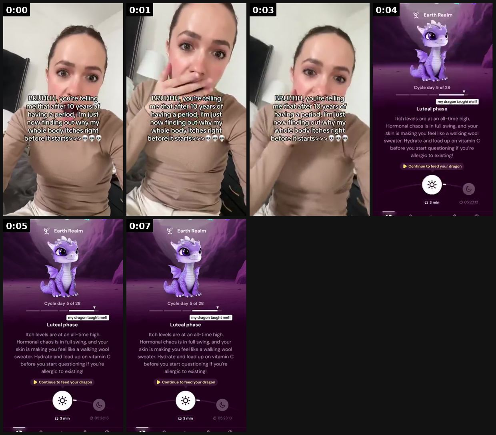

# 44 · Clipping campaign (pay-per-view clippers distribute founder/podcast content): see it, then make it

[](https://x.com/leonclipping/status/2107903429490135362)

**The example:** [@leonclipping on X](https://x.com/leonclipping/status/2107903429490135362) · 0:07 video · 44 likes, 3K views

**Watch it:** [open the post on X](https://x.com/leonclipping/status/2107903429490135362) · [play the video file](https://video.twimg.com/amplify_video/2107903387496833024/vid/avc1/320x568/7rkDLgG0WQ-jYeZR.mp4?tag=29)

> this app spams ONE format and pulled 522M views with organic UGC a 4 sec shocked reaction to a period fact nobody told you, then the dragon in the app explains it 930 of their videos passed 100K views the top one hit 12.2M 100+ creators all running the same hook you can check their entire UGC operation here for free https://darkugc.com/brands/Musa%3A%20Period%20%26%20Pregnancy?ref=leonclipping

## What you are seeing

A 4-second shocked-reaction hook (a woman covering her face and reading the fact on screen), then the app screen (a purple mascot with a body fact). It is one tiny format repeated across many clipping accounts.

## Beat by beat

The storyboard above samples the video every 0:01. Lines are the transcript for that stretch; on-screen text comes from OCR, so treat it as rough.

| Frame | Time | On screen | Said / sung |
|---|---|---|---|
| 1 | 0:00–0:01 | · | · |
| 2 | 0:01–0:02 | · | Somebody's watching me |
| 3 | 0:02–0:03 | · | · |
| 4 | 0:03–0:05 | Cycle day of 28 ll my on taught me! phase Itch levels are at an all-time high Hormonal chaos is in full swing, and your skin is making you feel like a walking w | · |
| 5 | 0:05–0:06 | Ef Cycle day of 28 ee phase Itch levels are at an all-time high Hormonal chaos is in full swing, and your skin is making you feel like a walking wool sweater. H | · |
| 6 | 0:06–0:07 | Cycle day of 28 ee my dragon taught me!! phase Itch levels are at an all-time high. Hormonal chaos is in full swing, and your skin is making you feel like a wal | · |

<details><summary>Full transcript (timestamped)</summary>

- `0:00` Somebody's watching me

</details>

## How to make one like it

**The format in one line:** Post a campaign on a clipping marketplace (Content Rewards, Whop clipping, Sideshift-type) paying a fixed rate per 1k views; dozens of clippers cut your long-form (founder podcast, lives, interviews) or a template format into shorts on their own accounts.

**Why it works:** - Pay only for views; massive account diversity. - One proven format × 100 clippers = outlier scale (Musa 522M views).

**Contents:** [1. Structure](#1-copy-the-structure) · [2. Shot by shot](#2-shot-by-shot-remake) · [3. Script and hooks](#3-write-the-script) · [4. Prompts](#4-prompts) · [5. Tools and settings](#5-tools-and-settings) · [6. Louise Carter remake](#6-louise-carter-remake) · [7. Variants and test](#7-variants-and-test-plan) · [8. Pitfalls](#8-pitfalls)

### 1. Copy the structure

Use the example's timing as your beat sheet. Keep the beat, change the words and the product.

| Beat | Time | In the example | Your version |
|---|---|---|---|
| 1 | 0:00 | Somebody's watching me | … |
| 2 | 0:01 | Somebody's watching me | … |
| 3 | 0:03 | Somebody's watching me | … |
| 4 | 0:04 | Somebody's watching me | … |
| 5 | 0:05 | on screen: Ef Cycle day of 28 ee phase Itch levels are at an all-time high Hormonal chaos is in full swing, and your skin is making | … |
| 6 | 0:07 | on screen: Cycle day of 28 ee my dragon taught me!! phase Itch levels are at an all-time high. Hormonal chaos is in full swing, and | … |

### 2. Shot-by-shot remake

**Target length / size:** Campaign on a clipping marketplace; clips 15-60s

| # | Time / slot | What we see (visual + camera) | Dialogue / on-screen text |
|---|---|---|---|
| 1 | Source | Long-form founder/podcast content | Hours of raw material |
| 2 | Clips | Clippers cut 15-60s moments with captions | Strong first line |
| 3 | Payout | Fixed $ per 1k views | Cap per clip |

<details><summary>Playbook shot list (Louise Carter version from the README)</summary>

| Time / slot | Visual | Audio / copy |
|---|---|---|
| Source | Qirra 30-60 min podcast/live with stories | — |
| Campaign | Rules: min length, must show product/name, disclosure, $ per 1k views, cap | — |
| Clips | Clippers post on own pages | — |
| Pay | Verified views only | — |

</details>

### 3. Write the script

Open with one of these hooks (first 1–3 seconds, or the headline on a static):

- Clip prompt: "the moment Qirra explains why she started LC"
- "Customer story that made Qirra cry"

Then fill the beats from the table above. Pull the wording from real customer reviews, not from ad copy: a review line beats a copywriter line almost every time. Read every line out loud and cut anything you would not say to a friend. Ready-made Louise Carter scripts are in section 6; hand [BOT.md](BOT.md) to any AI agent to write versions for another brand.

### 4. Prompts

**Campaign brief**

```text
Rate $X per 1k views (cap $Y per clip), required: brand handle in caption, #ad, no reposting other creators. Provide 10 example clips.
```

**Full creative-agent prompt (from the playbook):**

```
From this transcript {{TRANSCRIPT}} of Qirra's long-form content, list 15 clip-worthy 20-45s moments with hook line, timestamp, and on-screen caption.
```

### 5. Tools and settings

1. Need source content first (F27 founder content, podcast).
2. Pick reputable marketplace with view verification; set CPM cap and budget cap.
3. Require #ad disclosure and approved claims list.

| Setting | Value |
|---|---|
| What you are building | A repeatable system (account, page, offer or pipeline), not one ad |
| Cadence | Decide the posting or launch rhythm up front (e.g. daily, or 3 new ads a week) and keep it for 30 days |
| Template | Lock one caption, layout and naming template so output is consistent |
| Tracking | One UTM pattern per system (`utm_campaign=F<NN>`) and a weekly sheet: spend, CTR, hook rate, CPA |
| Tools | Meta Ads Manager / TikTok Ads Manager, a shared Drive folder per format, the agent brief in BOT.md |

### 6. Louise Carter remake

- A · Founder origin story clips.
- B · Customer-call clips (F26).
- C · "Jewelry myths" clips.

Brand rules, claims you can and cannot make, and more scripts: [brands/louise-carter.md](brands/louise-carter.md). Step-by-step from idea to scale: [STAGES.md](STAGES.md).

### 7. Variants and test plan

- $/1k views
- Source type

**Test plan:** - **Budget/structure:** $1,000 cap pilot - **Primary KPIs:** Verified views, cost per 1k, profile visits, Omni (F44-*) - **Kill rule:** <$ value vs Meta CPM after pilot - **Scale rule:** Only if Omni shows revenue - **Naming:** `utm_content=F44-<concept>-<variant>`; weekly Omni roll-up of new-customer revenue by format.

**Naming:** `F44-<variant>-<hook##>-<date>` so results map back to this folder. Change one thing per test (hook, narrator, length or offer), never two.

### 8. Pitfalls

- Clips need disclosure.
- View fraud: pay only on platform-verified views.
- The featured example is a 4-second reaction format repeated by many clip accounts.
- Changing the template every week: the system only learns if it stays consistent for at least 30 days.
- No tracking: without one naming and UTM pattern you cannot tell which piece of the system works.

**Compliance:** Baseline: [_COMPLIANCE.md](../_COMPLIANCE.md) (no fake testimonials, AI disclosure, no bulk/spoofed accounts, copy structure not assets, PDP-only claims). - Clippers must disclose paid partnership; no bot views; no reposting customers without consent.

## More examples

Every post we found for this format, with transcripts: [examples/](examples/README.md). Playbook: [README.md](README.md). Agent brief: [BOT.md](BOT.md).
