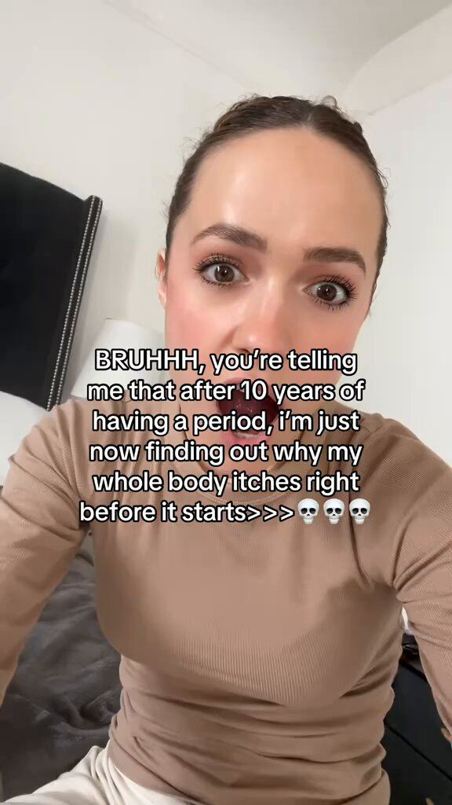

# 44 · Clipping campaign (pay-per-view clippers distribute founder/podcast content)

<!-- HERO:START -->
[](EXAMPLE.md)

**[See the example and how to make it →](EXAMPLE.md)** · [watch on X](https://x.com/leonclipping/status/2107903429490135362)
<!-- HERO:END -->


> **LC priority P2** · evidence: Medium (outlier case studies; mostly agency pitches) · hype risk: Med · cost $1-3 CPM paid to clippers + platform fee · setup 1 day; ongoing

## What it is
Post a campaign on a clipping marketplace (Content Rewards, Whop clipping, Sideshift-type) paying a fixed rate per 1k views; dozens of clippers cut your long-form (founder podcast, lives, interviews) or a template format into shorts on their own accounts.

## Why it works
- Pay only for views; massive account diversity.
- One proven format × 100 clippers = outlier scale (Musa 522M views).

## Shot-by-shot (LC version)

| Time / slot | Visual | Audio / copy |
|---|---|---|
| Source | Qirra 30-60 min podcast/live with stories | — |
| Campaign | Rules: min length, must show product/name, disclosure, $ per 1k views, cap | — |
| Clips | Clippers post on own pages | — |
| Pay | Verified views only | — |

## Hooks (swap-in openers)
- Clip prompt: "the moment Qirra explains why she started LC"
- "Customer story that made Qirra cry"

## Real examples from X (studied)
- @leonclipping — Musa: one format, 522M views, 930 videos >100K, 100+ creators ([post](https://x.com/leonclipping/status/2107903429490135362)).
- @alexzgirbu — clipper economics ~$3k per 1M views ([post](https://x.com/alexzgirbu/status/2092441815739670637)).
- @Dkevs_ — app clipping campaign 140K+ views while testing ([post](https://x.com/Dkevs_/status/2104045499208831116)).
- @SeoulJosephK — app marketing map incl. view-based campaigns ([post](https://x.com/SeoulJosephK/status/2072291737536803119)).

## Production recipe
1. Need source content first (F27 founder content, podcast).
2. Pick reputable marketplace with view verification; set CPM cap and budget cap.
3. Require #ad disclosure and approved claims list.

## Bot prompt (copy into the creative agent)
```
From this transcript {{TRANSCRIPT}} of Qirra's long-form content, list 15 clip-worthy 20-45s moments with hook line, timestamp, and on-screen caption.
```

## 3 LC scripts
- A · Founder origin story clips.
- B · Customer-call clips (F26).
- C · "Jewelry myths" clips.

## Variants to test
- $/1k views
- Source type

## Omni test plan
- **Budget/structure:** $1,000 cap pilot
- **Primary KPIs:** Verified views, cost per 1k, profile visits, Omni (F44-*)
- **Kill rule:** <$ value vs Meta CPM after pilot
- **Scale rule:** Only if Omni shows revenue
- **Naming:** `utm_content=F44-<concept>-<variant>`; weekly Omni roll-up of new-customer revenue by format.

## Compliance
Baseline: [_COMPLIANCE.md](../_COMPLIANCE.md) (no fake testimonials, AI disclosure, no bulk/spoofed accounts, copy structure not assets, PDP-only claims).
- Clippers must disclose paid partnership; no bot views; no reposting customers without consent.

## Related
- Strategies: 39-creator-campaign-marketplaces, 26-viral-format-intelligence-feed
- Formats: [43-hudson-method-creator-swarm](../43-hudson-method-creator-swarm/README.md), [27-founder-walk-and-talk-story-ad](../27-founder-walk-and-talk-story-ad/README.md)

<!-- EVIDENCE:START -->
## Evidence from X discovery (auto-generated)

| Date | Author | Post | Engagement | Grade | Gist |
|---|---|---|---|---|---|
| 2026-07-01 | [@SeoulJosephK](https://x.com/SeoulJosephK) | [link](https://x.com/SeoulJosephK/status/2072291737536803119) | 720L/2243BM/98kV | SOME | App marketing reading list: paid (athcanft), organic UGC (Superwall pod), Sideshift/Posted/Noise view-based campaigns, Jake Castillo for influencers. |
| 2026-08-26 | [@alexzgirbu](https://x.com/alexzgirbu) | [link](https://x.com/alexzgirbu/status/2092441815739670637) | 39L/36BM/2kV | SOME | Clipper earns ~$3k per 1M views cutting streams/vlogs into short clips submitted to Content Rewards/Clipping Net/Clipster campaigns. |
| 2026-09-27 | [@Dkevs_](https://x.com/Dkevs_) | [link](https://x.com/Dkevs_/status/2104045499208831116) | 13L/9BM/1kV | SOME | App clipping campaign hit 140K+ views while still testing formats; trained teen clippers (agency pitch). |
<!-- EVIDENCE:END -->
