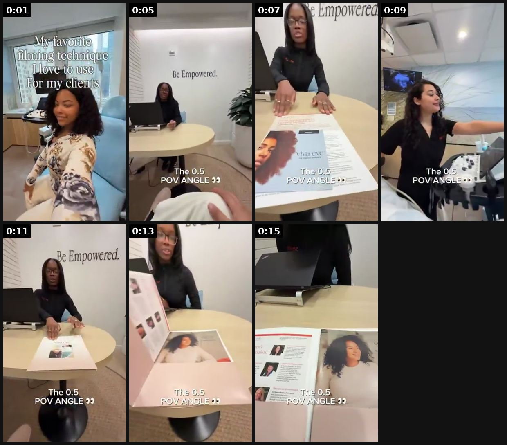
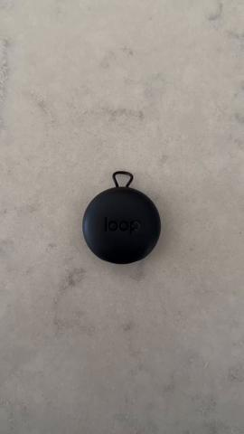
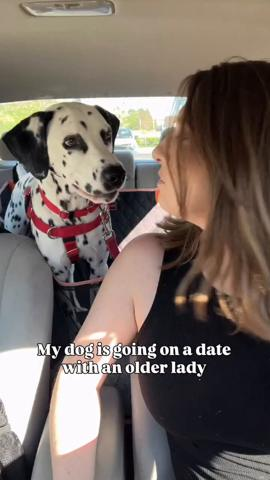

# 45 · Day in the life / behind the scenes (founder or customer): see it, then make it

[](https://x.com/ugcAshleyRJ/status/2067636022251290725)

**The example:** [@ugcAshleyRJ on X](https://x.com/ugcAshleyRJ/status/2067636022251290725) · 0:16 video · 13 likes, 534 views

**Watch it:** [open the post on X](https://x.com/ugcAshleyRJ/status/2067636022251290725) · [play the video file](https://video.twimg.com/amplify_video/2067635963845652480/vid/avc1/320x568/ZmDKM3A-TdanUqbu.mp4?tag=28)

> Here’s a filming technique my clients are obsessed with 👀 The 0.5 POV. That ultra-wide 0.5 lens on your phone? It’s the secret to UGC that actually stops the scroll. Here’s why it works: • Immersive → it pulls the viewer into the moment instead of watching from the outside • Dynamic → movement looks bigger, more energetic, more “real” • Native → it feels like content, not an ad, so people stay I use it for product de…

## What you are seeing

A day-in-the-life POV filmed with an ultra-wide 0.5x lens: walking into an office ("Be Empowered" on the wall), working at a round table, a printed magazine spread, with captions explaining the 0.5x POV angle.

## Beat by beat

The storyboard above samples the video every 0:02. Lines are the transcript for that stretch; on-screen text comes from OCR, so treat it as rough.

| Frame | Time | On screen | Said / sung |
|---|---|---|---|
| 1 | 0:00–0:03 | · | · |
| 2 | 0:03–0:06 | a Be Empowered The POV ANG | · |
| 3 | 0:06–0:08 | Empowered a Wal | · |
| 4 | 0:08–0:10 | · | · |
| 5 | 0:10–0:12 | Empowered. The 0.5 POV | · |
| 6 | 0:12–0:14 | · | · |
| 7 | 0:14–0:16 | · | · |

## More real examples (2)

Other posts that show this format, or a close cousin of it. Click a thumbnail to open it on X.

| | | |
|---|---|---|
| [](https://x.com/adamtaylorl/status/2100540269351350453)<br>**@adamtaylorl** · 0:36 video · 429 views<br>5. Day In The Life… Most brands will list a bunch of boring features. Loop just shows a guy using it for a day. Laptop, backpack, crowd at a live even | [](https://x.com/adamtaylorl/status/2090038019059314970)<br>**@adamtaylorl** · 0:58 video · 614 views<br>3. The Retail Vlog You're 40 seconds into a dog date before you realize Petco and the ingredients list walked in with it. Stealth education. |   |

## How to make one like it

**The format in one line:** Vlog-style sequence of a day — founder running LC or a customer living in her jewelry (gym → shower → work → date) — with the product present in every scene. Paid version: 20-30s cut with text hook.

**Why it works:** - Parasocial, native vlog grammar; product proof through continuity (same necklace all day). - Framework that converts one message into a new Entity ID (@williamkast_).

**Contents:** [1. Structure](#1-copy-the-structure) · [2. Shot by shot](#2-shot-by-shot-remake) · [3. Script and hooks](#3-write-the-script) · [4. Prompts](#4-prompts) · [5. Tools and settings](#5-tools-and-settings) · [6. Louise Carter remake](#6-louise-carter-remake) · [7. Variants and test](#7-variants-and-test-plan) · [8. Pitfalls](#8-pitfalls)

### 1. Copy the structure

Use the example's timing as your beat sheet. Keep the beat, change the words and the product.

| Beat | Time | In the example | Your version |
|---|---|---|---|
| 1 | 0:01 | (visual beat, see frame 1) | … |
| 2 | 0:05 | on screen: a Be Empowered The POV ANG | … |
| 3 | 0:07 | on screen: Empowered a Wal | … |
| 4 | 0:09 | (visual beat, see frame 4) | … |
| 5 | 0:11 | on screen: Empowered. The 0.5 POV | … |
| 6 | 0:13 | (visual beat, see frame 6) | … |
| 7 | 0:15 | (visual beat, see frame 7) | … |

### 2. Shot-by-shot remake

**Target length / size:** 30-60s, 1080x1920

| # | Time / slot | What we see (visual + camera) | Dialogue / on-screen text |
|---|---|---|---|
| 1 | 0-3s | Founder at 6am packing orders, phone propped on shelf | "A day running a jewellery brand from my spare room." |
| 2 | 3-15s | Quick cuts: coffee, emails, quality-checking chains under a lamp | VO with time stamps on screen |
| 3 | 15-30s | Testing a necklace in the sink, then a swim at lunch | "Every new piece goes in the sea before it goes on the site." |
| 4 | 30-45s | Evening: packing the last box, handwritten note | "Order 412 today." |
| 5 | End | Product | Soft CTA |

<details><summary>Playbook shot list (Louise Carter version from the README)</summary>

| Time / slot | Visual | Audio / copy |
|---|---|---|
| 0-2s | 0.5x POV alarm, necklace on nightstand? No — already on | "Day in my life wearing the same necklace for 24h" |
| 2-8s | Gym | Sweat |
| 8-12s | Shower | "still on" |
| 12-20s | Work / coffee | Compliment from coworker (real) |
| 20-25s | Pool/dinner | "any 7 for $85" |

</details>

### 3. Write the script

Open with one of these hooks (first 1–3 seconds, or the headline on a static):

- "Day in the life of a jewelry founder (the unglamorous version)"
- "24 hours in the same necklace"
- "A day packing 1,000 orders"

Then fill the beats from the table above. Pull the wording from real customer reviews, not from ad copy: a review line beats a copywriter line almost every time. Read every line out loud and cut anything you would not say to a friend. Ready-made Louise Carter scripts are in section 6; hand [BOT.md](BOT.md) to any AI agent to write versions for another brand.

### 4. Prompts

**Shoot**

```text
Phone on a mini tripod, 15-20 clips of 2-4s, natural light; time stamps as captions.
```

**Script (Claude)**

```text
Turn this list of real tasks [paste] into a 45-second day-in-the-life with one surprising detail.
```

**Full creative-agent prompt (from the playbook):**

```
Turn this list of a real day's scenes {{SCENES}} into a 25s DITL script: hook text, scene captions (≤6 words), and one product moment per scene.
```

### 5. Tools and settings

1. Film with phone 0.5x lens; 8-12 scenes; natural audio.
2. Organic first; paid cut only if organic retention ≥ average.

| Setting | Value |
|---|---|
| Canvas | 1080×1920 (9:16) master; crop a 1080×1350 (4:5) cut for feed placements |
| Frame rate | 30 fps (shoot 60 fps for slow-motion water or sparkle shots) |
| Camera | Phone main lens at 1x, exposure locked on skin, HDR off, grid on; tripod or a phone clamp for product shots |
| Light | One soft key at 45° (window or ring light), white card as fill; side light for metal sparkle |
| Audio | Lavalier or phone 15–20 cm from the mouth; mix voice at -14 LUFS, music at -28 to -30 dB under voice |
| Captions | Burned in, 2–5 words per line, 64–80 px bold sans, white with a black stroke or pill; keep text inside the safe zone (top 220 px and bottom 420 px clear, 64 px side margins) |
| Pacing | A visual change every 1.5–3 s; the hook lands in the first 1.5 s with no logo intro |
| Edit / export | CapCut or Premiere; H.264, 12–20 Mbps, AAC 320 kbps; upload natively to each platform, not via links |

### 6. Louise Carter remake

- A · Customer "24h in the same necklace".
- B · Qirra "launch day".
- C · Warehouse BTS "packing your stacks".

Brand rules, claims you can and cannot make, and more scripts: [brands/louise-carter.md](brands/louise-carter.md). Step-by-step from idea to scale: [STAGES.md](STAGES.md).

### 7. Variants and test plan

- Founder vs customer
- 0.5x POV vs standard

**Test plan:** - **Budget/structure:** Organic; paid cut $30/day 5 days if organic wins - **Primary KPIs:** Retention, saves; Omni (F45-*) - **Kill rule:** C-tier for paid in one list → keep organic unless CPA ok - **Scale rule:** Weekly series - **Naming:** `utm_content=F45-<concept>-<variant>`; weekly Omni roll-up of new-customer revenue by format.

**Naming:** `F45-<variant>-<hook##>-<date>` so results map back to this folder. Change one thing per test (hook, narrator, length or offer), never two.

### 8. Pitfalls

- Show the real day, not a staged one.
- One product moment, not five.
- Don't show customer names or addresses on labels.
- Slow open: if the first 1.5 s does not show the hook visually, most people swipe.
- Logo or brand intro at the start reads as an ad; put the brand at the end.
- Captions covered by the platform UI: check the safe zone on a real phone before posting.
- Music over the voice: keep music at least 14 dB under speech.

**Compliance:** Baseline: [_COMPLIANCE.md](../_COMPLIANCE.md) (no fake testimonials, AI disclosure, no bulk/spoofed accounts, copy structure not assets, PDP-only claims). - Real day; no staged "compliments" presented as real.

## Field notes

Newer observations live in the playbook: [Wave 8 update: Voynov page, Adam Taylor teardowns, queued posts (Oct 9, 2026)](README.md)

## More examples

Every post we found for this format, with transcripts: [examples/](examples/README.md). Playbook: [README.md](README.md). Agent brief: [BOT.md](BOT.md).
