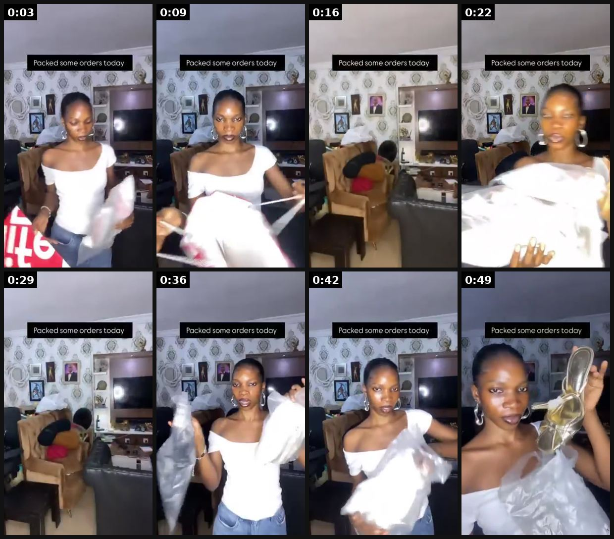

# 46 · Unboxing / packing orders (ASMR): see it, then make it

[](https://x.com/mannyvivianne/status/2101756682359480565)

**The example:** [@mannyvivianne on X](https://x.com/mannyvivianne/status/2101756682359480565) · 0:52 video · 14 likes, 439 views

**Watch it:** [open the post on X](https://x.com/mannyvivianne/status/2101756682359480565) · [play the video file](https://video.twimg.com/amplify_video/2101756598314012673/vid/avc1/320x568/4_Z02Z9oBRYWQnYX.mp4?tag=29)

> Pack orders with me. 👠

## What you are seeing

"Pack orders with me": a creator in her room unpacking a shipment and trying on the pieces ("Packed some orders today"), ending with a celebratory toast. It is casual, behind the scenes and in real time.

## Beat by beat

The storyboard above samples the video every 0:06. Lines are the transcript for that stretch; on-screen text comes from OCR, so treat it as rough.

| Frame | Time | On screen | Said / sung |
|---|---|---|---|
| 1 | 0:00–0:06 | Packed some orders today WwW yi! fs a | · |
| 2 | 0:06–0:13 | · | · |
| 3 | 0:13–0:19 | Oo a Ss oo ee | · |
| 4 | 0:19–0:26 | wee Packed some orders today ei gt | · |
| 5 | 0:26–0:32 | · | · |
| 6 | 0:32–0:39 | · | · |
| 7 | 0:39–0:45 | Packed some orders today Dx a | · |
| 8 | 0:45–0:52 | Packed some orders today ss eS | Black woman skin smooth Wish you no bleach, you no burn up |

<details><summary>Full transcript (timestamped)</summary>

- `0:46` Black woman skin smooth
- `0:49` Wish you no bleach, you no burn up

</details>

## How to make one like it

**The format in one line:** "Pack an order with me" (founder/team ASMR) or customer unboxing of the LC box — tactile, satisfying, shows packaging and gift readiness.

**Why it works:** - ASMR + packaging = gift signal. - Cheap volume content; a "new style" lever for stuck accounts.

**Contents:** [1. Structure](#1-copy-the-structure) · [2. Shot by shot](#2-shot-by-shot-remake) · [3. Script and hooks](#3-write-the-script) · [4. Prompts](#4-prompts) · [5. Tools and settings](#5-tools-and-settings) · [6. Louise Carter remake](#6-louise-carter-remake) · [7. Variants and test](#7-variants-and-test-plan) · [8. Pitfalls](#8-pitfalls)

### 1. Copy the structure

Use the example's timing as your beat sheet. Keep the beat, change the words and the product.

| Beat | Time | In the example | Your version |
|---|---|---|---|
| 1 | 0:03 | on screen: Packed some orders today WwW yi! fs a | … |
| 2 | 0:09 | (visual beat, see frame 2) | … |
| 3 | 0:16 | on screen: Oo a Ss oo ee | … |
| 4 | 0:22 | on screen: wee Packed some orders today ei gt | … |
| 5 | 0:29 | (visual beat, see frame 5) | … |
| 6 | 0:36 | (visual beat, see frame 6) | … |
| 7 | 0:42 | on screen: Packed some orders today Dx a | … |
| 8 | 0:49 | Black woman skin smooth Wish you no bleach, you no burn up | … |

### 2. Shot-by-shot remake

**Target length / size:** 20-60s, 1080x1920, ASMR audio

| # | Time / slot | What we see (visual + camera) | Dialogue / on-screen text |
|---|---|---|---|
| 1 | 0-2s | Top-down packing table, hands only | "pack an order with me" |
| 2 | 2-40s | Tissue, box, card, ribbon, sticker; close mic sounds | Text: what the customer ordered ("any 7 for $85") |
| 3 | 40-55s | Finished box | "to Sarah in Ohio" |

<details><summary>Playbook shot list (Louise Carter version from the README)</summary>

| Time / slot | Visual | Audio / copy |
|---|---|---|
| 0-2s | Top-down box | "Packing a 7-piece stack for Dana in Ohio" |
| 2-20s | Each piece placed | ASMR |
| 20-25s | Box closed + note | "any 7 for $85" |

</details>

### 3. Write the script

Open with one of these hooks (first 1–3 seconds, or the headline on a static):

- "Pack a 7-piece order with me"
- "Unboxing the gift I asked for"

Then fill the beats from the table above. Pull the wording from real customer reviews, not from ad copy: a review line beats a copywriter line almost every time. Read every line out loud and cut anything you would not say to a friend. Ready-made Louise Carter scripts are in section 6; hand [BOT.md](BOT.md) to any AI agent to write versions for another brand.

### 4. Prompts

**Shoot**

```text
Overhead phone mount, soft daylight, a lav mic close to the table for crinkles, no music or very quiet music.
```

**Full creative-agent prompt (from the playbook):**

```
Write 10 pack-with-me captions and hooks using real order types {{ORDERS}} (no customer full names).
```

### 5. Tools and settings

1. Top-down tripod; good mic; no customer PII on labels.

| Setting | Value |
|---|---|
| Canvas | 1080×1920 (9:16) master; crop a 1080×1350 (4:5) cut for feed placements |
| Frame rate | 30 fps (shoot 60 fps for slow-motion water or sparkle shots) |
| Camera | Phone main lens at 1x, exposure locked on skin, HDR off, grid on; tripod or a phone clamp for product shots |
| Light | One soft key at 45° (window or ring light), white card as fill; side light for metal sparkle |
| Audio | Lavalier or phone 15–20 cm from the mouth; mix voice at -14 LUFS, music at -28 to -30 dB under voice |
| Captions | Burned in, 2–5 words per line, 64–80 px bold sans, white with a black stroke or pill; keep text inside the safe zone (top 220 px and bottom 420 px clear, 64 px side margins) |
| Pacing | A visual change every 1.5–3 s; the hook lands in the first 1.5 s with no logo intro |
| Edit / export | CapCut or Premiere; H.264, 12–20 Mbps, AAC 320 kbps; upload natively to each platform, not via links |

### 6. Louise Carter remake

- A · Pack 7-piece stack.
- B · Bridesmaid order.
- C · Customer unboxing (UGC).

Brand rules, claims you can and cannot make, and more scripts: [brands/louise-carter.md](brands/louise-carter.md). Step-by-step from idea to scale: [STAGES.md](STAGES.md).

### 7. Variants and test plan

- Founder vs customer

**Test plan:** - **Budget/structure:** Organic; $20/day test - **Primary KPIs:** Saves, CPA; Omni (F46-*) - **Kill rule:** C-tier for paid → organic - **Scale rule:** Daily organic - **Naming:** `utm_content=F46-<concept>-<variant>`; weekly Omni roll-up of new-customer revenue by format.

**Naming:** `F46-<variant>-<hook##>-<date>` so results map back to this folder. Change one thing per test (hook, narrator, length or offer), never two.

### 8. Pitfalls

- Blur customer names and addresses.
- Do not fake order volume.
- Slow open: if the first 1.5 s does not show the hook visually, most people swipe.
- Logo or brand intro at the start reads as an ad; put the brand at the end.
- Captions covered by the platform UI: check the safe zone on a real phone before posting.
- Music over the voice: keep music at least 14 dB under speech.

**Compliance:** Baseline: [_COMPLIANCE.md](../_COMPLIANCE.md) (no fake testimonials, AI disclosure, no bulk/spoofed accounts, copy structure not assets, PDP-only claims). - Blur names/addresses.

## More examples

Every post we found for this format, with transcripts: [examples/](examples/README.md). Playbook: [README.md](README.md). Agent brief: [BOT.md](BOT.md).
