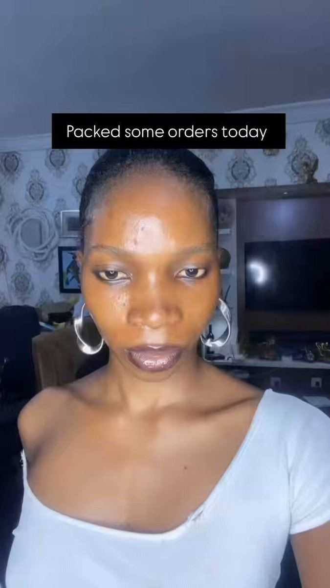

# 46 · Unboxing / packing orders (ASMR)

<!-- HERO:START -->
[](EXAMPLE.md)

**[See the example and how to make it →](EXAMPLE.md)** · [watch on X](https://x.com/mannyvivianne/status/2101756682359480565)
<!-- HERO:END -->


> **LC priority P2** · evidence: Medium · hype risk: Low · cost $0 · 30 min

## What it is
"Pack an order with me" (founder/team ASMR) or customer unboxing of the LC box — tactile, satisfying, shows packaging and gift readiness.

## Why it works
- ASMR + packaging = gift signal.
- Cheap volume content; a "new style" lever for stuck accounts.

## Shot-by-shot (LC version)

| Time / slot | Visual | Audio / copy |
|---|---|---|
| 0-2s | Top-down box | "Packing a 7-piece stack for Dana in Ohio" |
| 2-20s | Each piece placed | ASMR |
| 20-25s | Box closed + note | "any 7 for $85" |

## Hooks (swap-in openers)
- "Pack a 7-piece order with me"
- "Unboxing the gift I asked for"

## Real examples from X (studied)
- @Ecombos_Ai — unboxing among 10 AI UGC styles ([post](https://x.com/Ecombos_Ai/status/2103180929057407425)).
- @nicktheriot_ — new style (unboxing/reaction) for stuck accounts ([post](https://x.com/nicktheriot_/status/2096219973139992840)).

## Production recipe
1. Top-down tripod; good mic; no customer PII on labels.

## Bot prompt (copy into the creative agent)
```
Write 10 pack-with-me captions and hooks using real order types {{ORDERS}} (no customer full names).
```

## 3 LC scripts
- A · Pack 7-piece stack.
- B · Bridesmaid order.
- C · Customer unboxing (UGC).

## Variants to test
- Founder vs customer

## Omni test plan
- **Budget/structure:** Organic; $20/day test
- **Primary KPIs:** Saves, CPA; Omni (F46-*)
- **Kill rule:** C-tier for paid → organic
- **Scale rule:** Daily organic
- **Naming:** `utm_content=F46-<concept>-<variant>`; weekly Omni roll-up of new-customer revenue by format.

## Compliance
Baseline: [_COMPLIANCE.md](../_COMPLIANCE.md) (no fake testimonials, AI disclosure, no bulk/spoofed accounts, copy structure not assets, PDP-only claims).
- Blur names/addresses.

## Related
- Strategies: 27-satisfying-product-loop-recordings, 31-founder-daily-posting-product-as-ad
- Formats: [45-day-in-the-life-behind-the-scenes](../45-day-in-the-life-behind-the-scenes/README.md), [47-grwm-stack-with-me](../47-grwm-stack-with-me/README.md)

<!-- EVIDENCE:START -->
## Evidence from X discovery (auto-generated)

| Date | Author | Post | Engagement | Grade | Gist |
|---|---|---|---|---|---|
| 2026-10-08 | [@nicktheriot_](https://x.com/nicktheriot_) | [link](https://x.com/nicktheriot_/status/2108173638033871013) | 219L/348BM/12kV | VALUE | 2026 FB creative styles tier list: S = long primary text + organic image, LTO, UGC, VSL, reaction, news; A = demo, us vs them, testimonial, close-up, founder story, podcast, BTS, authority, x reasons; C = unboxing, DITL. |
| 2026-09-05 | [@nicktheriot_](https://x.com/nicktheriot_) | [link](https://x.com/nicktheriot_/status/2096219973139992840) | 45L/55BM/4kV | VALUE | Stuck-account order: new avatar → new style (AI UGC, animation, unboxing, reaction, native) → curiosity text hook → uncommon location → combos. |
| 2026-07-31 | [@raph_guilhem](https://x.com/raph_guilhem) | [link](https://x.com/raph_guilhem/status/2083288607062732816) | 55L/105BM/7kV | SOME | 30-format tree: hooks, founder (walking/car monologue, whiteboard), social proof (customer call, DM I get every day), news report. |
| 2026-09-24 | [@Ecombos_Ai](https://x.com/Ecombos_Ai) | [link](https://x.com/Ecombos_Ai/status/2103180929057407425) | 28L/26BM/2kV | SOME | 10 AI UGC styles: talking-head testimonial, product-in-hand, first-try reaction, fake podcast, street interview, comment reply, unboxing, DITL/GRWM, before/after, whiteboard. |
| 2026-08-18 | [@rirahcreates](https://x.com/rirahcreates) | [link](https://x.com/rirahcreates/status/2089827933561016787) | 12L/17BM/1kV | SOME | 20 UGC types: talking head, review, unboxing, testimonial, demo, problem/solution, before/after, GRWM, DITL, voiceover, routine, how-to, FAQ, 3 reasons why, POV. |
<!-- EVIDENCE:END -->
