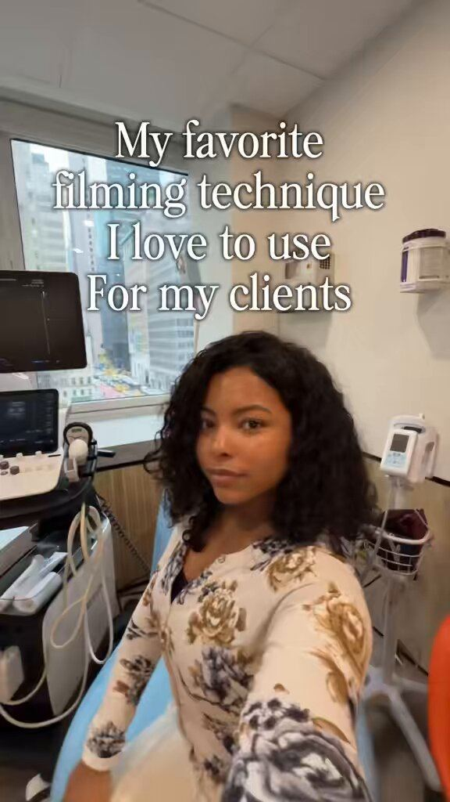

# 47 · GRWM / "stack with me"

<!-- HERO:START -->
[](EXAMPLE.md)

**[See the example and how to make it →](EXAMPLE.md)** · [watch on X](https://x.com/ugcAshleyRJ/status/2067636022251290725)
<!-- HERO:END -->


> **LC priority P1** · evidence: Medium · hype risk: Low · cost $0-150 (creator) · 30-60 min

## What it is
Creator gets ready (outfit → makeup → jewelry) or builds a stack piece by piece while talking; the jewelry is the payoff of the routine.

## Why it works
- GRWM is a default watch habit; jewelry as the "finishing touch" is natural.
- "Stack with me" demonstrates the bundle offer visually.

## Shot-by-shot (LC version)

| Time / slot | Visual | Audio / copy |
|---|---|---|
| 0-2s | Mirror, bare neck | "GRWM for a wedding — jewelry edition" |
| 2-15s | Layering 1→7 pieces | Chatty VO |
| 15-20s | Full look | "any 7 for $85" |

## Hooks (swap-in openers)
- "Building a 7-piece stack with me"
- "GRWM: jewelry I never take off"
- "Stack check"

## Real examples from X (studied)
- @rirahcreates — GRWM among 20 UGC types ([post](https://x.com/rirahcreates/status/2089827933561016787)).
- @Ecombos_Ai — DITL/GRWM AI UGC style ([post](https://x.com/Ecombos_Ai/status/2103180929057407425)).
- @0xJeyx — same product in every format (GRWM, DITL, quiz) ([post](https://x.com/0xJeyx/status/2063387846803673406)).
- @ugcAshleyRJ — 0.5x POV GRWM ([post](https://x.com/ugcAshleyRJ/status/2067636022251290725)).

## Production recipe
1. Creator briefs for swarm (F43).
2. Shoot mirror + close-ups.

## Bot prompt (copy into the creative agent)
```
Write 6 GRWM/stack-with-me scripts (25s) for occasions {{OCCASIONS}}; each builds a 7-piece stack from {{SKUS}}.
```

## 3 LC scripts
- A · Wedding guest stack.
- B · Office stack.
- C · Beach stack.

## Variants to test
- Occasion
- Creator age 25-35 vs 40-55

## Omni test plan
- **Budget/structure:** Creator content; $30/day per winner
- **Primary KPIs:** Saves, CPA; Omni (F47-*)
- **Kill rule:** CPA >2×
- **Scale rule:** Swarm brief
- **Naming:** `utm_content=F47-<concept>-<variant>`; weekly Omni roll-up of new-customer revenue by format.

## Compliance
Baseline: [_COMPLIANCE.md](../_COMPLIANCE.md) (no fake testimonials, AI disclosure, no bulk/spoofed accounts, copy structure not assets, PDP-only claims).
- Creator disclosure.

## Related
- Strategies: 28-ugc-creator-network-per-video-pay, 10-skit-and-problem-first-ugc-hooks
- Formats: [43-hudson-method-creator-swarm](../43-hudson-method-creator-swarm/README.md), [45-day-in-the-life-behind-the-scenes](../45-day-in-the-life-behind-the-scenes/README.md), [20-ai-model-lookbook-on-body](../20-ai-model-lookbook-on-body/README.md)

<!-- EVIDENCE:START -->
## Wave 3 update: brands & apps crushing it (Oct 2026)
- AI twins GRWM: two identical AI girls getting ready in sync in one closet (pink vs cream dress, jewelry, bags), page reportedly $11.4K/mo ([@wayne_forge](https://x.com/wayne_forge/status/2087161700298473607)); AI try-on haul influencer, 5.8M views on one video ([@Atlas8a](https://x.com/Atlas8a/status/2080302219199385799)). LC: twin-stack GRWM (same outfit, plated vs LC after a swim), real footage first.

## Wave 3 update: Meta ad-library long-runners (Fedotoff gut-health board)
- Smriti Kochar: Nutritionist 3-product stack explainer (Hinglish), 301 days live. An expert-recommended routine sells a bundle, not a single SKU; mixing local language keeps it native for the market.
- Stills, transcripts and LC remakes: [adlibrary/](adlibrary/README.md).

## Evidence from X discovery (auto-generated)

| Date | Author | Post | Engagement | Grade | Gist |
|---|---|---|---|---|---|
| 2026-09-24 | [@Ecombos_Ai](https://x.com/Ecombos_Ai) | [link](https://x.com/Ecombos_Ai/status/2103180929057407425) | 28L/26BM/2kV | SOME | 10 AI UGC styles: talking-head testimonial, product-in-hand, first-try reaction, fake podcast, street interview, comment reply, unboxing, DITL/GRWM, before/after, whiteboard. |
| 2026-06-06 | [@0xJeyx](https://x.com/0xJeyx) | [link](https://x.com/0xJeyx/status/2063387846803673406) | 15L/3BM/1kV | SOME | Generate the same product as every format at once (street quiz, review, GRWM, DITL) and let the feed pick — example: "$50 street quiz" video. |
| 2026-06-18 | [@ugcAshleyRJ](https://x.com/ugcAshleyRJ) | [link](https://x.com/ugcAshleyRJ/status/2067636022251290725) | 13L/5BM/1kV | SOME | The 0.5x ultra-wide POV filming technique for demos, GRWM and day-in-the-life — immersive, native. |
| 2026-08-18 | [@rirahcreates](https://x.com/rirahcreates) | [link](https://x.com/rirahcreates/status/2089827933561016787) | 12L/17BM/1kV | SOME | 20 UGC types: talking head, review, unboxing, testimonial, demo, problem/solution, before/after, GRWM, DITL, voiceover, routine, how-to, FAQ, 3 reasons why, POV. |
<!-- EVIDENCE:END -->
