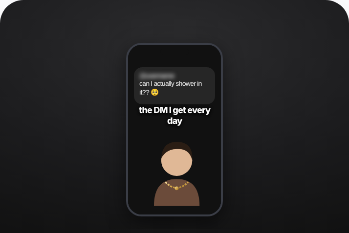

# 48 · 'The DM / question I get every day' answer video: see it, then make it



> **No clean public example yet.** This is an illustrative mock of the format, not a real ad. The closest real posts are in [examples/](examples/README.md); swap a real one in here when you find it.

## How to make one like it

**The format in one line:** Founder/creator shows a real DM or recurring question (blurred sender) and answers it on camera — objection handling disguised as content.

**Why it works:** - Answers the #1 objection natively. - Feels like a reply, not an ad.

**Contents:** [1. Structure](#1-copy-the-structure) · [2. Shot by shot](#2-shot-by-shot-remake) · [3. Script and hooks](#3-write-the-script) · [4. Prompts](#4-prompts) · [5. Tools and settings](#5-tools-and-settings) · [6. Louise Carter remake](#6-louise-carter-remake) · [7. Variants and test](#7-variants-and-test-plan) · [8. Pitfalls](#8-pitfalls)

### 1. Copy the structure

The skeleton every version follows: **hook → problem or tension → turn (the product shows up) → proof → one clear ask.** The shot-by-shot below fills it in.

### 2. Shot-by-shot remake

**Target length / size:** 20-45s, 1080x1920

| # | Time / slot | What we see (visual + camera) | Dialogue / on-screen text |
|---|---|---|---|
| 1 | 0-2s | Screenshot of a real DM or comment, big | "Does it REALLY not tarnish in the shower??" |
| 2 | 2-30s | Founder or creator answers to camera with proof B-roll | Honest answer with limits |
| 3 | End | Product | Offer |

<details><summary>Playbook shot list (Louise Carter version from the README)</summary>

| Time / slot | Visual | Audio / copy |
|---|---|---|
| 0-2s | DM screenshot (blurred) | "I get this DM every day" |
| 2-15s | Qirra answers with demo | Shower demo |
| 15-20s | CTA | — |

</details>

### 3. Write the script

Open with one of these hooks (first 1–3 seconds, or the headline on a static):

- "The DM I get every single day"
- "No, it won't turn green — here's why"

Then fill the beats from the table above. Pull the wording from real customer reviews, not from ad copy: a review line beats a copywriter line almost every time. Read every line out loud and cut anything you would not say to a friend. Ready-made Louise Carter scripts are in section 6; hand [BOT.md](BOT.md) to any AI agent to write versions for another brand.

### 4. Prompts

**Collect**

```text
Export real DMs/comments (with permission or anonymised), pick the 10 most repeated questions, one video per question.
```

**Full creative-agent prompt (from the playbook):**

```
From {{INBOX_EXPORT}}, rank the 10 most frequent pre-purchase questions and write a 15s answer script for each using PDP wording.
```

### 5. Tools and settings

1. Pull top 10 questions from inbox/comments; real DMs only, blur sender.

| Setting | Value |
|---|---|
| Canvas | 1080×1920 (9:16) master; crop a 1080×1350 (4:5) cut for feed placements |
| Frame rate | 30 fps (shoot 60 fps for slow-motion water or sparkle shots) |
| Camera | Phone main lens at 1x, exposure locked on skin, HDR off, grid on; tripod or a phone clamp for product shots |
| Light | One soft key at 45° (window or ring light), white card as fill; side light for metal sparkle |
| Audio | Lavalier or phone 15–20 cm from the mouth; mix voice at -14 LUFS, music at -28 to -30 dB under voice |
| Captions | Burned in, 2–5 words per line, 64–80 px bold sans, white with a black stroke or pill; keep text inside the safe zone (top 220 px and bottom 420 px clear, 64 px side margins) |
| Pacing | A visual change every 1.5–3 s; the hook lands in the first 1.5 s with no logo intro |
| Edit / export | CapCut or Premiere; H.264, 12–20 Mbps, AAC 320 kbps; upload natively to each platform, not via links |

### 6. Louise Carter remake

- A · "Can I shower in it?"
- B · "Is it real gold?" (14K PVD explained)
- C · "Will it fit my neck?"

Brand rules, claims you can and cannot make, and more scripts: [brands/louise-carter.md](brands/louise-carter.md). Step-by-step from idea to scale: [STAGES.md](STAGES.md).

### 7. Variants and test plan

- Founder vs CS rep

**Test plan:** - **Budget/structure:** $20/day each top 3 - **Primary KPIs:** CVR, CPA; Omni (F48-*) - **Kill rule:** CPA >2× - **Scale rule:** One per FAQ - **Naming:** `utm_content=F48-<concept>-<variant>`; weekly Omni roll-up of new-customer revenue by format.

**Naming:** `F48-<variant>-<hook##>-<date>` so results map back to this folder. Change one thing per test (hook, narrator, length or offer), never two.

### 8. Pitfalls

- Use real questions only; blur the sender.
- No clean public example was found; the visual is a mock.
- Slow open: if the first 1.5 s does not show the hook visually, most people swipe.
- Logo or brand intro at the start reads as an ad; put the brand at the end.
- Captions covered by the platform UI: check the safe zone on a real phone before posting.
- Music over the voice: keep music at least 14 dB under speech.

**Compliance:** Baseline: [_COMPLIANCE.md](../_COMPLIANCE.md) (no fake testimonials, AI disclosure, no bulk/spoofed accounts, copy structure not assets, PDP-only claims). - Real DMs only, sender blurred/consent.

## More examples

Every post we found for this format, with transcripts: [examples/](examples/README.md). Playbook: [README.md](README.md). Agent brief: [BOT.md](BOT.md).
