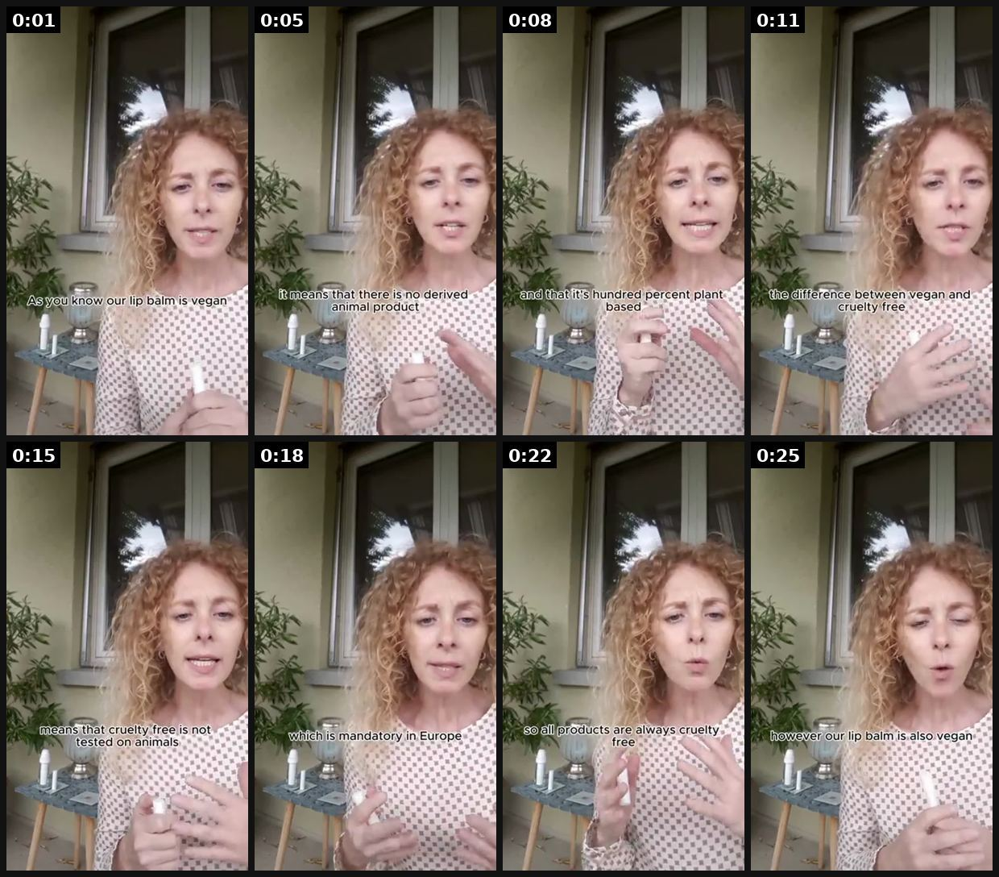
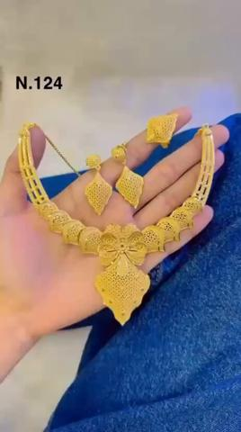
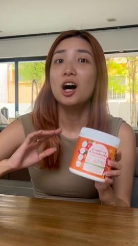
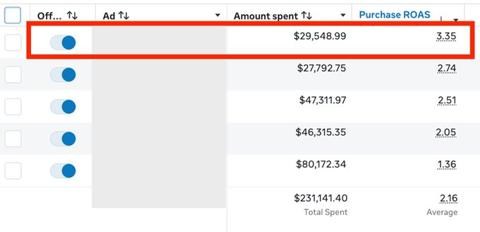

# 48 · 'The DM / question I get every day' answer video: see it, then make it

[](https://x.com/MaGeAuNaturel/status/1775569173747228909)

**The example:** [@MaGeAuNaturel on X](https://x.com/MaGeAuNaturel/status/1775569173747228909) · 0:27 video · 0 likes, 25 views

**Watch it:** [open the post on X](https://x.com/MaGeAuNaturel/status/1775569173747228909) · [play the video file](https://video.twimg.com/ext_tw_video/1775569137927872512/pu/vid/avc1/320x568/QMkb4hiIpljOFFKc.mp4?tag=12)

> This is a common question I get asked! Tune in for an in-depth explanation 🙌 LINK IN BIO | 100% natural, vegan, refillable & reusable skincare is all you need for happy, healthy skin 💛 #mageaunaturel #natural #vegan #frenchcosmetics #madeineurope #glowrecipe #skincare

## What you are seeing

A skincare founder films herself on a balcony, phone held at arm's length, answering a question she says she gets asked all the time. About 27 seconds, one take, natural light, a product held up to camera partway through. The post copy says "This is a common question I get asked!" and sends people to the link in bio.

## Beat by beat

The storyboard above samples the video every 0:03. Lines are the transcript for that stretch; on-screen text comes from OCR, so treat it as rough.

| Frame | Time | On screen | Said / sung |
|---|---|---|---|
| 1 | 0:00–0:03 | ue aw I ly a know. our lip is vegan ee | As you know, a lead bone is vegan, but that what does that really mean? |
| 2 | 0:03–0:06 | VA oY fi, a fs there is no derived animal product ft a SS aS Ps aa a | · |
| 3 | 0:06–0:10 | mi ty Se Ki ee ty ae percent pla based a2 aa. aa a a. a a fe | It means that there is no derived animal products and that it's 100 percent base. |
| 4 | 0:10–0:13 | a ae a LAS difference between vegan and cruelty free as as sf Ee sa Lm | · |
| 5 | 0:13–0:17 | 2. ma means that cruelty free is not tested on animals Jai sai a ee. | The difference between vegan cruelty free is not tested on animal, which is |
| 6 | 0:17–0:20 | 7, I. a mandatory in. Europe as fe ow a a ha ns | · |
| 7 | 0:20–0:23 | aa we? a VW te a aS cad ay ty my are always cruelty ISO al pot if cS a, Fr a ae Ae a5 os 5! a. al ww wu | men that are in Europe. So all products are always cruelty free. |
| 8 | 0:23–0:27 | a fi a, af a al howe. Nero lip is also. vegan a | However, a lead bone is also vegan. |

<details><summary>Full transcript (timestamped)</summary>

- `0:00` As you know, a lead bone is vegan, but that what does that really mean?
- `0:04` It means that there is no derived animal products and that it's 100 percent base.
- `0:10` The difference between vegan cruelty free is not tested on animal, which is
- `0:18` men that are in Europe. So all products are always cruelty free.
- `0:23` However, a lead bone is also vegan.

</details>

## More real examples (3)

Other posts that show this format, or a close cousin of it. Click a thumbnail to open it on X.

| | | |
|---|---|---|
| [](https://x.com/Aeeshatuuuu/status/2100222367909724510)<br>**@Aeeshatuuuu** · 0:07 video · 340 views<br>DAY 13 One question I get asked frequently is, Do you deliver outside Kaduna? And the answer is YES,we deliver nationwide across Nigeria,and guess wha | [](https://x.com/nikitaavermaa/status/2005526119584551309)<br>**@nikitaavermaa** · 1:12 video · 78 views<br>Address the most asked question head on - this is why going through comment sections and customer queries are so important! Great for weight loss/skin | [](https://x.com/antonioventre_/status/2091592059517837677)<br>**@antonioventre_** · image · 995 views<br>Customer-SERVICE call ad: record a real pre-purchase support call answering the 5-6 questions buyers actually ask. |

## How to make one like it

**The format in one line:** Founder/creator shows a real DM or recurring question (blurred sender) and answers it on camera — objection handling disguised as content.

**Why it works:** - Answers the #1 objection natively. - Feels like a reply, not an ad.

**Contents:** [1. Structure](#1-copy-the-structure) · [2. Shot by shot](#2-shot-by-shot-remake) · [3. Script and hooks](#3-write-the-script) · [4. Prompts](#4-prompts) · [5. Tools and settings](#5-tools-and-settings) · [6. Louise Carter remake](#6-louise-carter-remake) · [7. Variants and test](#7-variants-and-test-plan) · [8. Pitfalls](#8-pitfalls)

### 1. Copy the structure

Use the example's timing as your beat sheet. Keep the beat, change the words and the product.

| Beat | Time | In the example | Your version |
|---|---|---|---|
| 1 | 0:01 | As you know, a lead bone is vegan, but that what does that really mean? | … |
| 2 | 0:05 | As you know, a lead bone is vegan, but that what does that really mean? It means that there is no derived animal products and that it's 100 | … |
| 3 | 0:08 | It means that there is no derived animal products and that it's 100 percent base. | … |
| 4 | 0:11 | The difference between vegan cruelty free is not tested on animal, which is | … |
| 5 | 0:15 | The difference between vegan cruelty free is not tested on animal, which is | … |
| 6 | 0:18 | men that are in Europe. So all products are always cruelty free. | … |
| 7 | 0:22 | men that are in Europe. So all products are always cruelty free. | … |
| 8 | 0:25 | However, a lead bone is also vegan. | … |

### 2. Shot-by-shot remake

**Target length / size:** 20-45s, 1080x1920 (reply-to-comment overlay)

| # | Time / slot | What we see (visual + camera) | Dialogue / on-screen text |
|---|---|---|---|
| 1 | 0-2s | TikTok reply sticker with the real question | "Can you really shower in it??" |
| 2 | 2-6s | Founder or stylist to camera | "I get this DM every single day, so here's the answer." |
| 3 | 6-20s | Demo: wears it under the shower, then wipes dry | "14K PVD over stainless steel. It's bonded, so there's nothing to wash off." |
| 4 | 20-30s | Shows a 9-month-old piece next to a new one | "This one is 9 months old." |
| 5 | End | Offer | "Any 7 for $85." |

<details><summary>Playbook shot list (Louise Carter version from the README)</summary>

| Time / slot | Visual | Audio / copy |
|---|---|---|
| 0-2s | DM screenshot (blurred) | "I get this DM every day" |
| 2-15s | Qirra answers with demo | Shower demo |
| 15-20s | CTA | — |

</details>

### 3. Write the script

Open with one of these hooks (first 1–3 seconds, or the headline on a static):

- "The DM I get every single day"
- "No, it won't turn green — here's why"

Then fill the beats from the table above. Pull the wording from real customer reviews, not from ad copy: a review line beats a copywriter line almost every time. Read every line out loud and cut anything you would not say to a friend. Ready-made Louise Carter scripts are in section 6; hand [BOT.md](BOT.md) to any AI agent to write versions for another brand.

### 4. Prompts

**Question mining**

```text
Export the last 200 DMs and comments; group by question; rank by frequency; film the top 5.
```

**Shoot**

```text
Front camera, one take, natural light; reply sticker added in-app.
```

**Full creative-agent prompt (from the playbook):**

```
From {{INBOX_EXPORT}}, rank the 10 most frequent pre-purchase questions and write a 15s answer script for each using PDP wording.
```

### 5. Tools and settings

1. Pull top 10 questions from inbox/comments; real DMs only, blur sender.

| Setting | Value |
|---|---|
| Canvas | 1080×1920 (9:16) master; crop a 1080×1350 (4:5) cut for feed placements |
| Frame rate | 30 fps (shoot 60 fps for slow-motion water or sparkle shots) |
| Camera | Phone main lens at 1x, exposure locked on skin, HDR off, grid on; tripod or a phone clamp for product shots |
| Light | One soft key at 45° (window or ring light), white card as fill; side light for metal sparkle |
| Audio | Lavalier or phone 15–20 cm from the mouth; mix voice at -14 LUFS, music at -28 to -30 dB under voice |
| Captions | Burned in, 2–5 words per line, 64–80 px bold sans, white with a black stroke or pill; keep text inside the safe zone (top 220 px and bottom 420 px clear, 64 px side margins) |
| Pacing | A visual change every 1.5–3 s; the hook lands in the first 1.5 s with no logo intro |
| Edit / export | CapCut or Premiere; H.264, 12–20 Mbps, AAC 320 kbps; upload natively to each platform, not via links |

### 6. Louise Carter remake

- A · "Can I shower in it?"
- B · "Is it real gold?" (14K PVD explained)
- C · "Will it fit my neck?"

Brand rules, claims you can and cannot make, and more scripts: [brands/louise-carter.md](brands/louise-carter.md). Step-by-step from idea to scale: [STAGES.md](STAGES.md).

### 7. Variants and test plan

- Founder vs CS rep

**Test plan:** - **Budget/structure:** $20/day each top 3 - **Primary KPIs:** CVR, CPA; Omni (F48-*) - **Kill rule:** CPA >2× - **Scale rule:** One per FAQ - **Naming:** `utm_content=F48-<concept>-<variant>`; weekly Omni roll-up of new-customer revenue by format.

**Naming:** `F48-<variant>-<hook##>-<date>` so results map back to this folder. Change one thing per test (hook, narrator, length or offer), never two.

### 8. Pitfalls

- Use real questions (screenshot them).
- Answer the question in the first 10 seconds.
- Don't over-claim in the answer.
- Slow open: if the first 1.5 s does not show the hook visually, most people swipe.
- Logo or brand intro at the start reads as an ad; put the brand at the end.
- Captions covered by the platform UI: check the safe zone on a real phone before posting.
- Music over the voice: keep music at least 14 dB under speech.

**Compliance:** Baseline: [_COMPLIANCE.md](../_COMPLIANCE.md) (no fake testimonials, AI disclosure, no bulk/spoofed accounts, copy structure not assets, PDP-only claims). - Real DMs only, sender blurred/consent.

## More examples

Every post we found for this format, with transcripts: [examples/](examples/README.md). Playbook: [README.md](README.md). Agent brief: [BOT.md](BOT.md).
