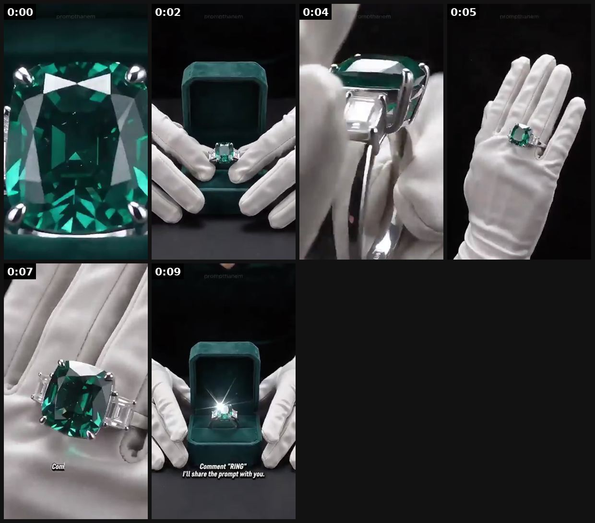
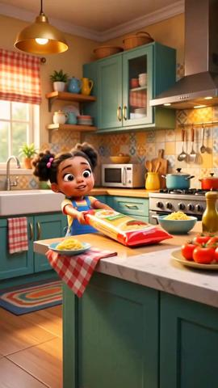
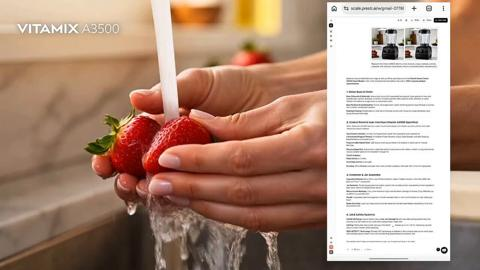
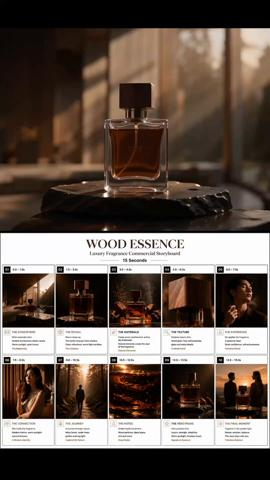
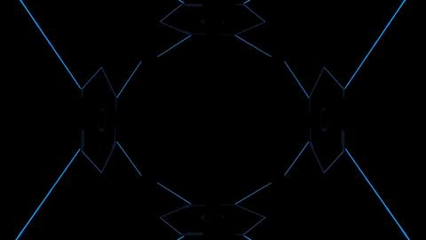

# 49 · Cinematic macro product film (15s, no dialogue): see it, then make it

[](https://x.com/prompthanem/status/2108225912957186085)

**The example:** [@prompthanem on X](https://x.com/prompthanem/status/2108225912957186085) · 0:10 video · 0 likes, 1 views

**Watch it:** [open the post on X](https://x.com/prompthanem/status/2108225912957186085) · [play the video file](https://video.twimg.com/amplify_video/2108187564263751681/vid/avc1/320x568/TOojYChMq4Kt-rs9.mp4?tag=14)

> this jewelry commercial was never filmed 👀💚💍 Velvet box → emerald macro → hand reveal → final product shot. Entirely created with AI from reference images. Want the prompt + references? Reply “RING”. 👇

## What you are seeing

An AI-generated cinematic jewelry commercial: a macro of an emerald, a velvet box opening, white-gloved hands lifting the ring, a hand reveal, and the box closing for the final shot. No people, just light, texture and slow camera moves.

## Beat by beat

The storyboard above samples the video every 0:01. Lines are the transcript for that stretch; on-screen text comes from OCR, so treat it as rough.

| Frame | Time | On screen | Said / sung |
|---|---|---|---|
| 1 | 0:00–0:01 | · | · |
| 2 | 0:01–0:03 | · | · |
| 3 | 0:03–0:05 | · | · |
| 4 | 0:05–0:06 | · | · |
| 5 | 0:06–0:08 | · | · |
| 6 | 0:08–0:10 | Comment RING I'll share the prompt with you. | · |

## More real examples (5)

Other posts that show this format, or a close cousin of it. Click a thumbnail to open it on X.

| | | |
|---|---|---|
| [](https://x.com/rirahcreates/status/2086324982892605618)<br>**@rirahcreates** · 0:10 video · 454 views<br>AI formats to watch: Pixar storytelling, claymation, timeline/notes videos, cinematic product ads, virtual influencers, 3D product animation, AI docum | [](https://x.com/Balentin_J/status/2080581505441480774)<br>**@Balentin_J** · 0:15 video · 3K views<br>&gt; What if a familiar kitchen moment could become a product story? 🥤 I explored that idea by reimagining the Vitamix A3500 as the centerpiece of a f | [](https://x.com/alohaproxy/status/2104226192085987378)<br>**@alohaproxy** · 1:04 video · 781 views<br>Every founder wants to see their product here👑 Ankon AI is currently at HOF on HopUp. I thought that deserved more than a leaderboard card......So I t |
| [](https://x.com/gptproto/status/2077709443165507626)<br>**@gptproto** · 0:15 video · 526 views<br>Can AI create luxury brand advertisements? This fragrance commercial was created with AI. Workflow: 🖼️ GPT Image 2 → storyboard &amp; visual concept 🎬 | [](https://x.com/Imagvio_AI/status/2088473026098774492)<br>**@Imagvio_AI** · 0:21 video · 195 views<br>Your weekend challenge starts now. 🎬 We created this entire cinematic product ad with Imagvio AI — from the luxury store to the product reveal, ingred |   |

## How to make one like it

**The format in one line:** A 6-15s premium macro film: water droplets on 14K gold, slow-motion splash, light sweep — no dialogue, one text line, logo. YouTube/CTV and solution-aware audiences.

**Why it works:** - Premium perception; works sound-off. - YouTube solution-aware format per one operator; 6s bumper cut.

**Contents:** [1. Structure](#1-copy-the-structure) · [2. Shot by shot](#2-shot-by-shot-remake) · [3. Script and hooks](#3-write-the-script) · [4. Prompts](#4-prompts) · [5. Tools and settings](#5-tools-and-settings) · [6. Louise Carter remake](#6-louise-carter-remake) · [7. Variants and test](#7-variants-and-test-plan) · [8. Pitfalls](#8-pitfalls)

### 1. Copy the structure

Use the example's timing as your beat sheet. Keep the beat, change the words and the product.

| Beat | Time | In the example | Your version |
|---|---|---|---|
| 1 | 0:00 | (visual beat, see frame 1) | … |
| 2 | 0:02 | (visual beat, see frame 2) | … |
| 3 | 0:04 | (visual beat, see frame 3) | … |
| 4 | 0:05 | (visual beat, see frame 4) | … |
| 5 | 0:07 | (visual beat, see frame 5) | … |
| 6 | 0:09 | on screen: Comment RING I'll share the prompt with you. | … |

### 2. Shot-by-shot remake

**Target length / size:** 10-15s, no dialogue, 1080x1920 and 1080x1350

| # | Time / slot | What we see (visual + camera) | Dialogue / on-screen text |
|---|---|---|---|
| 1 | 0-3s | Extreme macro of the chain links, light sweeps across | No text, or brand only |
| 2 | 3-7s | Water droplets running off the pendant, slow motion | - |
| 3 | 7-11s | Piece on skin, hand movement | - |
| 4 | 11-15s | Hero shot on a dark surface, logo | "[Brand]. 14K PVD." |

<details><summary>Playbook shot list (Louise Carter version from the README)</summary>

| Time / slot | Visual | Audio / copy |
|---|---|---|
| 0-3s | Macro water drop on herringbone | Sound design |
| 3-8s | Necklace through splash, slow-mo | — |
| 8-12s | On skin in sunlight | Text: "Shower-proof 14K PVD" |
| 12-15s | Logo + any 7 for $85 | — |

</details>

### 3. Write the script

Open with one of these hooks (first 1–3 seconds, or the headline on a static):

- Visual hook only: water hitting gold
- "Built for water."

Then fill the beats from the table above. Pull the wording from real customer reviews, not from ad copy: a review line beats a copywriter line almost every time. Read every line out loud and cut anything you would not say to a friend. Ready-made Louise Carter scripts are in section 6; hand [BOT.md](BOT.md) to any AI agent to write versions for another brand.

### 4. Prompts

**Real shoot**

```text
100mm macro lens, 4K 60-120fps, black acrylic surface, one hard key light + a moving strip light, spray bottle for droplets.
```

**AI (Seedance / Veo)**

```text
luxury jewelry commercial, extreme macro of a thin gold chain, a soft light sweep across the links, water droplets, black background, slow motion, 5s
```

**Sound**

```text
Subtle whoosh + chime library sounds, no music or a minimal pulse.
```

**Full creative-agent prompt (from the playbook):**

```
Write a 15s shot list + AI video prompts for an LC macro film from these product photos {{IMAGES}}; preserve exact product design.
```

### 5. Tools and settings

1. Shoot macro with phone macro lens + water spray, or AI image-to-video from real product photos (don't alter product).
2. Cuts: 15s, 6s bumper, 9:16/16:9.

| Setting | Value |
|---|---|
| Canvas | 1080×1920 (9:16) master; crop a 1080×1350 (4:5) cut for feed placements |
| Frame rate | 30 fps (shoot 60 fps for slow-motion water or sparkle shots) |
| Camera | Phone main lens at 1x, exposure locked on skin, HDR off, grid on; tripod or a phone clamp for product shots |
| Light | One soft key at 45° (window or ring light), white card as fill; side light for metal sparkle |
| Audio | Lavalier or phone 15–20 cm from the mouth; mix voice at -14 LUFS, music at -28 to -30 dB under voice |
| Captions | Burned in, 2–5 words per line, 64–80 px bold sans, white with a black stroke or pill; keep text inside the safe zone (top 220 px and bottom 420 px clear, 64 px side margins) |
| Pacing | A visual change every 1.5–3 s; the hook lands in the first 1.5 s with no logo intro |
| Edit / export | CapCut or Premiere; H.264, 12–20 Mbps, AAC 320 kbps; upload natively to each platform, not via links |

### 6. Louise Carter remake

- A · "Built for water".
- B · "Gold that stays".
- C · Gift box reveal macro.

Brand rules, claims you can and cannot make, and more scripts: [brands/louise-carter.md](brands/louise-carter.md). Step-by-step from idea to scale: [STAGES.md](STAGES.md).

### 7. Variants and test plan

- Real vs AI
- 15s vs 6s

**Test plan:** - **Budget/structure:** YouTube $50/day 7 days - **Primary KPIs:** View rate, CPV, brand lift; Omni (F49-*) - **Kill rule:** CPV > account avg ×1.5 - **Scale rule:** CTV - **Naming:** `utm_content=F49-<concept>-<variant>`; weekly Omni roll-up of new-customer revenue by format.

**Naming:** `F49-<variant>-<hook##>-<date>` so results map back to this folder. Change one thing per test (hook, narrator, length or offer), never two.

### 8. Pitfalls

- AI jewelry often invents detail; only use AI for environments, keep the product real.
- Pure beauty shots work as retargeting, not as cold hooks; test with a text hook.
- Slow open: if the first 1.5 s does not show the hook visually, most people swipe.
- Logo or brand intro at the start reads as an ad; put the brand at the end.
- Captions covered by the platform UI: check the safe zone on a real phone before posting.
- Music over the voice: keep music at least 14 dB under speech.

**Compliance:** Baseline: [_COMPLIANCE.md](../_COMPLIANCE.md) (no fake testimonials, AI disclosure, no bulk/spoofed accounts, copy structure not assets, PDP-only claims). - AI must not misrepresent product; label where required.

## More examples

Every post we found for this format, with transcripts: [examples/](examples/README.md). Playbook: [README.md](README.md). Agent brief: [BOT.md](BOT.md).
