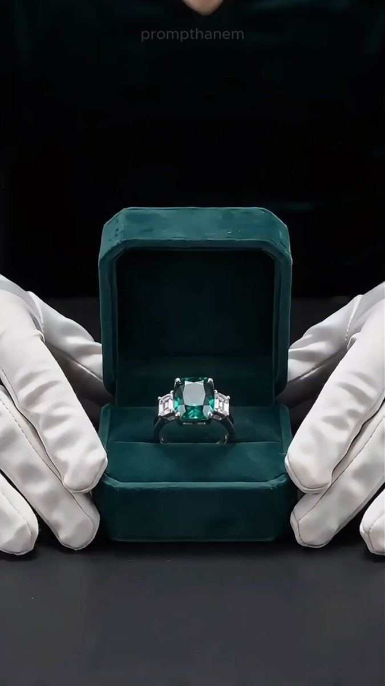

# 49 · Cinematic macro product film (15s, no dialogue)

<!-- HERO:START -->
[](EXAMPLE.md)

**[See the example and how to make it →](EXAMPLE.md)** · [watch on X](https://x.com/prompthanem/status/2108225912957186085)
<!-- HERO:END -->


> **LC priority P1** · evidence: Medium · hype risk: Med · cost $0-500 (AI or studio) · 2-6 h

## What it is
A 6-15s premium macro film: water droplets on 14K gold, slow-motion splash, light sweep — no dialogue, one text line, logo. YouTube/CTV and solution-aware audiences.

## Why it works
- Premium perception; works sound-off.
- YouTube solution-aware format per one operator; 6s bumper cut.

## Shot-by-shot (LC version)

| Time / slot | Visual | Audio / copy |
|---|---|---|
| 0-3s | Macro water drop on herringbone | Sound design |
| 3-8s | Necklace through splash, slow-mo | — |
| 8-12s | On skin in sunlight | Text: "Shower-proof 14K PVD" |
| 12-15s | Logo + any 7 for $85 | — |

## Hooks (swap-in openers)
- Visual hook only: water hitting gold
- "Built for water."

## Real examples from X (studied)
- @lifemaximised — top YouTube formats incl. 15s cinematic no-dialogue product film + 6s Shorts bumper ([post](https://x.com/lifemaximised/status/2094059955472990517)).
- @zackpaid — cinematic demo in 11 AI formats ([post](https://x.com/zackpaid/status/2085621175292670183)).
- @rirahcreates — cinematic product ads / 3D animation in AI formats ([post](https://x.com/rirahcreates/status/2086324982892605618)).
- @nicktheriot_ — close-up A-tier ([post](https://x.com/nicktheriot_/status/2108173638033871013)).

## Production recipe
1. Shoot macro with phone macro lens + water spray, or AI image-to-video from real product photos (don't alter product).
2. Cuts: 15s, 6s bumper, 9:16/16:9.

## Bot prompt (copy into the creative agent)
```
Write a 15s shot list + AI video prompts for an LC macro film from these product photos {{IMAGES}}; preserve exact product design.
```

## 3 LC scripts
- A · "Built for water".
- B · "Gold that stays".
- C · Gift box reveal macro.

## Variants to test
- Real vs AI
- 15s vs 6s

## Omni test plan
- **Budget/structure:** YouTube $50/day 7 days
- **Primary KPIs:** View rate, CPV, brand lift; Omni (F49-*)
- **Kill rule:** CPV > account avg ×1.5
- **Scale rule:** CTV
- **Naming:** `utm_content=F49-<concept>-<variant>`; weekly Omni roll-up of new-customer revenue by format.

## Compliance
Baseline: [_COMPLIANCE.md](../_COMPLIANCE.md) (no fake testimonials, AI disclosure, no bulk/spoofed accounts, copy structure not assets, PDP-only claims).
- AI must not misrepresent product; label where required.

## Related
- Strategies: 37-ai-realism-craft, 40-modular-variation-testing-review
- Formats: [30-voiceless-broll-text-overlay](../30-voiceless-broll-text-overlay/README.md), [05-ai-animation-format-swap](../05-ai-animation-format-swap/README.md)

<!-- EVIDENCE:START -->
## Wave 4 update: Fedotoff October 2026 swipe boards
- Solvaderm Skin Care: Clean product-on-podium static (Solvaderm, "Unlock your best skin yet"), 690 days live (Skincare & Anti-Aging Winners board). It shows a polished brand static can also run for years in skincare (a contrast to the ugly-ad board).
- Stills, how-to and LC remakes: [adlibrary/](adlibrary/README.md).

## Evidence from X discovery (auto-generated)

| Date | Author | Post | Engagement | Grade | Gist |
|---|---|---|---|---|---|
| 2026-10-08 | [@nicktheriot_](https://x.com/nicktheriot_) | [link](https://x.com/nicktheriot_/status/2108173638033871013) | 219L/348BM/12kV | VALUE | 2026 FB creative styles tier list: S = long primary text + organic image, LTO, UGC, VSL, reaction, news; A = demo, us vs them, testimonial, close-up, founder story, podcast, BTS, authority, x reasons; C = unboxing, DITL. |
| 2026-08-30 | [@lifemaximised](https://x.com/lifemaximised) | [link](https://x.com/lifemaximised/status/2094059955472990517) | 8L/5BM/1kV | VALUE | Top 4 YouTube ad formats by awareness: claymation 9-shot (unaware), hybrid AI UGC (problem-aware), 15s cinematic no-dialogue product film (solution-aware), 6s Shorts bumper (remarketing). Prompts included. |
| 2026-08-09 | [@rirahcreates](https://x.com/rirahcreates) | [link](https://x.com/rirahcreates/status/2086324982892605618) | 18L/7BM/0kV | SOME | AI formats to watch: Pixar storytelling, claymation, timeline/notes videos, cinematic product ads, virtual influencers, 3D product animation, AI documentary. |
| 2026-08-11 | [@lifemaximised](https://x.com/lifemaximised) | [link](https://x.com/lifemaximised/status/2087086851148660816) | 12L/9BM/1kV | SOME | Highest-ROAS YouTube ad anatomy: outcome text hook, 9-shot claymation villain arc, CTA last 3s, non-discount offer, custom-intent audiences, 6s Shorts bumper. |
| 2026-08-07 | [@zackpaid](https://x.com/zackpaid) | [link](https://x.com/zackpaid/status/2085621175292670183) | 9L/20BM/2kV | SOME | 11 AI formats (agency pitch): native UGC, founder, claymation, Pixar 3D, jingle, screen recording, before/after, testimonial compilation, cinematic demo, mini-doc, meme. |
<!-- EVIDENCE:END -->
