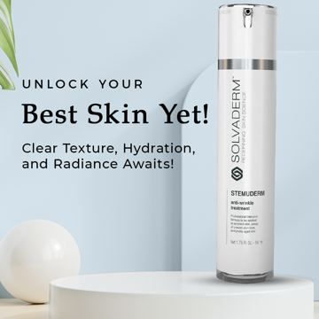

# Meta ad-library examples for F49

<!-- WAVE4 -->
## Wave 4: Alex Fedotoff's October 2026 swipe boards (GetHookd public previews)

Each ad below is from the free 10-ad preview of a public GetHookd board that [@FedotOff90](https://x.com/FedotOff90) shared on X. Days live are as of 2026-10-09; brand claims are the advertisers', not verified.

### Solvaderm Skin Care: Clean product-on-podium static (Solvaderm, "Unlock your best skin yet") (690 days live)

- **Board:** [Skincare & Anti-Aging Winners — Active Now (Oct 2026, US/EN)](https://x.com/FedotOff90/status/2107495487570137409) · dco
- **What happens:** A pastel 3D podium, a tall serum bottle, the headline "Unlock Your Best Skin Yet!" and a sub-line. DCO.
- **Why it lasts:** 690 days. It shows a polished brand static can also run for years in skincare (a contrast to the ugly-ad board).
- **How to make one:** A 3D-rendered podium scene, one bottle, a 5-word headline, 3 benefits.
- **LC remake:** LC: necklace on a podium, "Your forever necklace."

