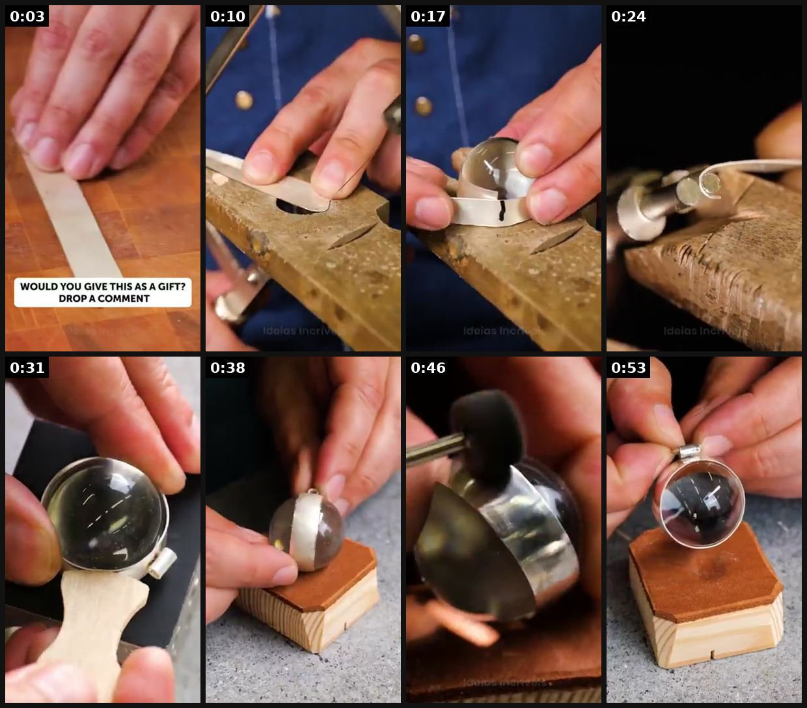
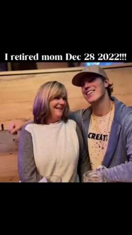
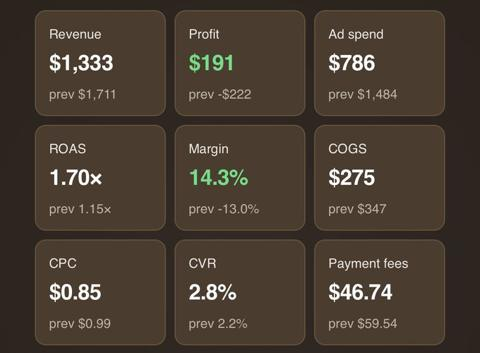
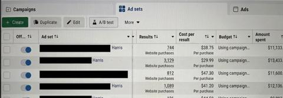

# 50 · Mini-documentary / founder mini-VSL ('how it's made', mission): see it, then make it

[](https://x.com/IND__Sweety/status/2103386592136376620)

**The example:** [@IND__Sweety on X](https://x.com/IND__Sweety/status/2103386592136376620) · 0:56 video · 2 likes, 4K views

**Watch it:** [open the post on X](https://x.com/IND__Sweety/status/2103386592136376620) · [play the video file](https://video.twimg.com/amplify_video/2103386548066725889/vid/avc1/320x568/faa9cRs_N-y8gGxL.mp4?tag=29)

> Jewelry or WIZARDRY? Wait Till You See How It’s Made

## What you are seeing

A how-it's-made clip: a jeweler's hands cutting a band, shaping a dome, setting a crystal and finishing the piece, shot in tight close-up. The opening caption asks "WOULD YOU GIVE THIS AS A GIFT? DROP A COMMENT".

## Beat by beat

The storyboard above samples the video every 0:07. Lines are the transcript for that stretch; on-screen text comes from OCR, so treat it as rough.

| Frame | Time | On screen | Said / sung |
|---|---|---|---|
| 1 | 0:00–0:07 | · | Oh |
| 2 | 0:07–0:14 | · | · |
| 3 | 0:14–0:21 | · | · |
| 4 | 0:21–0:28 | ee te HG, La er | · |
| 5 | 0:28–0:35 | · | · |
| 6 | 0:35–0:42 | fw ar a 72 er | · |
| 7 | 0:42–0:49 | · | · |
| 8 | 0:49–0:56 | · | · |

<details><summary>Full transcript (timestamped)</summary>

- `0:01` Oh

</details>

## More real examples (5)

Other posts that show this format, or a close cousin of it. Click a thumbnail to open it on X.

| | | |
|---|---|---|
| [](https://x.com/luisfelipebfr2/status/2101018997508669891)<br>**@luisfelipebfr2** · 3:55 video · 166 views<br>Eskiin founder mini-VSL breakdown: vision-board open loop → problem → failed solutions → mechanism → product → mission → retire mom. | [](https://x.com/rirahcreates/status/2086324982892605618)<br>**@rirahcreates** · 0:10 video · 454 views<br>AI formats to watch: Pixar storytelling, claymation, timeline/notes videos, cinematic product ads, virtual influencers, 3D product animation, AI docum | [](https://x.com/lorenzo_pravata/status/2079246318191403496)<br>**@lorenzo_pravata** · 1:58 video · 5K views<br>Resilia ~8,000 ads, "$10-15M/month" (unverified); mostly AI avatars/doctors/claymation; gap = real authority reshoots + long unaware VSL. |
| [](https://x.com/BobG_Ecom/status/2094146716417069510)<br>**@BobG_Ecom** · image · 201 views<br>0 to 100k/mo profit with ecom - Day 9 Back in the green, but slowing down as we are experiencing supply chain issues. I’ve been in the process making | [](https://x.com/Haariz23/status/2080054481853788591)<br>**@Haariz23** · image · 743 views<br>A Small Creative Strategy Update. Ecom Bros & Creative Strategists Listen up. A brand came to me with ads that weren't converting. Same creatives. Sam |   |

## How to make one like it

**The format in one line:** A 60-180s documentary-style piece: open loop, problem, failed solutions, mechanism (PVD bonding process), product, mission. Longer form for warm audiences and YouTube.

**Why it works:** - Mechanism education justifies price/claims. - Open-loop structure holds attention.

**Contents:** [1. Structure](#1-copy-the-structure) · [2. Shot by shot](#2-shot-by-shot-remake) · [3. Script and hooks](#3-write-the-script) · [4. Prompts](#4-prompts) · [5. Tools and settings](#5-tools-and-settings) · [6. Louise Carter remake](#6-louise-carter-remake) · [7. Variants and test](#7-variants-and-test-plan) · [8. Pitfalls](#8-pitfalls)

### 1. Copy the structure

Use the example's timing as your beat sheet. Keep the beat, change the words and the product.

| Beat | Time | In the example | Your version |
|---|---|---|---|
| 1 | 0:03 | Oh | … |
| 2 | 0:10 | (visual beat, see frame 2) | … |
| 3 | 0:17 | (visual beat, see frame 3) | … |
| 4 | 0:24 | on screen: ee te HG, La er | … |
| 5 | 0:31 | (visual beat, see frame 5) | … |
| 6 | 0:38 | on screen: fw ar a 72 er | … |
| 7 | 0:46 | (visual beat, see frame 7) | … |
| 8 | 0:53 | (visual beat, see frame 8) | … |

### 2. Shot-by-shot remake

**Target length / size:** 60-180s, 1080x1920 and 16:9

| # | Time / slot | What we see (visual + camera) | Dialogue / on-screen text |
|---|---|---|---|
| 1 | 0-10s | Founder voice over workshop B-roll | "I started Louise Carter because my mum's necklace turned her neck green on my wedding day." |
| 2 | 10-50s | How it's made: steel core, PVD chamber, polishing | Simple explanation of each step |
| 3 | 50-90s | Testing: sea, shower, sweat | "Every design spends a week in the sea before it goes on sale." |
| 4 | 90-120s | Customers wearing it, the mission | "Jewellery you never have to take off." |
| 5 | End | Offer | - |

<details><summary>Playbook shot list (Louise Carter version from the README)</summary>

| Time / slot | Visual | Audio / copy |
|---|---|---|
| 0-5s | Open loop | "I almost shut Louise Carter down in year one." |
| 5-40s | Problem: jewelry turning green | Story |
| 40-80s | Mechanism: PVD process footage | VO |
| 80-110s | Customers, mission | — |
| 110-120s | Offer | — |

</details>

### 3. Write the script

Open with one of these hooks (first 1–3 seconds, or the headline on a static):

- "How waterproof gold is actually made"
- "I almost shut this brand down"

Then fill the beats from the table above. Pull the wording from real customer reviews, not from ad copy: a review line beats a copywriter line almost every time. Read every line out loud and cut anything you would not say to a friend. Ready-made Louise Carter scripts are in section 6; hand [BOT.md](BOT.md) to any AI agent to write versions for another brand.

### 4. Prompts

**Shoot**

```text
Gimbal or handheld 4K 24fps, macro on materials, founder interview with a lav mic, two cameras if possible.
```

**Claude**

```text
Turn this founder interview transcript [paste] into a 2-minute mini-doc script: origin, how it's made, proof, mission.
```

**Full creative-agent prompt (from the playbook):**

```
Using {{FOUNDER_NOTES}} and {{PROCESS_FACTS}}, write a 120s mini-doc script in the Eskiin structure.
```

### 5. Tools and settings

1. Interview Qirra; supplier process footage (with permission).

| Setting | Value |
|---|---|
| Canvas | 1080×1920 (9:16) master; crop a 1080×1350 (4:5) cut for feed placements |
| Frame rate | 30 fps (shoot 60 fps for slow-motion water or sparkle shots) |
| Camera | Phone main lens at 1x, exposure locked on skin, HDR off, grid on; tripod or a phone clamp for product shots |
| Light | One soft key at 45° (window or ring light), white card as fill; side light for metal sparkle |
| Audio | Lavalier or phone 15–20 cm from the mouth; mix voice at -14 LUFS, music at -28 to -30 dB under voice |
| Captions | Burned in, 2–5 words per line, 64–80 px bold sans, white with a black stroke or pill; keep text inside the safe zone (top 220 px and bottom 420 px clear, 64 px side margins) |
| Pacing | A visual change every 1.5–3 s; the hook lands in the first 1.5 s with no logo intro |
| Edit / export | CapCut or Premiere; H.264, 12–20 Mbps, AAC 320 kbps; upload natively to each platform, not via links |

### 6. Louise Carter remake

- A · Origin story.
- B · How PVD is made.
- C · 300k customers mission.

Brand rules, claims you can and cannot make, and more scripts: [brands/louise-carter.md](brands/louise-carter.md). Step-by-step from idea to scale: [STAGES.md](STAGES.md).

### 7. Variants and test plan

- Length 60 vs 120s

**Test plan:** - **Budget/structure:** $40/day warm audiences - **Primary KPIs:** ThruPlay, CPA; Omni (F50-*) - **Kill rule:** CPA >2× - **Scale rule:** YouTube - **Naming:** `utm_content=F50-<concept>-<variant>`; weekly Omni roll-up of new-customer revenue by format.

**Naming:** `F50-<variant>-<hook##>-<date>` so results map back to this folder. Change one thing per test (hook, narrator, length or offer), never two.

### 8. Pitfalls

- Only show the real process and real suppliers (with permission).
- Keep the founder story true.
- Make a 30s cut for paid.
- Slow open: if the first 1.5 s does not show the hook visually, most people swipe.
- Logo or brand intro at the start reads as an ad; put the brand at the end.
- Captions covered by the platform UI: check the safe zone on a real phone before posting.
- Music over the voice: keep music at least 14 dB under speech.

**Compliance:** Baseline: [_COMPLIANCE.md](../_COMPLIANCE.md) (no fake testimonials, AI disclosure, no bulk/spoofed accounts, copy structure not assets, PDP-only claims). - Process claims must be accurate.

## Field notes

Newer observations live in the playbook: [Wave 2d update: provenance mini-docs (Serene Herbs) and long unaware VSLs](README.md)

## More examples

Every post we found for this format, with transcripts: [examples/](examples/README.md). Playbook: [README.md](README.md). Agent brief: [BOT.md](BOT.md).
