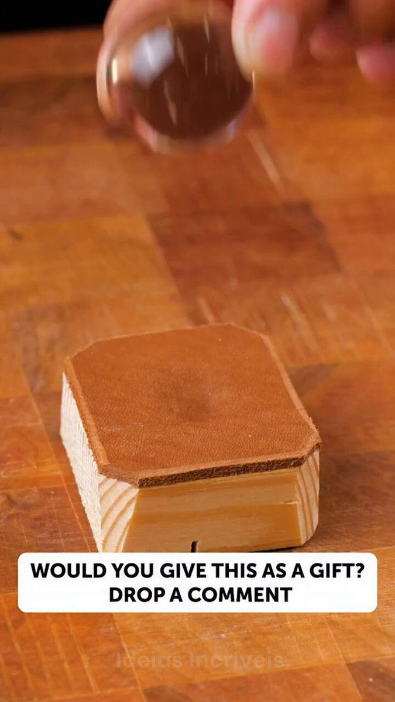

# 50 · Mini-documentary / founder mini-VSL ("how it's made", mission)

<!-- HERO:START -->
[](EXAMPLE.md)

**[See the example and how to make it →](EXAMPLE.md)** · [watch on X](https://x.com/IND__Sweety/status/2103386592136376620)
<!-- HERO:END -->


> **LC priority P2** · evidence: Medium (one teardown; contested) · hype risk: Med · cost $0-1,000 · 1-3 days

## What it is
A 60-180s documentary-style piece: open loop, problem, failed solutions, mechanism (PVD bonding process), product, mission. Longer form for warm audiences and YouTube.

## Why it works
- Mechanism education justifies price/claims.
- Open-loop structure holds attention.

## Shot-by-shot (LC version)

| Time / slot | Visual | Audio / copy |
|---|---|---|
| 0-5s | Open loop | "I almost shut Louise Carter down in year one." |
| 5-40s | Problem: jewelry turning green | Story |
| 40-80s | Mechanism: PVD process footage | VO |
| 80-110s | Customers, mission | — |
| 110-120s | Offer | — |

## Hooks (swap-in openers)
- "How waterproof gold is actually made"
- "I almost shut this brand down"

## Real examples from X (studied)
- @luisfelipebfr2 — Eskiin founder mini-VSL breakdown ([post](https://x.com/luisfelipebfr2/status/2101018997508669891)).
- @rirahcreates — AI documentary format ([post](https://x.com/rirahcreates/status/2086324982892605618)).
- @adamtaylorl — counter: founder-story VSLs "dead" ([post](https://x.com/adamtaylorl/status/2086814826177679660)).

## Production recipe
1. Interview Qirra; supplier process footage (with permission).

## Bot prompt (copy into the creative agent)
```
Using {{FOUNDER_NOTES}} and {{PROCESS_FACTS}}, write a 120s mini-doc script in the Eskiin structure.
```

## 3 LC scripts
- A · Origin story.
- B · How PVD is made.
- C · 300k customers mission.

## Variants to test
- Length 60 vs 120s

## Omni test plan
- **Budget/structure:** $40/day warm audiences
- **Primary KPIs:** ThruPlay, CPA; Omni (F50-*)
- **Kill rule:** CPA >2×
- **Scale rule:** YouTube
- **Naming:** `utm_content=F50-<concept>-<variant>`; weekly Omni roll-up of new-customer revenue by format.

## Compliance
Baseline: [_COMPLIANCE.md](../_COMPLIANCE.md) (no fake testimonials, AI disclosure, no bulk/spoofed accounts, copy structure not assets, PDP-only claims).
- Process claims must be accurate.

## Related
- Strategies: 31-founder-daily-posting-product-as-ad
- Formats: [27-founder-walk-and-talk-story-ad](../27-founder-walk-and-talk-story-ad/README.md), [49-cinematic-macro-product-film](../49-cinematic-macro-product-film/README.md)

## Wave 2d update: provenance mini-docs (Serene Herbs) and long unaware VSLs
- Serene Herbs AI "identity" ad: "Long before 'men's health' became an industry, Black Seed was already one of history's most respected botanicals. Found in the tomb of King Tutankhamun…" (3:27, #1 of 266 brand ads, live 47 days; [Atria](https://app.tryatria.com/ad/m1048529627980372)). LC: the history of PVD and why gold has always been about keeping it on.
- @lorenzo_pravata: Resilia's gap is long unaware ads. "Longer scripts and VSL structures, the kind Miami MD runs at 9-10 minutes, unlock the people everyone else gave up on."

<!-- EVIDENCE:START -->
## Evidence from X discovery (auto-generated)

| Date | Author | Post | Engagement | Grade | Gist |
|---|---|---|---|---|---|
| 2026-09-18 | [@luisfelipebfr2](https://x.com/luisfelipebfr2) | [link](https://x.com/luisfelipebfr2/status/2101018997508669891) | 0L/0BM/0kV | VALUE | Eskiin founder mini-VSL breakdown: vision-board open loop → problem → failed solutions → mechanism → product → mission → retire mom. |
| 2026-07-20 | [@lorenzo_pravata](https://x.com/lorenzo_pravata) | [link](https://x.com/lorenzo_pravata/status/2079246318191403496) | 56L/78BM/5kV | SOME | Resilia ~8,000 ads, "$10-15M/month" (unverified); mostly AI avatars/doctors/claymation; gap = real authority reshoots + long unaware VSL. |
| 2026-08-09 | [@rirahcreates](https://x.com/rirahcreates) | [link](https://x.com/rirahcreates/status/2086324982892605618) | 18L/7BM/0kV | SOME | AI formats to watch: Pixar storytelling, claymation, timeline/notes videos, cinematic product ads, virtual influencers, 3D product animation, AI documentary. |
| 2026-08-07 | [@zackpaid](https://x.com/zackpaid) | [link](https://x.com/zackpaid/status/2085621175292670183) | 9L/20BM/2kV | SOME | 11 AI formats (agency pitch): native UGC, founder, claymation, Pixar 3D, jingle, screen recording, before/after, testimonial compilation, cinematic demo, mini-doc, meme. |
<!-- EVIDENCE:END -->
