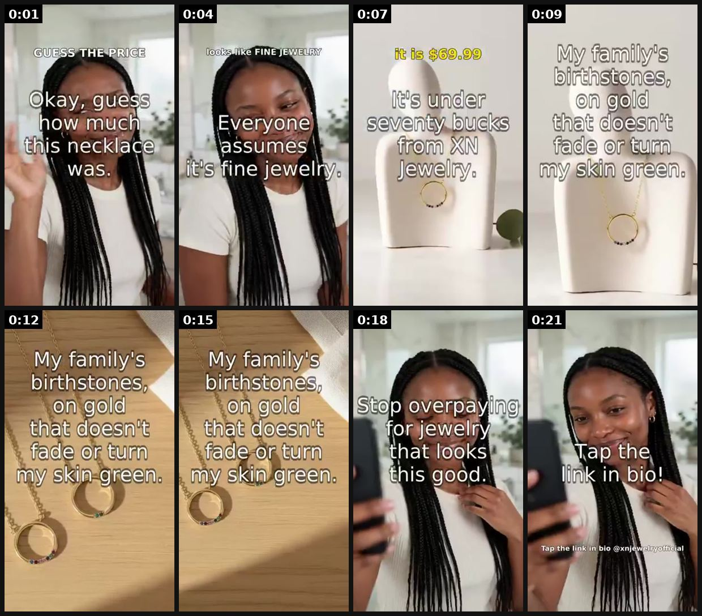
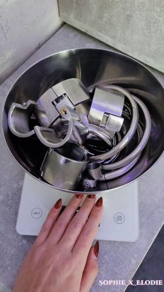

# 51 · Quiz / guess-the-price / street quiz game: see it, then make it

[](https://x.com/LewisSylvi3994/status/2105450856086917518)

**The example:** [@LewisSylvi3994 on X](https://x.com/LewisSylvi3994/status/2105450856086917518) · 0:22 video · 0 likes, 5 views

**Watch it:** [open the post on X](https://x.com/LewisSylvi3994/status/2105450856086917518) · [play the video file](https://video.twimg.com/amplify_video/2105450802303180800/vid/avc1/320x568/y00l3gBptmmBWkIM.mp4?tag=29)

> Guess the price 👀 Looks like fine jewelry… it's under $70 from XN Jewelry. Family birthstones on gold that doesn't fade. Stop overpaying 💛 https://xnjewelry.com/products/custom-birthstone-circle-necklace-1-8-stones-family-jewelry-gift-for-her-xn-jewelry

## What you are seeing

A guess-the-price game: a creator asks you to guess how much a necklace cost ("Everyone assumes it's fine jewelry"), shows the pieces close up, reveals "It's under $70 from XN Jewelry", then "Stop overpaying" and "Tap the link in bio!".

## Beat by beat

The storyboard above samples the video every 0:02. Lines are the transcript for that stretch; on-screen text comes from OCR, so treat it as rough.

| Frame | Time | On screen | Said / sung |
|---|---|---|---|
| 1 | 0:00–0:02 | · | Okay, guess how much this necklace was. |
| 2 | 0:02–0:05 | · | · |
| 3 | 0:05–0:08 | · | Everyone assumes it's fine jewelry. |
| 4 | 0:08–0:11 | Dire My family’s | It's under 70 bucks from XN Jewelry. |
| 5 | 0:11–0:14 | on, gold that doesnt TICKS | · |
| 6 | 0:14–0:16 | · | My family's burnt stones, on gold that doesn't fade or turn my skin green. |
| 7 | 0:16–0:19 | that looks his good | Stop overpaying for jewelry that looks this good. |
| 8 | 0:19–0:22 | a sap sin | · |

<details><summary>Full transcript (timestamped)</summary>

- `0:00` Okay, guess how much this necklace was.
- `0:05` Everyone assumes it's fine jewelry.
- `0:07` It's under 70 bucks from XN Jewelry.
- `0:11` My family's burnt stones, on gold that doesn't fade or turn my skin green.
- `0:17` Stop overpaying for jewelry that looks this good.

</details>

## More real examples (3)

Other posts that show this format, or a close cousin of it. Click a thumbnail to open it on X.

| | | |
|---|---|---|
| [](https://x.com/syinsyon/status/1979373551137489020)<br>**@syinsyon** · 1:00 video · 1.0M views<br>Can you guess how much this gold jewelry? | [](https://x.com/SophieElodie/status/2010785671498383613)<br>**@SophieElodie** · 0:13 video · 93K views<br>I just weighed the stainless steel jewelry I wear every day. Guess how much it weighs? 😏⛓️ | [](https://x.com/big_damola/status/1864240379110867128)<br>**@big_damola** · 0:38 video · 1K views<br>Guess the price of this jewelry 🌚 |

## How to make one like it

**The format in one line:** Viewer or passerby is quizzed: "solid gold or $12 a piece?", "guess the price of this 7-piece stack". Participation hook; answer reveal = offer.

**Why it works:** - Interactive; comments with guesses boost reach. - Reveal of low price = value shock.

**Contents:** [1. Structure](#1-copy-the-structure) · [2. Shot by shot](#2-shot-by-shot-remake) · [3. Script and hooks](#3-write-the-script) · [4. Prompts](#4-prompts) · [5. Tools and settings](#5-tools-and-settings) · [6. Louise Carter remake](#6-louise-carter-remake) · [7. Variants and test](#7-variants-and-test-plan) · [8. Pitfalls](#8-pitfalls)

### 1. Copy the structure

Use the example's timing as your beat sheet. Keep the beat, change the words and the product.

| Beat | Time | In the example | Your version |
|---|---|---|---|
| 1 | 0:01 | Okay, guess how much this necklace was. | … |
| 2 | 0:04 | Okay, guess how much this necklace was. Everyone assumes it's fine jewelry. | … |
| 3 | 0:07 | Everyone assumes it's fine jewelry. It's under 70 bucks from XN Jewelry. | … |
| 4 | 0:09 | It's under 70 bucks from XN Jewelry. | … |
| 5 | 0:12 | My family's burnt stones, on gold that doesn't fade or turn my skin green. | … |
| 6 | 0:15 | My family's burnt stones, on gold that doesn't fade or turn my skin green. | … |
| 7 | 0:18 | Stop overpaying for jewelry that looks this good. | … |
| 8 | 0:21 | Stop overpaying for jewelry that looks this good. | … |

### 2. Shot-by-shot remake

**Target length / size:** 30-60s, 1080x1920

| # | Time / slot | What we see (visual + camera) | Dialogue / on-screen text |
|---|---|---|---|
| 1 | 0-3s | Street: host stops a passer-by, holds up a stacked wrist | "Guess how much this whole stack cost." |
| 2 | 3-15s | Guesses: "$400?" "$250?" | Reactions on camera |
| 3 | 15-25s | Reveal | "Seven pieces. $85." |
| 4 | 25-40s | Passer-by puts it on | "Wait, and it's waterproof?" |
| 5 | End | Offer | - |

<details><summary>Playbook shot list (Louise Carter version from the README)</summary>

| Time / slot | Visual | Audio / copy |
|---|---|---|
| 0-2s | Two necklaces | "One is $900 solid gold. One is from a $85 stack. Guess." |
| 2-10s | Close-ups | Countdown |
| 10-15s | Reveal | "any 7 for $85" |

</details>

### 3. Write the script

Open with one of these hooks (first 1–3 seconds, or the headline on a static):

- "Real gold or $85? Guess"
- "Guess the price of this stack"

Then fill the beats from the table above. Pull the wording from real customer reviews, not from ad copy: a review line beats a copywriter line almost every time. Read every line out loud and cut anything you would not say to a friend. Ready-made Louise Carter scripts are in section 6; hand [BOT.md](BOT.md) to any AI agent to write versions for another brand.

### 4. Prompts

**Shoot**

```text
Handheld mic with logo, two phones (wide + close), signed releases from everyone shown.
```

**Variant**

```text
Weight version: "guess how much the stainless jewellery I wear every day weighs" (SophieElodie-style).
```

**Full creative-agent prompt (from the playbook):**

```
Write 8 quiz scripts for LC; reveals must be factual.
```

### 5. Tools and settings

1. Use honest comparisons; no "can't tell the difference" claims unless tested.

| Setting | Value |
|---|---|
| Canvas | 1080×1920 (9:16) master; crop a 1080×1350 (4:5) cut for feed placements |
| Frame rate | 30 fps (shoot 60 fps for slow-motion water or sparkle shots) |
| Camera | Phone main lens at 1x, exposure locked on skin, HDR off, grid on; tripod or a phone clamp for product shots |
| Light | One soft key at 45° (window or ring light), white card as fill; side light for metal sparkle |
| Audio | Lavalier or phone 15–20 cm from the mouth; mix voice at -14 LUFS, music at -28 to -30 dB under voice |
| Captions | Burned in, 2–5 words per line, 64–80 px bold sans, white with a black stroke or pill; keep text inside the safe zone (top 220 px and bottom 420 px clear, 64 px side margins) |
| Pacing | A visual change every 1.5–3 s; the hook lands in the first 1.5 s with no logo intro |
| Edit / export | CapCut or Premiere; H.264, 12–20 Mbps, AAC 320 kbps; upload natively to each platform, not via links |

### 6. Louise Carter remake

- A · Guess the price.
- B · Street: "which is waterproof?"
- C · Pinterest quiz pin.

Brand rules, claims you can and cannot make, and more scripts: [brands/louise-carter.md](brands/louise-carter.md). Step-by-step from idea to scale: [STAGES.md](STAGES.md).

### 7. Variants and test plan

- Street vs studio

**Test plan:** - **Budget/structure:** Organic; $20/day test - **Primary KPIs:** Comments/1k, CPA; Omni (F51-*) - **Kill rule:** B-tier: organic unless CPA ok - **Scale rule:** Series - **Naming:** `utm_content=F51-<concept>-<variant>`; weekly Omni roll-up of new-customer revenue by format.

**Naming:** `F51-<variant>-<hook##>-<date>` so results map back to this folder. Change one thing per test (hook, narrator, length or offer), never two.

### 8. Pitfalls

- Get releases from everyone on camera.
- The reveal price must be the real price.
- Don't fake guesses with actors without saying so.
- Slow open: if the first 1.5 s does not show the hook visually, most people swipe.
- Logo or brand intro at the start reads as an ad; put the brand at the end.
- Captions covered by the platform UI: check the safe zone on a real phone before posting.
- Music over the voice: keep music at least 14 dB under speech.

**Compliance:** Baseline: [_COMPLIANCE.md](../_COMPLIANCE.md) (no fake testimonials, AI disclosure, no bulk/spoofed accounts, copy structure not assets, PDP-only claims). - Accurate price comparisons; consent from street participants.

## Field notes

Newer observations live in the playbook: [Wave 4 update: Fedotoff October 2026 swipe boards](README.md) · [Wave 5 update: comment-code prompts (Oct 2026)](README.md)

## More examples

Every post we found for this format, with transcripts: [examples/](examples/README.md). Playbook: [README.md](README.md). Agent brief: [BOT.md](BOT.md).
