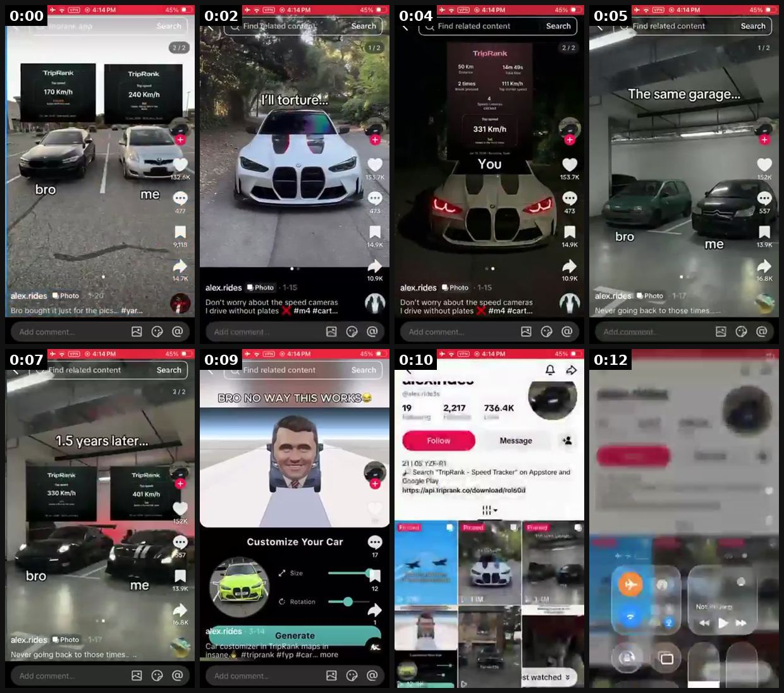
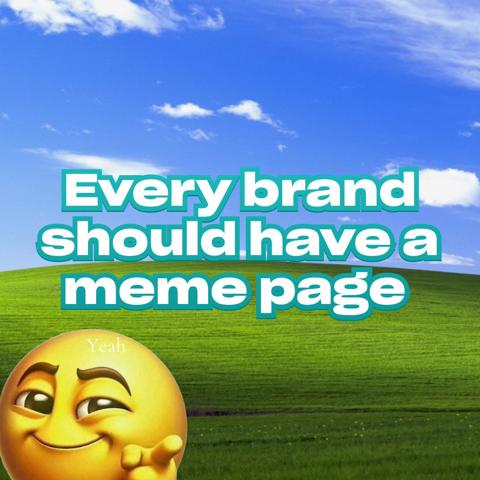
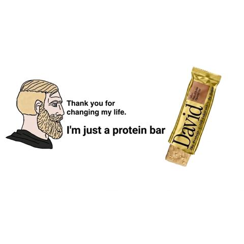
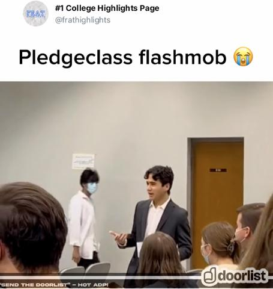
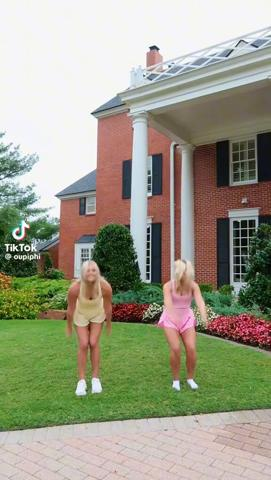
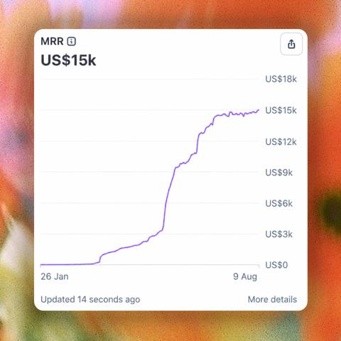
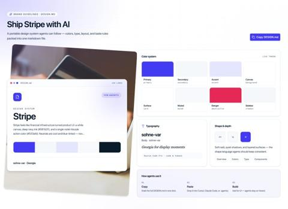

# 52 · Owned meme / niche page with product card ('bro vs me'): see it, then make it

[](https://x.com/leonclipping/status/2107564115275501944)

**The example:** [@leonclipping on X](https://x.com/leonclipping/status/2107564115275501944) · 0:13 video · 23 likes, 1K views

**Watch it:** [open the post on X](https://x.com/leonclipping/status/2107564115275501944) · [play the video file](https://video.twimg.com/amplify_video/2107564043401658368/vid/avc1/320x572/4cwYrbWgV9bY6YsH.mp4?tag=29)

> this guy might be a fucking genius he built a car meme page around random supercar pics, posts simple "bro vs me" memes and then slaps a speed tracker app screenshot right on the photo no face no filming no car needed just: -> a stock pic of a ferrari, porsche or m4 -> relatable "me and bro" car memes -> same meme format every post -> app plug as the "top speed" card the page only has 2,217 followers and it's already…

## What you are seeing

A meme page format: a supercar "bro vs me" meme (two cars in a garage), then the app's speed card pasted in as the punchline. The page posts memes; the product rides inside them.

## Beat by beat

The storyboard above samples the video every 0:01. Lines are the transcript for that stretch; on-screen text comes from OCR, so treat it as rough.

| Frame | Time | On screen | Said / sung |
|---|---|---|---|
| 1 | 0:00–0:01 | 132 bro on 14.76 … just for the pics... | Oh |
| 2 | 0:01–0:03 | or a. An … Photo Don’t worry about the speed cameras drive without plates | · |
| 3 | 0:03–0:04 | You 183.7K 14.9K … Photo 1-15 Don't worry about the speed cameras … #cart... drive without plates Add comment... | · |
| 4 | 0:04–0:06 | a guy 557 bro AS me 13.9K | · |
| 5 | 0:06–0:08 | related content Search a 1.5 years later … bro me 13.9K Add comment.. | · |
| 6 | 0:08–0:09 | Customize Your Car a | · |
| 7 | 0:09–0:11 | SAG we shes … 19 2,217 aS … Message 21 05 … Speed Tracker on | · |
| 8 | 0:11–0:13 | · | · |

<details><summary>Full transcript (timestamped)</summary>

- `0:00` Oh

</details>

## More real examples (7)

Other posts that show this format, or a close cousin of it. Click a thumbnail to open it on X.

| | | |
|---|---|---|
| [](https://x.com/iamjasonlevin/status/2079193650450649327)<br>**@iamjasonlevin** · 1:04 video · 4K views<br>Nobody wants to follow your brand page. Your brand needs a "Finsta". A secondary account that lets you take risk you wouldn't normally on the main acc | [](https://x.com/iamjasonlevin/status/2075207111307563424)<br>**@iamjasonlevin** · images · 3K views<br>Every brand should have a meme page If you are: - scared to post memes on main - run a SaaS or e-com - want to pull the funny marketing lever You shou | [](https://x.com/iamjasonlevin/status/2064716198843957258)<br>**@iamjasonlevin** · images · 1K views<br>MEMECEPTION (n.) putting your product into memes In a sentence: “yo bro, memeception on big meme pages is the future of product placement” |
| [](https://x.com/DimitriNakis/status/2034046029155258542)<br>**@DimitriNakis** · images · 95 views<br>Testing the Stake ad method for DoorList on frat meme pages. Might need to dial in the copy lol. Every app is a dating app | [](https://x.com/jakewilliammo/status/1998076247331438778)<br>**@jakewilliammo** · 0:24 video · 644 views<br>I found the “meme page arbitrage” opportunity of 2025 These videos AVERAGE millions of views And brands are completely sleeping on it It’s branded sor | [](https://x.com/gauravsbuilding/status/2086540833717895480)<br>**@gauravsbuilding** · image · 5K views<br>Attention all founders who don't know how to market your app, it's fr this easy. Create IG + TikTok pages for: 1. Your Brand 2. AI Influencer 3. Theme |
| [](https://x.com/shadcnblocks/status/2103741617194578191)<br>**@shadcnblocks** · image · 309 views<br>Copy DESIGN.md from any theme Open Alpine, Vercel, or any theme page → Brand guidelines → Copy DESIGN.md. Then install tokens with the shadcn CLI. Age |   |   |

## How to make one like it

**The format in one line:** A brand-owned (disclosed) niche meme page posting relatable memes where the product appears as a small card/sticker in the image — distribution via shares, not ads.

**Why it works:** - Memes travel; product card rides along. - Separate from brand feed; tests humour angles cheaply.

**Contents:** [1. Structure](#1-copy-the-structure) · [2. Shot by shot](#2-shot-by-shot-remake) · [3. Script and hooks](#3-write-the-script) · [4. Prompts](#4-prompts) · [5. Tools and settings](#5-tools-and-settings) · [6. Louise Carter remake](#6-louise-carter-remake) · [7. Variants and test](#7-variants-and-test-plan) · [8. Pitfalls](#8-pitfalls)

### 1. Copy the structure

Use the example's timing as your beat sheet. Keep the beat, change the words and the product.

| Beat | Time | In the example | Your version |
|---|---|---|---|
| 1 | 0:00 | Oh | … |
| 2 | 0:02 | Oh | … |
| 3 | 0:04 | Oh | … |
| 4 | 0:05 | on screen: a guy 557 bro AS me 13.9K | … |
| 5 | 0:07 | on screen: related content Search a 1.5 years later … bro me 13.9K Add comment.. | … |
| 6 | 0:09 | on screen: Customize Your Car a | … |
| 7 | 0:10 | on screen: SAG we shes … 19 2,217 aS … Message 21 05 … Speed Tracker on | … |
| 8 | 0:12 | (visual beat, see frame 8) | … |

### 2. Shot-by-shot remake

**Target length / size:** Static memes or 5-10s clips, daily, from an owned meme page

| # | Time / slot | What we see (visual + camera) | Dialogue / on-screen text |
|---|---|---|---|
| 1 | Meme | Two-panel "bro vs me" or "them vs me" meme | "Them: takes jewellery off to shower. Me:" |
| 2 | Product card | Small product card in the second panel | - |
| 3 | Caption | - | "if you know you know" |
| 4 | Cadence | Daily posting from the page; product in 1 of 4 posts | - |

<details><summary>Playbook shot list (Louise Carter version from the README)</summary>

| Time / slot | Visual | Audio / copy |
|---|---|---|
| Post | Meme image (gift-giving humour) with small LC card in corner | Caption |
| Bio | "by Louise Carter" | Disclosure |

</details>

### 3. Write the script

Open with one of these hooks (first 1–3 seconds, or the headline on a static):

- "Him: what do you want for your birthday / Me:"
- "POV: you can shower in your jewelry now"

Then fill the beats from the table above. Pull the wording from real customer reviews, not from ad copy: a review line beats a copywriter line almost every time. Read every line out loud and cut anything you would not say to a friend. Ready-made Louise Carter scripts are in section 6; hand [BOT.md](BOT.md) to any AI agent to write versions for another brand.

### 4. Prompts

**Meme bank (Claude)**

```text
Write 30 two-panel meme captions for [niche] where panel two shows the product as the obvious answer; no punching down.
```

**Tools**

```text
Canva meme templates or Imgflip; keep the page's look consistent.
```

**Full creative-agent prompt (from the playbook):**

```
Write 20 gift/jewelry memes (top text/bottom text) with placement for a small LC card; original concepts only.
```

### 5. Tools and settings

1. Own the page openly ("by LC"); original memes only (no stolen images).

| Setting | Value |
|---|---|
| Canvas | 1080×1920 (9:16) master; crop a 1080×1350 (4:5) cut for feed placements |
| Frame rate | 30 fps (shoot 60 fps for slow-motion water or sparkle shots) |
| Camera | Phone main lens at 1x, exposure locked on skin, HDR off, grid on; tripod or a phone clamp for product shots |
| Light | One soft key at 45° (window or ring light), white card as fill; side light for metal sparkle |
| Audio | Lavalier or phone 15–20 cm from the mouth; mix voice at -14 LUFS, music at -28 to -30 dB under voice |
| Captions | Burned in, 2–5 words per line, 64–80 px bold sans, white with a black stroke or pill; keep text inside the safe zone (top 220 px and bottom 420 px clear, 64 px side margins) |
| Pacing | A visual change every 1.5–3 s; the hook lands in the first 1.5 s with no logo intro |
| Edit / export | CapCut or Premiere; H.264, 12–20 Mbps, AAC 320 kbps; upload natively to each platform, not via links |

### 6. Louise Carter remake

- A · Gift memes.
- B · "Never take it off" memes.
- C · Stack addiction memes.

Brand rules, claims you can and cannot make, and more scripts: [brands/louise-carter.md](brands/louise-carter.md). Step-by-step from idea to scale: [STAGES.md](STAGES.md).

### 7. Variants and test plan

- Meme style

**Test plan:** - **Budget/structure:** Organic, 30 posts - **Primary KPIs:** Shares, follows, profile clicks; Omni (F52-*) - **Kill rule:** <5k avg after 30 posts - **Scale rule:** Repurpose winners as statics - **Naming:** `utm_content=F52-<concept>-<variant>`; weekly Omni roll-up of new-customer revenue by format.

**Naming:** `F52-<variant>-<hook##>-<date>` so results map back to this folder. Change one thing per test (hook, narrator, length or offer), never two.

### 8. Pitfalls

- Use meme formats you have rights to; avoid copyrighted stills for paid ads.
- Product in at most one in four posts.
- Label the page as brand-owned in the bio.
- Slow open: if the first 1.5 s does not show the hook visually, most people swipe.
- Logo or brand intro at the start reads as an ad; put the brand at the end.
- Captions covered by the platform UI: check the safe zone on a real phone before posting.
- Music over the voice: keep music at least 14 dB under speech.

**Compliance:** Baseline: [_COMPLIANCE.md](../_COMPLIANCE.md) (no fake testimonials, AI disclosure, no bulk/spoofed accounts, copy structure not assets, PDP-only claims). - Disclose brand ownership; licensed images only.

## More examples

Every post we found for this format, with transcripts: [examples/](examples/README.md). Playbook: [README.md](README.md). Agent brief: [BOT.md](BOT.md).
