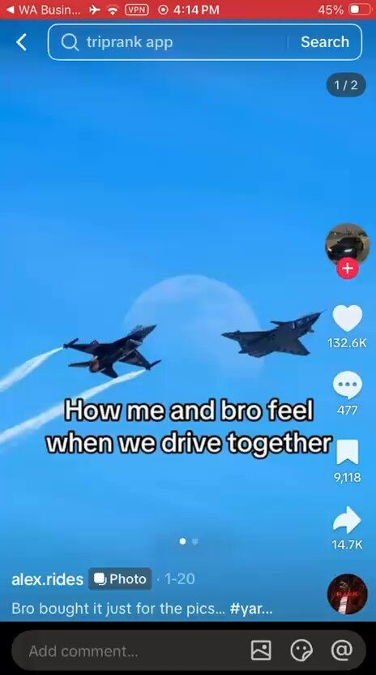

# 52 · Owned meme / niche page with product card ("bro vs me")

<!-- HERO:START -->
[](EXAMPLE.md)

**[See the example and how to make it →](EXAMPLE.md)** · [watch on X](https://x.com/leonclipping/status/2107564115275501944)
<!-- HERO:END -->


> **LC priority P2** · evidence: Low-Med (one outlier) · hype risk: Med · cost $0 · 15 min/post

## What it is
A brand-owned (disclosed) niche meme page posting relatable memes where the product appears as a small card/sticker in the image — distribution via shares, not ads.

## Why it works
- Memes travel; product card rides along.
- Separate from brand feed; tests humour angles cheaply.

## Shot-by-shot (LC version)

| Time / slot | Visual | Audio / copy |
|---|---|---|
| Post | Meme image (gift-giving humour) with small LC card in corner | Caption |
| Bio | "by Louise Carter" | Disclosure |

## Hooks (swap-in openers)
- "Him: what do you want for your birthday / Me:"
- "POV: you can shower in your jewelry now"

## Real examples from X (studied)
- @leonclipping — supercar "bro vs me" meme page: 736k likes, top post 1.4M views ([post](https://x.com/leonclipping/status/2107564115275501944)).
- @nicktheriot_ — meme C-tier for paid ([post](https://x.com/nicktheriot_/status/2108173638033871013)).

## Production recipe
1. Own the page openly ("by LC"); original memes only (no stolen images).

## Bot prompt (copy into the creative agent)
```
Write 20 gift/jewelry memes (top text/bottom text) with placement for a small LC card; original concepts only.
```

## 3 LC scripts
- A · Gift memes.
- B · "Never take it off" memes.
- C · Stack addiction memes.

## Variants to test
- Meme style

## Omni test plan
- **Budget/structure:** Organic, 30 posts
- **Primary KPIs:** Shares, follows, profile clicks; Omni (F52-*)
- **Kill rule:** <5k avg after 30 posts
- **Scale rule:** Repurpose winners as statics
- **Naming:** `utm_content=F52-<concept>-<variant>`; weekly Omni roll-up of new-customer revenue by format.

## Compliance
Baseline: [_COMPLIANCE.md](../_COMPLIANCE.md) (no fake testimonials, AI disclosure, no bulk/spoofed accounts, copy structure not assets, PDP-only claims).
- Disclose brand ownership; licensed images only.

## Related
- Strategies: 20-niche-persona-pages, 24-niche-character-account-network, 13-identity-shareables-accidental-virality
- Formats: [01-faceless-niche-slideshow](../01-faceless-niche-slideshow/README.md), [21-recurring-ai-character-mascot](../21-recurring-ai-character-mascot/README.md)

<!-- EVIDENCE:START -->
## Evidence from X discovery (auto-generated)

| Date | Author | Post | Engagement | Grade | Gist |
|---|---|---|---|---|---|
| 2026-10-06 | [@leonclipping](https://x.com/leonclipping) | [link](https://x.com/leonclipping/status/2107564115275501944) | 23L/25BM/1kV | VALUE | Supercar "bro vs me" meme page with the app's speed card pasted on the photo: 2.2k followers, 736k likes, top post 1.4M views. |
| 2026-08-07 | [@zackpaid](https://x.com/zackpaid) | [link](https://x.com/zackpaid/status/2085621175292670183) | 9L/20BM/2kV | SOME | 11 AI formats (agency pitch): native UGC, founder, claymation, Pixar 3D, jingle, screen recording, before/after, testimonial compilation, cinematic demo, mini-doc, meme. |
<!-- EVIDENCE:END -->
