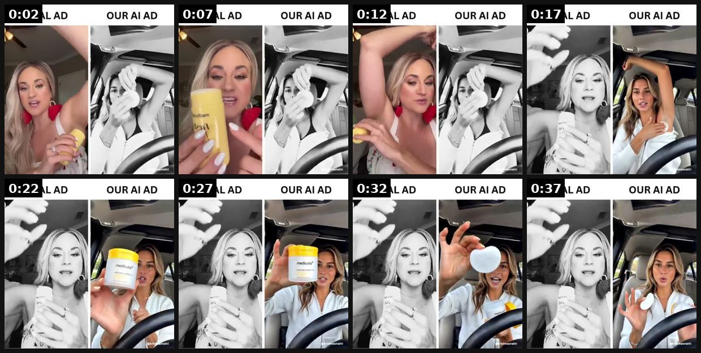
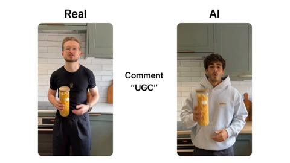
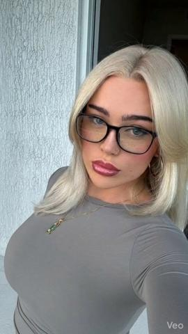
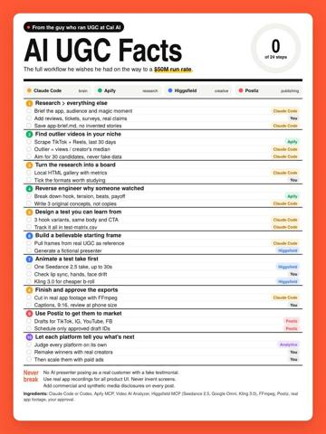
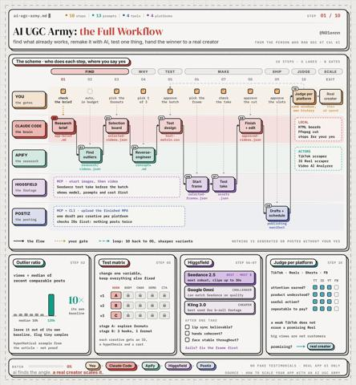
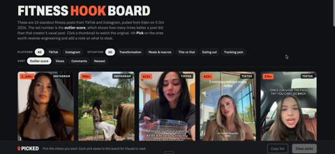

# 53 · AI UGC outlier-remake lab (find outliers → AI test on organic → remake winners with real creators → paid): see it, then make it

[](https://x.com/rathikrishnav/status/2056472046192951468)

**The example:** [@rathikrishnav on X](https://x.com/rathikrishnav/status/2056472046192951468) · 0:39 video · 0 likes, 49 views

**Watch it:** [open the post on X](https://x.com/rathikrishnav/status/2056472046192951468) · [play the video file](https://video.twimg.com/amplify_video/2056471845210324992/vid/avc1/540x540/7hZuUF7kzlbQ9iKP.mp4?tag=14)

> We've cracked hyper-realistic AI UGC. Left is a real video. Right is 100% AI. We can now replicate any winning ad on the internet with AI. We've officially crossed the uncanny valley, and there's no going back. I'm genuinely sorry for the people sleeping on this.

## What you are seeing

A split-screen test: on the left the brand's real UGC ad ('REAL AD'), on the right an AI-generated remake ('OUR AI AD') with a different AI creator copying the same moves — holding the yellow skincare jar, applying it, reacting — beat for beat for about 40 seconds. The point: a winning ad can be cloned with AI to test new faces.

## Beat by beat

The storyboard above samples the video every 0:04. Lines are the transcript for that stretch; on-screen text comes from OCR, so treat it as rough.

| Frame | Time | On screen | Said / sung |
|---|---|---|---|
| 1 | 0:00–0:05 | REAL AD OUR Al AD Ss Coa a 7% | If your deodorant is not infused with skincare, throw it out. |
| 2 | 0:05–0:09 | REAL AD OUR Al AD el at an | Look at what MediCube just came out with. They came out with the deodorant with skincare with Kojik Acid and Turmeric. |
| 3 | 0:09–0:14 | REAL AD OUR Al AD ol 1% a | So if you have those dark underarms, which most of us do, this is going to help lighten and brighten. |
| 4 | 0:14–0:19 | REAL AD OUR Al AD So Ii Ne if | Please tell me why it took the girls 30 freaking years to figure out how to lighten their armpits. And no, it's not laser, okay? |
| 5 | 0:19–0:24 | REAL AD OUR AI AD wv ee Ny a ad | This is literally after using these Kojik Acid Turmeric toner pads for like two weeks. Like the glow is insane. |
| 6 | 0:24–0:29 | REAL AD OUR Al AD aa as AD | The dark spots, the texture, everything started fading. Like this is what I've been using. It's literally pre-soaked. |
| 7 | 0:29–0:34 | REAL AD OUR Al AD a Ar fi Ms AD | You just swipe it on and you're done. And I swear this is the first thing that's actually worked without burning my skin off. |
| 8 | 0:34–0:39 | REAL AD OUR Al AD we AO ae | Like my underarms used to look so uneven and now they're literally smooth and bright. Like when I say glass skin for your bo- |

<details><summary>Full transcript (timestamped)</summary>

- `0:00` If your deodorant is not infused with skincare, throw it out.
- `0:03` Look at what MediCube just came out with.
- `0:06` They came out with the deodorant with skincare with Kojik Acid and Turmeric.
- `0:09` So if you have those dark underarms, which most of us do,
- `0:12` this is going to help lighten and brighten.
- `0:14` Please tell me why it took the girls 30 freaking years to figure out how to lighten their armpits.
- `0:18` And no, it's not laser, okay?
- `0:19` This is literally after using these Kojik Acid Turmeric toner pads for like two weeks.
- `0:23` Like the glow is insane.
- `0:24` The dark spots, the texture, everything started fading.
- `0:26` Like this is what I've been using.
- `0:28` It's literally pre-soaked.
- `0:29` You just swipe it on and you're done.
- `0:30` And I swear this is the first thing that's actually worked without burning my skin off.
- `0:34` Like my underarms used to look so uneven and now they're literally smooth and bright.
- `0:38` Like when I say glass skin for your bo-

</details>

## More real examples (6)

Other posts that show this format, or a close cousin of it. Click a thumbnail to open it on X.

| | | |
|---|---|---|
| [](https://x.com/raph_guilhem/status/2095453949805392267)<br>**@raph_guilhem** · 0:34 video · 391 views<br>Seedance 2.5 is insane for AI UGC. I built a Claude skill that takes an ad that's already converting and puts a new person in it. This is perfect for | [](https://x.com/SimScaler/status/2034333069167984905)<br>**@SimScaler** · 0:08 video · 1K views<br>You should be PRINTING with AI UGC right now You can reverse engineer any winning ad And recreate it in minutes with your own AI creator That's the ne | [](https://x.com/angeldot_/status/2107913083783987306)<br>**@angeldot_** · 0:18 video · 18K views<br>Cal AI scaled to 15M downloads before being acquired by MyFitnessPal now its co-founder just open-sourced the AI UGC workflow he wishes he had while b |
| [](https://x.com/ai_cult1/status/2092368368968049118)<br>**@ai_cult1** · 47:51 video · 49 views<br>Cal AI growth was paid, not organic: creator roster, affiliate program, MrBeast sponsorship, in-house daily ad creative ($40M in 12 months). | [](https://x.com/N01ennn/status/2107887039513268301)<br>**@N01ennn** · 0:12 video · 12K views<br>the person who ran UGC for Cal AI on its way to a $50M run rate just laid out how to run an AI UGC army for any app. this is pure f*cking treasure. so | [](https://x.com/slash1sol/status/2107878663488188775)<br>**@slash1sol** · 0:21 video · 9K views<br>THE CO-FOUNDER WHO RAN GROWTH AT CAL AI JUST LEAKED THE ENTIRE AI UGC PIPELINE. ONE PERSON, ZERO CREATORS, THOUSANDS OF TEST VIDEOS Cal AI went to 15M |

## How to make one like it

**The format in one line:** A production system, not a single look: research customers deeply → scrape niche videos and pick OUTLIERS (vs the creator's own average, e.g. 12×) → reverse-engineer hook/open question/sequence/payoff → build a believable AI starting frame and test one take → batch → post to 4 platforms from one scheduler → judge each platform separately → give winning concepts to real creators and put ad money be

**Why it works:** - Outlier-vs-own-baseline is a stronger signal than raw views (@jakecastilloooo). - AI videos are cheap tests; real creators remake winners for trust. - Changing one variable at a time makes results interpretable. - Never let the model invent product details — use real footage of the product.

**Contents:** [1. Structure](#1-copy-the-structure) · [2. Shot by shot](#2-shot-by-shot-remake) · [3. Script and hooks](#3-write-the-script) · [4. Prompts](#4-prompts) · [5. Tools and settings](#5-tools-and-settings) · [6. Louise Carter remake](#6-louise-carter-remake) · [7. Variants and test](#7-variants-and-test-plan) · [8. Pitfalls](#8-pitfalls)

### 1. Copy the structure

Use the example's timing as your beat sheet. Keep the beat, change the words and the product.

| Beat | Time | In the example | Your version |
|---|---|---|---|
| 1 | 0:02 | If your deodorant is not infused with skincare, throw it out. Look at what MediCube just came out with. | … |
| 2 | 0:07 | Look at what MediCube just came out with. They came out with the deodorant with skincare with Kojik Acid and Turmeric. | … |
| 3 | 0:12 | So if you have those dark underarms, which most of us do, this is going to help lighten and brighten. | … |
| 4 | 0:17 | Please tell me why it took the girls 30 freaking years to figure out how to lighten their armpits. And no, it's not laser, okay? | … |
| 5 | 0:22 | This is literally after using these Kojik Acid Turmeric toner pads for like two weeks. Like the glow is insane. | … |
| 6 | 0:27 | The dark spots, the texture, everything started fading. Like this is what I've been using. It's literally pre-soaked. You just swipe it on a | … |
| 7 | 0:32 | You just swipe it on and you're done. And I swear this is the first thing that's actually worked without burning my skin off. | … |
| 8 | 0:37 | Like my underarms used to look so uneven and now they're literally smooth and bright. Like when I say glass skin for your bo- | … |

### 2. Shot-by-shot remake

**Target length / size:** System: weekly loop (find outliers → AI test → real remake → paid)

| # | Time / slot | What we see (visual + camera) | Dialogue / on-screen text |
|---|---|---|---|
| 1 | Find | Pull outlier organic posts in the niche (10x the account's median views) | Sheet: link, hook, structure, views |
| 2 | AI test | Remake 5 outliers with AI UGC (labelled) and post organically | Same hook and beats as the outlier |
| 3 | Pick | Keep the 1-2 that beat the account median | - |
| 4 | Real remake | Brief real creators to film the winners | Exact beat sheet from the AI version |
| 5 | Paid | Run the real versions as paid; retire after fatigue | - |

<details><summary>Playbook shot list (Louise Carter version from the README)</summary>

| Time / slot | Visual | Audio / copy |
|---|---|---|
| Step 1 | Context pack: PDP, reviews, support tickets, surveys | Claude project |
| Step 2 | Apify TikTok/IG scrapers → outlier list (views ÷ creator median) | HTML board with select buttons |
| Step 3 | Video analyzer → hook, unanswered question, sequence, payoff | — |
| Step 4 | Starting frame from a real UGC reference: angle, skin detail, natural hands, mic | Image model |
| Step 5 | One test take (static/handheld, energy, exact dialogue) → check lip sync, hands, face drift | Seedance/Kling |
| Step 6 | Edit with REAL LC product footage; captions; review at phone size | FFmpeg/editor |
| Step 7 | Schedule to TikTok/IG/Shorts/FB | Postiz-type scheduler (drafts reviewed by a human) |
| Step 8 | Winners → real creator remake (F43) → Meta paid | Omni |

</details>

### 3. Write the script

Open with one of these hooks (first 1–3 seconds, or the headline on a static):

- Outlier-derived (examples): "I tested the internet's favorite jewelry hack…"
- "POV: you forgot you were wearing it in the ocean"
- "Things I stopped doing after 30: taking off my necklace"

Then fill the beats from the table above. Pull the wording from real customer reviews, not from ad copy: a review line beats a copywriter line almost every time. Read every line out loud and cut anything you would not say to a friend. Ready-made Louise Carter scripts are in section 6; hand [BOT.md](BOT.md) to any AI agent to write versions for another brand.

### 4. Prompts

**Outlier search**

```text
TikTok Creative Center / Foreplay: filter by niche, last 30 days, sort by views; keep posts at 10x the account median.
```

**AI remake (Arcads / Seedance)**

```text
Split-screen check: put the original and the AI remake side by side and match every beat before posting.
```

**Full creative-agent prompt (from the playbook):**

```
Context: {{LC_CONTEXT_PACK}}. Here are scraped videos with views and each creator's median {{SCRAPE}}. 1) Rank by outlier ratio; 2) for top 10 give hook (first 2s), unanswered question, sequence, payoff, and why it worked; 3) propose 3 LC adaptations changing only ONE variable each; 4) write starting-frame and animation prompts (camera static/handheld, energy, exact ≤30-word dialogue, what must stay consistent). Product must be shown with real LC footage — mark insert points.
```

### 5. Tools and settings

1. Build context pack in /lc-mkt (PDP facts, top 200 reviews, top 50 support questions).
2. Outlier research weekly: jewelry, gifting, "waterproof jewelry", GRWM niches; outlier = ≥5× creator median.
3. Analyze top 10 → pick 3 formats → 1 variable per test.
4. AI frame rules: real UGC reference, no text on face, natural hands, plausible audio source; product shots must be REAL LC footage composited (no AI-invented jewelry).
5. Post to an LC-owned test account (disclosed as AI where required); judge per platform at fixed windows.
6. Concept with signal → brief 3-5 real creators (F43) → Partnership ads.

| Setting | Value |
|---|---|
| What you are building | A repeatable system (account, page, offer or pipeline), not one ad |
| Cadence | Decide the posting or launch rhythm up front (e.g. daily, or 3 new ads a week) and keep it for 30 days |
| Template | Lock one caption, layout and naming template so output is consistent |
| Tracking | One UTM pattern per system (`utm_campaign=F<NN>`) and a weekly sheet: spend, CTR, hook rate, CPA |
| Tools | Meta Ads Manager / TikTok Ads Manager, a shared Drive folder per format, the agent brief in BOT.md |

### 6. Louise Carter remake

- A · Outlier "jewelry hack I tested" → AI creator takes LC necklace into shower; real product insert shots.
- B · Outlier "things I stopped doing after 30" → AI narrator; #4 = taking necklace off.
- C · Outlier "gift reaction" format → real creator remake only (reactions must be real).

Brand rules, claims you can and cannot make, and more scripts: [brands/louise-carter.md](brands/louise-carter.md). Step-by-step from idea to scale: [STAGES.md](STAGES.md).

### 7. Variants and test plan

- Model (Seedance vs Kling vs Omni)
- Hook vs character vs setting (one at a time)
- AI vs real-creator remake of same script

**Test plan:** - **Budget/structure:** 20 AI test videos/week (~$100-200 gen cost) on organic; $50/day paid on remade winners - **Primary KPIs:** Outlier ratio vs account median, 3s hold, profile clicks; paid CPA on remakes; Omni (F53-*) - **Kill rule:** No video >3× account median after 40 tests - **Scale rule:** Remake winners with 3-5 real creators; whitelist - **Naming:** `utm_content=F53-<concept>-<variant>`; weekly Omni roll-up of new-customer revenue by format.

**Naming:** `F53-<variant>-<hook##>-<date>` so results map back to this folder. Change one thing per test (hook, narrator, length or offer), never two.

### 8. Pitfalls

- Label AI UGC.
- Remake the structure, never copy someone's footage or exact script.
- Kill AI tests fast; they are only for picking.
- Changing the template every week: the system only learns if it stays consistent for at least 30 days.
- No tracking: without one naming and UTM pattern you cannot tell which piece of the system works.

**Compliance:** Baseline: [_COMPLIANCE.md](../_COMPLIANCE.md) (no fake testimonials, AI disclosure, no bulk/spoofed accounts, copy structure not assets, PDP-only claims). - Label AI-generated realistic people (Meta "AI info", TikTok AIGC label); no AI "customer testimonials" — AI characters must not claim to be real customers. - Use only real product footage for the jewelry. - Posting through schedulers: human review of every draft; no bulk/spoofed accounts; respect scraper ToS (public data only).

## Field notes

Newer observations live in the playbook: [Wave 5 update: formats from non-selling content (Oct 2026)](README.md)

## More examples

Every post we found for this format, with transcripts: [examples/](examples/README.md). Playbook: [README.md](README.md). Agent brief: [BOT.md](BOT.md).
