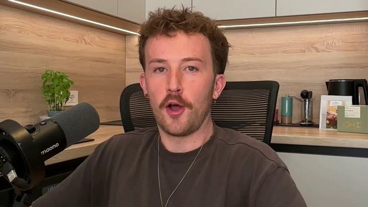

# 53 · AI UGC outlier-remake lab (find outliers → AI test on organic → remake winners with real creators → paid)

<!-- HERO:START -->
[](EXAMPLE.md)

**[See the example and how to make it →](EXAMPLE.md)** · [watch on X](https://x.com/0xDepressionn/status/2107918489587507606)
<!-- HERO:END -->


> **LC priority P1** · evidence: Med-High (ex-Cal AI operator, detailed method) · hype risk: Med · cost $2-10 per AI test video + tooling · pipeline setup 1-2 days; then ~20 min/video

## What it is
A production system, not a single look: research customers deeply → scrape niche videos and pick OUTLIERS (vs the creator's own average, e.g. 12×) → reverse-engineer hook/open question/sequence/payoff → build a believable AI starting frame and test one take → batch → post to 4 platforms from one scheduler → judge each platform separately → give winning concepts to real creators and put ad money behind them.

## Why it works
- Outlier-vs-own-baseline is a stronger signal than raw views (@jakecastilloooo).
- AI videos are cheap tests; real creators remake winners for trust.
- Changing one variable at a time makes results interpretable.
- Never let the model invent product details — use real footage of the product.

## Shot-by-shot (LC version)

| Time / slot | Visual | Audio / copy |
|---|---|---|
| Step 1 | Context pack: PDP, reviews, support tickets, surveys | Claude project |
| Step 2 | Apify TikTok/IG scrapers → outlier list (views ÷ creator median) | HTML board with select buttons |
| Step 3 | Video analyzer → hook, unanswered question, sequence, payoff | — |
| Step 4 | Starting frame from a real UGC reference: angle, skin detail, natural hands, mic | Image model |
| Step 5 | One test take (static/handheld, energy, exact dialogue) → check lip sync, hands, face drift | Seedance/Kling |
| Step 6 | Edit with REAL LC product footage; captions; review at phone size | FFmpeg/editor |
| Step 7 | Schedule to TikTok/IG/Shorts/FB | Postiz-type scheduler (drafts reviewed by a human) |
| Step 8 | Winners → real creator remake (F43) → Meta paid | Omni |

## Hooks (swap-in openers)
- Outlier-derived (examples): "I tested the internet's favorite jewelry hack…"
- "POV: you forgot you were wearing it in the ocean"
- "Things I stopped doing after 30: taking off my necklace"

## Real examples from X (studied)
- @jakecastilloooo — "How to scale your app with an AI UGC Army (Full Workflow)", ex-Cal AI UGC/influencer lead; 984 likes / 3,090 bookmarks / 290K views ([post](https://x.com/jakecastilloooo/status/2107873317369581751)). Full text saved in discovery/jakecastilloooo.md; his 13 prompts are pasted verbatim in strategy 29.
- @0xDepressionn — summary of the same workflow ("treats AI videos as cheap tests, organic first, then ad money behind winners") ([post](https://x.com/0xDepressionn/status/2107918489587507606)).
- @ai_cult1 — Cal AI growth context: paid creator roster + affiliate + daily in-house creative ([post](https://x.com/ai_cult1/status/2092368368968049118)).
- @carlynorthmedia — know when to stop iterating a winner: hook reuse causes audience + algorithm fatigue ([post](https://x.com/carlynorthmedia/status/2107565970197782530)).

## Production recipe
1. Build context pack in /lc-mkt (PDP facts, top 200 reviews, top 50 support questions).
2. Outlier research weekly: jewelry, gifting, "waterproof jewelry", GRWM niches; outlier = ≥5× creator median.
3. Analyze top 10 → pick 3 formats → 1 variable per test.
4. AI frame rules: real UGC reference, no text on face, natural hands, plausible audio source; product shots must be REAL LC footage composited (no AI-invented jewelry).
5. Post to an LC-owned test account (disclosed as AI where required); judge per platform at fixed windows.
6. Concept with signal → brief 3-5 real creators (F43) → Partnership ads.

## Bot prompt (copy into the creative agent)
```
Context: {{LC_CONTEXT_PACK}}. Here are scraped videos with views and each creator's median {{SCRAPE}}. 1) Rank by outlier ratio; 2) for top 10 give hook (first 2s), unanswered question, sequence, payoff, and why it worked; 3) propose 3 LC adaptations changing only ONE variable each; 4) write starting-frame and animation prompts (camera static/handheld, energy, exact ≤30-word dialogue, what must stay consistent). Product must be shown with real LC footage — mark insert points.
```

## 3 LC scripts
- A · Outlier "jewelry hack I tested" → AI creator takes LC necklace into shower; real product insert shots.
- B · Outlier "things I stopped doing after 30" → AI narrator; #4 = taking necklace off.
- C · Outlier "gift reaction" format → real creator remake only (reactions must be real).

## Variants to test
- Model (Seedance vs Kling vs Omni)
- Hook vs character vs setting (one at a time)
- AI vs real-creator remake of same script

## Omni test plan
- **Budget/structure:** 20 AI test videos/week (~$100-200 gen cost) on organic; $50/day paid on remade winners
- **Primary KPIs:** Outlier ratio vs account median, 3s hold, profile clicks; paid CPA on remakes; Omni (F53-*)
- **Kill rule:** No video >3× account median after 40 tests
- **Scale rule:** Remake winners with 3-5 real creators; whitelist
- **Naming:** `utm_content=F53-<concept>-<variant>`; weekly Omni roll-up of new-customer revenue by format.

## Compliance
Baseline: [_COMPLIANCE.md](../_COMPLIANCE.md) (no fake testimonials, AI disclosure, no bulk/spoofed accounts, copy structure not assets, PDP-only claims).
- Label AI-generated realistic people (Meta "AI info", TikTok AIGC label); no AI "customer testimonials" — AI characters must not claim to be real customers.
- Use only real product footage for the jewelry.
- Posting through schedulers: human review of every draft; no bulk/spoofed accounts; respect scraper ToS (public data only).

## Related
- Strategies: 29-ai-ugc-outlier-test-pipeline, 26-viral-format-intelligence-feed, 37-ai-realism-craft, 28-ugc-creator-network-per-video-pay
- Formats: [06-ai-ugc-talking-head](../06-ai-ugc-talking-head/README.md), [43-hudson-method-creator-swarm](../43-hudson-method-creator-swarm/README.md), [01-faceless-niche-slideshow](../01-faceless-niche-slideshow/README.md)

<!-- EVIDENCE:START -->
## Evidence from X discovery (auto-generated)

| Date | Author | Post | Engagement | Grade | Gist |
|---|---|---|---|---|---|
| 2026-10-07 | [@jakecastilloooo](https://x.com/jakecastilloooo) | [link](https://x.com/jakecastilloooo/status/2107873317369581751) | 984L/3090BM/290kV | VALUE | Ex-Cal AI UGC lead's full AI UGC workflow (article): customer context → outlier videos vs creator baseline → reverse-engineer → believable first frame → test take → batch → 4-platform scheduling → remake winners with real creators, then paid. |
| 2026-10-08 | [@traqscales](https://x.com/traqscales) | [link](https://x.com/traqscales/status/2108113354178932920) | 22L/26BM/1kV | VALUE | Once app: 22.5M views from 2 AI UGC creators (one 13M, 9 >100K) — AI bride crying at her reception, "we gave every guest a camera instead of hiring more photographers" → QR → app as the mechanism. |
| 2026-10-07 | [@0xDepressionn](https://x.com/0xDepressionn) | [link](https://x.com/0xDepressionn/status/2107918489587507606) | 18L/14BM/2kV | SOME | Summary of Jake Castillo's workflow: AI videos as cheap organic tests, then ad money behind winners. |
| 2026-10-06 | [@carlynorthmedia](https://x.com/carlynorthmedia) | [link](https://x.com/carlynorthmedia/status/2107565970197782530) | 0L/0BM/0kV | SOME | Know when to stop iterating a winner: reusing the same hook causes audience + algorithm fatigue. |
<!-- EVIDENCE:END -->
