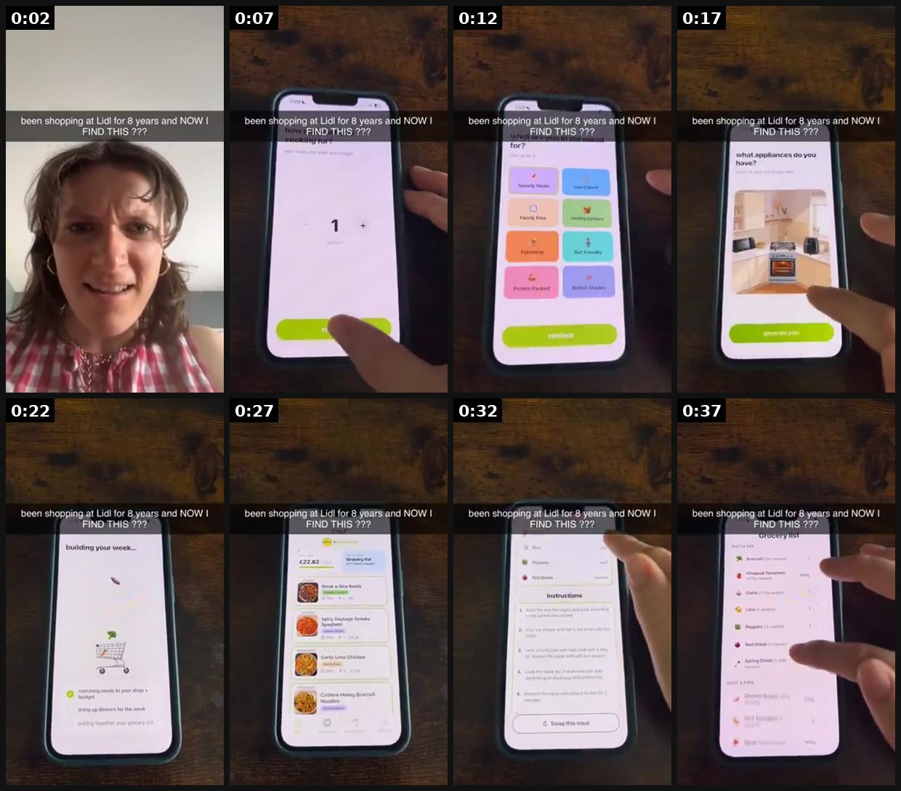
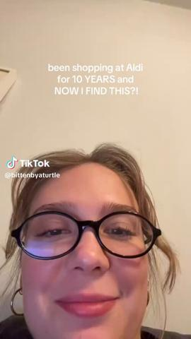
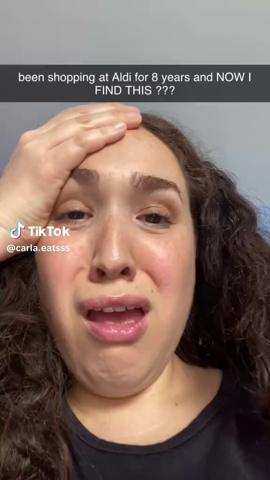
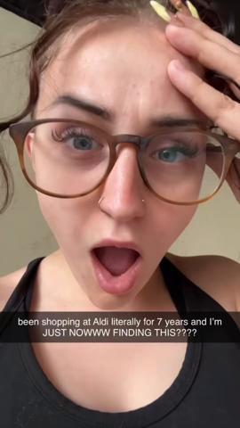
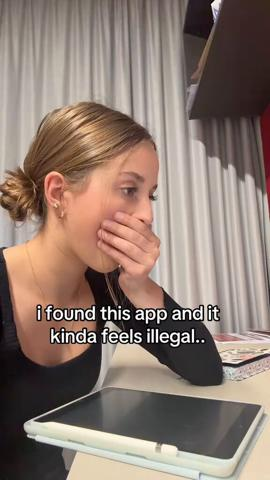
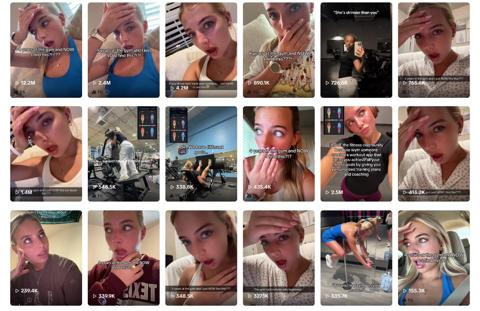
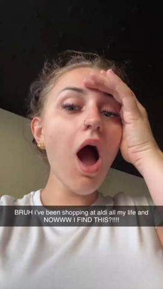

# 54 · 'Been doing X for N years and NOW I find this???' — regret-discovery hook + silent demo: see it, then make it

[](https://x.com/pixclipper/status/2084739019187847201)

**The example:** [@pixclipper on X](https://x.com/pixclipper/status/2084739019187847201) · 0:40 video · 134 likes, 26K views

**Watch it:** [open the post on X](https://x.com/pixclipper/status/2084739019187847201) · [play the video file](https://video.twimg.com/amplify_video/2084738947930800128/vid/avc1/320x568/i7qGSBJitxPPWBv8.mp4?tag=29)

> this meal planner app is doing $300k/mo+ in revenue and you've probably never seen a single ad from them their whole strategy is 18 ugc accounts on tiktok running the SAME 43-second video on repeat > "been shopping at ALDI for 8 years and NOW I FIND THIS ???" > "been shopping at LIDL for 8 years and NOW I FIND THIS ???" (uk version) > "kaufland einkaufen kann so einfach sein?!" (german version) every video is a silen…

## What you are seeing

A short selfie reaction ("been shopping at Lidl for 8 years and NOW I find this??"), then a long wordless screen demo of the app: tapping through store deals and recipes on a phone held over a counter. There is no voiceover; the text hook does the work.

## Beat by beat

The storyboard above samples the video every 0:05. Lines are the transcript for that stretch; on-screen text comes from OCR, so treat it as rough.

| Frame | Time | On screen | Said / sung |
|---|---|---|---|
| 1 | 0:00–0:05 | been shopping at for years and NOW FIND THIS | No way. |
| 2 | 0:05–0:10 | been at for years and NOW THIS 22? | · |
| 3 | 0:10–0:15 | yo. on been shopping at for years and NOW FIND THIS 2??? for Family Fave bed | · |
| 4 | 0:15–0:20 | been shopping at for years and NOW FIND. THIS 722 hat appliances do you have Ny a | · |
| 5 | 0:20–0:25 | been for 8.years and NOW FIND THIS building your week.. | · |
| 6 | 0:25–0:30 | been shopping at Lid! for NOW FIND THIS ?2? | · |
| 7 | 0:30–0:35 | been shopping for.8 years and NOW FIND THIS 2??? Instructions | · |
| 8 | 0:35–0:40 | been shopping at Lid! for and NOW HIS 222 | · |

<details><summary>Full transcript (timestamped)</summary>

- `0:00` No way.

</details>

## More real examples (6)

Other posts that show this format, or a close cousin of it. Click a thumbnail to open it on X.

| | | |
|---|---|---|
| [](https://x.com/themariaines/status/2108191952047153611)<br>**@themariaines** · 0:14 video · 2K views<br>Same hook, same format, different app: Albo 891.8K views, $70K/mo — "been shopping at Aldi for 10 years and NOW I FIND THIS" + silent demo. | [](https://x.com/themariaines/status/2086845144230416463)<br>**@themariaines** · 0:43 video · 18K views<br>miso: $100K MRR and 100K downloads 5 weeks after launch with the regret-discovery hook; one video 8.0M views, 200K shares. | [](https://x.com/PerezHatesAI/status/2107132379123077221)<br>**@PerezHatesAI** · 0:42 video · 3K views<br>I need to sit down 😭 29.3M views. 376K saves. 121K shares. For a meal planning app. The hook isn't the app. It's this line: "been shopping at Aldi lit |
| [](https://x.com/danclipping/status/2075946162235011466)<br>**@danclipping** · 0:15 video · 25K views<br>$976K/month is crazy This is a study/homework helper AI app with 350 million users Just from UGC creators They run formats like "I just found this app | [](https://x.com/ColinMaddenUGC/status/2097280776421126601)<br>**@ColinMaddenUGC** · image · 8K views<br>Our 1.8k-follower UGC creator pulled 12.2M views while some 400k-follower ones can’t even hit 10k… We’ve seen this happen across 100s of brands and th | [](https://x.com/pixclipper/status/2090016988223430845)<br>**@pixclipper** · 0:26 video · 14K views<br>this app crossed $100K revenue and 100K downloads in under 50 days 🤯 their whole strategy is one ugc format on repeat: - shocked face reaction - a sna |

## How to make one like it

**The format in one line:** A 2-4 second selfie of genuine exasperation/disbelief (hand on forehead, near-tears, "no way") with a caption that names a long habit + a specific place/brand the viewer shares — "been shopping at ALDI for 8 years and NOW I FIND THIS ???" — then a silent, hands-only demo of the product doing the thing. Almost no words, so any creator in any country can re-shoot it.

**Why it works:** - The named habit/place is the targeting: everyone who shares it stops (@pixclipper: "the store name does the targeting"). - Disbelief + regret ("8 years!") is a loss-aversion hook — viewers fear they are also missing out. - Wordless → any creator re-shoots it in an afternoon; 18 accounts × daily posting = 702 videos in 8 weeks. - It is among the most SAVED hook types, not just watched (@consumerxai).

**Contents:** [1. Structure](#1-copy-the-structure) · [2. Shot by shot](#2-shot-by-shot-remake) · [3. Script and hooks](#3-write-the-script) · [4. Prompts](#4-prompts) · [5. Tools and settings](#5-tools-and-settings) · [6. Louise Carter remake](#6-louise-carter-remake) · [7. Variants and test](#7-variants-and-test-plan) · [8. Pitfalls](#8-pitfalls)

### 1. Copy the structure

Use the example's timing as your beat sheet. Keep the beat, change the words and the product.

| Beat | Time | In the example | Your version |
|---|---|---|---|
| 1 | 0:02 | No way. | … |
| 2 | 0:07 | on screen: been at for years and NOW THIS 22? | … |
| 3 | 0:12 | on screen: yo. on been shopping at for years and NOW FIND THIS 2??? for Family Fave bed | … |
| 4 | 0:17 | on screen: been shopping at for years and NOW FIND. THIS 722 hat appliances do you have Ny a | … |
| 5 | 0:22 | on screen: been for 8.years and NOW FIND THIS building your week.. | … |
| 6 | 0:27 | on screen: been shopping at Lid! for NOW FIND THIS ?2? | … |
| 7 | 0:32 | on screen: been shopping for.8 years and NOW FIND THIS 2??? Instructions | … |
| 8 | 0:37 | on screen: been shopping at Lid! for and NOW HIS 222 | … |

### 2. Shot-by-shot remake

**Target length / size:** 15-30s, 1080x1920, silent demo

| # | Time / slot | What we see (visual + camera) | Dialogue / on-screen text |
|---|---|---|---|
| 1 | 0-3s | Text on screen over a hand holding the necklace | "Been buying gold jewellery for 15 years and NOW I find this???" |
| 2 | 3-10s | Silent demo: shower water over the chain | - |
| 3 | 10-18s | Sea dip, then the chain still bright | - |
| 4 | 18-24s | Close-up of the stack | "14K PVD. Waterproof." |
| 5 | End | Offer | - |

<details><summary>Playbook shot list (Louise Carter version from the README)</summary>

| Time / slot | Visual | Audio / copy |
|---|---|---|
| 0-3s | Selfie, hand on forehead, disbelief/near-tears face; caption "been buying gold jewelry for 10 years and NOW I FIND THIS ???" | "no way" (only words) |
| 3-10s | Hands-only: LC necklace under running shower water, close-up | Shower SFX |
| 10-18s | Same necklace in pool/sea; then next to an old green-tinged chain (own, unbranded) | — |
| 18-25s | Hands build a 7-piece stack on the LC PDP / box | Caption stays on top |
| 25-30s | Price card "any 7 for $85" on screen | — |

</details>

### 3. Write the script

Open with one of these hooks (first 1–3 seconds, or the headline on a static):

- "been buying gold jewelry for 10 years and NOW I FIND THIS ???"
- "been taking my necklace off to shower for 12 years and NOW I find this ???"
- "been buying my sister birthday candles for 6 years and NOW I find this ???"
- "been shopping at [mall store] for jewelry for 8 years and NOW I FIND THIS ???" (avoid naming competitors in paid)
- "been throwing out green-turning rings since high school and NOW…"

Then fill the beats from the table above. Pull the wording from real customer reviews, not from ad copy: a review line beats a copywriter line almost every time. Read every line out loud and cut anything you would not say to a friend. Ready-made Louise Carter scripts are in section 6; hand [BOT.md](BOT.md) to any AI agent to write versions for another brand.

### 4. Prompts

**Hook bank (Claude)**

```text
Write 15 variations of "Been doing X for N years and NOW I find this???" for [audience], each with a specific number and habit.
```

**Shoot**

```text
Macro clips, no voice, trending sound low.
```

**Full creative-agent prompt (from the playbook):**

```
Write 15 regret-discovery captions for LC in the exact pattern "been [habit] for [N] years and NOW I FIND THIS ???" Habits must be real pains of women 25-55 with gold jewelry (taking it off to shower, green neck, buying gifts, tarnish). Then for the best 5, write a 20s silent hands-only demo shot list using only PDP facts {{PDP_FACTS}}.
```

### 5. Tools and settings

1. Write 10 caption variants: habit × years × shared context (a store, a routine, a gift occasion).
2. Brief creators (F43 swarm): 3s disbelief selfie (real reaction to first trying it), then hands-only demo; no talking.
3. Film the demo flat-lay/top-down on a real bathroom counter, shower, pool.
4. Post daily across 5-20 creator accounts; track which 3 carry views; boost winners as Spark/Partnership ads.
5. Localise: swap the shared context per market (store, season, holiday).

| Setting | Value |
|---|---|
| Canvas | 1080×1920 (9:16) master; crop a 1080×1350 (4:5) cut for feed placements |
| Frame rate | 30 fps (shoot 60 fps for slow-motion water or sparkle shots) |
| Camera | Phone main lens at 1x, exposure locked on skin, HDR off, grid on; tripod or a phone clamp for product shots |
| Light | One soft key at 45° (window or ring light), white card as fill; side light for metal sparkle |
| Audio | Lavalier or phone 15–20 cm from the mouth; mix voice at -14 LUFS, music at -28 to -30 dB under voice |
| Captions | Burned in, 2–5 words per line, 64–80 px bold sans, white with a black stroke or pill; keep text inside the safe zone (top 220 px and bottom 420 px clear, 64 px side margins) |
| Pacing | A visual change every 1.5–3 s; the hook lands in the first 1.5 s with no logo intro |
| Edit / export | CapCut or Premiere; H.264, 12–20 Mbps, AAC 320 kbps; upload natively to each platform, not via links |

### 6. Louise Carter remake

- A · "been taking my necklace off to shower for 12 years and NOW I FIND THIS ???" → shower demo → 6-month-old LC piece → any 7 for $85.
- B · "been buying my mom candles for Mother's Day for 15 years and NOW I find this ???" → gift box unboxing → engraving/stack.
- C · "been buying gold jewelry that turns green since 2014 and NOW…" → ocean swim demo.

Brand rules, claims you can and cannot make, and more scripts: [brands/louise-carter.md](brands/louise-carter.md). Step-by-step from idea to scale: [STAGES.md](STAGES.md).

### 7. Variants and test plan

- Habit/years wording
- Shared context (store vs routine vs occasion)
- Crying vs annoyed vs shocked face
- Demo location

**Test plan:** - **Budget/structure:** Organic: 5-20 creator accounts × daily for 4 weeks; Paid: top 3 by views → $50/day Spark/Partnership each - **Primary KPIs:** Views, saves/1k, shares/1k, profile clicks; paid CPA; Omni (F54-*) - **Kill rule:** <1k avg views after 30 posts per account - **Scale rule:** More creators + localised contexts - **Naming:** `utm_content=F54-<concept>-<variant>`; weekly Omni roll-up of new-customer revenue by format.

**Naming:** `F54-<variant>-<hook##>-<date>` so results map back to this folder. Change one thing per test (hook, narrator, length or offer), never two.

### 8. Pitfalls

- The number of years must be plausible for the person shown.
- The demo has to prove the hook.
- Keep text on screen to the hook and one benefit.
- Slow open: if the first 1.5 s does not show the hook visually, most people swipe.
- Logo or brand intro at the start reads as an ad; put the brand at the end.
- Captions covered by the platform UI: check the safe zone on a real phone before posting.
- Music over the voice: keep music at least 14 dB under speech.

**Compliance:** Baseline: [_COMPLIANCE.md](../_COMPLIANCE.md) (no fake testimonials, AI disclosure, no bulk/spoofed accounts, copy structure not assets, PDP-only claims). - The reaction must be the creator's genuine reaction to really trying LC; creators disclose (#ad / Paid partnership). - Don't name competitor stores/brands in a disparaging way in paid ads; organic naming of where you shop is fine if truthful. - No "before" props that misrepresent other products.

## More examples

Every post we found for this format, with transcripts: [examples/](examples/README.md). Playbook: [README.md](README.md). Agent brief: [BOT.md](BOT.md).
