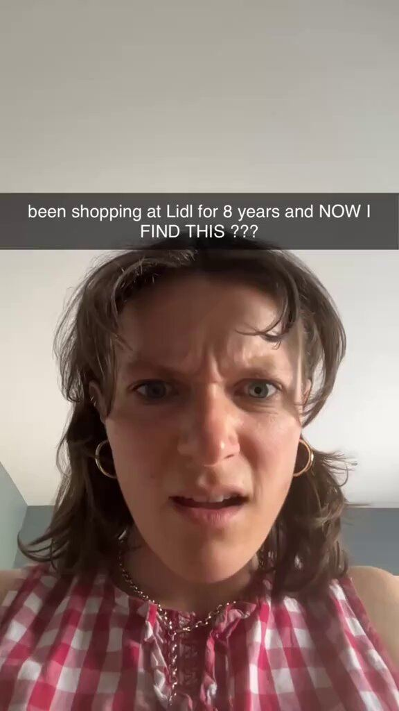

# 54 · "Been doing X for N years and NOW I find this???" — regret-discovery hook + silent demo

<!-- HERO:START -->
[](EXAMPLE.md)

**[See the example and how to make it →](EXAMPLE.md)** · [watch on X](https://x.com/pixclipper/status/2084739019187847201)
<!-- HERO:END -->


> **LC priority P0** · evidence: High (multiple apps, 30M+ views, revenue claims) · hype risk: Low · cost $0-100 (creator) / near-zero to re-shoot · 30-60 min

## What it is
A 2-4 second selfie of genuine exasperation/disbelief (hand on forehead, near-tears, "no way") with a caption that names a long habit + a specific place/brand the viewer shares — "been shopping at ALDI for 8 years and NOW I FIND THIS ???" — then a silent, hands-only demo of the product doing the thing. Almost no words, so any creator in any country can re-shoot it.

## Why it works
- The named habit/place is the targeting: everyone who shares it stops (@pixclipper: "the store name does the targeting").
- Disbelief + regret ("8 years!") is a loss-aversion hook — viewers fear they are also missing out.
- Wordless → any creator re-shoots it in an afternoon; 18 accounts × daily posting = 702 videos in 8 weeks.
- It is among the most SAVED hook types, not just watched (@consumerxai).

## Shot-by-shot (LC version)

| Time / slot | Visual | Audio / copy |
|---|---|---|
| 0-3s | Selfie, hand on forehead, disbelief/near-tears face; caption "been buying gold jewelry for 10 years and NOW I FIND THIS ???" | "no way" (only words) |
| 3-10s | Hands-only: LC necklace under running shower water, close-up | Shower SFX |
| 10-18s | Same necklace in pool/sea; then next to an old green-tinged chain (own, unbranded) | — |
| 18-25s | Hands build a 7-piece stack on the LC PDP / box | Caption stays on top |
| 25-30s | Price card "any 7 for $85" on screen | — |

## Hooks (swap-in openers)
- "been buying gold jewelry for 10 years and NOW I FIND THIS ???"
- "been taking my necklace off to shower for 12 years and NOW I find this ???"
- "been buying my sister birthday candles for 6 years and NOW I find this ???"
- "been shopping at [mall store] for jewelry for 8 years and NOW I FIND THIS ???" (avoid naming competitors in paid)
- "been throwing out green-turning rings since high school and NOW…"

## Real examples from X (studied)
- @pixclipper — Mise: 18 UGC accounts running the SAME 43s video (ALDI / LIDL / German versions), two spoken words ("no way"), silent onboarding demo; 702 videos in 8 weeks; $300K/mo ([post](https://x.com/pixclipper/status/2084739019187847201)).
- @themariaines — Albo: same hook + format, 891.8K views, $70K/mo ([post](https://x.com/themariaines/status/2108191952047153611)); original: Herbi/miso 8.0M views, 200K shares, $100K MRR 5 weeks after launch ([post](https://x.com/themariaines/status/2086845144230416463)); Herbi 20M+ views ([post](https://x.com/themariaines/status/2090121630538412531)).
- @wesocialgrowth — Herbi + Mise combined 30M+ views with this hook ([post](https://x.com/wesocialgrowth/status/2087932298939544011)).
- @jakeackerm — 2.6M views in 7 days: crying face + text, then demo; template "been (doing X) for x years and NOW I FIND THIS ???" ([post](https://x.com/jakeackerm/status/2079949900037415215)).
- @consumerxai — "disbelief" is one of 6 hook types people SAVE; save rate beats views as a signal ([post](https://x.com/consumerxai/status/2107471216126906682)).
- Transcripts (box): the Albo video is one line ("Okay, I actually cannot believe this right now"); the miso video is two words ("No way").

## Production recipe
1. Write 10 caption variants: habit × years × shared context (a store, a routine, a gift occasion).
2. Brief creators (F43 swarm): 3s disbelief selfie (real reaction to first trying it), then hands-only demo; no talking.
3. Film the demo flat-lay/top-down on a real bathroom counter, shower, pool.
4. Post daily across 5-20 creator accounts; track which 3 carry views; boost winners as Spark/Partnership ads.
5. Localise: swap the shared context per market (store, season, holiday).

## Bot prompt (copy into the creative agent)
```
Write 15 regret-discovery captions for LC in the exact pattern "been [habit] for [N] years and NOW I FIND THIS ???" Habits must be real pains of women 25-55 with gold jewelry (taking it off to shower, green neck, buying gifts, tarnish). Then for the best 5, write a 20s silent hands-only demo shot list using only PDP facts {{PDP_FACTS}}.
```

## 3 LC scripts
- A · "been taking my necklace off to shower for 12 years and NOW I FIND THIS ???" → shower demo → 6-month-old LC piece → any 7 for $85.
- B · "been buying my mom candles for Mother's Day for 15 years and NOW I find this ???" → gift box unboxing → engraving/stack.
- C · "been buying gold jewelry that turns green since 2014 and NOW…" → ocean swim demo.

## Variants to test
- Habit/years wording
- Shared context (store vs routine vs occasion)
- Crying vs annoyed vs shocked face
- Demo location

## Omni test plan
- **Budget/structure:** Organic: 5-20 creator accounts × daily for 4 weeks; Paid: top 3 by views → $50/day Spark/Partnership each
- **Primary KPIs:** Views, saves/1k, shares/1k, profile clicks; paid CPA; Omni (F54-*)
- **Kill rule:** <1k avg views after 30 posts per account
- **Scale rule:** More creators + localised contexts
- **Naming:** `utm_content=F54-<concept>-<variant>`; weekly Omni roll-up of new-customer revenue by format.

## Compliance
Baseline: [_COMPLIANCE.md](../_COMPLIANCE.md) (no fake testimonials, AI disclosure, no bulk/spoofed accounts, copy structure not assets, PDP-only claims).
- The reaction must be the creator's genuine reaction to really trying LC; creators disclose (#ad / Paid partnership).
- Don't name competitor stores/brands in a disparaging way in paid ads; organic naming of where you shop is fine if truthful.
- No "before" props that misrepresent other products.

## Related
- Strategies: 28-ugc-creator-network-per-video-pay, 10-skit-and-problem-first-ugc-hooks, 36-owned-winner-video-remix
- Formats: [28-reaction-hook-plus-demo](../28-reaction-hook-plus-demo/README.md), [43-hudson-method-creator-swarm](../43-hudson-method-creator-swarm/README.md), [18-green-screen-reaction-and-comment-reply](../18-green-screen-reaction-and-comment-reply/README.md)

<!-- EVIDENCE:START -->
## Wave 4 update: Fedotoff October 2026 swipe boards
- Muscle Mat: Dog-test visual hook (Muscle Mat, 859 days), 859 days live (Hook Frameworks That Stop the Scroll board). The visual hook (an animal test) and the copy hook (the comfort question) run together: Fedotoff's "every hook is 2 hooks".
- Muscle Mat: "FREE" baby-on-topper static (Muscle Mat), 533 days live (Hook Frameworks That Stop the Scroll board). A cute visual plus a giveaway word.
- Stills, how-to and LC remakes: [adlibrary/](adlibrary/README.md).

## Wave 5 update: hook = product (Oct 2026)
- Removal test from Matt Gittleson's 1.4B-view guide: remove the product. If the video still makes sense, the product was decoration ([article](https://x.com/mattgittleson/status/2107530746923823444)). The regret/discovery hook passes only if the discovered thing *is* the product.

## Evidence from X discovery (auto-generated)

| Date | Author | Post | Engagement | Grade | Gist |
|---|---|---|---|---|---|
| 2026-08-04 | [@pixclipper](https://x.com/pixclipper) | [link](https://x.com/pixclipper/status/2084739019187847201) | 134L/339BM/26kV | VALUE | Mise $300K/mo: 18 UGC accounts running the SAME 43s wordless video (ALDI/LIDL/German versions); store name does the targeting; 702 videos in 8 weeks, 3 carry 60% of views. |
| 2026-08-10 | [@themariaines](https://x.com/themariaines) | [link](https://x.com/themariaines/status/2086845144230416463) | 124L/292BM/18kV | VALUE | miso: $100K MRR and 100K downloads 5 weeks after launch with the regret-discovery hook; one video 8.0M views, 200K shares. |
| 2026-10-08 | [@themariaines](https://x.com/themariaines) | [link](https://x.com/themariaines/status/2108191952047153611) | 16L/35BM/2kV | VALUE | Same hook, same format, different app: Albo 891.8K views, $70K/mo — "been shopping at Aldi for 10 years and NOW I FIND THIS" + silent demo. |
| 2026-08-19 | [@themariaines](https://x.com/themariaines) | [link](https://x.com/themariaines/status/2090121630538412531) | 25L/42BM/3kV | SOME | Herbi: 70K downloads, $20K/mo in 50 days, 20M+ views; Mise copied the playbook → $100K/mo in 5 weeks. |
| 2026-10-06 | [@consumerxai](https://x.com/consumerxai) | [link](https://x.com/consumerxai/status/2107471216126906682) | 12L/18BM/1kV | SOME | 30 most-SAVED app TikTok hooks in 6 types (POV moment, name the viewer, disbelief, signs/lists, result first, pattern interrupt); save rate > views as signal. |
| 2026-08-13 | [@wesocialgrowth](https://x.com/wesocialgrowth) | [link](https://x.com/wesocialgrowth/status/2087932298939544011) | 2L/8BM/1kV | SOME | Herbi + Mise: 30M+ combined views with shocked reaction + app demo + "been shopping at [supermarket] for 10 years and NOW I FIND THIS". |
| 2026-07-22 | [@jakeackerm](https://x.com/jakeackerm) | [link](https://x.com/jakeackerm/status/2079949900037415215) | 1L/0BM/0kV | SOME | 2.6M views in 7 days: crying face + text, then app demo; template "been (doing X) for x years and NOW I FIND THIS ???". |
<!-- EVIDENCE:END -->
