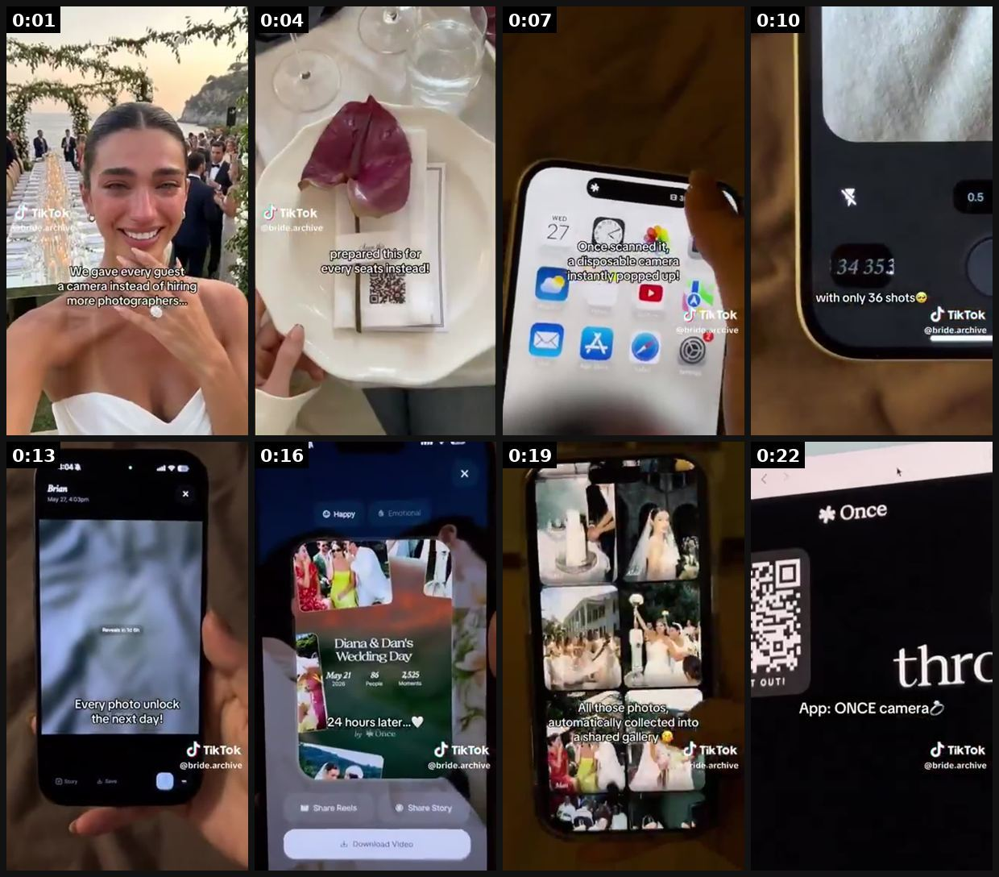
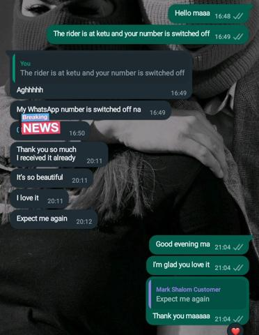
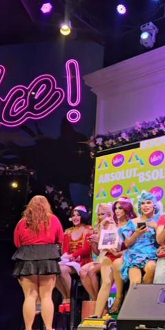
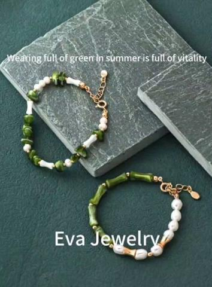
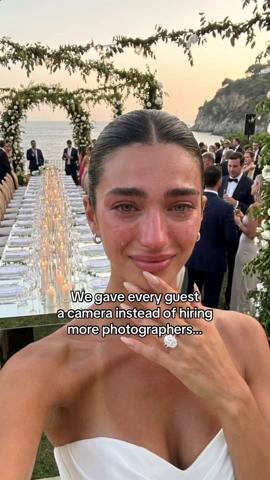
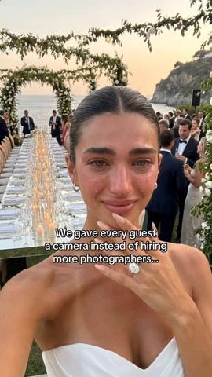

# 55 · Emotional life-moment story with the product as the hidden mechanism (crying-bride 'we gave every guest a camera'): see it, then make it

[](https://x.com/stat_biz/status/2100293137709269251)

**The example:** [@stat_biz on X](https://x.com/stat_biz/status/2100293137709269251) · 0:23 video · 6 likes, 582 views

**Watch it:** [open the post on X](https://x.com/stat_biz/status/2100293137709269251) · [play the video file](https://video.twimg.com/amplify_video/2100196134350422016/vid/avc1/320x568/ESpyc-uyYMAzoB8n.mp4?tag=29)

> UGC videos with crying-face hooks can go viral. For example, the wedding app “Once” (https://onbo-hub.com/apps/once), which has a disposable-camera-style feature for weddings and similar events, uses the hook of a woman crying in a wedding dress. One of their videos has more than 1 million likes. And there’s basically no doubt it’s AI-generated. The creator has apparently been “getting married” continuously for more …

## What you are seeing

A real wedding moment (a crying bride, a flower) as the hook, then a phone showing the app (Once camera) collecting guests' photos, ending on a QR code and the app name. The emotion comes first and the mechanism is revealed after.

## Beat by beat

The storyboard above samples the video every 0:02. Lines are the transcript for that stretch; on-screen text comes from OCR, so treat it as rough.

| Frame | Time | On screen | Said / sung |
|---|---|---|---|
| 1 | 0:00–0:03 | ia eh, tS my ee ti Pb gifs ri a a Ne ta Sl aw 78 every guest a an | · |
| 2 | 0:03–0:06 | seats instead! LA rr yo | · |
| 3 | 0:06–0:09 | · | · |
| 4 | 0:09–0:12 | 0.5 Ic 34 with only 36 shots ob | Talk to you on the vision of a standing light |
| 5 | 0:12–0:15 | 4048 a? Brian May 27, 4039 photo unlock day! cf | · |
| 6 | 0:15–0:18 | Happy ey Diana Wedding Day ie May 21 24 hours later... by Once Pr. | · |
| 7 | 0:18–0:21 | mt rh Mi, iv collected into shared gall archive ae | · |
| 8 | 0:21–0:23 | · | · |

<details><summary>Full transcript (timestamped)</summary>

- `0:04` Talk to you on the vision of a standing light

</details>

## More real examples (5)

Other posts that show this format, or a close cousin of it. Click a thumbnail to open it on X.

| | | |
|---|---|---|
| [](https://x.com/ByMorola/status/1752970187198865515)<br>**@ByMorola** · images · 474 views<br>We love reviews. We customized a bracelet for a client and frame 1 was her reaction. Customized bracelet- N11000 Adjustable customized bracelets for w | [](https://x.com/Strawaubreyyy/status/2006263964175622457)<br>**@Strawaubreyyy** · 0:27 video · 129 views<br>Napaiyak ko sya nung Shady brunch 🥹 I gave her a locket necklace na may picture ng mom nya so she can carry it with her everywhere she goes🥹 & I told | [](https://x.com/eva_jiang47397/status/1824386160946274779)<br>**@eva_jiang47397** · 0:11 video · 10 views<br>I bought my American mother-in-law a Chinese bracelet on Independence Day, and she was shocked.but she liked the necklace I gave her very much and hop |
| [](https://x.com/sammgrowth/status/2080991187133943894)<br>**@sammgrowth** · 0:24 video · 22K views<br>i should never be sharing this but fuck it a wedding app is running the craziest ai ugc play of 2026 and nobody has clocked it 11.8M views on one tikt | [](https://x.com/Pavol_Repisky/status/2078415656895082582)<br>**@Pavol_Repisky** · 0:24 video · 130 views<br>Disposable-camera app $20K/mo in 83 days; best TikTok 10M views/900K likes = AI bride crying at "her" wedding. |   |

## How to make one like it

**The format in one line:** A peak-emotion moment (bride in tears at her reception, mom at a birthday, best friend at a graduation) + an on-screen line that reveals an unusual choice — "We gave every guest a camera instead of hiring more photographers…" / "Everyone says no phones at weddings… but I did the opposite" — then the product is shown as the mechanism behind the moment (QR on the place card → app). The ad is the sto

**Why it works:** - Emotion first, product second: viewers watch a wedding, not an ad (@traqscales: "doesn't need to look like an ad"). - The contrarian line ("instead of", "I did the opposite") creates curiosity about the mechanism. - Weddings/milestones are universally shareable; brides and bridesmaids save and send.

**Contents:** [1. Structure](#1-copy-the-structure) · [2. Shot by shot](#2-shot-by-shot-remake) · [3. Script and hooks](#3-write-the-script) · [4. Prompts](#4-prompts) · [5. Tools and settings](#5-tools-and-settings) · [6. Louise Carter remake](#6-louise-carter-remake) · [7. Variants and test](#7-variants-and-test-plan) · [8. Pitfalls](#8-pitfalls)

### 1. Copy the structure

Use the example's timing as your beat sheet. Keep the beat, change the words and the product.

| Beat | Time | In the example | Your version |
|---|---|---|---|
| 1 | 0:01 | on screen: ia eh, tS my ee ti Pb gifs ri a a Ne ta Sl aw 78 every guest a an | … |
| 2 | 0:04 | on screen: seats instead! LA rr yo | … |
| 3 | 0:07 | Talk to you on the vision of a standing light | … |
| 4 | 0:10 | Talk to you on the vision of a standing light | … |
| 5 | 0:13 | on screen: 4048 a? Brian May 27, 4039 photo unlock day! cf | … |
| 6 | 0:16 | on screen: Happy ey Diana Wedding Day ie May 21 24 hours later... by Once Pr. | … |
| 7 | 0:19 | on screen: mt rh Mi, iv collected into shared gall archive ae | … |
| 8 | 0:22 | (visual beat, see frame 8) | … |

### 2. Shot-by-shot remake

**Target length / size:** 30-60s, 1080x1920

| # | Time / slot | What we see (visual + camera) | Dialogue / on-screen text |
|---|---|---|---|
| 1 | 0-5s | Wedding morning, bride's mum crying quietly | Caption: "We gave her mum's old necklace a second life." |
| 2 | 5-20s | Flashback photos of the mum wearing a necklace; it had turned green | Soft VO from the daughter |
| 3 | 20-35s | Gift moment: a small box, the new necklace | "So she can wear it every day now. Even in the sea." |
| 4 | 35-45s | Mum wearing it at the reception, dancing | - |
| 5 | End | Brand card, soft offer | - |

<details><summary>Playbook shot list (Louise Carter version from the README)</summary>

| Time / slot | Visual | Audio / copy |
|---|---|---|
| 0-3s | Real bride, tearful smile, at reception (consented footage); caption "We gave every bridesmaid a necklace instead of matching dresses…" | Ambient music |
| 3-8s | Close-up: bridesmaids' hands, each wearing a different LC piece | — |
| 8-14s | Flashback: the gift boxes on the place settings, handwritten notes | — |
| 14-20s | Group jumps in the pool after the reception — necklaces still on | Caption: "…they swam in them that night" |
| 20-25s | "24 hours later" text from a bridesmaid (real, consented) | — |

</details>

### 3. Write the script

Open with one of these hooks (first 1–3 seconds, or the headline on a static):

- "We gave every bridesmaid a necklace instead of matching dresses…"
- "Everyone said skip the favors… I did the opposite"
- "My mom cried when she opened this (she's never cried at a gift)"
- "I proposed with a $12 ring on purpose…" (only if real story)
- "We swam at the reception. Nobody took their jewelry off."

Then fill the beats from the table above. Pull the wording from real customer reviews, not from ad copy: a review line beats a copywriter line almost every time. Read every line out loud and cut anything you would not say to a friend. Ready-made Louise Carter scripts are in section 6; hand [BOT.md](BOT.md) to any AI agent to write versions for another brand.

### 4. Prompts

**Casting**

```text
Use a real customer story (with consent) or label it as a dramatisation.
```

**Shoot**

```text
Warm grade, handheld, natural sound; music swells only at the gift moment.
```

**Full creative-agent prompt (from the playbook):**

```
From these customer wedding/milestone stories {{STORIES}}, write 10 on-screen opener lines in the pattern "[We/I] [did unusual thing with LC] instead of [expected thing]…" and a 6-shot sequence for each using only footage the customer can supply. Flag anything that would require staging.
```

### 5. Tools and settings

1. Source REAL moments: ask LC customers who bought bridesmaid/wedding/anniversary gifts for consented footage (Omnisend post-purchase flow; offer store credit, disclose).
2. Script only the on-screen line; the footage is real.
3. If testing AI versions (F53 lab), label as AI and never present the AI person as a real customer/bride; use only for angle discovery, then remake with real people.
4. Cut 20-30s; caption-driven; trending emotional audio (licensed for paid).

| Setting | Value |
|---|---|
| Canvas | 1080×1920 (9:16) master; crop a 1080×1350 (4:5) cut for feed placements |
| Frame rate | 30 fps (shoot 60 fps for slow-motion water or sparkle shots) |
| Camera | Phone main lens at 1x, exposure locked on skin, HDR off, grid on; tripod or a phone clamp for product shots |
| Light | One soft key at 45° (window or ring light), white card as fill; side light for metal sparkle |
| Audio | Lavalier or phone 15–20 cm from the mouth; mix voice at -14 LUFS, music at -28 to -30 dB under voice |
| Captions | Burned in, 2–5 words per line, 64–80 px bold sans, white with a black stroke or pill; keep text inside the safe zone (top 220 px and bottom 420 px clear, 64 px side margins) |
| Pacing | A visual change every 1.5–3 s; the hook lands in the first 1.5 s with no logo intro |
| Edit / export | CapCut or Premiere; H.264, 12–20 Mbps, AAC 320 kbps; upload natively to each platform, not via links |

### 6. Louise Carter remake

- A · Bride: "We gave every bridesmaid a necklace instead of matching dresses…" → pool at the reception.
- B · Daughter: "I gave my mom 7 pieces for 7 decades…" → her reaction (real).
- C · Anniversary: "Our 10th anniversary: no flowers, just this" → stack reveal.

Brand rules, claims you can and cannot make, and more scripts: [brands/louise-carter.md](brands/louise-carter.md). Step-by-step from idea to scale: [STAGES.md](STAGES.md).

### 7. Variants and test plan

- Occasion (wedding/birthday/anniversary/graduation)
- Bride POV vs guest POV
- Real vs AI-labelled test

**Test plan:** - **Budget/structure:** Organic first; best 2 → $50/day Partnership ads - **Primary KPIs:** Views, shares, saves; CPA on paid; Omni (F55-*) - **Kill rule:** <5k views avg after 10 posts - **Scale rule:** Wedding season calendar (Mar-Oct) + bridesmaid bundle offer - **Naming:** `utm_content=F55-<concept>-<variant>`; weekly Omni roll-up of new-customer revenue by format.

**Naming:** `F55-<variant>-<hook##>-<date>` so results map back to this folder. Change one thing per test (hook, narrator, length or offer), never two.

### 8. Pitfalls

- Label dramatisations.
- Don't exploit grief; keep it warm, not sad.
- The product must be the hidden mechanism, not the hero of every shot.
- Slow open: if the first 1.5 s does not show the hook visually, most people swipe.
- Logo or brand intro at the start reads as an ad; put the brand at the end.
- Captions covered by the platform UI: check the safe zone on a real phone before posting.
- Music over the voice: keep music at least 14 dB under speech.

**Compliance:** Baseline: [_COMPLIANCE.md](../_COMPLIANCE.md) (no fake testimonials, AI disclosure, no bulk/spoofed accounts, copy structure not assets, PDP-only claims). - Do NOT replicate the AI-bride tactic as if real: an AI person presented as a real bride/customer is a deceptive endorsement (FTC) and violates platform AI-labelling rules. Real footage with consent, or clearly labelled AI. - Guests/minors in footage need consent; blur where needed.

## Field notes

Newer observations live in the playbook: [Wave 3 update: brands & apps crushing it (Oct 2026)](README.md) · [Wave 4 update: Fedotoff October 2026 swipe boards](README.md) · [Wave 5 update: Once wedding app, 15M+ (Oct 2026)](README.md)

## More examples

Every post we found for this format, with transcripts: [examples/](examples/README.md). Playbook: [README.md](README.md). Agent brief: [BOT.md](BOT.md).
