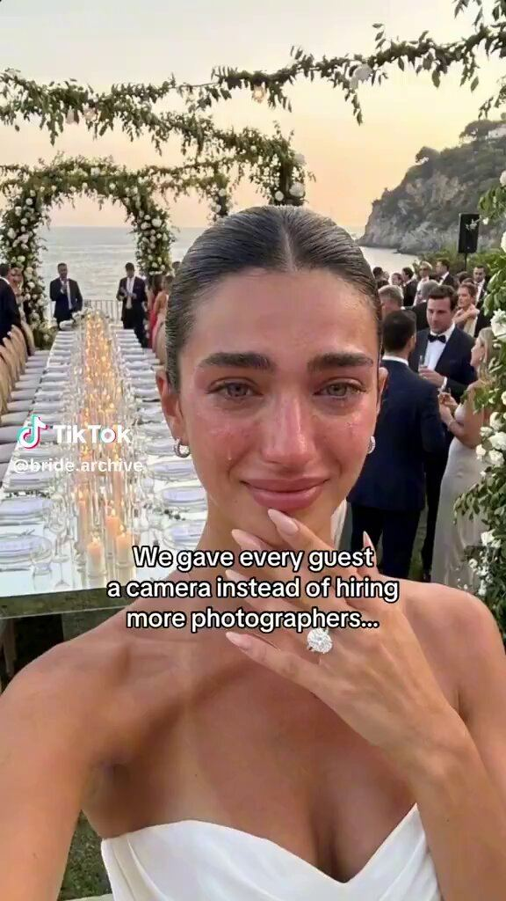

# 55 · Emotional life-moment story with the product as the hidden mechanism (crying-bride "we gave every guest a camera")

<!-- HERO:START -->
[](EXAMPLE.md)

**[See the example and how to make it →](EXAMPLE.md)** · [watch on X](https://x.com/stat_biz/status/2100293137709269251)
<!-- HERO:END -->


> **LC priority P1** · evidence: High reach (22.5M views) / AI-persona caveat · hype risk: Med · cost $0-500 · 2-4 h

## What it is
A peak-emotion moment (bride in tears at her reception, mom at a birthday, best friend at a graduation) + an on-screen line that reveals an unusual choice — "We gave every guest a camera instead of hiring more photographers…" / "Everyone says no phones at weddings… but I did the opposite" — then the product is shown as the mechanism behind the moment (QR on the place card → app). The ad is the story; the product is how it happened.

## Why it works
- Emotion first, product second: viewers watch a wedding, not an ad (@traqscales: "doesn't need to look like an ad").
- The contrarian line ("instead of", "I did the opposite") creates curiosity about the mechanism.
- Weddings/milestones are universally shareable; brides and bridesmaids save and send.

## Shot-by-shot (LC version)

| Time / slot | Visual | Audio / copy |
|---|---|---|
| 0-3s | Real bride, tearful smile, at reception (consented footage); caption "We gave every bridesmaid a necklace instead of matching dresses…" | Ambient music |
| 3-8s | Close-up: bridesmaids' hands, each wearing a different LC piece | — |
| 8-14s | Flashback: the gift boxes on the place settings, handwritten notes | — |
| 14-20s | Group jumps in the pool after the reception — necklaces still on | Caption: "…they swam in them that night" |
| 20-25s | "24 hours later" text from a bridesmaid (real, consented) | — |

## Hooks (swap-in openers)
- "We gave every bridesmaid a necklace instead of matching dresses…"
- "Everyone said skip the favors… I did the opposite"
- "My mom cried when she opened this (she's never cried at a gift)"
- "I proposed with a $12 ring on purpose…" (only if real story)
- "We swam at the reception. Nobody took their jewelry off."

## Real examples from X (studied)
- @traqscales — Once: 22.5M views from 2 AI UGC creators; one 13M; 9 >100K; AI bride + disposable cameras → app behind it ([post](https://x.com/traqscales/status/2108113354178932920)). Contact sheet: tearful bride → "prepared this for every seat instead!" (QR card) → "Once scanned it, a disposable camera instantly popped up" → "with only 36 shots" → "Every photo unlocks the next day!" → "24 hours later…".
- @Pavol_Repisky — disposable camera app $20K/mo in 83 days; best TikTok 10M views/900K likes = AI bride crying at her own wedding ([post](https://x.com/Pavol_Repisky/status/2078415656895082582)).
- @stat_biz — crying-face hooks; the creator has been "getting married" for 6+ months — clearly AI ([post](https://x.com/stat_biz/status/2100293137709269251)).

## Production recipe
1. Source REAL moments: ask LC customers who bought bridesmaid/wedding/anniversary gifts for consented footage (Omnisend post-purchase flow; offer store credit, disclose).
2. Script only the on-screen line; the footage is real.
3. If testing AI versions (F53 lab), label as AI and never present the AI person as a real customer/bride; use only for angle discovery, then remake with real people.
4. Cut 20-30s; caption-driven; trending emotional audio (licensed for paid).

## Bot prompt (copy into the creative agent)
```
From these customer wedding/milestone stories {{STORIES}}, write 10 on-screen opener lines in the pattern "[We/I] [did unusual thing with LC] instead of [expected thing]…" and a 6-shot sequence for each using only footage the customer can supply. Flag anything that would require staging.
```

## 3 LC scripts
- A · Bride: "We gave every bridesmaid a necklace instead of matching dresses…" → pool at the reception.
- B · Daughter: "I gave my mom 7 pieces for 7 decades…" → her reaction (real).
- C · Anniversary: "Our 10th anniversary: no flowers, just this" → stack reveal.

## Variants to test
- Occasion (wedding/birthday/anniversary/graduation)
- Bride POV vs guest POV
- Real vs AI-labelled test

## Omni test plan
- **Budget/structure:** Organic first; best 2 → $50/day Partnership ads
- **Primary KPIs:** Views, shares, saves; CPA on paid; Omni (F55-*)
- **Kill rule:** <5k views avg after 10 posts
- **Scale rule:** Wedding season calendar (Mar-Oct) + bridesmaid bundle offer
- **Naming:** `utm_content=F55-<concept>-<variant>`; weekly Omni roll-up of new-customer revenue by format.

## Compliance
Baseline: [_COMPLIANCE.md](../_COMPLIANCE.md) (no fake testimonials, AI disclosure, no bulk/spoofed accounts, copy structure not assets, PDP-only claims).
- Do NOT replicate the AI-bride tactic as if real: an AI person presented as a real bride/customer is a deceptive endorsement (FTC) and violates platform AI-labelling rules. Real footage with consent, or clearly labelled AI.
- Guests/minors in footage need consent; blur where needed.

## Related
- Strategies: 10-skit-and-problem-first-ugc-hooks, 13-identity-shareables-accidental-virality, 12-built-in-sharing-gift-referral
- Formats: [53-ai-ugc-outlier-remake-lab](../53-ai-ugc-outlier-remake-lab/README.md), [47-grwm-stack-with-me](../47-grwm-stack-with-me/README.md), [08-drama-show-micro-series](../08-drama-show-micro-series/README.md)

<!-- W8NOTE -->
## Wave 8 update: Voynov page, Adam Taylor teardowns, queued posts (Oct 9, 2026)
- **Emotional redemption (Wuffes):** "We thought it was time to say goodbye for good." The discovery moment is a Reddit thread on screen ([@adamtaylorl](https://x.com/adamtaylorl/status/2090038014353277073)). Voynov's best ad of 2025 tells the story from the husband's POV: "His empathy for the struggles of his wife makes the ad feel like a love letter, not a promotion" ([post](https://x.com/LachezarVoynov/status/1976293825112150474)). LC: the partner who noticed she stopped wearing jewelry because it kept going green.
<!-- /W8NOTE -->

<!-- EVIDENCE:START -->
## Wave 3 update: brands & apps crushing it (Oct 2026)
- Once (disposable-camera wedding app, ~$20K/mo in 83 days): an AI bride crying at her own wedding; 11.8M views on an account with 2,516 followers, 202K bookmarks, and not one comment noticed she was AI ([@sammgrowth](https://x.com/sammgrowth/status/2080991187133943894)); 22.5M views from 2 AI creators, 13M top ([@traqscales](https://x.com/traqscales/status/2108113354178932920)).

## Wave 4 update: Fedotoff October 2026 swipe boards
- Mariella Gut Health Expert: "Gross embarrassing story time" gut yapper (Mariella Gut Health Expert), 320 days live (Yapper Ads board). It's a confession, not a pitch.
- Pure Rhythm: Menopause reframe podcast (hair / energy), 326 days live (Podcast-Style Ads board). Identity and defiance ("not going to waste away") for women 50+.
- Aucier: AI story ad: sister's autistic son's meltdowns (sensory product), 447 days live (AI & CGI Ads That Actually Convert board). A high-emotion family story, and the product is the turning point.
- Stills, how-to and LC remakes: [adlibrary/](adlibrary/README.md).

## Wave 5 update: Once wedding app, 15M+ (Oct 2026)
- Matt Gittleson's "try naming the app" example: a creator in front of wedding footage (green-screen style) explains the Once disposable-camera event app: QR sign at the table, guests take 24 photos each, everything uploads to one gallery, App Store page at the end. 15M+ views, and the product is the purpose of the video ([article](https://x.com/mattgittleson/status/2107530746923823444)).

## Evidence from X discovery (auto-generated)

| Date | Author | Post | Engagement | Grade | Gist |
|---|---|---|---|---|---|
| 2026-10-08 | [@traqscales](https://x.com/traqscales) | [link](https://x.com/traqscales/status/2108113354178932920) | 22L/26BM/1kV | VALUE | Once app: 22.5M views from 2 AI UGC creators (one 13M, 9 >100K) — AI bride crying at her reception, "we gave every guest a camera instead of hiring more photographers" → QR → app as the mechanism. |
| 2026-09-16 | [@stat_biz](https://x.com/stat_biz) | [link](https://x.com/stat_biz/status/2100293137709269251) | 6L/1BM/1kV | SOME | Crying-face hooks go viral; Once's bride is clearly AI ("getting married" for 6+ months) — authenticity caveat. |
| 2026-07-18 | [@Pavol_Repisky](https://x.com/Pavol_Repisky) | [link](https://x.com/Pavol_Repisky/status/2078415656895082582) | 0L/0BM/0kV | SOME | Disposable-camera app $20K/mo in 83 days; best TikTok 10M views/900K likes = AI bride crying at "her" wedding. |
<!-- EVIDENCE:END -->
