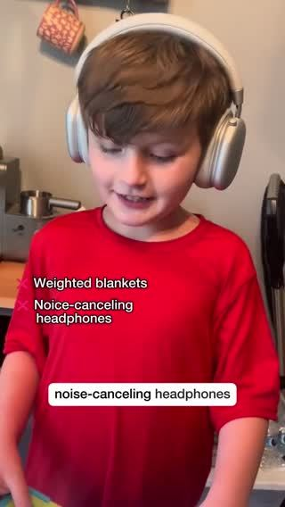

# Meta ad-library examples for F55

<!-- WAVE4 -->
## Wave 4: Alex Fedotoff's October 2026 swipe boards (GetHookd public previews)

Each ad below is from the free 10-ad preview of a public GetHookd board that [@FedotOff90](https://x.com/FedotOff90) shared on X. Days live are as of 2026-10-09; brand claims are the advertisers', not verified.

### Aucier: AI story ad: sister's autistic son's meltdowns (sensory product) (447 days live)

- **Board:** [AI & CGI Ads That Actually Convert](https://x.com/FedotOff90/status/2107892934050037807) · video 108 s
- **What happens:** "My autistic son's meltdowns were destroying our family until I found this…" A first-person family story told over AI-generated scenes. 108 s.
- **Why it lasts:** 447 days. A high-emotion family story, and the product is the turning point.
- **How to make one:** Write a first-person family-crisis narrative, generate scenes with AI, add VO, reveal the product as the turning point at 60-70%.
- **LC remake:** Family story: "My daughter refused to wear the necklace grandma gave her: it turned green."

### Pure Rhythm: Menopause reframe podcast (hair / energy) (326 days live)

- **Board:** [Podcast-Style Ads — Ecom (mic/interview format)](https://x.com/FedotOff90/status/2101063012471951797) · video 101 s
- **What happens:** "When your period stops, your brain literally cuts off the signal to your ovaries… that's the moment you need to say, no, I'm not going to waste away at 50. I still have 30 years ahead." 101 s.
- **Why it lasts:** 326 days. Identity and defiance ("not going to waste away") for women 50+.
- **How to make one:** An empowering reframe of the life stage, then the mechanism, then the product.
- **LC remake:** "At 50 I stopped buying jewelry that hides. I buy pieces I live in."

### Mariella Gut Health Expert: "Gross embarrassing story time" gut yapper (Mariella Gut Health Expert) (320 days live)

- **Board:** [Yapper Ads (raw talking-head UGC) - Oct 2026](https://x.com/FedotOff90/status/2108196484403663180) · video 105 s
- **What happens:** A creator on a couch: "Alright, gross embarrassing story time! A few months ago I started noticing that my smells were… terrible… I was feeling bloated, icky… I consulted a few physicians, they said something was wrong with my gut health…" 105 s.
- **Why it lasts:** 320 days. Embarrassment is the hook; Fedotoff: "only sell things people are embarrassed to buy in person". It's a confession, not a pitch.
- **How to make one:** Couch, casual, pyjama energy. Say "gross/embarrassing" in the first 2 s, give 2-3 specific symptoms in their own words, what they tried, the doctor moment, then the product.
- **LC remake:** "Embarrassing story time: my ex-boyfriend's mom asked why my neck was green."

