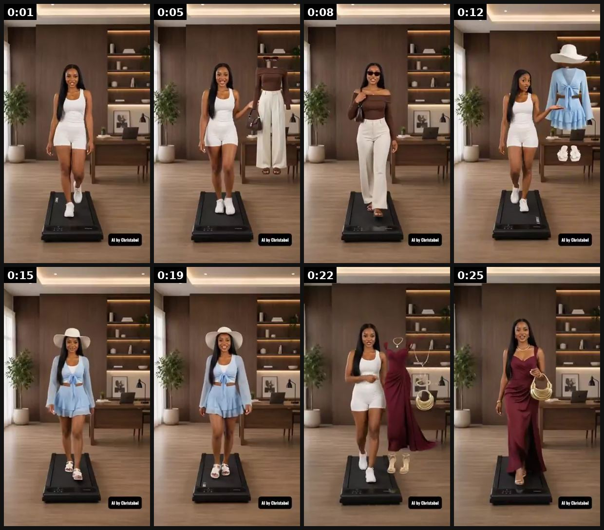

# 57 · Styling carousel — 'how to wear it / how it stacks' (jewelry-native carousel): see it, then make it

[](https://x.com/ChristyGodswil/status/2080225401406672901)

**The example:** [@ChristyGodswil on X](https://x.com/ChristyGodswil/status/2080225401406672901) · 0:27 video · 73 likes, 12K views

**Watch it:** [open the post on X](https://x.com/ChristyGodswil/status/2080225401406672901) · [play the video file](https://video.twimg.com/amplify_video/2080225328601919488/vid/avc1/320x568/-puJYDEolrSuC3Ag.mp4?tag=29)

> Fashion brands don’t just need beautiful clothes. They need content that helps people imagine themselves wearing them. Instead of posting another product photo, imagine showing your customers how to style each outfit, what occasions it’s perfect for, and what it actually looks like on a real person. That’s exactly what AI makes possible. This is the kind of content that grabs attention, tells a story, and helps your …

## What you are seeing

A styling video: the same woman on a turntable stand in a wood-panelled room, changing outfit every couple of seconds (white set, wide trousers, sun hat, blue dress, black, maroon). It shows many ways to wear and style one wardrobe.

## Beat by beat

The storyboard above samples the video every 0:03. Lines are the transcript for that stretch; on-screen text comes from OCR, so treat it as rough.

| Frame | Time | On screen | Said / sung |
|---|---|---|---|
| 1 | 0:00–0:03 | · | Need an effortless everyday look? |
| 2 | 0:03–0:06 | el a Al by | Watch how I'd style it. |
| 3 | 0:06–0:10 | I es ee Al by | Simple, elegant, ready for anywhere. |
| 4 | 0:10–0:13 | · | Planning a beach getaway? |
| 5 | 0:13–0:17 | · | I'd wear this. |
| 6 | 0:17–0:20 | · | Fresh, light, and vacation ready. Now let's dress for the evening. |
| 7 | 0:20–0:24 | · | This one makes an entrance. |
| 8 | 0:24–0:27 | · | Elegant, timeless, unforgettable. |

<details><summary>Full transcript (timestamped)</summary>

- `0:00` Need an effortless everyday look?
- `0:04` Watch how I'd style it.
- `0:06` Simple, elegant, ready for anywhere.
- `0:09` Planning a beach getaway?
- `0:11` I'd wear this.
- `0:16` Fresh, light, and vacation ready.
- `0:19` Now let's dress for the evening.
- `0:21` This one makes an entrance.
- `0:23` Elegant, timeless, unforgettable.

</details>

## How to make one like it

**The format in one line:** A 5-8 card carousel that answers "how will I actually wear this?": one piece styled 5 ways, or how several pieces build one look. Each card evolves the story (hook → looks → proof → CTA) instead of repeating one message.

**Why it works:** - Answers the #1 jewelry pre-purchase question (wearability). - Each swipe is a re-engagement opportunity; carousel copy should build like a short story. - Shows the bundle (any 7) as outfits, raising AOV.

**Contents:** [1. Structure](#1-copy-the-structure) · [2. Shot by shot](#2-shot-by-shot-remake) · [3. Script and hooks](#3-write-the-script) · [4. Prompts](#4-prompts) · [5. Tools and settings](#5-tools-and-settings) · [6. Louise Carter remake](#6-louise-carter-remake) · [7. Variants and test](#7-variants-and-test-plan) · [8. Pitfalls](#8-pitfalls)

### 1. Copy the structure

Use the example's timing as your beat sheet. Keep the beat, change the words and the product.

| Beat | Time | In the example | Your version |
|---|---|---|---|
| 1 | 0:01 | Need an effortless everyday look? | … |
| 2 | 0:05 | Need an effortless everyday look? Watch how I'd style it. Simple, elegant, ready for anywhere. | … |
| 3 | 0:08 | Simple, elegant, ready for anywhere. Planning a beach getaway? | … |
| 4 | 0:12 | Planning a beach getaway? I'd wear this. | … |
| 5 | 0:15 | I'd wear this. Fresh, light, and vacation ready. | … |
| 6 | 0:19 | Fresh, light, and vacation ready. Now let's dress for the evening. | … |
| 7 | 0:22 | Now let's dress for the evening. This one makes an entrance. | … |
| 8 | 0:25 | Elegant, timeless, unforgettable. | … |

### 2. Shot-by-shot remake

**Target length / size:** 6-10 slides or 15-30s outfit-change video

| # | Time / slot | What we see (visual + camera) | Dialogue / on-screen text |
|---|---|---|---|
| 1 | Cover | The full stack worn | "5 ways to wear one necklace" |
| 2 | Slides 2-6 | One styling per slide (layered, single, with a turtleneck, beach, office) | Short caption each |
| 3 | Last | All pieces flat lay | Names + prices |

<details><summary>Playbook shot list (Louise Carter version from the README)</summary>

| Time / slot | Visual | Audio / copy |
|---|---|---|
| Card 1 | Hook: "1 necklace, 5 ways" over Chelsea Herringbone on skin | — |
| Card 2 | Alone, white tee | "the everyday" |
| Card 3 | Layered with a fine chain | "the layer" |
| Card 4 | With a blazer | "the office" |
| Card 5 | Wet, at the beach | "the beach (yes, waterproof)" |
| Card 6 | Full 7-piece stack | "or build all 7 for $85 →" |

</details>

### 3. Write the script

Open with one of these hooks (first 1–3 seconds, or the headline on a static):

- "1 necklace, 5 ways"
- "How to stack 7 pieces without looking like a jewelry store"
- "Wedding guest → beach → office: same stack"
- "The 3-piece rule for layering necklaces"

Then fill the beats from the table above. Pull the wording from real customer reviews, not from ad copy: a review line beats a copywriter line almost every time. Read every line out loud and cut anything you would not say to a friend. Ready-made Louise Carter scripts are in section 6; hand [BOT.md](BOT.md) to any AI agent to write versions for another brand.

### 4. Prompts

**Shoot**

```text
Same model, same light, turntable or same mirror spot, change one variable per look.
```

**Full creative-agent prompt (from the playbook):**

```
Write 5 styling-carousel scripts (6 cards each, ≤10 words per card) for LC pieces {{SKUS}}: card 1 hook, cards 2-5 looks/occasions, card 6 offer (any 7 for $85). Also suggest the photo for each card.
```

### 5. Tools and settings

1. Shoot one model/creator in 5 outfits (or use real customer photos with permission).
2. 4:5, ≤10 words per card, consistent type; card 1 = hook, last card = offer.
3. Variants: "1 piece 5 ways", "7-piece stack build", "occasion stack" (wedding/office/beach), FAQ carousel (sizes, waterproof, care).

| Setting | Value |
|---|---|
| Canvas | 1080×1350 (4:5) per slide; 1080×1920 for TikTok photo mode |
| Slides | 5–10; slide 1 is the hook only, last slide is the ask (save / follow / shop) |
| Type | 64–96 px headline per slide, one idea per slide, consistent position across slides |
| Continuity | Same template, colour and font on every slide so it reads as one piece |
| Audio (TikTok) | Add a trending sound at low volume; photo mode auto-advances |
| Tools | Canva or Figma template; Postnitro or ChatGPT for drafts; export PNG, sRGB |

### 6. Louise Carter remake

- A · "1 necklace, 5 ways" (Chelsea Herringbone).
- B · "Build a 7-piece stack in 6 swipes".
- C · FAQ carousel: "Can I shower in it? Will it turn green? Is it real gold?" → PDP answers.

Brand rules, claims you can and cannot make, and more scripts: [brands/louise-carter.md](brands/louise-carter.md). Step-by-step from idea to scale: [STAGES.md](STAGES.md).

### 7. Variants and test plan

- Single piece vs stack
- Model vs real customers
- Occasion vs styling-rule framing

**Test plan:** - **Budget/structure:** 3 carousels, $30/day each, 5 days - **Primary KPIs:** CTR (all), card swipe rate, AOV; Omni (F57-*) - **Kill rule:** CTR <0.8% - **Scale rule:** Organic weekly + Pinterest pins - **Naming:** `utm_content=F57-<concept>-<variant>`; weekly Omni roll-up of new-customer revenue by format.

**Naming:** `F57-<variant>-<hook##>-<date>` so results map back to this folder. Change one thing per test (hook, narrator, length or offer), never two.

### 8. Pitfalls

- Consistency of framing makes it look editorial.
- Show close-ups too; full-body shots make jewelry invisible.
- A weak first slide: nobody swipes past a boring cover.
- No reason to save: give a list, a checklist or a reference people come back to.

**Compliance:** Baseline: [_COMPLIANCE.md](../_COMPLIANCE.md) (no fake testimonials, AI disclosure, no bulk/spoofed accounts, copy structure not assets, PDP-only claims). - Customer photos only with permission; claims (waterproof) PDP-exact.

## More examples

Every post we found for this format, with transcripts: [examples/](examples/README.md). Playbook: [README.md](README.md). Agent brief: [BOT.md](BOT.md).
