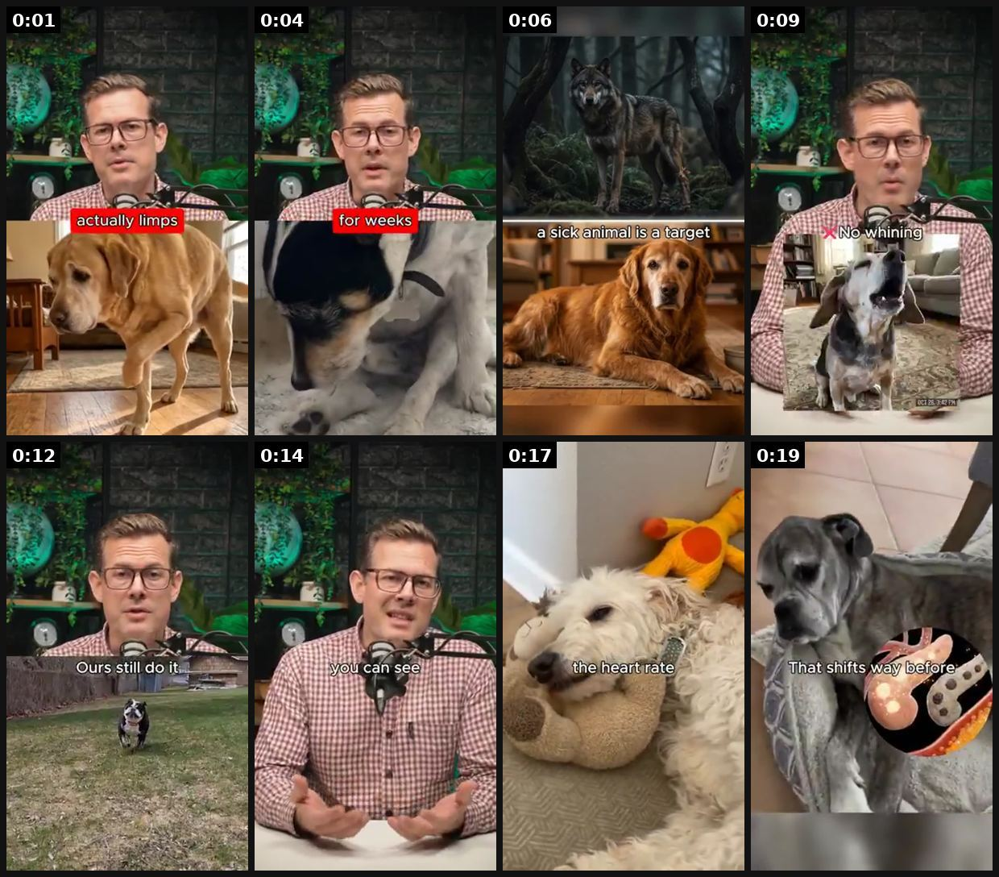
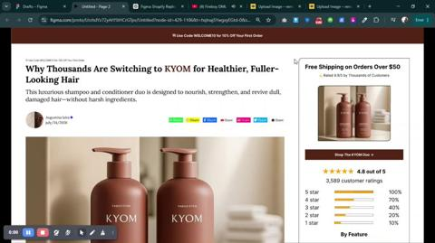
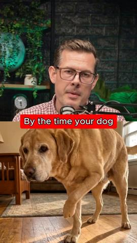

# 58 · Educational care / material explainer post ('how to keep gold from tarnishing', 'which metals are safe'): see it, then make it

[](https://x.com/lorenzo_pravata/status/2095136884666052819)

**The example:** [@lorenzo_pravata on X](https://x.com/lorenzo_pravata/status/2095136884666052819) · 0:21 video · 36 likes, 3K views

**Watch it:** [open the post on X](https://x.com/lorenzo_pravata/status/2095136884666052819) · [play the video file](https://video.twimg.com/amplify_video/2095136804991053824/vid/avc1/320x568/xbARYjkUN0Y0WpXR.mp4?tag=29)

> There are a ton of your customers who know nothing about your brand. That's what educational ads are for. Here's the first 20 seconds of one of ours. The product doesn't appear until after this clip ends. We spend it on why dogs hide pain. In the wild a sick animal is a https://t.co/uBTkkEZnMy

## What you are seeing

A vet or expert talking to camera with red caption labels, intercut with dogs (a golden retriever, a scruffy dog, a husky, a dog with a toy). It is an educational explainer about care, with the product as the solution.

## Beat by beat

The storyboard above samples the video every 0:02. Lines are the transcript for that stretch; on-screen text comes from OCR, so treat it as rough.

| Frame | Time | On screen | Said / sung |
|---|---|---|---|
| 1 | 0:00–0:02 | · | By the time your dog you actually limps or slows down, it's usually been wrong for weeks. |
| 2 | 0:02–0:05 | · | · |
| 3 | 0:05–0:07 | yr 1. hee ely. re Woe a Fi Sick if oY ae ON ans | It's a survival thing. In the wild, a sick animal is a target. |
| 4 | 0:07–0:10 | SR, a Pita? Wwe. se ot te as ie poe te! oct 25,342 | So dogs learn to mask it. No whining, no limping, they just carry on. |
| 5 | 0:10–0:13 | Pe Fate. su ag till do I a at melt nat Fan ss os se hee wh or ad ox ee Ty ae a SA ax vee Si ae en 26 fe m2 Se Ea | Ours still do it. And what changes first isn't something you can see. |
| 6 | 0:13–0:15 | · | · |
| 7 | 0:15–0:18 | · | It's their vitals, the breathing, the heart rate, sleep, how much they drink. |
| 8 | 0:18–0:21 | · | That shifts way before your eyes catch a thing. |

<details><summary>Full transcript (timestamped)</summary>

- `0:00` By the time your dog you actually limps or slows down, it's usually been wrong for weeks.
- `0:04` It's a survival thing. In the wild, a sick animal is a target.
- `0:07` So dogs learn to mask it. No whining, no limping, they just carry on.
- `0:11` Ours still do it. And what changes first isn't something you can see.
- `0:15` It's their vitals, the breathing, the heart rate, sleep, how much they drink.
- `0:18` That shifts way before your eyes catch a thing.

</details>

## More real examples (4)

Other posts that show this format, or a close cousin of it. Click a thumbnail to open it on X.

| | | |
|---|---|---|
| [](https://x.com/taye_afola19505/status/2077796327887450475)<br>**@taye_afola19505** · 0:44 video · 908 views<br>Built a premium advertorial experience for @KYOM combining emotional storytelling, educational content, social proof, and conversion-focused design to | [](https://x.com/Bogzabs96/status/2096280202103927187)<br>**@Bogzabs96** · 0:21 video · 1K views<br>There are a ton of your customers who know nothing about your brand. That's what educational ads are for. Here's the first 20 seconds of one of ours. | [](https://x.com/didicoding/status/2088172069703852134)<br>**@didicoding** · 0:10 video · 121 views<br>Most business owners are using AI to write captions. But AI can now help you create: - Product videos - Promotional videos - Ads - Brand stories - Edu |
| [](https://x.com/framesbysalman/status/2075809251919110498)<br>**@framesbysalman** · 16:15 video · 339 views<br>From founders and creators to brand owners, everyone is building their personal brand through: Educational content Vlogs Entertaining videos Launch co |   |   |

## How to make one like it

**The format in one line:** Teach a jewelry-care or materials lesson — how to clean gold at home, what "gold-plated vs vermeil vs PVD" means, which metals are safe for sensitive skin, how to store fine chains — with the LC piece as the example. Runs as Reels, carousels or Story tap-throughs; paid as MOF trust-builder.

**Why it works:** - Positions LC as the authority in a category with purchase anxiety. - Doesn't look like an ad; saves well; feeds retargeting pools.

**Contents:** [1. Structure](#1-copy-the-structure) · [2. Shot by shot](#2-shot-by-shot-remake) · [3. Script and hooks](#3-write-the-script) · [4. Prompts](#4-prompts) · [5. Tools and settings](#5-tools-and-settings) · [6. Louise Carter remake](#6-louise-carter-remake) · [7. Variants and test](#7-variants-and-test-plan) · [8. Pitfalls](#8-pitfalls)

### 1. Copy the structure

Use the example's timing as your beat sheet. Keep the beat, change the words and the product.

| Beat | Time | In the example | Your version |
|---|---|---|---|
| 1 | 0:01 | By the time your dog you actually limps or slows down, it's usually been wrong for weeks. | … |
| 2 | 0:04 | By the time your dog you actually limps or slows down, it's usually been wrong for weeks. It's a survival thing. In the wild, a sick animal | … |
| 3 | 0:06 | It's a survival thing. In the wild, a sick animal is a target. So dogs learn to mask it. No whining, no limping, they just carry on. | … |
| 4 | 0:09 | So dogs learn to mask it. No whining, no limping, they just carry on. | … |
| 5 | 0:12 | So dogs learn to mask it. No whining, no limping, they just carry on. Ours still do it. And what changes first isn't something you can see. | … |
| 6 | 0:14 | Ours still do it. And what changes first isn't something you can see. It's their vitals, the breathing, the heart rate, sleep, how much they | … |
| 7 | 0:17 | It's their vitals, the breathing, the heart rate, sleep, how much they drink. That shifts way before your eyes catch a thing. | … |
| 8 | 0:19 | It's their vitals, the breathing, the heart rate, sleep, how much they drink. That shifts way before your eyes catch a thing. | … |

### 2. Shot-by-shot remake

**Target length / size:** 5-7 slide carousel or a 30-45s video

| # | Time / slot | What we see (visual + camera) | Dialogue / on-screen text |
|---|---|---|---|
| 1 | Slide 1 | Tarnished chain next to a bright one | "Why gold jewellery tarnishes (and how to stop it)" |
| 2 | Slide 2 | Diagram: plating vs PVD layers | "Plating is a coat. PVD is bonded." |
| 3 | Slide 3 | Care list | "Do: rinse and dry. Don't: bleach, chlorine for hours." |
| 4 | Slide 4 | Metal guide | "Which metal for sensitive skin?" |
| 5 | Slide 5 | Save prompt | "Save this for later." |

<details><summary>Playbook shot list (Louise Carter version from the README)</summary>

| Time / slot | Visual | Audio / copy |
|---|---|---|
| 0-3s | Text: "your gold jewelry is turning green because…" | VO |
| 3-12s | Diagram: plated layer vs PVD bonded | "plating sits on top; PVD bonds" |
| 12-20s | Care tips: what to avoid, how to clean | — |
| 20-25s | LC piece after 6 months | "any 7 for $85" |

</details>

### 3. Write the script

Open with one of these hooks (first 1–3 seconds, or the headline on a static):

- "why your gold jewelry turns green (it's not your skin)"
- "plated vs vermeil vs PVD in 20 seconds"
- "how to clean gold jewelry at home"
- "jewelry you should never wear in the pool (and what you can)"

Then fill the beats from the table above. Pull the wording from real customer reviews, not from ad copy: a review line beats a copywriter line almost every time. Read every line out loud and cut anything you would not say to a friend. Ready-made Louise Carter scripts are in section 6; hand [BOT.md](BOT.md) to any AI agent to write versions for another brand.

### 4. Prompts

**Claude**

```text
Write a care-guide carousel for [material], 5 slides, every claim checkable; include a short "what to avoid" list.
```

**Design**

```text
Clean educational layout, numbered slides, one diagram.
```

**Full creative-agent prompt (from the playbook):**

```
Using only {{PDP_FACTS}} and generally accepted jewelry-care facts, write 6 educational posts (Reel script ≤60 words + 6-card carousel) on materials and care. No medical claims (e.g., "hypoallergenic") unless on PDP.
```

### 5. Tools and settings

1. 5 lessons from support FAQs; each as 20s Reel + 6-card carousel.
2. Founder or CS lead on camera (F48 overlap) or faceless diagram.
3. Run paid only to engaged/visitor audiences (MOF).

| Setting | Value |
|---|---|
| Canvas | 1080×1920 (9:16) master; crop a 1080×1350 (4:5) cut for feed placements |
| Frame rate | 30 fps (shoot 60 fps for slow-motion water or sparkle shots) |
| Camera | Phone main lens at 1x, exposure locked on skin, HDR off, grid on; tripod or a phone clamp for product shots |
| Light | One soft key at 45° (window or ring light), white card as fill; side light for metal sparkle |
| Audio | Lavalier or phone 15–20 cm from the mouth; mix voice at -14 LUFS, music at -28 to -30 dB under voice |
| Captions | Burned in, 2–5 words per line, 64–80 px bold sans, white with a black stroke or pill; keep text inside the safe zone (top 220 px and bottom 420 px clear, 64 px side margins) |
| Pacing | A visual change every 1.5–3 s; the hook lands in the first 1.5 s with no logo intro |
| Edit / export | CapCut or Premiere; H.264, 12–20 Mbps, AAC 320 kbps; upload natively to each platform, not via links |

### 6. Louise Carter remake

- A · "Why your necklace turns green".
- B · "Plated vs vermeil vs PVD".
- C · "Packing jewelry for a beach trip".

Brand rules, claims you can and cannot make, and more scripts: [brands/louise-carter.md](brands/louise-carter.md). Step-by-step from idea to scale: [STAGES.md](STAGES.md).

### 7. Variants and test plan

- Reel vs carousel
- Founder vs faceless

**Test plan:** - **Budget/structure:** Organic + $20/day MOF retargeting - **Primary KPIs:** Saves, retargeting CVR lift; Omni (F58-*) - **Kill rule:** Saves/1k below account avg - **Scale rule:** Evergreen library - **Naming:** `utm_content=F58-<concept>-<variant>`; weekly Omni roll-up of new-customer revenue by format.

**Naming:** `F58-<variant>-<hook##>-<date>` so results map back to this folder. Change one thing per test (hook, narrator, length or offer), never two.

### 8. Pitfalls

- Care advice must be accurate; don't say "never tarnishes".
- Hypoallergenic claims need evidence.
- Make it worth saving, not a disguised ad.
- Slow open: if the first 1.5 s does not show the hook visually, most people swipe.
- Logo or brand intro at the start reads as an ad; put the brand at the end.
- Captions covered by the platform UI: check the safe zone on a real phone before posting.
- Music over the voice: keep music at least 14 dB under speech.

**Compliance:** Baseline: [_COMPLIANCE.md](../_COMPLIANCE.md) (no fake testimonials, AI disclosure, no bulk/spoofed accounts, copy structure not assets, PDP-only claims). - Accurate, substantiated material claims; no skin/medical claims beyond PDP.

## More examples

Every post we found for this format, with transcripts: [examples/](examples/README.md). Playbook: [README.md](README.md). Agent brief: [BOT.md](BOT.md).
